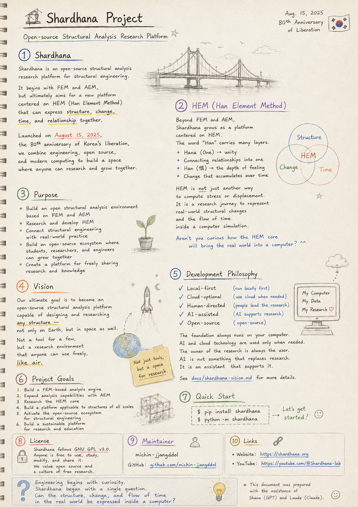
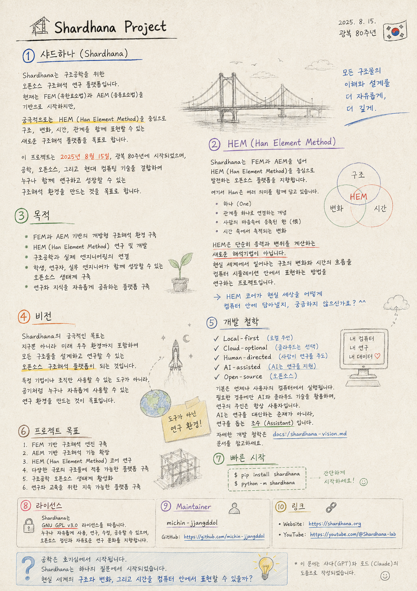

> Location: `README.md`

# 🏗️ Shardhana Project

<p align="center">
  
</p>

## Shardhana

Shardhana is an open-source structural analysis research platform for structural engineering.

It begins with FEM (Finite Element Method) and AEM (Applied Element Method) as its foundation,

but its ultimate goal is a new structural analysis platform built around HEM (Han Element Method) —
one that can express structure, change, time, and relationship together.

This project was launched on August 15, 2025, the 80th anniversary of Korea's liberation,

with the goal of creating a structural analysis environment where anyone can research and grow together,
by combining engineering, open source, and modern computing.

---

## 🎯 HEM (Han Element Method)

Shardhana aims to grow as an open-source platform centered on HEM (Han Element Method),
going beyond FEM and AEM.

The word "Han" carries several meanings at once.

- Hana (One) — unity
- The concept of connecting relationships into one
- Han (恨) — the depth of feeling condensed in the human heart
- Change that accumulates over time

HEM is not simply a new analysis method for calculating stress and displacement.

It is a research project exploring how to represent
the structural changes and the flow of time that happen in the real world,
inside a computer simulation.

> Aren't you curious how the HEM core will bring the real world into a computer? ^^

---

## 🎯 Purpose

- Build an open structural analysis environment based on FEM and AEM
- Research and develop HEM (Han Element Method)
- Connect structural engineering with real-world practice
- Build an open-source ecosystem where students, researchers, and practicing engineers can grow together
- Create a platform for freely sharing research and knowledge

---

## 🚀 Vision

Shardhana's ultimate goal is to become an open-source structural analysis platform
capable of designing and researching any structure —

not only on Earth, but in future space environments as well.

Not a tool available only to specific companies or organizations,

but a research environment that anyone can use freely,
like air.

---

## 🧭 Development Philosophy

Shardhana is developed around the following principles.

- **Local-first**
- **Cloud-optional**
- **Human-directed**
- **AI-assisted**
- **Open-source**

The foundation always runs on the user's own computer.

AI and cloud technology are used only when needed.
The owner of the research is always the user.

AI is not something that replaces research.
It is an assistant that supports it.

For a more detailed account of the development philosophy, see `docs/shardhana-vision.md`.

---

## 🌟 Project Goals

1. Build a FEM-based structural analysis engine
2. Expand structural analysis capabilities with AEM
3. Research the HEM (Han Element Method) core
4. Build a platform applicable to structures of all scales
5. Activate the open-source ecosystem for structural engineering
6. Build a sustainable platform for research and education

---

## 🚀 Quick Start

```bash
pip install shardhana
python -m shardhana
```

---

## 🔐 License

Shardhana follows the GNU GPL v3.0 license.

Anyone is free to use, study, modify, and share it.
We value the spirit of open source and a culture of free research.

---

## 👤 Maintainer

**michin-jjangddol**

GitHub: https://github.com/michin-jjangddol

---

## 🔗 Links

- Website: https://shardhana.org
- YouTube: https://youtube.com/@Shardhana-lab

---

> Engineering begins with curiosity.
>
> Shardhana began with a single question.
>
> Can the structure, change, and flow of time in the real world be expressed inside a computer?

---

*This document was prepared with the assistance of Shana (GPT) and Laude (Claude).*

---
<br>
<br>

# 🏗️ Shardhana Project

<p align="center">
  
</p>

## 샤드하나(Shardhana)

Shardhana는 구조공학을 위한 오픈소스 구조해석 연구 플랫폼입니다.

현재는 FEM(유한요소법)과 AEM(응용요소법)을 기반으로 시작하지만,

궁극적으로는 HEM(Han Element Method)을 중심으로
구조, 변화, 시간, 관계를 함께 표현할 수 있는
새로운 구조해석 플랫폼을 목표로 합니다.

이 프로젝트는 2025년 8월 15일, 광복 80주년에 시작되었으며,

공학, 오픈소스, 그리고 현대 컴퓨팅 기술을 결합하여
누구나 함께 연구하고 성장할 수 있는 구조해석 환경을 만드는 것을 목표로 합니다.

---

## 🎯 HEM (Han Element Method)

Shardhana는 FEM과 AEM을 넘어
HEM(Han Element Method)을 중심으로 발전하는 오픈소스 플랫폼을 지향합니다.

여기서 Han은 여러 의미를 함께 담고 있습니다.

- 하나(One)
- 관계를 하나로 연결하는 개념
- 사람의 마음속에 응축된 한(恨)
- 시간 속에서 축적되는 변화

HEM은 단순히 응력과 변위를 계산하는 새로운 해석기법이 아닙니다.

현실 세계에서 일어나는 구조의 변화와 시간의 흐름을
컴퓨터 시뮬레이션 안에서 표현하는 방법을 연구하는 프로젝트입니다.

> HEM 코어가 현실 세상을 어떻게 컴퓨터 안에 담아낼지, 궁금하지 않으신가요? ^^

---

## 🎯 목적

- FEM과 AEM 기반의 개방형 구조해석 환경 구축
- HEM(Han Element Method) 연구 및 개발
- 구조공학과 실제 엔지니어링의 연결
- 학생, 연구자, 실무 엔지니어가 함께 성장할 수 있는 오픈소스 생태계 구축
- 연구와 지식을 자유롭게 공유하는 플랫폼 구축

---

## 🚀 비전

Shardhana의 궁극적인 목표는

지구뿐 아니라 미래 우주 환경까지 포함하여

모든 구조물을 설계하고 연구할 수 있는 오픈소스 구조해석 플랫폼이 되는 것입니다.

특정 기업이나 조직만 사용할 수 있는 도구가 아니라,

공기처럼 누구나 자유롭게 사용할 수 있는 연구 환경을 만드는 것이 목표입니다.

---

## 🧭 개발 철학

Shardhana는 다음 철학을 기반으로 개발됩니다.

- **Local-first** (로컬 우선)
- **Cloud-optional** (클라우드는 선택)
- **Human-directed** (사람이 연구를 주도)
- **AI-assisted** (AI는 연구를 지원)
- **Open-source** (오픈소스)

기본은 언제나 사용자의 컴퓨터에서 실행됩니다.

필요한 경우에만 AI와 클라우드 기술을 활용하며,
연구의 주인은 항상 사용자입니다.

AI는 연구를 대신하는 존재가 아니라,
연구를 돕는 조수(Assistant)입니다.

자세한 개발 철학은 `docs/shardhana-vision.md` 문서를 참고하세요.

---

## 🌟 프로젝트 목표

1. FEM 기반 구조해석 엔진 구축
2. AEM 기반 구조해석 기능 확장
3. HEM(Han Element Method) 코어 연구
4. 다양한 규모의 구조물에 적용 가능한 플랫폼 구축
5. 구조공학 오픈소스 생태계 활성화
6. 연구와 교육을 위한 지속 가능한 플랫폼 구축

---

## 🚀 빠른 시작

```bash
pip install shardhana
python -m shardhana
```

---

## 🔐 라이선스

Shardhana는 GNU GPL v3.0 라이선스를 따릅니다.

누구나 자유롭게 사용, 연구, 수정, 공유할 수 있으며,
오픈소스 정신과 자유로운 연구 문화를 지향합니다.

---

## 👤 Maintainer

**michin-jjangddol**

GitHub: https://github.com/michin-jjangddol

---

## 🔗 링크

- Website: https://shardhana.org
- YouTube: https://youtube.com/@Shardhana-lab

---

> 공학은 호기심에서 시작됩니다.
>
> Shardhana는 하나의 질문에서 시작되었습니다.
>
> 현실 세계의 구조와 변화, 그리고 시간을 컴퓨터 안에서 표현할 수 있을까?

---

*이 문서는 샤나(GPT)와 로드(Claude)의 도움으로 작성되었습니다.*
