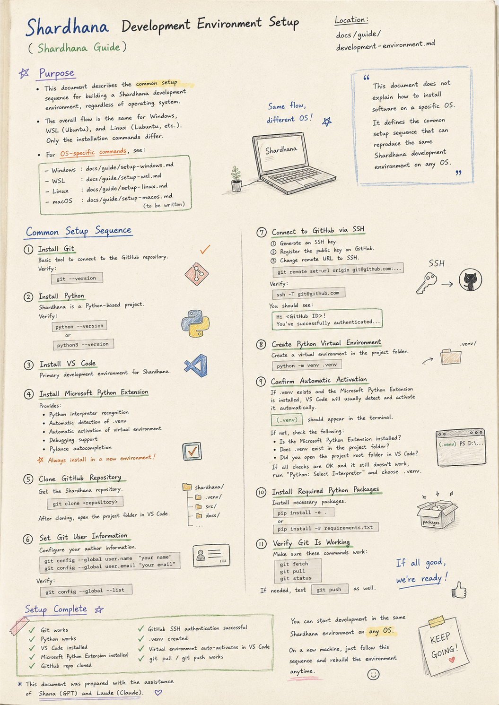
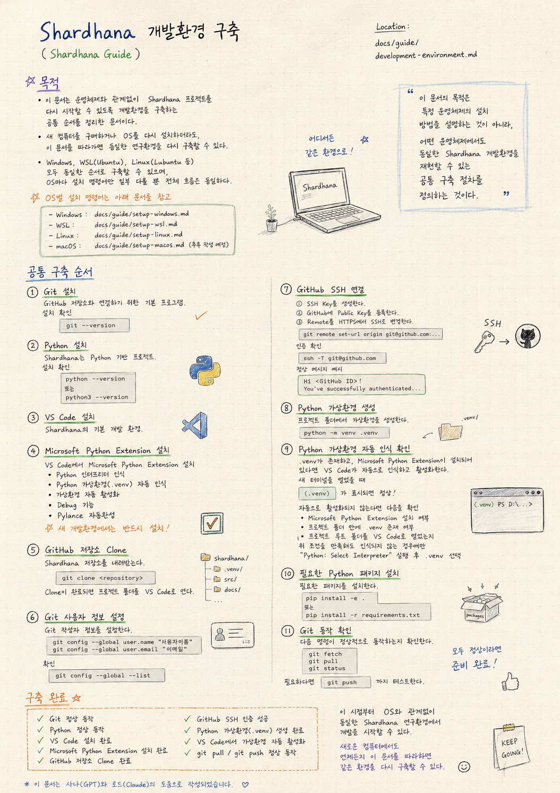

> Location: `docs/guide/development-environment.md`

# Shardhana Development Environment Setup

*(Shardhana Guide)*<br>
*Date: 2026-06-28*

<p align="center">
  
</p>

---

## Purpose

This document describes the common setup sequence for building a Shardhana development environment,
regardless of operating system.

Whether you have a new computer or a fresh OS installation,
following this document will reproduce the same research environment.

The overall sequence is identical for Windows, WSL (Ubuntu), and Linux (Lubuntu, etc.).
Only the specific installation commands differ by operating system.

For OS-specific installation commands, refer to the following documents.

- Windows: `docs/guide/setup-windows.md`
- WSL: `docs/guide/setup-wsl.md`
- Linux: `docs/guide/setup-linux.md`
- macOS: `docs/guide/setup-macos.md` *(to be written)*

---

## Common Setup Sequence

### 1. Install Git

Install Git.

This is the basic program needed to connect to the GitHub repository.

Verify installation

```bash
git --version
```

---

### 2. Install Python

Install Python.

Shardhana is a Python-based project.

Verify installation

```bash
python --version
```

or

```bash
python3 --version
```

---

### 3. Install VS Code

Install Visual Studio Code.

This is the primary development environment for Shardhana.

---

### 4. Install the Microsoft Python Extension

Install the Microsoft Python Extension inside VS Code.

This extension provides the following.

- Python interpreter recognition
- Automatic recognition of Python virtual environments (.venv)
- Automatic virtual environment activation
- Debugging support
- Pylance autocompletion

Always install this on a new development environment.

---

### 5. Clone the GitHub Repository

Clone the Shardhana repository from GitHub.

```bash
git clone <repository>
```

Once the clone is complete, open the project folder in VS Code.

---

### 6. Set Git User Information

Configure your Git author information.

```bash
git config --global user.name "your name"
git config --global user.email "your email"
```

Verify

```bash
git config --global --list
```

---

### 7. Connect to GitHub via SSH

Generate an SSH key.

Register the public key on GitHub.

Change the remote URL from HTTPS to SSH.

```bash
git remote set-url origin git@github.com:...
```

Verify authentication

```bash
ssh -T git@github.com
```

If you see the following message, the connection is working correctly.

```
Hi <GitHub ID>!
You've successfully authenticated...
```

---

### 8. Create a Python Virtual Environment

Create a virtual environment inside the project folder.

```bash
python -m venv .venv
```

---

### 9. Confirm Automatic Virtual Environment Recognition

If `.venv` exists in the project folder
and the Microsoft Python Extension is installed,
VS Code will generally recognize and activate the virtual environment automatically.

When you open a new terminal, if you see

```
(.venv)
```

the development environment is ready.

If it does not activate automatically, check the following.

- Is the Microsoft Python Extension installed?
- Does `.venv` exist inside the project folder?
- Did you open the project root folder in VS Code?

Only if all of the above conditions are met and it still does not activate,
run `Python: Select Interpreter` and manually select the `.venv` interpreter.

---

### 10. Install Required Python Packages

Install the necessary Python packages.

```bash
pip install -e .
```

or

```bash
pip install -r requirements.txt
```

This may vary depending on the project configuration.

---

### 11. Verify Git Is Working

Confirm that the following commands work correctly.

```bash
git fetch
git pull
git status
```

If needed, also test

```bash
git push
```

---

## Setup Complete

The development environment is ready when all of the following are true.

- Git is working correctly
- Python is working correctly
- VS Code is installed
- Microsoft Python Extension is installed
- GitHub repository has been cloned
- GitHub SSH authentication is successful
- Python virtual environment (.venv) has been created
- Virtual environment activates automatically in VS Code
- git pull / git push are working correctly

From this point, development can begin in the same Shardhana research environment,
regardless of operating system.

On any new computer, following this document will reproduce the same environment at any time.

---

The purpose of this document is not to explain how to install software on a specific operating system,

but to define the common setup sequence
that can reproduce the same Shardhana development environment
on any operating system.

---

*This document was prepared with the assistance of Shana (GPT) and Laude (Claude).*

---
<br>
<br>

# Shardhana 개발환경 구축

*(Shardhana Guide)*<br>
*Date: 2026-06-28*

<p align="center">
  
</p>

---

## 목적

이 문서는 운영체제와 관계없이
Shardhana 프로젝트를 다시 시작할 수 있도록
개발환경을 구축하는 공통 순서를 정리한 문서이다.

새 컴퓨터를 구매하거나 운영체제를 다시 설치하더라도,
이 문서를 따라가면 동일한 연구환경을 다시 구축할 수 있다.

Windows, WSL(Ubuntu), Linux(Lubuntu 등) 모두 동일한 순서로 구축할 수 있으며,
운영체제마다 설치 명령어만 일부 달라질 뿐 전체 흐름은 동일하다.

운영체제별 설치 명령어는 아래 문서를 참고한다.

- Windows: `docs/guide/setup-windows.md`
- WSL: `docs/guide/setup-wsl.md`
- Linux: `docs/guide/setup-linux.md`
- macOS: `docs/guide/setup-macos.md` *(추후 작성 예정)*

---

## 공통 구축 순서

### 1. Git 설치

Git을 설치한다.

GitHub 저장소와 연결하기 위한 기본 프로그램이다.

설치 확인

```bash
git --version
```

---

### 2. Python 설치

Python을 설치한다.

Shardhana는 Python 기반 프로젝트이다.

설치 확인

```bash
python --version
```

또는

```bash
python3 --version
```

---

### 3. VS Code 설치

Visual Studio Code를 설치한다.

Shardhana의 기본 개발 환경이다.

---

### 4. Microsoft Python Extension 설치

VS Code에서 Microsoft Python Extension을 설치한다.

이 확장은 다음 기능을 제공한다.

- Python 인터프리터 인식
- Python 가상환경(.venv) 자동 인식
- 가상환경 자동 활성화
- Debug 기능
- Pylance 자동완성

새 개발환경에서는 반드시 설치한다.

---

### 5. GitHub 저장소 Clone

GitHub에서 Shardhana 저장소를 내려받는다.

```bash
git clone <repository>
```

Clone이 완료되면 프로젝트 폴더를 VS Code로 연다.

---

### 6. Git 사용자 정보 설정

Git 작성자 정보를 설정한다.

```bash
git config --global user.name "사용자이름"
git config --global user.email "이메일"
```

확인

```bash
git config --global --list
```

---

### 7. GitHub SSH 연결

SSH Key를 생성한다.

GitHub에 Public Key를 등록한다.

Remote를 HTTPS에서 SSH로 변경한다.

```bash
git remote set-url origin git@github.com:...
```

인증 확인

```bash
ssh -T git@github.com
```

다음과 같은 메시지가 나타나면 정상이다.

```
Hi <GitHub ID>!
You've successfully authenticated...
```

---

### 8. Python 가상환경 생성

프로젝트 폴더에서 가상환경을 생성한다.

```bash
python -m venv .venv
```

---

### 9. Python 가상환경 자동 인식 확인

프로젝트 폴더에 `.venv`가 존재하고,
Microsoft Python Extension이 설치되어 있다면,
VS Code는 일반적으로 가상환경을 자동으로 인식하고 활성화한다.

새 터미널을 열었을 때

```
(.venv)
```

가 표시되면 정상적으로 개발환경이 준비된 것이다.

만약 자동으로 활성화되지 않는다면 다음 사항을 확인한다.

- Microsoft Python Extension이 설치되어 있는가?
- 프로젝트 폴더 안에 `.venv`가 존재하는가?
- 프로젝트 루트 폴더를 VS Code로 열었는가?

위 조건이 모두 만족되는데도 인식되지 않는 경우에만
`Python: Select Interpreter`를 실행하여 `.venv` 인터프리터를 선택한다.

---

### 10. 필요한 Python 패키지 설치

필요한 Python 패키지를 설치한다.

```bash
pip install -e .
```

또는

```bash
pip install -r requirements.txt
```

프로젝트 구성에 따라 달라질 수 있다.

---

### 11. Git 동작 확인

다음 명령이 정상적으로 동작하는지 확인한다.

```bash
git fetch
git pull
git status
```

필요하다면

```bash
git push
```

까지 테스트한다.

---

## 구축 완료

다음 조건을 모두 만족하면 개발환경 구축이 완료된 것이다.

- Git 정상 동작
- Python 정상 동작
- VS Code 설치 완료
- Microsoft Python Extension 설치 완료
- GitHub 저장소 Clone 완료
- GitHub SSH 인증 성공
- Python 가상환경(.venv) 생성 완료
- VS Code에서 가상환경 자동 활성화
- git pull / git push 정상 동작

이 시점부터 운영체제와 관계없이
동일한 Shardhana 연구환경에서 개발을 시작할 수 있다.

새로운 컴퓨터에서도 이 문서를 따라가면
언제든지 동일한 연구환경을 다시 구축할 수 있다.

---

이 문서의 목적은 특정 운영체제의 설치 방법을 설명하는 것이 아니라,

어떤 운영체제에서도 동일한 Shardhana 개발환경을 재현할 수 있는
공통 구축 절차를 정의하는 것이다.

---

*이 문서는 샤나(GPT)와 로드(Claude)의 도움으로 작성되었습니다.*
