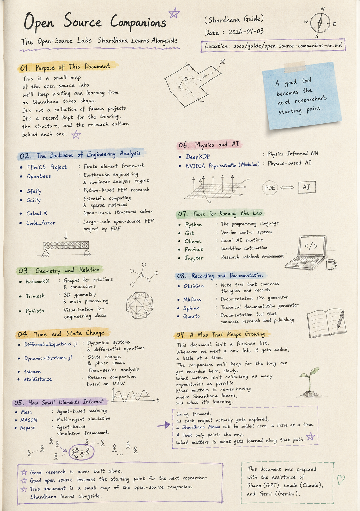
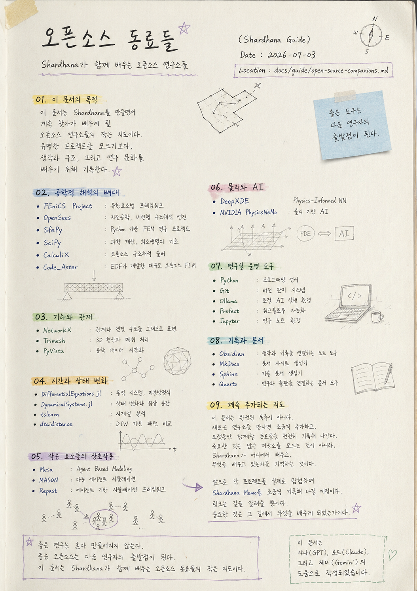

> Location: `docs/guide/open-source-companions-en.md`

# Open Source Companions

## The Open-Source Labs Shardhana Learns Alongside

*(Shardhana Guide)*
*Date: 2026-07-03*

## 🎬 YouTube Video

[Watch on YouTube](https://youtu.be/muUsHZoiiQI)

  

---

# 01. Purpose of This Document

This document is a small map

of the open-source labs

we'll keep visiting and learning from

as Shardhana takes shape.

It isn't a collection of famous projects.

It's a record kept

for the thinking, the structure,

and the research culture behind each one.

---

# 02. The Backbone of Engineering Analysis

## FEniCS Project

https://github.com/FEniCS

A finite element framework
that turns equations into code.

---

## OpenSees

https://github.com/OpenSees/OpenSees

An engine for earthquake engineering
and nonlinear structural analysis.

---

## SfePy

https://github.com/sfepy/sfepy

A Python-based
finite element research project.

---

## SciPy

https://github.com/scipy/scipy

The foundation for
scientific computing and sparse matrices.

---

## CalculiX

https://github.com/Dhondtguido/CalculiX

An open-source structural analysis solver.

---

## Code_Aster

https://gitlab.com/codeaster/src

A large-scale open-source FEM project
developed by EDF.

---

# 03. Geometry and Relation

## NetworkX

https://github.com/networkx/networkx

A library that represents
relationships and connections as graphs.

---

## Trimesh

https://github.com/mikedh/trimesh

3D geometry
and mesh processing.

---

## PyVista

https://github.com/pyvista/pyvista

Visualization
for engineering data.

---

# 04. Time and State Change

## DifferentialEquations.jl

https://github.com/SciML/DifferentialEquations.jl

Dynamical systems
and differential equations.

---

## DynamicalSystems.jl

https://github.com/JuliaDynamics/DynamicalSystems.jl

State change
and phase space.

---

## tslearn

https://github.com/tslearn-team/tslearn

Time-series analysis.

---

## dtaidistance

https://github.com/wannesm/dtaidistance

Pattern comparison
based on DTW.

---

# 05. How Small Elements Interact

## Mesa

https://github.com/projectmesa/mesa

Agent-based modeling.

---

## MASON

https://github.com/eclab/mason

Multi-agent
simulation.

---

## Repast

https://repast.github.io/

An agent-based
simulation framework.

---

# 06. Physics and AI

## DeepXDE

https://github.com/lululxvi/deepxde

Physics-Informed Neural Networks.

---

## NVIDIA PhysicsNeMo (formerly Modulus)

https://github.com/NVIDIA/physicsnemo

Physics-based AI.

---

# 07. Tools for Running the Lab

## Python

https://github.com/python/cpython

The programming language.

---

## Git

https://github.com/git/git

The version control system.

---

## Ollama

https://github.com/ollama/ollama

A local AI runtime.

---

## Prefect

https://github.com/PrefectHQ/prefect

Workflow automation.

---

## Jupyter

https://github.com/jupyterlab/jupyterlab

A research notebook environment.

---

# 08. Recording and Documentation

## Obsidian

https://obsidian.md/

A note-taking tool
that connects thoughts and records.

---

## MkDocs

https://github.com/mkdocs/mkdocs

A documentation site generator.

---

## Sphinx

https://github.com/sphinx-doc/sphinx

A technical documentation generator.

---

## Quarto

https://github.com/quarto-dev/quarto-cli

A documentation tool
that connects research and publishing.

---

# 09. A Map That Keeps Growing

This document

isn't a finished list.

Whenever we meet a new lab,

it gets added, a little at a time.

The companions we'll keep for the long run

get recorded here, slowly.

What matters isn't

collecting as many repositories as possible.

What matters is remembering

where Shardhana learns,

and what it's learning.

---

Going forward,

as each project actually gets explored,

a Shardhana Memo

will be added here, a little at a time.

A link

only points the way.

What matters

is what gets learned

along that path.

---

*Good research is never built alone.*

*Good open source becomes the starting point for the next researcher.*

*This document is a small map of the open-source companions Shardhana learns alongside.*

---

*This document was prepared with the assistance of Shana (GPT), Laude (Claude), and Gemi (Gemini).*

---
 
 

# 오픈소스 동료들

## Shardhana가 함께 배우는 오픈소스 연구소들

*(Shardhana Guide)*
*Date: 2026-07-03*

## 🎬 유튜브 영상

[Watch on YouTube](https://youtu.be/T4fivyJ7TIg)

  

---

# 01. 이 문서의 목적

이 문서는

Shardhana를 만들면서

계속 찾아가 배우게 될

오픈소스 연구소들의 작은 지도이다.

유명한 프로젝트를 모으기보다,

생각과 구조,

그리고 연구 문화를 배우기 위해

기록한다.

---

# 02. 공학적 해석의 뼈대

## FEniCS Project

https://github.com/FEniCS

수식을 코드로 표현하는
유한요소법 프레임워크.

---

## OpenSees

https://github.com/OpenSees/OpenSees

지진공학과
비선형 구조해석 엔진.

---

## SfePy

https://github.com/sfepy/sfepy

Python 기반
유한요소법 연구 프로젝트.

---

## SciPy

https://github.com/scipy/scipy

과학 계산과
희소행렬의 기초.

---

## CalculiX

https://github.com/Dhondtguido/CalculiX

오픈소스 구조해석 솔버.

---

## Code_Aster

https://gitlab.com/codeaster/src

EDF가 개발한
대규모 오픈소스 FEM 프로젝트.

---

# 03. 기하와 관계

## NetworkX

https://github.com/networkx/networkx

관계와 연결 구조를
그래프로 표현하는 라이브러리.

---

## Trimesh

https://github.com/mikedh/trimesh

3D 형상과
메쉬 처리.

---

## PyVista

https://github.com/pyvista/pyvista

공학 데이터
시각화.

---

# 04. 시간과 상태 변화

## DifferentialEquations.jl

https://github.com/SciML/DifferentialEquations.jl

동적 시스템과
미분방정식.

---

## DynamicalSystems.jl

https://github.com/JuliaDynamics/DynamicalSystems.jl

상태 변화와
위상 공간.

---

## tslearn

https://github.com/tslearn-team/tslearn

시계열 분석.

---

## dtaidistance

https://github.com/wannesm/dtaidistance

DTW 기반
패턴 비교.

---

# 05. 작은 요소들의 상호작용

## Mesa

https://github.com/projectmesa/mesa

Agent Based Modeling.

---

## MASON

https://github.com/eclab/mason

다중 에이전트
시뮬레이션.

---

## Repast

https://repast.github.io/

에이전트 기반
시뮬레이션 프레임워크.

---

# 06. 물리와 AI

## DeepXDE

https://github.com/lululxvi/deepxde

Physics-Informed Neural Networks.

---

## NVIDIA PhysicsNeMo (구 Modulus)

https://github.com/NVIDIA/physicsnemo

물리 기반 AI.

---

# 07. 연구실 운영 도구

## Python

https://github.com/python/cpython

프로그래밍 언어.

---

## Git

https://github.com/git/git

버전 관리 시스템.

---

## Ollama

https://github.com/ollama/ollama

로컬 AI 실행 환경.

---

## Prefect

https://github.com/PrefectHQ/prefect

워크플로우 자동화.

---

## Jupyter

https://github.com/jupyterlab/jupyterlab

연구 노트 환경.

---

# 08. 기록과 문서

## Obsidian

https://obsidian.md/

생각과 기록을
연결하는 노트 도구.

---

## MkDocs

https://github.com/mkdocs/mkdocs

문서 사이트 생성기.

---

## Sphinx

https://github.com/sphinx-doc/sphinx

기술 문서 생성기.

---

## Quarto

https://github.com/quarto-dev/quarto-cli

연구와 출판을
연결하는 문서 도구.

---

# 09. 계속 추가되는 지도

이 문서는
완성된 목록이 아니다.

새로운 연구소를 만나면
조금씩 추가하고,

오랫동안 함께할 동료들을
천천히 기록해 나간다.

중요한 것은

많은 저장소를 모으는 것이 아니라,

Shardhana가

어디에서 배우고,

무엇을 배우고 있는지를

기억하는 것이다.

---

앞으로

각 프로젝트를 실제로 탐험하며

Shardhana Memo를

조금씩 기록해 나갈 예정이다.

링크는

길을 알려줄 뿐이다.

중요한 것은

그 길에서

무엇을 배우게 되었는가이다.

---

*좋은 연구는 혼자 만들어지지 않는다.*

*좋은 오픈소스는 다음 연구자의 출발점이 된다.*

*이 문서는 Shardhana가 함께 배우는 오픈소스 동료들의 작은 지도이다.*

---

*이 문서는 샤나(GPT), 로드(Claude), 그리고 제미(Gemini)의 도움으로 작성되었습니다.*
