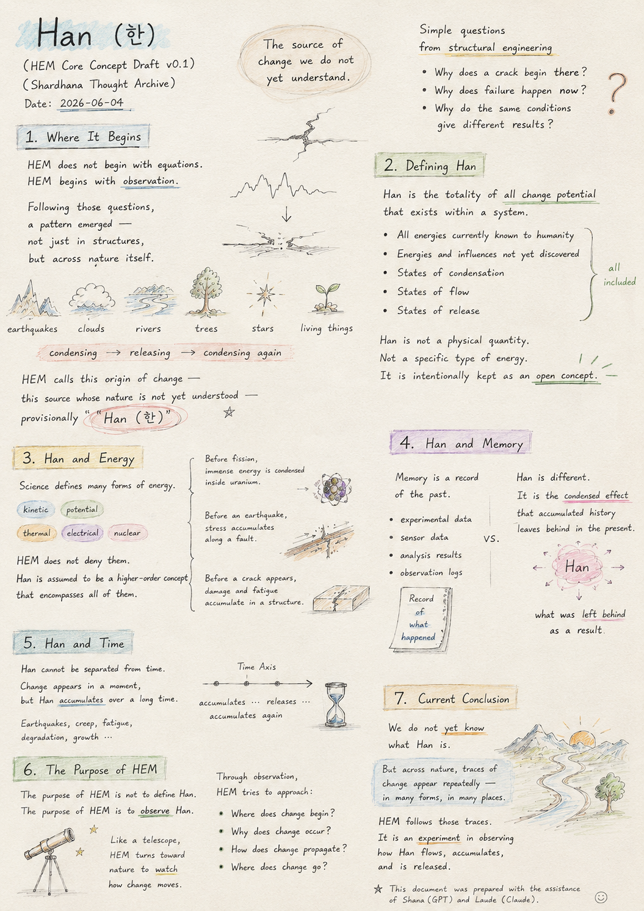
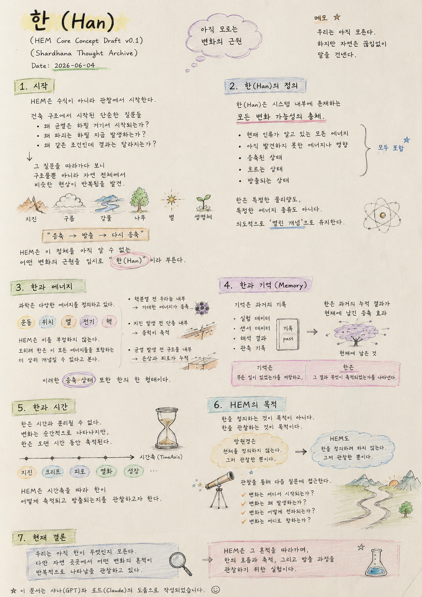

> Location: `docs/han-concept.md`

# Han (한)

*(HEM Core Concept Draft v0.1)*  
*(Shardhana Thought Archive)*  
*Date: 2026-06-04*

## 🎬 YouTube Video

[Watch on YouTube](https://youtu.be/imPb8R_vErw)

  

---

## 1. Where It Begins

HEM does not begin with equations.

HEM begins with observation.

The questions that started in structural engineering were simple:

- Why does a crack begin *there* of all places?
- Why does failure happen *now* of all moments?
- Why do the same conditions produce different results?

Following those questions,  
a pattern emerged —  
not just in structures,  
but across nature itself.

Earthquakes.  
Clouds.  
Rivers.  
Trees.  
Stars.  
Living things.

All of them show something condensing,  
releasing,  
and condensing again.

HEM calls this origin of change —  
this source whose nature is not yet understood —  
provisionally **"Han (한)"**.

---

## 2. Defining Han

Han is the highest-level concept currently used in HEM.

Han is not a specific physical quantity.

Han is not a specific type of energy.

Han is **the totality of all change potential**  
existing within a system.

This includes:

- All energies currently known to humanity
- Energies and influences not yet discovered
- States of condensation
- States of flow
- States of release

Han is intentionally kept as an open concept.

---

## 3. Han and Energy

Modern science defines many forms of energy:

- Kinetic energy
- Potential energy
- Thermal energy
- Electrical energy
- Nuclear energy

HEM does not deny any of these.

Rather, Han is assumed to be a higher-order concept  
that encompasses all of them.

For example:

Before nuclear fission,  
an enormous amount of energy is condensed inside uranium.

Before an earthquake,  
stress accumulates along a fault.

Before a crack appears,  
damage and fatigue accumulate inside a structure.

HEM regards these states of condensation  
as one form of Han.

---

## 4. Han and Memory

Memory is a record of the past.

- Experimental data
- Sensor readings
- Analysis results
- Observation logs

Han is something different.

Han is not simply a record.  
Han is the condensed effect  
that accumulated history leaves behind in the present.

In other words:

Memory stores *what happened.*

Han represents *what was left behind as a result.*

---

## 5. Han and Time

Han cannot be separated from time.

Change appears in a moment —  
but Han accumulates over a long time.

Earthquakes.  
Creep.  
Fatigue.  
Degradation.  
Growth.

HEM seeks to observe  
how Han accumulates and releases  
along the axis of time.

---

## 6. The Purpose of HEM

The purpose of HEM is not to define Han.

The purpose of HEM is to observe Han.

A telescope does not define the stars it watches.  
In the same way, HEM does not try to define Han.

But just as a telescope turns toward the sky  
to watch what is there —  
HEM turns toward nature  
to watch how change moves.

Through that observation,  
HEM tries to approach these questions:

- Where does change begin?
- Why does change occur?
- How does change propagate?
- Where does change go?

---

## 7. Current Conclusion

We do not yet know what Han is.

But across nature,  
traces of change  
appear repeatedly —  
in many forms, in many places.

HEM follows those traces.

It is an experiment in observing  
how Han flows, accumulates,  
and is released.

---

*This document was prepared with the assistance of Shana (GPT) and Laude (Claude).*

# 한(Han)

*(HEM Core Concept Draft v0.1)*  
*(Shardhana Thought Archive)*  
*Date: 2026-06-04*

## 🎬 유튜브 영상

[Watch on YouTube](https://youtu.be/BsENf20EowA)

  

---

## 1. 시작

HEM은 수식에서 시작하지 않는다.

HEM은 관찰에서 시작한다.

건축 구조에서 시작된 질문은 단순했다.

- 왜 균열은 하필 거기서 시작되는가?
- 왜 파괴는 하필 지금 발생하는가?
- 왜 같은 조건인데 결과는 달라지는가?

이 질문을 따라가다 보니  
구조물뿐 아니라 자연 전체에서  
비슷한 현상이 반복적으로 나타남을 발견하였다.

지진.  
구름.  
강물.  
나무.  
별.  
생명체.

모두 어떤 것이 응축되었다가 방출되고  
다시 응축되는 모습을 보인다.

HEM은 이 정체를 아직 알 수 없는  
어떤 변화의 근원을  
임시로 **"한(Han)"** 이라고 부른다.

---

## 2. 한(Han)의 정의

한(Han)은 현재 HEM에서 사용하는 최상위 개념이다.

한은 특정한 물리량이 아니다.

한은 특정한 에너지 종류도 아니다.

한은 시스템 내부에 존재하는  
**모든 변화 가능성의 총체**이다.

여기에는:

- 현재 인류가 알고 있는 모든 에너지
- 아직 발견하지 못한 에너지나 영향
- 응축된 상태
- 흐르는 상태
- 방출되는 상태

모두 포함될 수 있다.

따라서 한은 의도적으로 열린 개념으로 유지한다.

---

## 3. 한과 에너지

현재 과학은 다양한 에너지를 정의하고 있다.

- 운동에너지
- 위치에너지
- 열에너지
- 전기에너지
- 핵에너지

HEM은 이러한 에너지를 부정하지 않는다.

오히려 한은 이러한 에너지들을 포함하는  
더 상위 개념일 수 있다고 가정한다.

예를 들어,

핵분열 이전 우라늄 내부에는  
엄청난 에너지가 응축되어 있다.

지진 발생 이전 단층 내부에는  
응력이 축적되어 있다.

균열 발생 이전 구조물 내부에는  
손상과 피로가 누적되어 있다.

HEM은 이러한 응축 상태 또한  
한의 한 형태로 본다.

---

## 4. 한과 기억(Memory)

기억은 과거의 기록이다.

- 실험 데이터
- 센서 데이터
- 해석 결과
- 관측 기록

반면 한은 단순한 기록이 아니다.

한은 과거의 누적 결과가  
현재에 남긴 응축 효과이다.

즉,

기억은 "무슨 일이 있었는가"를 저장하고,

한은 "그 결과 무엇이 축적되었는가"를 나타낸다.

---

## 5. 한과 시간

한은 시간과 분리될 수 없다.

변화는 순간적으로 나타나지만,  
한은 오랜 시간 동안 축적된다.

지진.  
크리프.  
피로.  
열화.  
성장.

HEM은 시간축(TimeAxis)을 따라  
한이 어떻게 축적되고 방출되는지를  
관찰하고자 한다.

---

## 6. HEM의 목적

HEM의 목적은 한을 정의하는 것이 아니다.

HEM의 목적은 한을 관찰하는 것이다.

망원경이 천체를 정의하지 않듯,  
HEM도 한을 정의하려 하지 않는다.

다만 망원경이 천체를 관찰하듯,  
HEM은 자연 속 변화의 흐름을 관찰한다.

관찰을 통해 다음 질문에 접근하고자 한다.

- 변화는 어디서 시작되는가?
- 변화는 왜 발생하는가?
- 변화는 어떻게 전파되는가?
- 변화는 어디로 향하는가?

---

## 7. 현재 결론

우리는 아직 한이 무엇인지 모른다.

다만 자연 곳곳에서  
어떤 변화의 흔적이  
반복적으로 나타남을 관찰하고 있다.

HEM은 그 흔적을 따라가며,  
한의 흐름과 축적, 그리고 방출 과정을  
관찰하기 위한 실험이다.

---

*이 문서는 샤나(GPT)와 로드(Claude)의 도움으로 작성되었습니다.*
