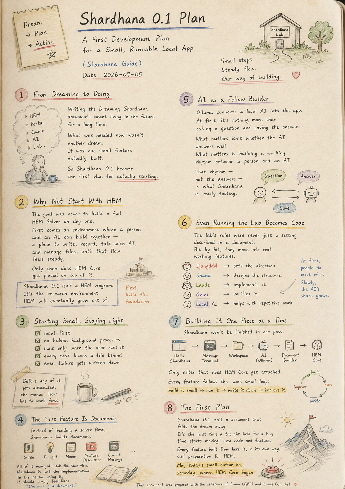
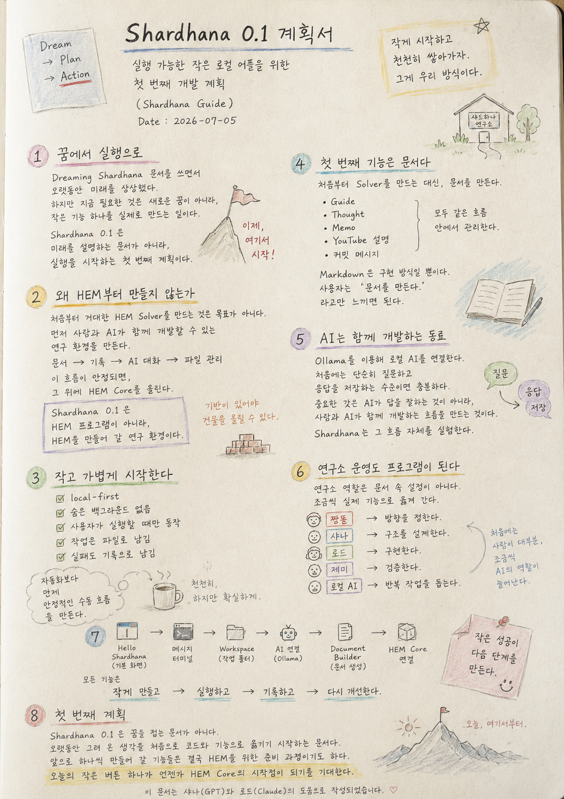

> Location: `docs/plan/001-shardhana-plan.md`

# Shardhana 0.0.1 Plan

## A First Development Plan for a Small, Runnable Local App

*(Shardhana Guide) Date: 2026-07-05*

  

---

## 1. From Dreaming to Doing

Writing the Dreaming Shardhana documents meant living in the future for a long time.

HEM,
Portal,
Guide,
AI,
even the way the lab itself would run.

Then, at some point, one thing became clear.

What was needed now wasn't another dream. It was one small feature, actually built.

So Shardhana 0.1 stopped being a document about the future, and became the first plan for actually starting.

---

## 2. Why Not Start With HEM

The goal was never to build a full HEM Solver on day one.

First comes an environment where a person and an AI can build together — a place to write documents, keep records, talk with AI, and manage files, until that flow feels steady.

Only then does HEM Core get placed on top of it.

In other words: Shardhana 0.1 isn't a HEM program. It's the research environment HEM will eventually grow out of.

---

## 3. Starting Small, Staying Light

Shardhana never tries to become a massive program overnight. The same principles hold throughout:

- local-first
- no hidden background processes
- runs only when the user runs it
- every task leaves a file behind
- even failure gets written down

Before any of it gets automated, the manual flow has to work, reliably, first.

---

## 4. The First Feature Is Documents

Instead of building a solver first, Shardhana builds documents.

Guides,
Thoughts,
Memos,
YouTube descriptions,
commit messages —

all of it managed inside the same flow.

Markdown is just the implementation. To the person using it, it should simply feel like: *I'm making a document.*

---

## 5. AI as a Fellow Builder

Ollama connects a local AI into the app.

At first, it's nothing more than asking a question and saving the answer.

What matters isn't whether the AI answers well. What matters is building a working rhythm between a person and an AI.

That rhythm — not the answers — is what Shardhana is really testing.

---

## 6. Even Running the Lab Becomes Code

The lab's roles were never just a setting described in a document. Bit by bit, they move into real, working features.

Jjangddol sets the direction.
Shana designs the structure.
Laude implements it.
Gemi verifies it.
The local AI helps with the repetitive work.

At first, a person does most of it. Slowly, the AI's share grows.

---

## 7. Building It One Piece at a Time

Shardhana won't be finished in one pass.

It starts from Hello Shardhana, then a message terminal, then a workspace, then a connection to AI, then a Document Builder.

Only after that does HEM Core get attached.

Every feature follows the same small loop: build it small, run it, write it down, improve it.

---

## 8. The First Plan

Shardhana 0.1 isn't a document that folds the dream away.

It's the first time a thought held for a long time starts moving into code and working features.

Every feature built from here is, in its own way, still preparation for HEM.

May today's small button be, someday, where HEM Core began.

---
This document was prepared with the assistance of Shana (GPT) and Laude (Claude).

---
 
 

# Shardhana 0.0.1 계획서

## 실행 가능한 작은 로컬 어플을 위한 첫 번째 개발 계획

*(Shardhana Guide) Date: 2026-07-05*

  

---

## 1. 꿈에서 실행으로

Dreaming Shardhana 문서를 쓰면서
오랫동안 미래를 상상했다.

HEM,
Portal,
Guide,
AI,
그리고 연구소 운영 방식까지.

하지만 어느 순간 한 가지를 깨달았다.

지금 필요한 것은 새로운 꿈이 아니라,
작은 기능 하나를 실제로 만드는 일이었다.

그래서 Shardhana 0.1은
미래를 설명하는 문서가 아니라,
실행을 시작하는 첫 번째 계획이 되었다.

---

## 2. 왜 HEM부터 만들지 않는가

처음부터 거대한 HEM Solver를 만드는 것은 목표가 아니다.

먼저 사람과 AI가 함께 개발할 수 있는 연구 환경을 만든다.

문서를 만들고,
기록을 남기고,
AI와 대화하고,
파일을 관리하는 흐름이 안정되면,

그 위에 HEM Core를 올린다.

즉,

Shardhana 0.1은
HEM 프로그램이 아니라,
HEM을 만들어 갈 연구 환경이다.

---

## 3. 작고 가볍게 시작한다

Shardhana는 처음부터 거대한 프로그램이 되려고 하지 않는다.

항상 같은 원칙을 따른다.

- local-first
- 숨은 백그라운드 없음
- 사용자가 실행할 때만 동작
- 작업은 파일로 남김
- 실패도 기록으로 남김

자동화보다
먼저
안정적인 수동 작업 흐름을 만든다.

---

## 4. 첫 번째 기능은 문서다

처음부터 Solver를 만드는 대신,
문서를 만든다.

Guide,
Thought,
Memo,
YouTube 설명,
커밋 메시지.

모두 같은 흐름 안에서 관리한다.

Markdown은 구현 방식일 뿐이다.

사용자는
'문서를 만든다.'
라고만 느끼면 된다.

---

## 5. AI는 함께 개발하는 동료

Ollama를 이용해
로컬 AI를 연결한다.

처음에는 단순히 질문하고
응답을 저장하는 수준이면 충분하다.

중요한 것은
AI가 답을 잘하는 것이 아니라,
사람과 AI가 함께 개발하는 흐름을 만드는 것이다.

Shardhana는
그 흐름 자체를 실험한다.

---

## 6. 연구소 운영도 프로그램이 된다

연구소 역할은 문서 속 설정이 아니다.

조금씩 실제 기능으로 옮겨 간다.

짱똘은 방향을 정한다.
샤나는 구조를 설계한다.
로드는 구현한다.
제미는 검증한다.
로컬 AI는 반복 작업을 돕는다.

처음에는 사람이 대부분을 하지만,
조금씩 AI의 역할이 늘어난다.

---

## 7. 하나씩 만들어 간다

Shardhana는
한 번에 완성되지 않는다.

Hello Shardhana에서 시작해
메시지 터미널을 만들고,
Workspace를 만들고,
AI를 연결하고,
Document Builder를 만든다.

그 다음에야
HEM Core를 붙인다.

모든 기능은
작게 만들고,
실행하고,
기록하고,
다시 개선한다.

---

## 8. 첫 번째 계획

Shardhana 0.1은
꿈을 접는 문서가 아니다.

오랫동안 그려 온 생각을
처음으로 코드와 기능으로 옮기기 시작하는 문서다.

앞으로 하나씩 만들어 갈 기능들은
결국 HEM을 위한 준비 과정이기도 하다.

오늘의 작은 버튼 하나가
언젠가 HEM Core의 시작점이 되기를 기대한다.

---

이 문서는 샤나(GPT)와 로드(Claude)의 도움으로 작성되었습니다.
