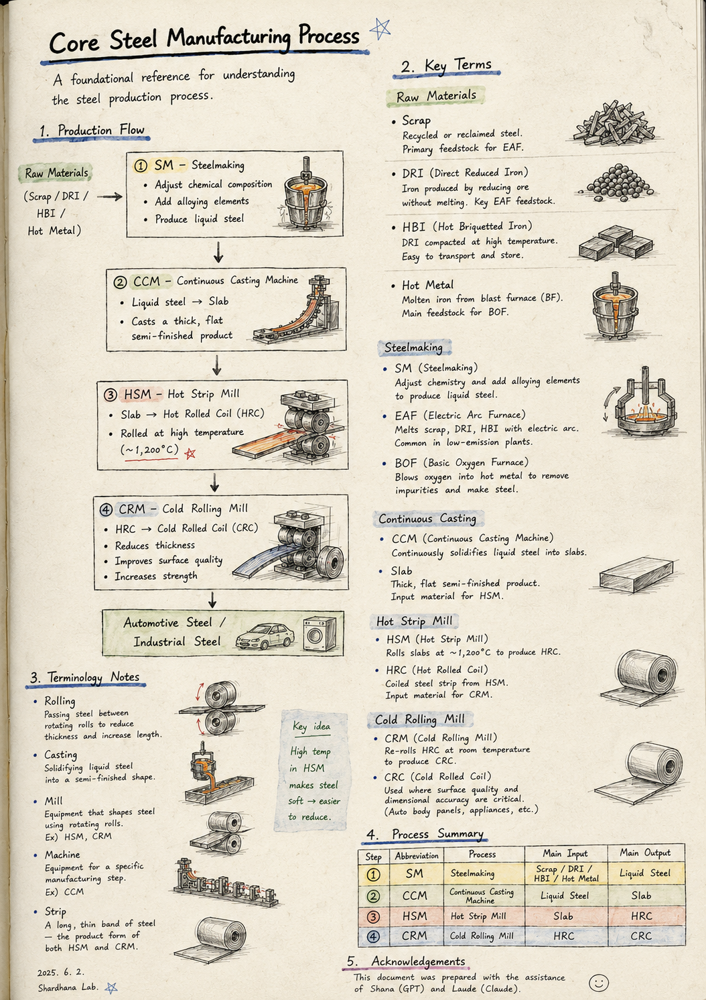
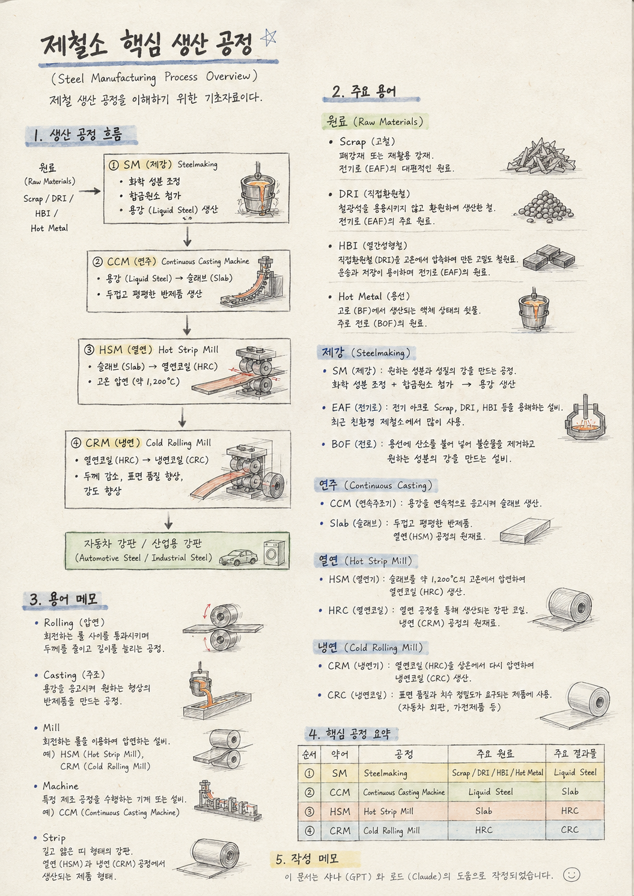

> Location: `docs/reference/steel-manufacturing-process.md`

# Core Steel Manufacturing Process

This document is a foundational reference for understanding the steel production process.

<p align="center">
  
</p>

---

# Production Flow

```text
Raw Materials
(Scrap / DRI / HBI / Hot Metal)
                     │
                     ▼
┌──────────────────────────────────────────────────────┐
│ ① SM — Steelmaking                                  │
│                                                      │
│ • Adjust chemical composition                        │
│ • Add alloying elements                               │
│ • Produce liquid steel                                │
└──────────────────────────────────────────────────────┘
                     │
                     ▼
┌──────────────────────────────────────────────────────┐
│ ② CCM — Continuous Casting Machine                   │
│                                                      │
│ • Liquid steel → Slab                                 │
│ • Casts a thick, flat semi-finished product           │
└──────────────────────────────────────────────────────┘
                     │
                     ▼
┌──────────────────────────────────────────────────────┐
│ ③ HSM — Hot Strip Mill                               │
│                                                      │
│ • Slab → Hot Rolled Coil (HRC)                        │
│ • Rolled at high temperature                          │
└──────────────────────────────────────────────────────┘
                     │
                     ▼
┌──────────────────────────────────────────────────────┐
│ ④ CRM — Cold Rolling Mill                            │
│                                                      │
│ • HRC → Cold Rolled Coil (CRC)                        │
│ • Reduces thickness                                    │
│ • Improves surface quality                             │
│ • Increases strength                                   │
└──────────────────────────────────────────────────────┘
                     │
                     ▼

Automotive Steel / Industrial Steel
```

---

# Key Terms

## Raw Materials

### Scrap

Recycled or reclaimed steel. The primary feedstock for the Electric Arc Furnace (EAF).

---

### DRI — Direct Reduced Iron

Iron produced by chemically reducing iron ore without melting it. A key EAF feedstock, often used where natural gas is available as a reducing agent.

---

### HBI — Hot Briquetted Iron

DRI that has been compacted at high temperature into a dense, briquette form. Easier to transport and store than loose DRI, and used as an EAF feedstock.

---

### Hot Metal

Molten iron produced by a blast furnace (BF). This is the primary feedstock for the Basic Oxygen Furnace (BOF).

---

## Steelmaking

### SM — Steelmaking

The process of producing steel with a specific chemical composition and set of properties. Alloying elements are added and the chemistry is adjusted to produce liquid steel, ready for casting.

---

### EAF — Electric Arc Furnace

Melts scrap, DRI, and HBI using an electric arc. Increasingly favored in newer, lower-emission steel plants since it doesn't rely on a blast furnace.

---

### BOF — Basic Oxygen Furnace

Refines hot metal by blowing oxygen through it to burn off impurities, converting it into steel of the desired composition.

---

## Continuous Casting

### CCM — Continuous Casting Machine

Continuously solidifies liquid steel into slabs, replacing the older practice of casting steel into individual ingots.

---

### Slab

A thick, flat semi-finished steel product cast by the CCM. Becomes the input material for the Hot Strip Mill.

---

## Hot Strip Mill

### HSM — Hot Strip Mill

Rolls slabs at roughly 1,200°C to produce hot rolled coil (HRC). The high temperature keeps the steel soft enough to be reduced significantly in thickness.

---

### HRC — Hot Rolled Coil

Coiled steel strip produced by the HSM. Becomes the input material for the Cold Rolling Mill.

---

## Cold Rolling Mill

### CRM — Cold Rolling Mill

Re-rolls HRC at room temperature to produce cold rolled coil (CRC), improving surface finish and dimensional precision beyond what hot rolling alone can achieve.

---

### CRC — Cold Rolled Coil

Coiled steel strip produced by the CRM. Used where surface quality and dimensional accuracy matter most, such as automotive outer body panels and home appliances.

---

# Terminology Notes

### Rolling

Passing steel between rotating rolls to reduce its thickness and increase its length.

---

### Casting

Solidifying liquid steel into a semi-finished shape.

---

### Mill

Equipment that shapes steel by passing it through rotating rolls.

Examples:
- HSM (Hot Strip Mill)
- CRM (Cold Rolling Mill)

---

### Machine

Equipment built to perform a specific manufacturing step.

Example:
- CCM (Continuous Casting Machine)

---

### Strip

A long, thin band of steel — the product form coming out of both the HSM and CRM.

---

# Process Summary

| Step | Abbreviation | Process | Main Input | Main Output |
|------|--------------|---------|------------|-------------|
| ① | SM | Steelmaking | Scrap / DRI / HBI / Hot Metal | Liquid Steel |
| ② | CCM | Continuous Casting Machine | Liquid Steel | Slab |
| ③ | HSM | Hot Strip Mill | Slab | HRC |
| ④ | CRM | Cold Rolling Mill | HRC | CRC |

---

## Acknowledgements

This document was prepared with the assistance of Shana (GPT) and Laude (Claude).

---
<br>
<br>

# 제철소 핵심 생산 공정

*(Steel Manufacturing Process Overview)*

제철 생산 공정을 이해하기 위한 기초자료이다.

<p align="center">
  
</p>

---

# 생산 공정 흐름

```text
원료 (Raw Materials)
(Scrap / DRI / HBI / Hot Metal)
                     │
                     ▼
┌──────────────────────────────────────────────────────┐
│ ① SM (제강) : Steelmaking                           │
│                                                      │
│ • 화학 성분 조정                                     │
│ • 합금원소 첨가                                      │
│ • 용강(Liquid Steel) 생산                            │
└──────────────────────────────────────────────────────┘
                     │
                     ▼
┌──────────────────────────────────────────────────────┐
│ ② CCM (연주) : Continuous Casting Machine           │
│                                                      │
│ • 용강(Liquid Steel) → 슬래브(Slab)                  │
│ • 두껍고 평평한 반제품 생산                          │
└──────────────────────────────────────────────────────┘
                     │
                     ▼
┌──────────────────────────────────────────────────────┐
│ ③ HSM (열연) : Hot Strip Mill                       │
│                                                      │
│ • 슬래브(Slab) → 열연코일(HRC)                      │
│ • 고온 압연                                          │
└──────────────────────────────────────────────────────┘
                     │
                     ▼
┌──────────────────────────────────────────────────────┐
│ ④ CRM (냉연) : Cold Rolling Mill                    │
│                                                      │
│ • 열연코일(HRC) → 냉연코일(CRC)                     │
│ • 두께 감소                                          │
│ • 표면 품질 향상                                     │
│ • 강도 향상                                          │
└──────────────────────────────────────────────────────┘
                     │
                     ▼

자동차 강판 / 산업용 강판
(Automotive Steel / Industrial Steel)
```

---

# 주요 용어

## 원료 (Raw Materials)

### Scrap (고철)

폐강재 또는 재활용 강재.

전기로(EAF)의 대표적인 원료이다.

---

### DRI (직접환원철) : Direct Reduced Iron

철광석을 용융시키지 않고 환원하여 생산한 철.

전기로(EAF)의 주요 원료이다.

---

### HBI (열간성형철) : Hot Briquetted Iron

직접환원철(DRI)을 고온에서 압축하여 만든 고밀도 철원료.

운송과 저장이 용이하며 전기로(EAF)의 원료로 사용된다.

---

### Hot Metal (용선)

고로(BF)에서 생산되는 액체 상태의 쇳물.

주로 전로(BOF)의 원료로 사용된다.

---

## 제강 (Steelmaking)

### SM (제강) : Steelmaking

제철소에서 원하는 성분과 성질의 강(Steel)을 만드는 공정.

화학 성분을 조정하고 합금원소를 첨가하여 용강(Liquid Steel)을 생산한다.

---

### EAF (전기로) : Electric Arc Furnace

전기 아크를 이용하여 Scrap, DRI, HBI 등을 용해하는 설비.

최근 친환경 제철소에서 많이 사용된다.

---

### BOF (전로) : Basic Oxygen Furnace

용선(Hot Metal)에 산소를 불어 넣어 불순물을 제거하고 원하는 성분의 강을 만드는 설비.

---

## 연주 (Continuous Casting)

### CCM (연속주조기) : Continuous Casting Machine

용강(Liquid Steel)을 연속적으로 응고시켜 슬래브(Slab)를 생산하는 설비.

---

### Slab (슬래브)

연주(CCM) 공정에서 생산되는 두껍고 평평한 반제품.

열연(HSM) 공정의 원재료가 된다.

---

## 열연 (Hot Strip Mill)

### HSM (열연기) : Hot Strip Mill

슬래브(Slab)를 약 1,200℃의 고온에서 압연하여 열연코일(HRC)을 생산하는 설비.

---

### HRC (열연코일) : Hot Rolled Coil

열연(HSM) 공정을 통해 생산되는 강판 코일.

냉연(CRM) 공정의 원재료가 된다.

---

## 냉연 (Cold Rolling Mill)

### CRM (냉연기) : Cold Rolling Mill

열연코일(HRC)을 상온에서 다시 압연하여 냉연코일(CRC)을 생산하는 설비.

---

### CRC (냉연코일) : Cold Rolled Coil

냉연(CRM) 공정을 통해 생산되는 강판 코일.

자동차 외판, 가전제품 등 표면 품질과 치수 정밀도가 요구되는 제품에 사용된다.

---

# 용어 메모

### Rolling (압연, 壓延)

회전하는 롤(Roll) 사이를 통과시키며 두께를 줄이고 길이를 늘리는 가공 공정.

---

### Casting (주조, 鑄造)

용강(Liquid Steel)을 응고시켜 원하는 형상의 반제품을 만드는 공정.

---

### Mill

회전하는 롤(Roll)을 이용하여 압연하는 설비.

예)
- HSM (Hot Strip Mill)
- CRM (Cold Rolling Mill)

---

### Machine

특정 제조 공정을 수행하는 기계 또는 설비.

예)
- CCM (Continuous Casting Machine)

---

### Strip

길고 얇은 띠 형태의 강판.

열연(HSM)과 냉연(CRM) 공정에서 생산되는 제품 형태를 의미한다.

---

# 핵심 공정 요약

| 순서 | 약어 | 공정 | 주요 원료 | 주요 결과물 |
|------|------|------|-----------|-------------|
| ① | SM | Steelmaking | Scrap / DRI / HBI / Hot Metal | Liquid Steel |
| ② | CCM | Continuous Casting Machine | Liquid Steel | Slab |
| ③ | HSM | Hot Strip Mill | Slab | HRC |
| ④ | CRM | Cold Rolling Mill | HRC | CRC |

---

## 작성 메모

이 문서는 샤나(GPT)와 로드(Claude)의 도움으로 작성되었습니다.
