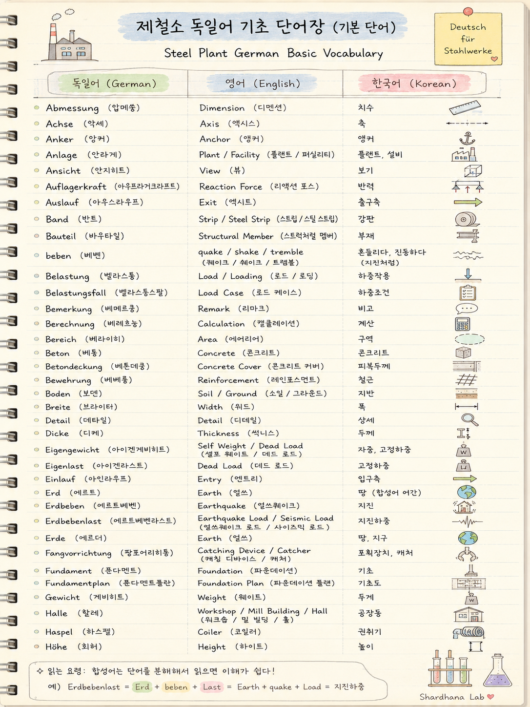
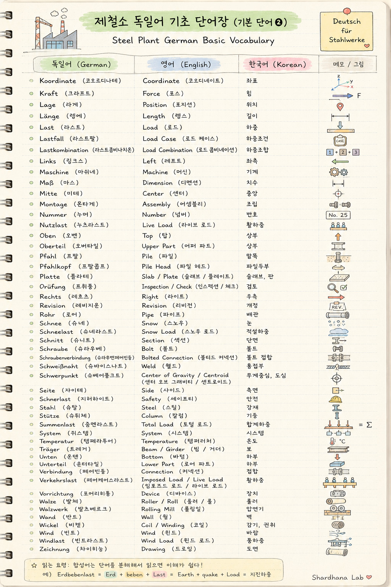

**Document Path:** `docs/reference/steel-plant-german-vocabulary.md`

# 제철소 독일어 기초 단어장
# Steel Plant German Basic Vocabulary
# Grundwortschatz Deutsch für Stahlwerke

---

  

---

  

---

목적 : 독일어 기술문서(TD) 독해를 위한 제철소 기본 용어 정리

Purpose: A basic vocabulary for reading German technical documents (TD) in steel plant engineering.

Zweck: Ein Grundwortschatz zum Lesen deutscher technischer Dokumente (TD) im Stahlwerksbereich.

---

## Scope

본 문서는 SMS 등 독일계 제철소 프로젝트에서

자주 등장하는 구조·기계·도면 용어를

독일어 → 영어 → 한국어 순으로 정리한

실무 참고용 단어장이다.

독일어 학습이 아니라

TD를 빠르게 해석하는 것을 목표로 한다.

---

## 기본 단어

| 독일어 (German) | 영어 (English) | 한국어 (Korean) |
|---|---|---|
| Abmessung (압메쑹) | Dimension (디멘션) | 치수 |
| Achse (악세) | Axis (액시스) | 축 |
| Anker (앙커) | Anchor (앵커) | 앵커 |
| Anlage (안라게) | Plant / Facility (플랜트 / 퍼실리티) | 플랜트, 설비 |
| Ansicht (안지히트) | View (뷰) | 보기 |
| Auflagerkraft (아우프라거크라프트) | Reaction Force (리액션 포스) | 반력 |
| Auslauf (아우스라우프) | Exit (엑시트) | 출구측 |
| Band (반트) | Strip / Steel Strip (스트립 / 스틸 스트립) | 강판 |
| Bauteil (바우타일) | Structural Member (스트럭처럴 멤버) | 부재 |
| beben (베벤) | quake / shake / tremble (퀘이크 / 쉐이크 / 트렘블) | 흔들리다, 진동하다 (지진처럼) |
| Belastung (벨라스퉁) | Load / Loading (로드 / 로딩) | 하중작용 |
| Belastungsfall (벨라스퉁스팔) | Load Case (로드 케이스) | 하중조건 |
| Bemerkung (베메르쿵) | Remark (리마크) | 비고 |
| Berechnung (베레흐눙) | Calculation (캘큘레이션) | 계산 |
| Bereich (베라이히) | Area (에어리어) | 구역 |
| Beton (베통) | Concrete (콘크리트) | 콘크리트 |
| Betondeckung (베톤데쿵) | Concrete Cover (콘크리트 커버) | 피복두께 |
| Bewehrung (베베룽) | Reinforcement (레인포스먼트) | 철근 |
| Boden (보덴) | Soil / Ground (소일 / 그라운드) | 지반 |
| Breite (브라이터) | Width (위드) | 폭 |
| Detail (데타일) | Detail (디테일) | 상세 |
| Dicke (디케) | Thickness (씩니스) | 두께 |
| Eigengewicht (아이겐게비히트) | Self Weight / Dead Load (셀프 웨이트 / 데드 로드) | 자중, 고정하중 |
| Eigenlast (아이겐라스트) | Dead Load (데드 로드) | 고정하중 |
| Einlauf (아인라우프) | Entry (엔트리) | 입구측 |
| Erd (에르트) | Earth (얼쓰) | 땅 (합성어 어간) |
| Erdbeben (에르트베벤) | Earthquake (얼쓰퀘이크) | 지진 |
| Erdbebenlast (에르트베벤라스트) | Earthquake Load / Seismic Load (얼쓰퀘이크 로드 / 사이즈믹 로드) | 지진하중 |
| Erde (에르더) | Earth (얼쓰) | 땅, 지구 |
| Fangvorrichtung (팡포어리히퉁) | Catching Device / Catcher (캐칭 디바이스 / 캐처) | 포획장치, 캐처 |
| Fundament (푼다멘트) | Foundation (파운데이션) | 기초 |
| Fundamentplan (푼다멘트플란) | Foundation Plan (파운데이션 플랜) | 기초도 |
| Gewicht (게비히트) | Weight (웨이트) | 무게 |
| Halle (할레) | Workshop / Mill Building / Hall (워크숍 / 밀 빌딩 / 홀) | 공장동 |
| Haspel (하스펠) | Coiler (코일러) | 권취기 |
| Höhe (회허) | Height (하이트) | 높이 |
| Koordinate (코오르디나테) | Coordinate (코오디네이트) | 좌표 |
| Kraft (크라프트) | Force (포스) | 힘 |
| Lage (라게) | Position (포지션) | 위치 |
| Länge (렝에) | Length (렝스) | 길이 |
| Last (라스트) | Load (로드) | 하중 |
| Lastfall (라스트팔) | Load Case (로드 케이스) | 하중조건 |
| Lastkombination (라스트콤비나치온) | Load Combination (로드 콤비네이션) | 하중조합 |
| Links (링크스) | Left (레프트) | 좌측 |
| Maschine (마쉬네) | Machine (머신) | 기계 |
| Maß (마스) | Dimension (디멘션) | 치수 |
| Mitte (미테) | Center (센터) | 중앙 |
| Montage (몬타게) | Assembly (어셈블리) | 조립 |
| Nummer (누머) | Number (넘버) | 번호 |
| Nutzlast (누츠라스트) | Live Load (라이브 로드) | 활하중 |
| Oben (오벤) | Top (탑) | 상부 |
| Oberteil (오버타일) | Upper Part (어퍼 파트) | 상부 |
| Pfahl (프팔) | Pile (파일) | 말뚝 |
| Pfahlkopf (프팔콥프) | Pile Head (파일 헤드) | 파일두부 |
| Platte (플라테) | Slab / Plate (슬래브 / 플레이트) | 슬래브, 판 |
| Prüfung (프뤼풍) | Inspection / Check (인스펙션 / 체크) | 검토 |
| Rechts (레흐츠) | Right (라이트) | 우측 |
| Revision (레비지온) | Revision (리비전) | 개정 |
| Rohr (로어) | Pipe (파이프) | 배관 |
| Schnee (슈네) | Snow (스노우) | 눈 |
| Schneelast (슈네라스트) | Snow Load (스노우 로드) | 적설하중 |
| Schnitt (슈니트) | Section (섹션) | 단면 |
| Schraube (슈라우베) | Bolt (볼트) | 볼트 |
| Schraubenverbindung (슈라우벤페어빈둥) | Bolted Connection (볼티드 커넥션) | 볼트 접합 |
| Schweißnaht (슈바이스나트) | Weld (웰드) | 용접부 |
| Schwerpunkt (슈베어풍크트) | Center of Gravity / Centroid (센터 오브 그래비티 / 센트로이드) | 무게중심, 도심 |
| Seite (자이테) | Side (사이드) | 측면 |
| Sicherheit (지허하이트) | Safety (세이프티) | 안전 |
| Stahl (슈탈) | Steel (스틸) | 강재 |
| Stütze (슈튀체) | Column (칼럼) | 기둥 |
| Summenlast (줌멘라스트) | Total Load (토털 로드) | 합계하중 |
| System (쥐스템) | System (시스템) | 시스템 |
| Temperatur (템페라투어) | Temperature (템퍼러처) | 온도 |
| Träger (트레거) | Beam / Girder (빔 / 거더) | 보 |
| Unten (운텐) | Bottom (바텀) | 하부 |
| Unterteil (운터타일) | Lower Part (로어 파트) | 하부 |
| Verbindung (페어빈둥) | Connection (커넥션) | 접합 |
| Verkehrslast (페어케어스라스트) | Imposed Load / Live Load (임포즈드 로드 / 라이브 로드) | 활하중 |
| Vorrichtung (포어리히퉁) | Device (디바이스) | 장치 |
| Walze (발체) | Roller / Roll (롤러 / 롤) | 롤러 |
| Walzwerk (발츠베르크) | Rolling Mill (롤링밀) | 압연기 |
| Wand (반트) | Wall (월) | 벽 |
| Wickel (비켈) | Coil / Winding (코일) | 감기, 권취 |
| Wind (빈트) | Wind (윈드) | 바람 |
| Windlast (빈트라스트) | Wind Load (윈드 로드) | 풍하중 |
| Zeichnung (차이히눙) | Drawing (드로잉) | 도면 |

---

## 자주 보이는 합성어

| 독일어 (German) | 분해 (Breakdown) | 영어 (English) | 한국어 (Korean) |
|---|---|---|---|
| Erdbeben | Erd + beben | Earth + quake | 지진 |
| Erdbebenlast | Erdbeben + Last | Earthquake + Load | 지진하중 |
| Summenlast | Summen + Last | Total Load | 합계하중 |
| Einlauf | Ein + Lauf | Entry | 입구측 |
| Auslauf | Aus + Lauf | Exit | 출구측 |
| Unterteil | Unter + Teil | Lower Part | 하부 |
| Oberteil | Ober + Teil | Upper Part | 상부 |
| Walzwerk | Walz + Werk | Rolling Mill | 압연기 |
| Fangvorrichtung | Fang + Vorrichtung | Catching Device / Catcher | 포획장치, 캐처 |
| Berechnungsunterlagen | Berechnung(s) + Unterlagen | Calculation Documents | 계산서류 |

---

## 읽는 요령

독일어 기술문서는 합성어가 매우 많다.

예를 들어

Erdbebenlast

↓

Erd + beben + Last

↓

Earth + quake + Load

↓

지진하중

처럼 단어를 분해하여 읽으면

긴 독일어 단어도 비교적 쉽게 이해할 수 있다.

본 문서는 이러한 합성어를 빠르게 해석하기 위한 참고용 단어장이다.

---

※ 목표

독일어를 배우는 것이 아니라,

제철소 기술문서를 읽기 위한 독일어 기술용어를 익히는 것을 목표로 한다.

---

## Revision History

| Rev. | Date | Description |
|------|------|-------------|
| 0.1 | 2026-07 | Initial version |
| 0.2 | 2026-07 | 하중/구조/도면/기초 관련 용어 추가, Schwerpunkt에 Centroid 병기 |
| 0.3 | 2026-07 | Scope 추가, 발음 교정(Dicke/Breite/Höhe/Pfahl), Verkehrslast 번역 보완, 축·좌표·조립·용접·철근 등 용어 추가 |

---

이 문서는 샤나(GPT)와 로드(Claude)의 도움으로 작성되었습니다.
