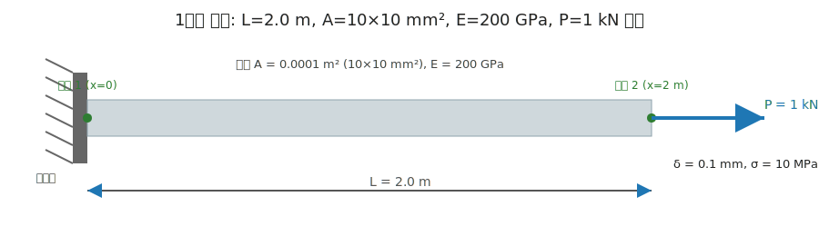

# 교재 예제 1: 1차원 막대 축변형

이 예제에서는 **1차원 막대(Bar)** 에 축방향 하중이 작용할 때 발생하는 **변형량**과 **응력**을 계산합니다.

---

## 1. 문제 제시

- 재질: 강(steel), 탄성계수  
  E = 200 GPa = 200 × 10^9 Pa  

- 막대 길이:  
  L = 2.0 m  

- 단면적:  
  A = 0.0001 m² = 10 mm × 10 mm  

- 인장하중:  
  P = 1.0 kN = 1000 N  

👉 구하시오:
1. 변형량 δ (mm 단위)  
2. 평균 축응력 σ  

---

## 2. 해석 개념 (쉽게 이해하기)

- 탄성계수 (E): 재료가 얼마나 뻣뻣한지 (클수록 덜 늘어남)  
- 단면적 (A): 단면이 클수록 힘을 더 잘 받음  
- 길이 (L): 길수록 잘 늘어남  
- 하중 (P): 크게 걸릴수록 잘 늘어남  

---

## 3. 공식

- 변형량: δ = (P × L) / (E × A)  
- 응력:   σ = P / A  

---

## 4. 풀이

δ = (1000 × 2.0) / (200 × 10^9 × 0.0001)  
   = 2000 / (20 × 10^6)  
   = 1.0 × 10^-4 m  
   = **0.1 mm**  

σ = 1000 / 0.0001  
   = 1.0 × 10^7 Pa  
   = **10 MPa**  

---

## 5. 정답

- 변형량: **0.1 mm**  
- 응력: **10 MPa**

---

## 6. 참고 그림



---

## 7. 파이썬 코드 예시

```python
# 1차원 막대 축변형 계산 예제

E = 200e9       # 탄성계수 (Pa)
L = 2.0         # 길이 (m)
A = 0.0001      # 단면적 (m^2)
P = 1000        # 인장하중 (N)

# 변형량 계산
delta = (P * L) / (E * A)
# 응력 계산
sigma = P / A

print(f"변형량 δ = {delta*1000:.3f} mm")   # mm 단위 출력
print(f"응력 σ = {sigma/1e6:.2f} MPa")    # MPa 단위 출력