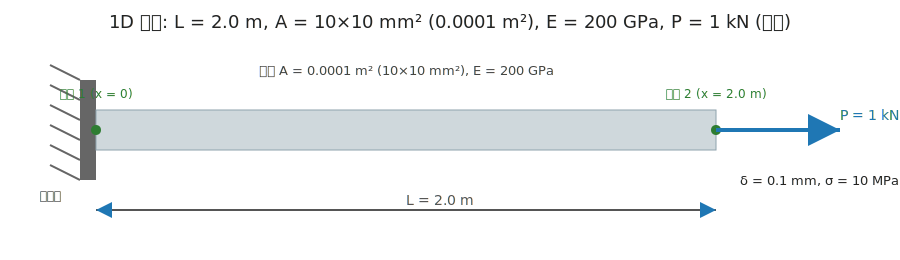

# 예제 1 : 1차원 막대 축변형

이 예제에서는 **1차원 막대(Bar)** 에 축방향 하중이 작용할 때 발생하는 **변형량(δ)** 과 **응력(σ)** 을 계산합니다.

---

## 문제

- 재질: 강(steel), 탄성계수 E = 200 GPa = 200 × 10⁹ Pa  
- 막대 길이: L = 2.0 m  
- 단면적: A = 0.0001 m² (10 mm × 10 mm 정사각형 단면)  
- 인장하중: P = 1.0 kN = 1000 N  

---

## 해석 개념

1. 변형량:  
   δ = (P × L) / (E × A)

2. 응력:  
   σ = P / A

---

## 풀이

1. 변형량 계산  
   δ = (1000 × 2.0) / (200 × 10⁹ × 0.0001)  
   δ = 2000 / (20 × 10⁶)  
   δ = 1.0 × 10⁻⁴ m  
   δ = **0.1 mm**

2. 응력 계산  
   σ = 1000 / 0.0001  
   σ = 1.0 × 10⁷ Pa  
   σ = **10 MPa**

---

## 정답

- 변형량: **0.1 mm**  
- 응력: **10 MPa**

---

## 참고 그림

