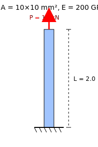

# 예제 2: 1차원 수직 막대 압축

이 예제에서는 **수직으로 세워진 강재 막대(Bar)** 가 위쪽에서 압축하중을 받을 때 발생하는 **변형량**과 **평균 축응력**을 계산합니다.

---

## 1. 문제 제시

- 재질: 강(steel), 탄성계수  
  E = 200 GPa = 200 × 10^9 Pa  

- 막대 길이  
  L = 2.0 m  

- 단면적  
  A = 0.0001 m² (10 mm × 10 mm 정사각형 단면)  

- 압축하중  
  P = 10.0 kN = 10,000 N  

👉 구하시오:
1. 변형량 δ (mm 단위)  
2. 평균 축응력 σ  

---

## 2. 해석 개념 (쉽게 이해하기)

- **탄성계수 E**: 재료가 얼마나 뻣뻣한지  
- **단면적 A**: 두꺼울수록 힘을 더 잘 버팀  
- **길이 L**: 길수록 잘 늘어나거나 줄어듦  
- **하중 P**: 잡아당기거나 누르는 힘  

---

## 3. 사용 공식

- 축강성: k = (E × A) / L  
- 변형량: δ = (P × L) / (E × A)  
- 응력: σ = P / A  

---

## 4. 풀이 과정

주어진 값:  
P = 10,000 N  
L = 2.0 m  
E = 200 × 10^9 Pa  
A = 0.0001 m²  

1) 변형량 계산  
δ = (10,000 × 2.0) / (200 × 10^9 × 0.0001)  
δ = 20,000 / (20 × 10^6)  
δ = 1.0 × 10^-3 m  
δ = **1.0 mm**  

2) 응력 계산  
σ = 10,000 / 0.0001  
σ = 1.0 × 10^8 Pa  
σ = **100 MPa**  

---

## 5. 정답

- 변형량 δ = **1.0 mm**  
- 응력 σ = **100 MPa**  

---

## 6. 참고 그림



---

## 7. 파이썬 코드 예시

```python
# 예제 2: 1차원 수직 막대 압축 계산

E = 200e9   # 탄성계수 (Pa)
L = 2.0     # 길이 (m)
A = 0.0001  # 단면적 (m^2)
P = 10000   # 압축하중 (N)

# 변형량 계산
delta = (P * L) / (E * A)

# 응력 계산
sigma = P / A

print(f"변형량 δ = {delta*1000:.3f} mm")   # mm 단위
print(f"응력 σ = {sigma/1e6:.2f} MPa")     # MPa 단위