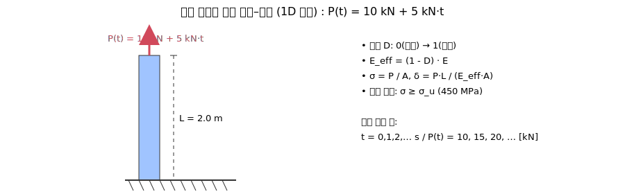

# 예제 3: 점증 하중에 따른 손상–파괴 (1D AEM 맛보기)

이 예제는 1차원 막대(축스프링)에 **점증 하중**을 걸어 **손상(강성 감소)** 과 **파괴**를 단순 모델로 관찰한다.  
그림: 

---

## 1. 모델 / 재료 / 하중 이력
- 재료: 강(steel), E = 200 GPa (200×10^9 Pa)
- 항복강도: σ_y = 250 MPa
- 극한강도(파괴기준): σ_u = 450 MPa
- 길이: L = 2.0 m
- 단면적: A = 0.0001 m^2 (10×10 mm^2)
- 하중 이력: P(t) = 10 kN + 5 kN·t (t는 초 단위, 정수 증가)

참고: A = 1e-4 m^2 이므로 σ[MPa] = P[kN] × 10  
→ σ_y(250 MPa)에 해당하는 하중 P_y = 25 kN, σ_u(450 MPa)에 해당하는 P_u = 45 kN

---

## 2. 손상(강성 저하) 규칙 (선형 소프트닝)
- 손상변수 D ∈ [0, 1], 유효강성 E_eff = (1 − D) · E
- σ ≤ σ_y  → D = 0
- σ_y < σ < σ_u → D = (σ − σ_y) / (σ_u − σ_y)
- σ ≥ σ_u → D = 1 (파괴)
- 응력: σ = P / A
- 변형량: δ = P·L / (E_eff·A) = P·L / ((1 − D)·E·A)

---

## 3. 이론 결과(요약 테이블)
| t [s] | P [kN] | σ [MPa] | D | (1−D) | δ [mm] | 비고 |
|---:|---:|---:|---:|---:|---:|---|
| 0 | 10 | 100 | 0.00 | 1.00 | 1.0 | 탄성 |
| 1 | 15 | 150 | 0.00 | 1.00 | 1.5 | 탄성 |
| 2 | 20 | 200 | 0.00 | 1.00 | 2.0 | 탄성 |
| 3 | 25 | 250 | 0.00 | 1.00 | 2.5 | 항복 도달 |
| 4 | 30 | 300 | 0.25 | 0.75 | 4.0 | 손상 시작 |
| 5 | 35 | 350 | 0.50 | 0.50 | 7.0 | 연화 진행 |
| 6 | 40 | 400 | 0.75 | 0.25 | 16.0 | 연화 급증 |
| 7 | 45 | 450 | 1.00 | 0.00 | — | 파괴 도달 |

→ **파괴 시점: t = 7 s (P = 45 kN)**

---

## 4. 파이썬 코드 (시뮬레이션 + 그래프)
> 가상환경에서 `pip install matplotlib` 후 실행하세요.

```python
# 예제 3: 점증 하중 → 손상 → 파괴 (1D, 선형 소프트닝)
import math
import matplotlib.pyplot as plt

E = 200e9        # Pa
A = 1.0e-4       # m^2
L = 2.0          # m
sigma_y = 250e6  # Pa
sigma_u = 450e6  # Pa

P0 = 10_000      # N (10 kN)
dP = 5_000       # N/s (5 kN per second)

def damage_from_sigma(sigma):
    if sigma <= sigma_y:
        return 0.0
    if sigma >= sigma_u:
        return 1.0
    return (sigma - sigma_y) / (sigma_u - sigma_y)

ts, Ps_kN, sigmas_MPa, Ds, deltas_mm = [], [], [], [], []
t_fail = None

for t in range(0, 100):   # 충분히 큰 상한
    P = P0 + dP * t
    sigma = P / A
    D = damage_from_sigma(sigma)

    ts.append(t)
    Ps_kN.append(P / 1000)
    sigmas_MPa.append(sigma / 1e6)
    Ds.append(D)

    if D >= 1.0:
        t_fail = t
        deltas_mm.append(float("nan"))  # 파괴 시점 이후 정의 X
        break

    E_eff = (1.0 - D) * E
    delta = P * L / (E_eff * A)   # m
    deltas_mm.append(delta * 1000)  # mm

# 텍스트 요약
if t_fail is not None:
    print(f"Failure at t = {t_fail} s, P = {Ps_kN[-1]:.1f} kN, sigma = {sigmas_MPa[-1]:.0f} MPa")
else:
    print("No failure within the time window.")

# 그래프: 시간-하중, 시간-변형량
fig = plt.figure(figsize=(8,5))
ax1 = plt.gca()
ax2 = ax1.twinx()

ax1.plot(ts, Ps_kN, label="Load P [kN]")
ax2.plot(ts, deltas_mm, linestyle="--", label="Deformation δ [mm]")

ax1.set_xlabel("Time t [s]")
ax1.set_ylabel("P [kN]")
ax2.set_ylabel("δ [mm]")
ax1.grid(True, alpha=0.3)

if t_fail is not None:
    ax1.axvline(t_fail, linestyle=":", color="gray", label=f"Failure at {t_fail}s")

lns = ax1.get_lines() + ax2.get_lines()
labels = [l.get_label() for l in lns]
ax1.legend(lns, labels, loc="upper left")

plt.title("Progressive Loading: Load & Deformation vs Time")
plt.tight_layout()
plt.show()