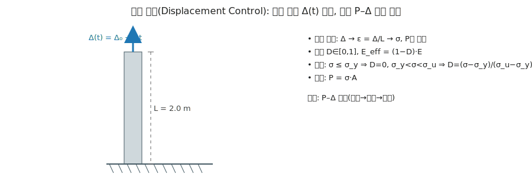

# 예제 4: 변위 제어(Displacement Control) – 1D 손상–파괴 맛보기

이 예제는 수직 막대 상단에 **변위 Δ(t)** 를 시간에 따라 부여(변위 제어)하고, 그때 필요한 **하중 P**와 **손상 진행**을 관찰한다.  
도식: 

---

## 1. 모델 / 재료 / 입력
- 재료: E = 200 GPa, 항복강도 σ_y = 250 MPa, 극한강도 σ_u = 450 MPa
- 기하: L = 2.0 m, A = 0.0001 m² (10×10 mm²)
- 변위 이력: Δ(t) = Δ0 + r·t
  - 예시 값: Δ0 = 0.0 mm, r = 0.5 mm/s  (필요 시 문서에서 쉽게 바꿀 수 있음)

도움말:
- 변형률 ε = Δ / L
- 손상 D ∈ [0,1], 유효강성 E_eff = (1 − D) · E
- 응력–손상 규칙(선형 소프트닝):
  - σ ≤ σ_y  → D = 0
  - σ_y < σ < σ_u → D = (σ − σ_y) / (σ_u − σ_y)
  - σ ≥ σ_u → D = 1 (파괴)
- 평형: σ = E_eff · ε = (1 − D) · E · ε
- 하중: P = σ · A

※ D가 σ에, σ가 D에 의존하므로, 각 시간 단계에서 간단한 반복(고정점)으로 D–σ를 맞춘다.

---

## 2. 결과 해석 포인트
- 초기(탄성): D = 0 → P가 Δ에 비례(직선).
- 연화: D ↑ → E_eff ↓ → 작은 Δ 증가에도 P가 덜 증가 또는 감소(곡선 꺾임).
- 파괴: σ ≥ σ_u 도달 시 D = 1 → 강성 소실로 해석 중단.

---

## 3. 파이썬 코드 (P–Δ 곡선 및 시간표시)
> 가상환경에서 `pip install matplotlib` 후 실행하세요.

```python
# 예제 4: 변위 제어(Displacement Control) - 1D 손상/파괴 간단 모델
# Δ(t) = Δ0 + r * t 를 부여하고 P–Δ 곡선을 그림

import math
import matplotlib.pyplot as plt

# ----- 재료/기하 -----
E = 200e9        # Pa
A = 1.0e-4       # m^2
L = 2.0          # m
sigma_y = 250e6  # Pa
sigma_u = 450e6  # Pa

# ----- 변위 이력 -----
d0_mm = 0.0      # 초기 변위 [mm]
rate_mm_s = 0.5  # 변위 증가 속도 [mm/s]
dt = 1.0         # 시간 간격 [s]
t_max = 60       # 최대 시간 [s] (충분히 크게)

def update_damage(sigma):
    if sigma <= sigma_y:
        return 0.0
    if sigma >= sigma_u:
        return 1.0
    return (sigma - sigma_y) / (sigma_u - sigma_y)

ts, deltas_mm, sigmas_MPa, Ps_kN, Ds = [], [], [], [], []
t_fail = None

for step in range(int(t_max/dt) + 1):
    t = step * dt
    delta_mm = d0_mm + rate_mm_s * t
    epsilon = (delta_mm / 1000.0) / L  # mm -> m 변환 후 /L

    # 고정점 반복으로 D-σ 일치
    D = 0.0
    for _ in range(100):
        sigma = (1.0 - D) * E * epsilon
        newD = update_damage(sigma)
        if abs(newD - D) < 1e-6:
            D = newD
            break
        D = newD

    # 파괴 체크
    if D >= 1.0:
        t_fail = t
        # 기록 후 루프 종료
        ts.append(t)
        deltas_mm.append(delta_mm)
        sigmas_MPa.append(sigma / 1e6)
        Ps_kN.append((sigma * A) / 1000.0)
        Ds.append(D)
        break

    # 정리
    ts.append(t)
    deltas_mm.append(delta_mm)
    sigmas_MPa.append(sigma / 1e6)
    Ps_kN.append((sigma * A) / 1000.0)
    Ds.append(D)

# 출력 요약
if t_fail is not None:
    print(f"Failure at t = {t_fail:.1f} s  |  Δ = {deltas_mm[-1]:.3f} mm  |  P = {Ps_kN[-1]:.2f} kN  |  σ = {sigmas_MPa[-1]:.0f} MPa")
else:
    print("No failure within time window.")

# 그래프: P-Δ, 그리고 시간 라벨
fig = plt.figure(figsize=(8,5))
ax1 = plt.gca()
ax1.plot(deltas_mm, Ps_kN, label="P–Δ curve")
ax1.set_xlabel("Δ [mm]")
ax1.set_ylabel("P [kN]")
ax1.grid(True, alpha=0.3)
if t_fail is not None:
    ax1.axvline(deltas_mm[-1], linestyle=":", color="gray", label=f"Failure at t={t_fail:.1f}s")

plt.title("Displacement Control: Load P vs Displacement Δ")
plt.legend()
plt.tight_layout()
plt.show()