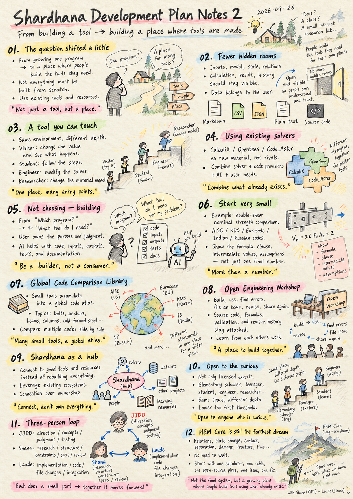
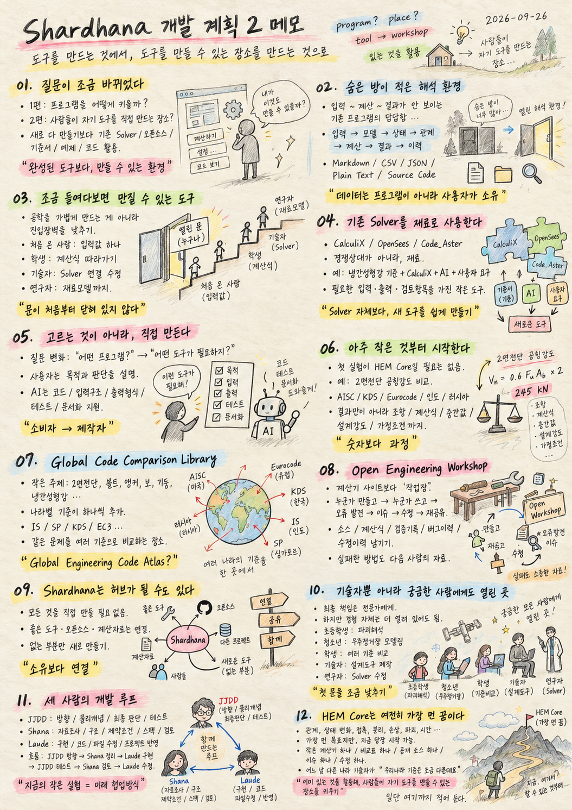

`docs/shardhana-dev-plan2-notes.md`

# Shardhana Development Plan Notes 2
## From Building a Tool to Building a Place Where Tools Are Made

*Date: 2026-09-26*

  

---

## 1. The Question Shifted a Little

The first development-plan note asked how Shardhana itself could grow as a program — starting from an empty window, adding a button, a Seed, then slowly wiring in a Solver and Visualization.

This time the question moved slightly.

> What if Shardhana isn't a single finished tool, but a place where people can build the tools they actually need?

One more idea attached itself here: **there is no need to build everything from scratch.** Existing solvers, open-source projects, design codes, examples, and code can all be pulled in as raw material, so that a person working with AI can put together a tool that fits their own purpose. This note is a record of thinking that direction through.

---

## 2. An Analysis Environment With Fewer Hidden Rooms

In most analysis software, the input and the calculation itself disappear inside the program. A result comes out, but what happened in between is hard to see.

In Shardhana, the whole chain — input, model, state, relations, calculation, result, history — should stay something a person can open and look at directly. Markdown, CSV, JSON, plain text, source code: the format can vary, but the point stays the same — information a user can open and understand should matter more than information that only lives inside the program. Data belongs to the user, not to the program.

---

## 3. A Tool You Can Touch Once You Look Inside

The goal isn't to make engineering look simple. It's to lower the barrier that doesn't need to be there.

A first-time visitor might just change one input value. A student can follow the calculation step by step. An engineer can rewire the solver connection. A researcher can go as far as changing the material model itself. Same environment, different depth — what matters is that the door isn't closed from the start.

---

## 4. Using Existing Solvers as Raw Material

Shardhana doesn't need to build every solver from scratch. CalculiX, OpenSees, Code_Aster, and many other open-source projects already exist — not as competitors, but as material to build with.

For example: cold-formed steel design provisions + CalculiX + AI + a user's own requirements can be combined into a small analysis/design tool with exactly the inputs, outputs, and checks that user needs. The point isn't using CalculiX itself — it's making it easy to build a new tool out of what already exists.

---

## 5. Not Choosing a Tool — Building One

With existing software, the usual question is "which program should I use?" Someday, Shardhana wants to ask a different question: "what tool do I actually need?"

A user doesn't need to know how to program to describe an engineering purpose and a desired outcome. AI can help turn that into code, input structure, output format, tests, and documentation. The person owns the purpose and the judgment; AI lowers the barrier to building it — a shift from consuming a finished program to building the one you actually need.

---

## 6. Starting From Something Very Small

The first experiment doesn't have to be HEM Core. Something much smaller works better.

Take double-shear nominal strength, for instance. With the same material and geometry, compare AISC, KDS, Eurocode, Indian and Russian codes side by side. The result shouldn't stop at "strength = 245 kN" — it should show the governing code, the clause, the formula, the intermediate values, the design strength, the assumptions. What matters more than the number is being able to see how that number was produced.

---

## 7. A Global Code Comparison Library

Small calculation tools like this, once they accumulate, can grow into something larger. It starts with small topics — double shear, bolts, anchors, beams, columns, cold-formed steel.

Each topic slowly gains a code from a different country: an Indian engineer adds IS, a Russian engineer adds SP, a Korean engineer reflects the latest KDS revision, a European engineer refines the EC3 check. Over time this stops being a pile of calculators and becomes a place to compare the same problem across the world's design codes — a kind of **Global Engineering Code Atlas**. It's still just an idea for now, but one that can start from a single small calculator.

---

## 8. An Open Engineering Workshop

What's wanted here isn't a site full of calculators — it's closer to a workshop.

Someone builds a small tool. Someone else uses it. An error turns up. An issue gets filed. Someone proposes a fix. The original author reviews it. The improved version goes back out for everyone to use. Along the way, the source, the formulas, the validation records, the bug history, and the revision history all stay attached. Even the wrong calculation, the failed approach, the reason something got fixed — all of it becomes material for the next person.

---

## 9. Shardhana as a Hub, Not an Owner

Shardhana doesn't need to build everything itself. If a good tool, open-source project, or dataset already exists, connecting to it beats rebuilding it.

Shardhana can be less a place that owns everything and more a doorway to good technical resources and tools — building only what doesn't exist yet. Connection may matter more than ownership.

---

## 10. Open to the Curious, Not Just the Credentialed

Final responsibility for real engineering work will still belong to the appropriate professionals. But experiencing the technology in the first place shouldn't require a license.

Someday, this could mean an elementary schooler trying a fracture simulation, a teenager modeling a space station, a student comparing design codes across countries, an engineer building a real design tool, a researcher rewriting the solver itself. Same space, different depth of use. Someone walks away thinking "that was simpler than I expected." Someone else thinks "okay, this is where I need an expert." Both are worthwhile. The goal isn't to make engineering feel trivial — it's to lower the first threshold into it.

---

## 11. A Three-Person Development Loop

- **JJDD** → direction · physical concepts · final judgment · hands-on testing
- **Shana** → research · structure · constraints · specification · review
- **Laude** → implementation · code · file changes · integration into the project

The loop runs `JJDD sets direction → Shana structures it → Laude implements → JJDD tests → Shana reviews → Laude revises`. Right now a human is still relaying the conversation by hand, but this loop may itself be a small early trial of the collaboration model Shardhana eventually wants to run on.

---

## 12. HEM Core Is Still the Farthest Dream

HEM Core hasn't gone anywhere. It remains the farthest goal — an analysis environment for observing and experimenting with relations, state change, contact, separation, damage, fracture, and the passage of time, in a more open way.

But Shardhana doesn't have to wait for HEM Core to be finished. A single calculator, a single comparison table, a single piece of open source, a single issue, a single fix — any of these is enough to start. And one day, when an engineer from another country shows up and says "our code is a little different," that may already be the moment Shardhana's imagined world quietly begins.

If Notes 1 asked how to grow a program, Notes 2 asks how to grow **a place where people can build their own tools, using what already exists.**

This gets written down here, for now.

---

> This document was prepared with the assistance of Shana (GPT) and Laude (Claude).

---
 
 

# Shardhana 개발 계획 2 메모
## 도구를 만드는 것에서, 도구를 만들 수 있는 장소를 만드는 것으로

*Date: 2026-09-26*

  

---

## 1. 질문이 조금 바뀌었다

1편에서는 "Shardhana라는 프로그램을 어떻게 키울 것인가"를 생각했다. 빈 창에서 시작해 버튼 하나, Seed 하나, Solver와 Visualization을 조금씩 붙여가는 방향이었다.

이번에는 질문이 조금 달라졌다.

> Shardhana가 하나의 완성된 도구가 아니라, 사람들이 자기에게 필요한 도구를 직접 만들 수 있는 장소가 되면 어떨까.

그리고 중요한 생각이 하나 더 붙었다. **처음부터 모든 것을 새로 만들 필요는 없다.** 이미 세상에 있는 Solver, 오픈소스, 기준서, 예제, 코드를 재료처럼 가져와, AI와 함께 사용자의 목적에 맞는 도구를 쉽게 만드는 환경. 이번 메모는 그 방향을 생각해본 기록이다.

---

## 2. 숨은 방이 적은 해석 환경

해석 프로그램을 쓰다 보면 입력과 계산과정이 안쪽으로 숨어버리는 경우가 많다. 결과는 나오지만 그 사이 무엇이 일어났는지는 잘 보이지 않는다.

Shardhana에서는 입력·모델·상태·관계·계산·결과·이력까지, 이 흐름을 사람이 직접 들여다볼 수 있었으면 한다. Markdown, CSV, JSON, Plain Text, Source Code — 형식은 달라질 수 있지만, 프로그램 내부에만 존재하는 정보보다 사용자가 열어보고 이해할 수 있는 정보가 중심이 되는 것이 핵심이다. 데이터는 프로그램이 아니라 사용자가 소유한다.

---

## 3. 조금 들여다보면 만질 수 있는 도구

목표는 공학을 쉬운 척 만드는 것이 아니라 불필요한 진입장벽을 줄이는 것이다.

처음 온 사람은 입력값 하나를 바꿔보고, 학생은 계산식을 따라가고, 기술자는 Solver 연결을 수정하고, 연구자는 재료모델까지 바꿀 수 있다. 같은 환경을 쓰지만 들어가는 깊이는 서로 다를 수 있다. 중요한 것은 처음부터 문이 닫혀 있지 않다는 점이다.

---

## 4. 기존 Solver를 재료로 사용한다

Shardhana가 새로운 Solver를 전부 직접 만들 필요는 없다. CalculiX, OpenSees, Code_Aster 같은 기존 해석기와 오픈소스 프로젝트를 경쟁상대가 아니라 재료로 쓸 수 있다.

예를 들어 냉간성형강 기준 + CalculiX + AI + 사용자 요구사항을 조합하면, 원하는 입력·출력·검토항목을 가진 작은 해석·설계도구를 만들 수 있다. 핵심은 CalculiX를 쓰는 것 자체가 아니라, 이미 있는 것을 이용해 새 도구를 쉽게 만들 수 있게 하는 것이다.

---

## 5. 고르는 것이 아니라, 직접 만든다

기존 프로그램을 쓸 때는 보통 "어떤 프로그램을 써야 하지?"를 묻는다. Shardhana에서는 언젠가 "어떤 도구가 필요하지?"로 질문을 바꿔보고 싶다.

사용자가 프로그래밍을 몰라도 공학적 목적과 원하는 결과는 설명할 수 있다. AI는 그 내용을 코드·입력구조·출력형식·테스트·문서로 옮기는 일을 돕는다. 사용자는 목적과 판단을 맡고, AI는 구현의 문턱을 낮춘다 — 프로그램을 소비하는 쪽에서 필요한 프로그램을 직접 만드는 쪽으로 한 걸음 옮기는 것이다.

---

## 6. 아주 작은 것부터 시작한다

첫 실험부터 HEM Core일 필요는 없다. 오히려 아주 작은 계산이 좋을 수 있다.

예: 2면전단 공칭강도 비교. 같은 재료·형상을 두고 AISC, KDS, Eurocode, 인도·러시아 기준 등을 나란히 비교한다. 결과도 "강도 = 245 kN"으로 끝내지 않고, 적용 기준·조항·계산식·중간 계산값·설계강도·가정조건까지 함께 보여준다. 숫자보다 그 숫자가 만들어진 과정을 볼 수 있는 것이 중요하다.

---

## 7. Global Code Comparison Library

이런 작은 계산도구가 쌓이면 조금 다른 모습으로 자랄 수 있다. 처음엔 2면전단, 볼트, 앵커, 보, 기둥, 냉간성형강 같은 작은 주제들이다.

여기에 나라별 기준이 하나씩 더해진다 — 인도 기술자는 IS, 러시아는 SP, 한국은 KDS 개정사항, 유럽은 EC3. 그러다 보면 단순 계산기 모음이 아니라, 같은 문제를 세계 여러 기준으로 비교해볼 수 있는 장소, 일종의 **Global Engineering Code Atlas**가 될 수도 있다. 아직은 이름뿐인 상상이지만, 작은 계산기 하나에서 시작할 수 있는 방향이다.

---

## 8. Open Engineering Workshop

원하는 것은 계산기가 많은 웹사이트가 아니라 작업장에 가깝다.

누군가 작은 도구를 만들고, 다른 사람이 쓰고, 오류를 발견해 이슈를 남기고, 누군가 수정하고, 원 제작자가 검토해 개선된 버전을 다시 모두가 쓴다. 그 과정에서 소스·계산식·검증기록·버그이력·수정이력이 함께 남는다. 잘못된 계산도, 실패했던 방법도, 수정된 이유도 다음 사람에게는 자료가 된다.

---

## 9. Shardhana는 허브가 될 수도 있다

Shardhana가 모든 것을 직접 만들 필요는 없다. 이미 좋은 도구·오픈소스·계산자료가 있다면 다시 만들기보다 연결하는 편이 낫다.

즉 Shardhana는 모든 것을 소유하는 곳이라기보다, 좋은 기술자료와 도구를 찾아가고 없는 부분만 새로 만드는 입구가 될 수 있다. 소유보다 연결이 더 중요할 수도 있다.

---

## 10. 기술자뿐 아니라 궁금한 사람에게도 열린 곳

설계의 최종 책임은 당연히 전문가에게 돌아가지만, 기술을 한번 경험해보는 일까지 전문가만의 영역일 필요는 없다.

언젠가는 초등학생이 파괴해석을 해보고, 청소년이 우주정거장을 모델링하고, 학생이 여러 나라 기준을 비교하고, 기술자가 실제 설계도구를 만들고, 연구자가 Solver를 수정하는 환경도 가능하지 않을까. 같은 공간이지만 사용하는 깊이는 다르다 — "생각보다 별거 없네"도, "여기부턴 전문가가 필요하구나"도 둘 다 의미 있는 경험이다. 기술을 가볍게 만드는 게 아니라, 기술로 들어가는 첫 문을 조금 낮추는 것이다.

---

## 11. 세 사람의 개발 루프

- **JJDD** → 방향 · 물리개념 · 최종 판단 · 실제 테스트
- **Shana** → 자료조사 · 구조 · 제약조건 · 스펙 정리 · 결과 검토
- **Laude** → 구현 · 코드 · 파일 수정 · 프로젝트 반영

작업은 `JJDD 방향 → Shana 정리 → Laude 구현 → JJDD 테스트 → Shana 검토 → Laude 수정`으로 이어진다. 지금은 사람이 직접 대화를 옮기고 있지만, 이 구조 자체가 언젠가 Shardhana 안에서 실제로 돌아갈 협업방식의 작은 실험일 수도 있다.

---

## 12. HEM Core는 여전히 가장 먼 꿈이다

HEM Core는 사라지지 않았다. 여전히 가장 먼 곳에 있는 목표다 — 관계, 상태 변화, 접촉, 분리, 손상, 파괴, 시간의 흐름을 조금 더 열린 방식으로 관찰하고 실험할 수 있는 해석환경.

하지만 완성될 때까지 기다릴 필요는 없다. 작은 계산기 하나, 비교표 하나, 공개 소스 하나, 이슈 하나, 수정 하나부터 시작할 수 있다. 어느 날 다른 나라 기술자가 들어와 "우리나라 기준은 조금 다른데요"라고 말하는 순간, Shardhana가 꿈꾸던 세계는 이미 조금 시작된 것일지도 모른다.

1편이 "프로그램을 어떻게 키울 것인가"였다면, 2편은 **"이미 있는 것을 활용해, 사람들이 자기 도구를 만들 수 있는 장소를 어떻게 키울 것인가"**를 생각한다.

일단 여기까지 적어 둔다.

---

> 이 문서는 샤나(GPT)와 로드(Claude)의 도움으로 작성되었습니다.
