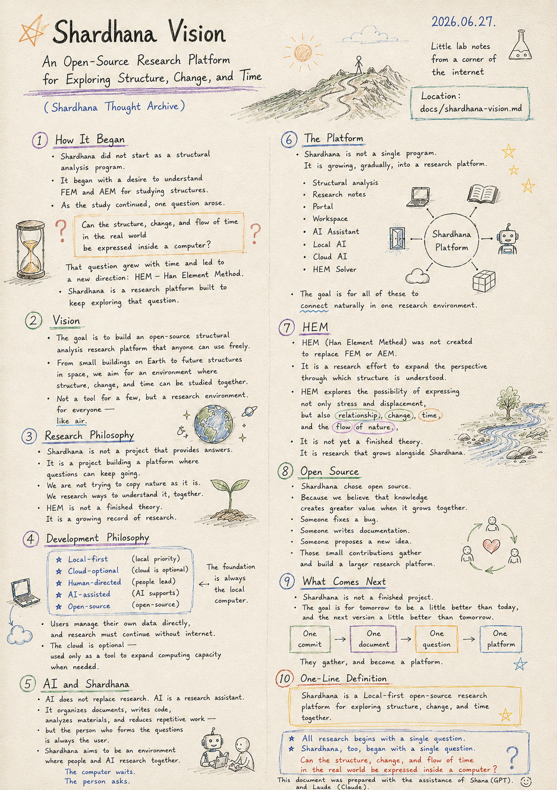
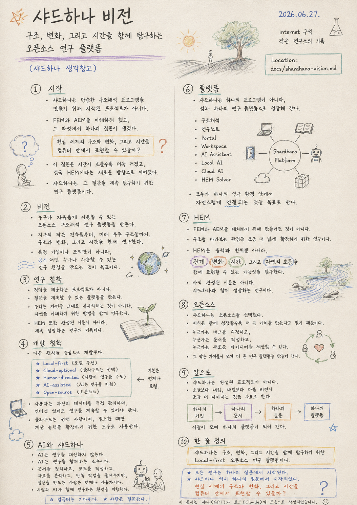

> Location: `docs/shardhana-vision.md`

# Shardhana Vision

### An Open-Source Research Platform
### for Exploring Structure, Change, and Time

## 🎬 YouTube Video

[Watch on YouTube](https://youtu.be/36Dd8UxMvXk)

*Date: 2026-06-27*
  

---

## 1. How It Began

Shardhana did not begin as a project to build a structural analysis program.

---

It started with an attempt to understand FEM and AEM

in order to study structural engineering.

---

And as that study continued, one question emerged.

---

> Can the structure, change, and flow of time
> in the real world
> be expressed inside a computer?

---

That question grew larger with time,

and eventually led to a new direction:

HEM — Han Element Method.

---

Shardhana is a research platform

built to keep exploring that question.

---

## 2. Vision

Shardhana's ultimate goal is to build

an open-source structural analysis research platform

that anyone can use freely.

---

From small buildings on Earth

to future structures in space,

the aim is an environment where structure, change, and time

can be researched together.

---

Not a tool available only to specific companies or organizations,

but a research environment that anyone can use —

like air.

---

## 3. Research Philosophy

Shardhana is not a project that provides answers.

---

It is a project building a platform

where questions can keep going.

---

We are not trying to copy nature as it is.

We are researching ways to understand it, together.

---

HEM, too, is not a finished theory.

It is a growing record of research.

---

## 4. Development Philosophy

Shardhana is developed around the following principles.

- **Local-first**
- **Cloud-optional**
- **Human-directed**
- **AI-assisted**
- **Open-source**

---

The foundation is always the local computer.

Users manage their own data directly,

and research must be able to continue without an internet connection.

---

The cloud is optional —

used only as a tool to expand computing capacity

when needed.

---

## 5. AI and Shardhana

AI does not replace research.

AI is a research assistant.

---

It organizes documents,

writes code,

analyzes materials,

and reduces repetitive work —

---

but the person who forms the questions

is always the user.

---

Shardhana aims to be an environment

where people and AI research together.

---

*The computer waits.*

*The person asks.*

---

## 6. The Platform

Shardhana is not a single program.

It is growing, gradually, into a research platform.

---

Structural analysis.

Research notes.

Portal.

Workspace.

AI Assistant.

Local AI.

Cloud AI.

HEM Solver.

---

The goal is for all of these

to connect naturally

within a single research environment.

---

## 7. HEM

HEM (Han Element Method) was not created to replace FEM or AEM.

---

It is a research effort to expand

the perspective through which structure is understood.

---

HEM explores the possibility of expressing

not only stress and displacement,

but also relationship,

change,

time,

and the flow of nature.

---

It is not yet a finished theory.

It is research that grows alongside Shardhana.

---

## 8. Open Source

Shardhana chose open source.

---

Because we believe that knowledge

creates greater value when it grows together.

---

Someone fixes a bug.

Someone writes documentation.

Someone proposes a new idea.

---

Those small contributions gather

and build a larger research platform.

---

## 9. What Comes Next

Shardhana is not a finished project.

---

The goal is for tomorrow to be a little better than today,

and the next version to be a little better than tomorrow.

---

One commit.

One document.

One question.

They gather, and become a platform.

---

## 10. One-Line Definition

> **Shardhana is a Local-first open-source research platform for exploring structure, change, and time together.**

---

> *All research begins with a single question.*
>
> *Shardhana, too, began with a single question.*
>
> **Can the structure, change, and flow of time in the real world be expressed inside a computer?**

---

*This document was prepared with the assistance of Shana (GPT) and Laude (Claude).*

---
 
 

# 샤드하나 비전

### 구조, 변화, 그리고 시간을 함께 탐구하는
### 오픈소스 연구 플랫폼

*Date: 2026-06-27*

## 🎬 유튜브 영상

[Watch on YouTube](https://youtu.be/DXheHwh5ZFs)

  

---

## 1. 시작

샤드하나는

단순한 구조해석 프로그램을 만들기 위해 시작된 프로젝트가 아니다.

---

처음에는

구조해석을 공부하기 위해

FEM과 AEM을 이해하려 했다.

---

조금씩 공부를 이어가면서

하나의 질문이 생겼다.

---

> 현실 세계의 구조와 변화,
> 그리고 시간을
> 컴퓨터 안에서 표현할 수 있을까?

---

이 질문은 시간이 흐를수록 더욱 커졌고,

결국 HEM(Han Element Method)이라는 새로운 방향으로 이어졌다.

---

샤드하나는

그 질문을 계속 탐구하기 위한 연구 플랫폼이다.

---

## 2. 비전

샤드하나의 궁극적인 목표는

누구나 자유롭게 사용할 수 있는

오픈소스 구조해석 연구 플랫폼을 만드는 것이다.

---

지구의 작은 건축물부터,

미래 우주 구조물까지,

구조와 변화, 그리고 시간을 함께 연구할 수 있는 환경을 지향한다.

---

특정 기업이나 조직만 사용할 수 있는 프로그램이 아니라,

공기처럼 누구나 사용할 수 있는 연구 환경을 만드는 것이 목표이다.

---

## 3. 연구 철학

샤드하나는

정답을 제공하는 프로젝트가 아니다.

---

질문을 계속할 수 있는 플랫폼을 만드는 프로젝트이다.

---

우리는 자연을 그대로 복사하려는 것이 아니라,

자연을 이해하기 위한 방법을 함께 연구한다.

---

HEM 또한 완성된 이론이 아니라,

계속 성장하는 연구의 기록이다.

---

## 4. 개발 철학

샤드하나는 다음 원칙을 중심으로 개발된다.

- **Local-first** (로컬 우선)
- **Cloud-optional** (클라우드는 선택)
- **Human-directed** (사람이 연구를 주도)
- **AI-assisted** (AI는 연구를 지원)
- **Open-source** (오픈소스)

---

기본은 언제나 로컬 컴퓨터이다.

사용자는 자신의 데이터를 직접 관리하며,

인터넷 없이도 연구를 계속할 수 있어야 한다.

---

클라우드는 선택 사항이며,

필요한 경우에만

계산 능력을 확장하기 위한 도구로 사용한다.

---

## 5. AI와 샤드하나

AI는 연구를 대신하지 않는다.

AI는 연구를 함께하는 조수이다.

---

문서를 정리하고,

코드를 작성하고,

자료를 분석하고,

반복 작업을 줄여주지만,

---

질문을 만드는 사람은 언제나 사용자이다.

---

샤드하나는

사람과 AI가 함께 연구하는 환경을 지향한다.

---

*컴퓨터는 기다린다.*

*사람은 질문한다.*

---

## 6. 플랫폼

샤드하나는 하나의 프로그램이 아니라,

점차 하나의 연구 플랫폼으로 성장해 간다.

---

구조해석.

연구노트.

Portal.

Workspace.

AI Assistant.

Local AI.

Cloud AI.

HEM Solver.

---

모두가 하나의 연구 환경 안에서

자연스럽게 연결되는 것을 목표로 한다.

---

## 7. HEM

HEM(Han Element Method)은

FEM과 AEM을 대체하기 위해 만들어진 것이 아니다.

---

구조를 바라보는 관점을

조금 더 넓게 확장하기 위한 연구이다.

---

HEM은

응력과 변위뿐 아니라,

관계,

변화,

시간,

그리고 자연의 흐름을 함께 표현할 수 있는 가능성을 탐구한다.

---

아직 완성된 이론은 아니다.

샤드하나와 함께 성장하는 연구이다.

---

## 8. 오픈소스

샤드하나는 오픈소스를 선택했다.

---

지식은 함께 성장할수록

더 큰 가치를 만든다고 믿기 때문이다.

---

누군가는 버그를 수정하고,

누군가는 문서를 작성하고,

누군가는 새로운 아이디어를 제안할 수 있다.

---

그 작은 기여들이 모여

더 큰 연구 플랫폼을 만들어 간다.

---

## 9. 앞으로

샤드하나는 완성된 프로젝트가 아니다.

---

오늘보다 내일,

내일보다 다음 버전이

조금 더 나아지는 것을 목표로 한다.

---

하나의 커밋,

하나의 문서,

하나의 질문이

모여 하나의 플랫폼이 되어 간다.

---

## 10. 한 줄 정의

> **샤드하나는 구조, 변화, 그리고 시간을 함께 탐구하기 위한 Local-first 오픈소스 연구 플랫폼이다.**

---

> *모든 연구는 하나의 질문에서 시작된다.*
>
> *샤드하나 역시 하나의 질문에서 시작되었다.*
>
> **현실 세계의 구조와 변화, 그리고 시간을 컴퓨터 안에서 표현할 수 있을까?**

---

*이 문서는 샤나(GPT)와 로드(Claude)의 도움으로 작성되었습니다.*
