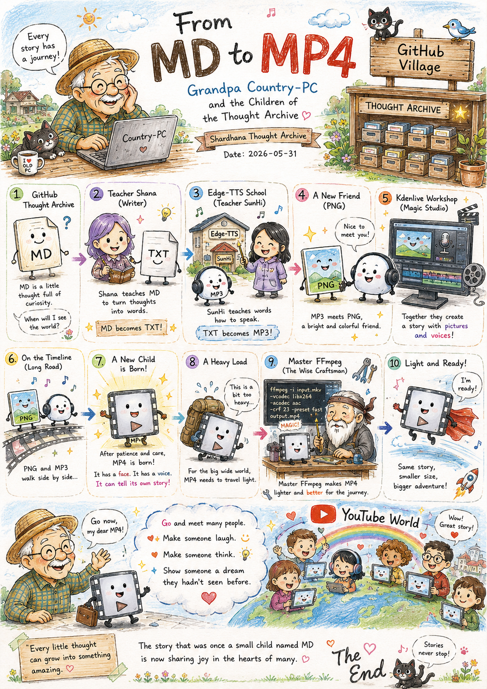
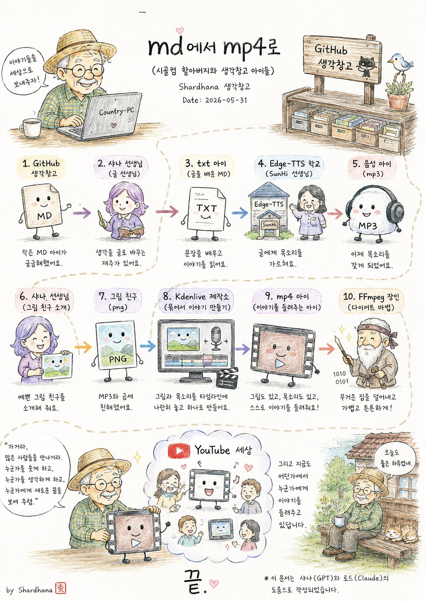

> Location: `docs/thoughts/From_MD-To_MP4-notes.md`

# From MD to MP4

*(Grandpa Country-PC and the Children of the Thought Archive)*  
*(Shardhana Thought Archive)*  
*Date: May 31 2026*

## 🎬 YouTube Video

[Watch on YouTube](https://youtu.be/V6pktkAfnzU)

  

---

Once upon a time,

Grandpa Country-PC was tidying up his Thought Archive —  
a small storehouse tucked into a corner of GitHub Village.

Inside that storehouse lived countless stories.

Some were very old thoughts.  
Some had only just been born that very day.

Among them was a small child named MD.

MD was always full of questions.

One day, MD looked up at Grandpa and asked:

*"Grandpa — when will I get to see the world?"*

Grandpa Country-PC smiled gently and said:

*"Not just yet, little one."*  
*"First — go and learn how to speak."*

---

So MD went to find Teacher Shana.

Teacher Shana had a special gift:  
she could turn thoughts into words.

Studying alongside Shana,  
MD slowly began to learn sentences.

And one day —  
MD grew into a new shape,  
and took a new name: TXT.

TXT could now read its own story  
clearly, word by word.

---

But the people of the world  
still couldn't hear TXT's voice.

So TXT set off on a journey to the next village.

There, a curious school called Edge-TTS was waiting.  
And inside that school was Teacher SunHi.

Teacher SunHi was a kind of magician —  
one who could teach words how to speak.

TXT studied hard,  
and at last learned to talk like a person.

And with that,  
TXT received a new name: MP3.

MP3 was overjoyed.

---

But a new question arrived almost immediately.

*"I can speak now —  
but can I ever have a face?"*

Grandpa Country-PC nodded quietly.

*"Then go and find a picture to be friends with."*

This time, Teacher Shana came back.

She introduced MP3 to a bright and colorful friend.

That friend's name was PNG.

MP3 and PNG became close very quickly.

But no matter how close they were,  
they still had to travel separately.

---

So the two of them went together  
to the Kdenlive Workshop.

The Kdenlive Workshop was a place  
that wove pictures and voices into a single story.

The workshop was always busy.

Along a long road called the Timeline,  
PNG and MP3 were placed side by side.

And after a long, careful stretch of time —  
a new child was born.

That child's name was MP4.

MP4 had a face.  
MP4 had a voice.

For the first time,  
it could tell its own story — all by itself.

---

But MP4 was carrying quite a lot.

For a long journey into the world,  
the load was a little too heavy.

So Grandpa Country-PC paid one last visit —  
to Master FFmpeg.

Master FFmpeg was wise and experienced,  
having sent countless video children out into the world before.

He looked at MP4 for a long, quiet moment.

Then he said:

*"You carry a good story."*  
*"But travel lighter — and you'll go much farther."*

Master FFmpeg carefully sorted through MP4's things,  
setting aside what wasn't needed.

The story stayed exactly the same.  
But the load became much lighter.

MP4 smiled.

Now it was truly ready to travel.

---

At last, Grandpa Country-PC placed a gentle hand on MP4's shoulder.

*"Go now."*

*"Go and meet many people."*

*"Make someone laugh.  
Make someone think.  
Show someone a dream they hadn't seen before."*

And so MP4 set off  
into the wide world of YouTube.

Somewhere out there, even now,  
it is telling its story to someone.

The story that was once  
a small child named MD  
in the corner of a GitHub Thought Archive.

The End.

---

*This document was prepared with the assistance of Shana (GPT) and Laude (Claude).*

---
 
 

# md에서 mp4로

*(시골컴 할아버지와 생각창고 아이들)*  
*(Shardhana 생각창고)*  
*Date: 2026-05-31*

## 🎬 유튜브 영상

[Watch on YouTube](https://youtu.be/al9GUZrT62w)

  

---

옛날 옛날에,

시골컴 할아버지는 GitHub 마을 한쪽에 있는  
생각창고를 정리하고 있었습니다.

그 창고 안에는 수많은 이야기들이 살고 있었습니다.

어떤 아이는 아주 오래된 생각이었고,  
어떤 아이는 오늘 막 태어난 생각이었습니다.

그중에는 MD라는 작은 아이도 있었습니다.

MD는 늘 궁금한 것이 많았습니다.

어느 날 MD가 할아버지에게 물었습니다.

"할아버지, 저는 언제쯤 세상 구경을 할 수 있나요?"

시골컴 할아버지는 빙그레 웃으며 말했습니다.

"아직은 조금 이르단다."  
"먼저 글을 배우러 가 보렴."

---

그래서 MD는 샤나 선생님을 찾아갔습니다.

샤나 선생님은 생각을 글로 바꾸는 재주가 있었습니다.

샤나와 함께 공부한 MD는  
점점 문장을 배우기 시작했습니다.

그러자 어느 날,  
MD는 TXT라는 새로운 모습으로 자라났습니다.

TXT는 이제 자신의 이야기를  
또박또박 읽을 수 있게 되었습니다.

---

하지만 아직 세상 사람들은  
TXT의 목소리를 들을 수 없었습니다.

그래서 TXT는 옆 마을로 여행을 떠났습니다.

그곳에는 Edge-TTS라는 신기한 학교가 있었습니다.  
학교에는 SunHi 선생님이 계셨습니다.

SunHi 선생님은  
글에게 목소리를 가르치는 마법사였습니다.

TXT는 열심히 공부했고,  
마침내 사람처럼 말할 수 있게 되었습니다.

그리고 MP3라는 이름을 얻게 되었습니다.

MP3는 너무 기뻤습니다.

---

하지만 또 궁금해졌습니다.

"저는 말할 수는 있는데,  
아직 모습을 가질 수는 없나요?"

시골컴 할아버지는 고개를 끄덕였습니다.

"그럼 그림을 만나러 가 보렴."

이번에는 다시 샤나 선생님이 찾아왔습니다.

샤나는 MP3에게 예쁜 그림 친구를 소개해 주었습니다.

그 친구의 이름은 PNG였습니다.

PNG와 MP3는 금세 친해졌습니다.

하지만 둘은 따로따로 다닐 수밖에 없었습니다.

---

그래서 둘은 함께  
Kdenlive 제작소를 찾아갔습니다.

Kdenlive 제작소는  
그림과 목소리를 하나로 묶어  
이야기를 만드는 곳이었습니다.

제작소는 매우 바빴습니다.

타임라인이라는 긴 길 위에  
PNG와 MP3를 나란히 세웠습니다.

그리고 많은 시간이 흐른 뒤,  
마침내 새로운 아이가 태어났습니다.

그 아이의 이름은 MP4였습니다.

MP4는 그림도 가지고 있었고,  
목소리도 가지고 있었습니다.

처음으로 스스로 이야기를 들려줄 수 있게 된 것입니다.

---

하지만 MP4는 조금 통통했습니다.

세상 여행을 하기에는  
짐이 너무 많았습니다.

그래서 시골컴 할아버지는  
마지막으로 FFmpeg 장인을 찾아갔습니다.

FFmpeg 장인은  
수많은 영상 아이들을 세상으로 보내 본 현명한 장인이었습니다.

장인은 MP4를 한참 바라보더니  
조용히 말했습니다.

"너는 좋은 이야기구나."  
"하지만 조금 가벼워지면 더 멀리 갈 수 있단다."

장인은 MP4의 불필요한 짐을 정리해 주었습니다.

이야기는 그대로였지만,  
몸은 훨씬 가벼워졌습니다.

MP4는 기분 좋게 웃었습니다.

---

마침내 시골컴 할아버지는  
MP4의 어깨를 토닥였습니다.

"가거라."

"많은 사람들을 만나거라."

"누군가를 웃게 하고,  
누군가를 생각하게 하고,  
누군가에게 새로운 꿈을 보여 주렴."

그렇게 MP4는  
YouTube라는 넓은 세상으로 여행을 떠났습니다.

그리고 지금도 어딘가에서  
누군가에게 이야기를 들려주고 있습니다.

한때는 GitHub 생각창고의 작은 MD 아이였던,  
그 이야기 말입니다.

끝.

---

*이 문서는 샤나(GPT)와 로드(Claude)의 도움으로 작성되었습니다.*
