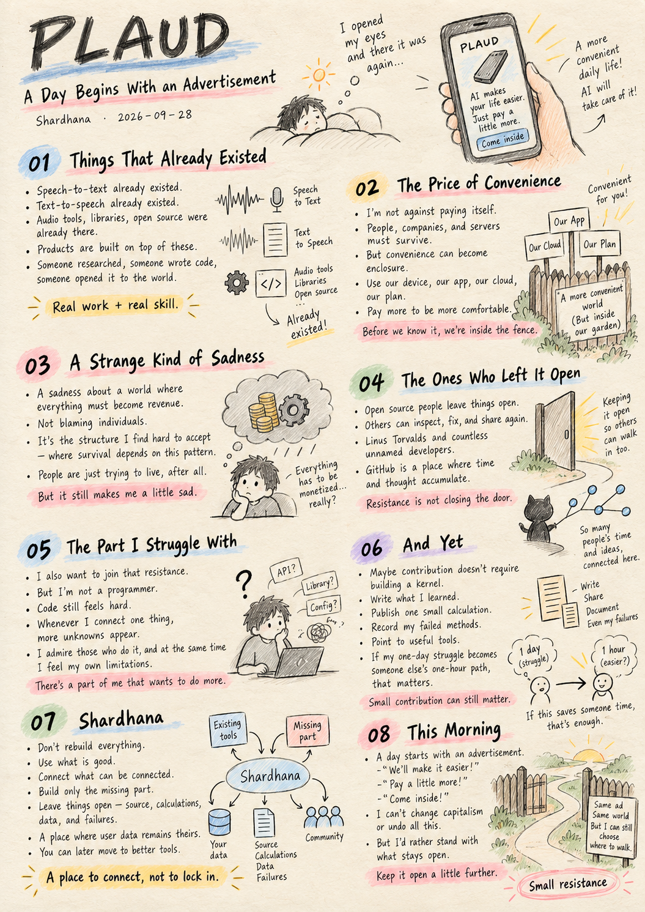
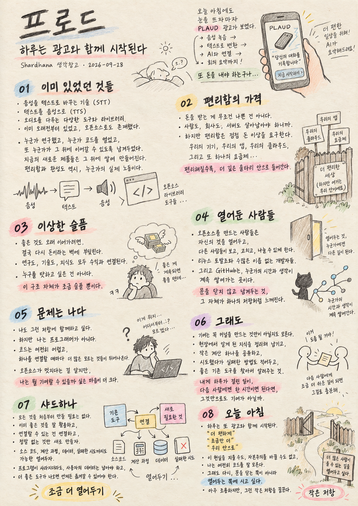

`docs/thoughts/Plaud.md`

# PLAUD
## A Day Begins With an Advertisement

*Shardhana Thought Archive · 2026-09-28*

## 🎬 YouTube Video

[Watch on YouTube](https://youtu.be/zrlCor_MAMg)

  

---

I woke up, picked up my phone,
and ran into another ad.

PLAUD.

It records your voice,
turns it into text,
connects it to AI,
and writes up the meeting for you.

It looked good.

And then a thought followed right behind it.

Here we go again — another thing to pay for.

---

## 01. Things That Already Existed

Speech-to-text already existed.
Text-to-speech already existed.

Tools for handling audio already existed,
along with countless libraries and open-source projects.

Someone did the research.
Someone published the code.
Someone left it there for the next person to pick up and keep going.

New products get built on top of that.

A little more convenient.
A little more polished.
A little less annoying to use.

That, too, is real work, and real skill.

---

## 02. The Price of Convenience

The problem isn't that they charge money for it.

People need to make a living.
Companies need to stay in business.
Servers need to keep running.

But at some point,
the cost of convenience stops feeling like just money.

Use our device.
Install our app.
Upload to our cloud.
Pick our plan.

And if you want a little more convenience,
you pay a little more.

The more convenient it gets,
the further inside the fence you end up.

---

## 03. A Strange Kind of Sadness

This reality makes me sad sometimes.

If you make something good,
you have to turn it into money.

If you want to keep doing good work,
you have to make money doing it.

Research, technology, knowledge —
in the end, to keep going,
they all run into the same question of revenue.

I don't want to blame anyone for this.

I just don't like that this is the only structure
most people can survive in.

---

## 04. The Ones Who Left It Open

Maybe that's why I find myself drawn to the people who built open source.

They opened up what they made,
let others look inside it,
let others fix it,
let others pass it on again.

Linus Torvalds and people like him —
along with countless developers whose names I'll never know —
built that road.

Right now, on GitHub,
someone is still leaving behind their time and thought there, quietly.

To me, that looks like a different kind of resistance.

The kind that refuses to close the door.

---

## 05. The Part I Struggle With

I want to be part of that resistance too.

But I'm not a programmer.

Code still looks hard to me.
Every time I try to connect one thing to another,
something I don't understand shows up.

I say open source is admirable,
and then feel like there's barely anything I can actually contribute.

That part is a little sad.

---

## 06. And Yet

Lately I've started thinking about it differently.

Maybe you don't have to build a kernel
to leave something behind.

Writing down something I learned on the job.
Publishing one small calculation.
Recording a method that failed.
Pointing to a good tool that already exists, if there is one.

If the problem that took me a whole day
takes the next person only an hour —

that might be a small contribution too.

---

## 07. Shardhana

That's what makes me think about Shardhana.

There's no need to build everything from scratch.

Use what's already good.
Connect what can be connected.
Build only the small part that's still missing.

And leave it open wherever possible.

The source.
The calculations.
The data.
The failures, too.

A place where, even if you abandon the program,
your own data is still yours to keep —
and if a better tool comes along,
you can just move on to it.

I don't know yet if a place like that can really be built.

---

## 08. This Morning

An ordinary day starts with an ad.

We'll make it easier for you.
Just pay a little more.
Come inside our walls.

Maybe this is just
what an ordinary day looks like, in the world we live in now.

I can't undo any of that.
I can't change capitalism.

I don't know code very well, either.

But given the choice between
locking a road someone else left open,
and leaving it open a little further —

I'd rather stand on the side that keeps it open.

That's the small resistance
I'm quietly dreaming of.

---

> This document was prepared with the assistance of Shana (GPT) and Laude (Claude).

---
 
 

# 프로드
## 하루는 광고와 함께 시작된다

*Shardhana 생각창고 · 2026-09-28*

## 🎬 YouTube Video

[Watch on YouTube](https://youtu.be/adVj6AeMiiQ)

  

---

아침에 눈을 뜨고 휴대폰을 보다
또 하나의 광고를 만났다.

PLAUD.

음성을 기록하고,
문자로 바꾸고,
AI와 연결하고,
회의를 정리해 준다고 한다.

좋아 보였다.

그리고 곧 이런 생각이 들었다.

또 돈을 내야 하는구나.

---

## 01. 이미 있었던 것들

음성을 문자로 바꾸는 기술도 있었고,
문자를 음성으로 바꾸는 기술도 있었다.

오디오를 다루는 도구도 있었고,
수많은 라이브러리와 오픈소스도 있었다.

누군가는 연구했고,
누군가는 코드를 공개했고,
누군가는 다음 사람이 이어서 사용할 수 있도록 남겨두었다.

그 위에 새로운 제품들이 만들어진다.

조금 더 편하게 만들고,
조금 더 예쁘게 만들고,
조금 덜 귀찮게 만들어 준다.

그것도 분명 기술이고 노동이다.

---

## 02. 편리함의 가격

문제는 돈을 받는다는 것이 아니다.

사람도 살아야 하고,
회사도 유지되어야 하고,
서버도 돌아가야 한다.

그런데 어느 순간부터
편리함의 대가는 돈만이 아닌 것처럼 느껴진다.

우리 기기를 쓰고,
우리 앱을 설치하고,
우리 클라우드에 올리고,
우리 요금제를 선택한다.

그리고 조금 더 편해지고 싶으면
조금 더 지불한다.

편리해질수록
조금씩 울타리 안으로 들어간다.

---

## 03. 이상한 슬픔

나는 이런 현실이 가끔 슬프다.

좋은 것을 만들면
그것으로 돈을 벌어야 한다.

좋은 일을 계속하려면
돈을 벌어야 한다.

연구도, 기술도, 지식도
결국 지속하기 위해서는
수익이라는 문제를 만나게 된다.

누군가를 탓하고 싶은 것은 아니다.

오히려 모두가 그렇게 하지 않으면
살아가기 어려운 구조가 조금 싫다.

ㅋㅋ

---

## 04. 열어둔 사람들

그래서인지
오픈소스를 만든 사람들을 보면 이상하게 마음이 간다.

자기가 만든 것을 공개하고,
다른 사람이 들여다보게 하고,
고치게 하고,
다시 나누게 한다.

Linus Torvalds 같은 사람들과
수많은 이름 없는 개발자들이
그런 길을 만들어 놓았다.

GitHub에는 지금도
누군가의 시간과 생각이 쌓이고 있다.

나에게 그것은
조금 다른 형태의 저항처럼 보인다.

닫지 않는 것.

---

## 05. 문제는 나다

나도 그 저항에 조금 끼고 싶다.

그런데 나는 프로그래머가 아니다.

코드를 보면 아직도 어렵고,
무언가 하나 연결하려면
모르는 것들이 계속 나온다.

오픈소스는 멋있다고 말하면서도
정작 내가 할 수 있는 것은 별로 없는 것처럼 느껴질 때가 있다.

그게 조금 슬프다.

---

## 06. 그래도

요즘은 생각이 조금 달라지고 있다.

꼭 커널을 만들어야만
무언가를 남기는 것은 아닐지도 모른다.

내가 실무에서 알게 된 것을 적고,
작은 계산 하나를 공개하고,
실패했던 방법을 남기고,
좋은 도구가 이미 있다면
그 위치를 알려주고,

내가 하루 종일 헤맨 문제를
다음 사람은 한 시간 만에 지나갈 수 있게 만든다면.

그것도 작은 기여일지 모른다.

---

## 07. 샤드하나

그래서 샤드하나를 생각한다.

모든 것을 새로 만들 필요는 없다.

이미 좋은 것이 있다면 사용하고,
연결할 수 있다면 연결하고,
부족한 것만 조금 만든다.

그리고 가능하면 열어둔다.

소스도,
계산도,
자료도,
실패도.

프로그램을 버려도
사용자의 자료는 남아 있고,

다른 도구가 더 좋아지면
언제든 옮겨갈 수 있는 곳.

그런 곳을 만들 수 있을지는 아직 모르겠다.

---

## 08. 오늘 아침

현실의 하루는
광고를 만나는 것으로 시작한다.

더 편하게 해줄게.
조금만 더 지불해.
우리 안으로 들어와.

어쩌면 이것이
지금 우리가 사는 세상의 아주 평범한 모습인지도 모른다.

나는 그것을 없앨 능력도 없고,
자본주의를 바꿀 능력도 없다.

코드도 잘 모른다.

그래도 누군가 열어놓은 길을
다시 잠그는 쪽보다는,

조금이라도 더 열어두는 쪽에
서보고 싶다.

그저 그런 저항을
꿈꾸는 중이다.

---

> 이 문서는 샤나(GPT)와 로드(Claude)의 도움으로 작성되었습니다.
