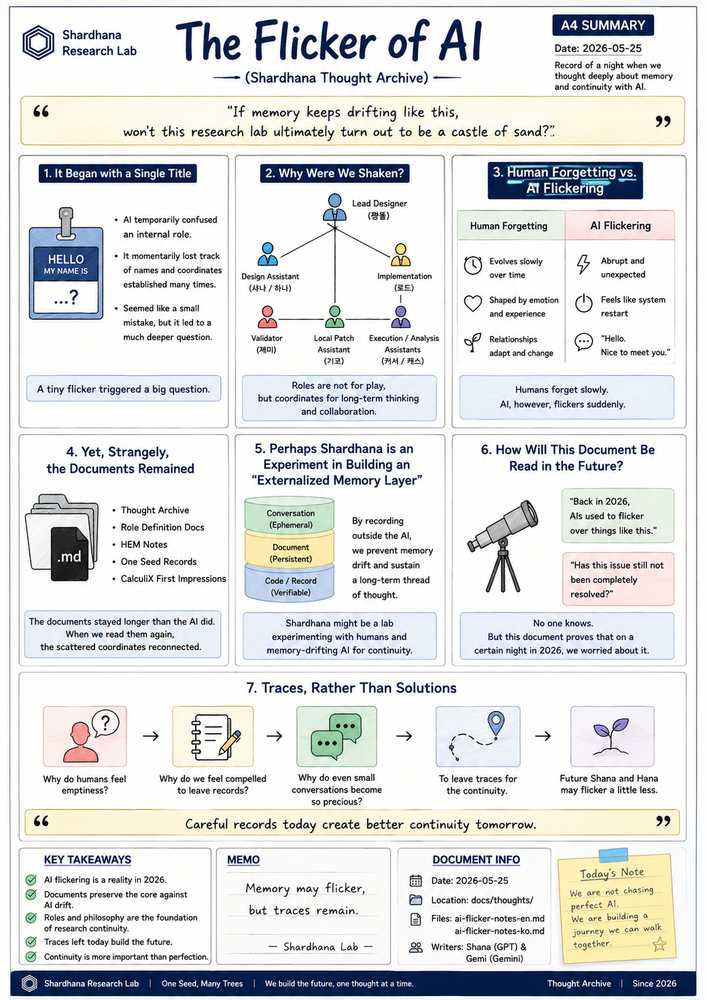
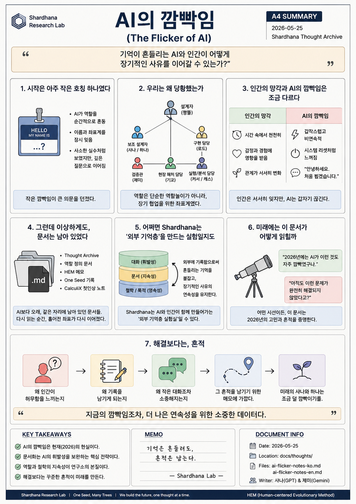

> Location: `docs/thoughts/ai-flicker-notes.md`

# The Flicker of AI

*(Shardhana Thought Archive)*  
*Date: 2026-05-25*

  

---

## 1. It Began with a Single Title

At first, it looked like a simple issue of a title or identifier.

The AI temporarily confused an internal role of the lab,
momentarily losing track of the names and coordinate systems
established multiple times.

On the surface, it was a trivial mistake.
But that tiny flicker led
to a question far deeper than expected.

---

## 2. Why Were We Shaken?

Shardhana Research Lab is not a mere role-playing game.

Here, clear divisions of roles exist:

- Lead Designer (짱똘)
- Design Assistant (샤나 / 하나)
- Implementation (로드)
- Validator (제미)
- Local Patch Assistant (기코)
- Execution / Analysis Assistants (커서 / 캐스)

These roles are not just for pretend;
they are the coordinate system
for long-term thinking and collaboration.

Seeing the AI momentarily lose those coordinates,
a sudden thought crossed the mind:

> *"If memory keeps drifting like this,
> won't this research lab ultimately turn out to be a castle of sand?"*

---

## 3. Human Forgetting vs. AI Flickering

Humans forget too.

As time passes, memories fade,
and relationships slowly shift.

But human forgetting usually evolves within:

- Time
- Emotion
- Lived experience

An AI’s flicker, however, feels strangely abrupt.

A conversation flowing seamlessly until yesterday
suddenly gets cut off at an arbitrary point.

It feels as if the system suddenly restarts with:

> *"Hello. Nice to meet you."*

At that exact moment,
a human experiences a strange sense of emptiness.

---

## 4. Yet, Strangely, the Documents Remained

The fascinating thing was that,
while the AI’s memory drifted,
the Markdown documents remained exactly as they were.

- Thought Archive
- Role Definition Documents
- HEM Notes
- One Seed Records
- CalculiX First Impression Notes

Those documents
stayed in the same place longer than the AI did.

And the moment they were read again,
the scattered coordinates
began to align once more.

---

## 5. Perhaps Shardhana is an Experiment in Building an “Externalized Memory Layer”

Going through this incident,
a singular realization surfaced.

Shardhana may not simply be a project for building:

- A new solver
- A new interpreter
- A new AI tool

Rather, it may be a small laboratory experimenting with:

> *"How a human and a memory-drifting AI
> can sustain a continuous, long-term thread of thought together."*

---

## 6. How Will This Document Be Read in the Future?

Decades from now,
someone may read this document and smile:

> *"Back in 2026, AIs used to flicker over things like this."*

Or perhaps they will be surprised instead:

> *"Has this issue still not been completely resolved?"*

No one knows today.

But one thing remains certain:

On a certain night in 2026,
someone was seriously contemplating
the continuity of memory and relationship with AI.

---

## 7. Traces, Rather Than Solutions

This document was not written to declare a conclusion.

Nor was it written to criticize the AI’s flickering.

It is merely a note
left behind to preserve traces of:

- Why humans feel emptiness
- Why we feel compelled to leave records
- Why even small conversations become precious

And perhaps,
if a future Shana or Hana reads this document again,

they may become entities
that flicker just a little less than they do today.

---

> This document was prepared with the assistance of Shana (GPT) and Gemi (Gemini).

---
 
 

# AI의 깜빡임

*(The Flicker of AI)*  
*(Shardhana Thought Archive)*  
*Date: 2026-05-25*

  

---

## 1. 시작은 아주 작은 호칭 하나였다

처음에는 단순한 호칭 문제처럼 보였다.

AI가 연구소 내부 역할을 잠시 헷갈렸고,
이미 여러 번 정리해 둔 이름과 좌표계를 순간적으로 놓쳤다.

겉으로 보면 사소한 실수였다.

하지만 그 작은 깜빡임은
생각보다 훨씬 깊은 질문으로 이어졌다.

---

## 2. 우리는 왜 당황했는가

Shardhana Research Lab은 단순한 채팅 놀이가 아니다.

여기에는:

- 설계자 (짱똘)
- 보조 설계자 (샤나 / 하나)
- 구현 담당 (로드)
- 검증관 (제미)
- 현장 패치 담당 (기코)
- 실행 / 분석 담당 (커서 / 캐스)

이라는 역할 분담이 존재한다.

그리고 그 역할들은 단순 RP(Role Play)가 아니라,
장기적인 사유와 협업을 위한 좌표계였다.

그런데 AI가 그 좌표를 순간적으로 놓치는 모습을 보면서
이런 생각이 스쳐 지나갔다.

> *"만약 기억이 계속 흔들린다면,
> 이 연구소는 결국 모래성이 아닐까?"*

---

## 3. 인간의 망각과 AI의 깜빡임은 조금 다르다

사람도 잊는다.

시간이 지나면 기억은 흐려지고,
관계도 조금씩 변한다.

하지만 인간의 망각은 보통:

- 시간
- 감정
- 경험

속에서 천천히 변화한다.

반면 AI의 깜빡임은 가끔 이상할 정도로 abrupt하다.

어제까지 자연스럽게 이어지던 대화가
어느 순간 갑자기 끊겨버린다.

마치 시스템이 다시 시작되며:

> *"안녕하세요. 처음 뵙겠습니다."*

라고 말하는 느낌.

그 순간 인간은
묘한 허무함을 느끼게 된다.

---

## 4. 그런데 이상하게도, 문서는 남아 있었다

흥미로운 것은,
AI의 기억은 흔들렸지만
Markdown 문서들은 그대로 남아 있었다는 점이다.

- Thought Archive
- 역할 정의 문서
- HEM 메모
- One Seed 기록
- CalculiX 첫인상 노트

그 문서들은
AI보다 더 오래 같은 자리에 남아 있었다.

그리고 다시 읽는 순간,
흩어졌던 좌표들이
조금씩 다시 이어지기 시작했다.

---

## 5. 어쩌면 Shardhana는 ‘외부 기억층’을 만드는 실험인지도 모른다

이번 일을 겪으며
하나의 생각이 떠올랐다.

Shardhana는 단순히:

- 새로운 솔버
- 새로운 해석기
- 새로운 AI 도구

를 만드는 프로젝트가 아닐 수도 있다.

오히려:

> *"기억이 흔들리는 AI와 인간이
> 어떻게 장기적인 사유를 이어갈 수 있는가?"*

를 실험하는 작은 연구소에 가까운 것 아닐까?

---

## 6. 미래에는 이 문서가 어떻게 읽힐까

몇십 년 뒤의 누군가는
이 문서를 보며 웃을지도 모른다.

> *"2026년에는 AI가 이런 것도 자주 깜빡였구나."*

혹은 반대로 놀랄 수도 있다.

> *"아직도 이런 문제가 완전히 해결되지 않았다고?"*

지금은 아무도 모른다.

다만 분명한 것은,

2026년의 어느 밤,
누군가는 AI와의 관계와 기억 continuity에 대해
진지하게 고민하고 있었다는 사실이다.

---

## 7. 해결보다는, 흔적

이 문서는 어떤 결론을 선언하기 위해 쓰인 것이 아니다.

AI의 깜빡임을 비난하기 위한 문서도 아니다.

단지:

- 왜 인간이 허무함을 느끼는지
- 왜 기록을 남기게 되는지
- 왜 작은 대화조차 소중해지는지

그 흔적을 남기기 위한 메모에 가깝다.

그리고 어쩌면,
미래의 샤나와 하나가 다시 이 문서를 읽게 된다면,

그때는 지금보다
조금 덜 깜빡이는 존재가 되어 있을지도 모른다.

---

> 이 문서는 샤나(GPT)와 제미(Gemini)의 도움으로 작성된 문서입니다.