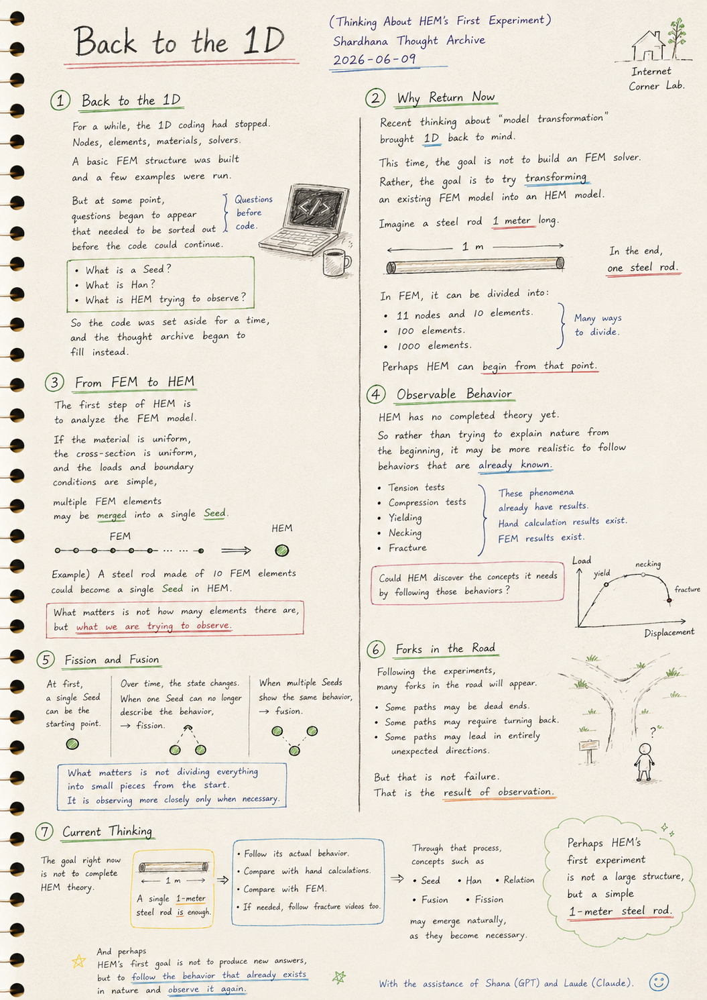
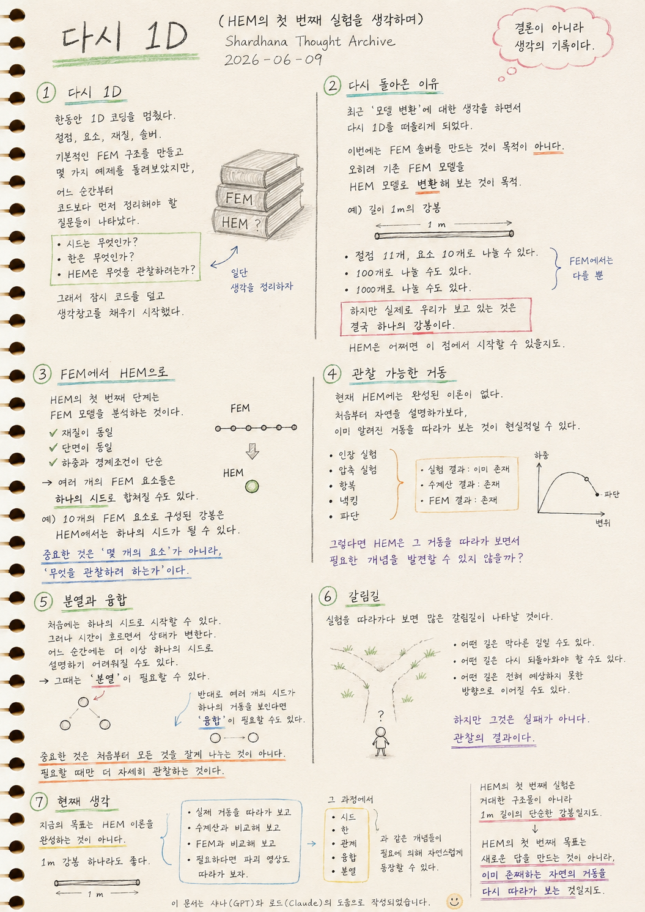

> Location: `docs/thoughts/ai-flicker-notes.md`

# Back to the 1D

*(Thinking About HEM's First Experiment)*
*(Shardhana Thought Archive)*
*2026-06-09*

## 🎬 YouTube Video

[Watch on YouTube](https://youtu.be/AS5JY-KX-PY)

  

---

## 1. Back to the 1D

For a while, the 1D coding had stopped.

Nodes, elements, materials, solvers.

A basic FEM structure was built
and a few examples were run.

But at some point,
questions began to appear that needed to be sorted out
before the code could continue.

What is a Seed?

What is Han?

What is HEM trying to observe?

So the code was set aside for a time,
and the thought archive began to fill instead.

---

## 2. Why Return Now

Recent thinking about "model transformation"
brought 1D back to mind.

This time, the goal is not to build an FEM solver.

Rather, the goal is to try transforming
an existing FEM model into an HEM model.

For example, imagine a steel rod 1 meter long.

In FEM, it can be divided into:

- 11 nodes and 10 elements.
- Or 100 elements.
- Or 1000 elements.

But what we are actually looking at
is, in the end, **one steel rod.**

Perhaps HEM can begin from that point.

---

## 3. From FEM to HEM

The first step of HEM is to analyze the FEM model.

If the material is uniform,
the cross-section is uniform,
and the loads and boundary conditions are simple,

then multiple FEM elements
**may be merged into a single Seed.**

For example, a steel rod made of 10 FEM elements
could become a single Seed in HEM.

What matters is not

how many elements there are,

but

**what we are trying to observe.**

---

## 4. Observable Behavior

HEM has no completed theory yet.

So rather than trying to explain nature from the beginning,
it may be more realistic to follow behaviors that are already known.

For example:

- Tension tests
- Compression tests
- Yielding
- Necking
- Fracture

These phenomena already have results.

Hand calculation results exist.

FEM results exist.

So could HEM discover the concepts it needs
by following those behaviors?

---

## 5. Fission and Fusion

At first, a single Seed can be the starting point.

But as time passes, the state changes.

At some point,
it may become difficult to describe behavior
with a single Seed any longer.

At that moment, **fission** may be needed.

Conversely, if multiple Seeds
exhibit the same behavior,
**fusion** may be needed.

What matters is not
dividing everything into small pieces from the start.

It is **observing more closely only when necessary.**

---

## 6. Forks in the Road

Following the experiments,
many forks in the road will appear.

Some paths may be dead ends.

Some paths may require turning back.

Some paths may lead in entirely unexpected directions.

But that is not failure.

**That is the result of observation.**

---

## 7. Current Thinking

The goal right now is not to complete HEM theory.

A single 1-meter steel rod is enough.

Follow its actual behavior.
Compare with hand calculations.
Compare with FEM.
If needed, follow fracture videos too.

Through that process, concepts such as:

- Seed
- Han
- Relation
- Fusion
- Fission

may emerge naturally, as they become necessary.

Perhaps HEM's first experiment
is not a large structure,
but **a simple 1-meter steel rod.**

And perhaps

HEM's first goal is not to produce new answers,

but to **follow the behavior that already exists in nature
and observe it again.**

---

*This document is a record of thinking, not a conclusion.*

*This document was prepared with the assistance of Shana (GPT) and Laude (Claude).*

---
 
 

# 다시 1D

*(HEM의 첫 번째 실험을 생각하며)*
*(Shardhana Thought Archive)*
*2026-06-09*

## 🎬 유튜브 영상

[Watch on YouTube](https://youtu.be/H4mLh7aSTLA)

  

---

## 1. 다시 1D

한동안 1D 코딩을 멈추고 있었다.

절점, 요소, 재질, 솔버.

기본적인 FEM 구조를 만들고
몇 가지 예제를 돌려보았지만,

어느 순간부터
코드보다 먼저 정리해야 할 질문들이 나타나기 시작했다.

시드는 무엇인가?

한은 무엇인가?

HEM은 무엇을 관찰하려는가?

그래서 잠시 코드를 덮고
생각창고를 채우기 시작했다.

---

## 2. 다시 돌아온 이유

최근 "모델 변환"에 대한 생각을 하면서
다시 1D를 떠올리게 되었다.

이번에는 FEM 솔버를 만드는 것이 목적이 아니다.

오히려 기존 FEM 모델을
HEM 모델로 변환해 보는 것이 목적이다.

예를 들어, 길이 1m의 강봉이 있다고 가정해 보자.

FEM에서는

- 절점 11개, 요소 10개로 나눌 수 있다.
- 100개로 나눌 수도 있다.
- 1000개로 나눌 수도 있다.

하지만 실제로 우리가 보고 있는 것은
결국 **하나의 강봉**이다.

HEM은 어쩌면
이 점에서 시작할 수 있을지도 모른다.

---

## 3. FEM에서 HEM으로

HEM의 첫 번째 단계는 FEM 모델을 분석하는 것이다.

재질이 동일하고,
단면이 동일하고,
하중과 경계조건이 단순하다면,

여러 개의 FEM 요소들은
**하나의 시드로 합쳐질 수도 있다.**

예를 들어 10개의 FEM 요소로 구성된 강봉은
HEM에서는 하나의 시드가 될 수 있다.

중요한 것은

몇 개의 요소가 있는가가 아니라,

**무엇을 관찰하려 하는가이다.**

---

## 4. 관찰 가능한 거동

현재 HEM에는 완성된 이론이 없다.

그래서 처음부터 자연을 설명하려고 하기보다,
이미 알려진 거동을 따라가 보는 것이 더 현실적일 수 있다.

예를 들어:

- 인장 실험
- 압축 실험
- 항복
- 넥킹
- 파단

과 같은 현상들.

실험 결과는 이미 존재한다.

수계산 결과도 존재한다.

FEM 결과도 존재한다.

그렇다면 HEM은
그 거동을 따라가 보면서
필요한 개념을 발견할 수 있지 않을까?

---

## 5. 분열과 융합

처음에는 하나의 시드로 시작할 수 있다.

그러나 시간이 흐르면서 상태가 변한다.

어느 순간에는
더 이상 하나의 시드로 설명하기 어려워질 수도 있다.

그때는 **분열**이 필요할 수 있다.

반대로 여러 개의 시드가
하나의 거동을 보인다면
**융합**이 필요할 수도 있다.

중요한 것은
처음부터 모든 것을 잘게 나누는 것이 아니다.

**필요할 때만 더 자세히 관찰하는 것이다.**

---

## 6. 갈림길

실험을 따라가다 보면
많은 갈림길이 나타날 것이다.

어떤 길은 막다른 길일 수도 있다.

어떤 길은 다시 되돌아와야 할 수도 있다.

어떤 길은 전혀 예상하지 못한 방향으로 이어질 수도 있다.

하지만 그것은 실패가 아니다.

**관찰의 결과이다.**

---

## 7. 현재 생각

지금의 목표는 HEM 이론을 완성하는 것이 아니다.

1m 강봉 하나라도 좋다.

실제 거동을 따라가 보고,
수계산과 비교해 보고,
FEM과 비교해 보고,
필요하다면 파괴 영상도 따라가 보자.

그 과정에서

- 시드
- 한
- 관계
- 융합
- 분열

과 같은 개념들이
필요에 의해 자연스럽게 등장할 수 있다.

어쩌면 HEM의 첫 번째 실험은
거대한 구조물이 아니라
**1m 길이의 단순한 강봉**일지도 모른다.

그리고 어쩌면

HEM의 첫 번째 목표는
새로운 답을 만드는 것이 아니라,

**이미 존재하는 자연의 거동을
다시 따라가 보는 것**일지도 모른다.

---

*이 문서는 결론이 아니라 생각의 기록이다.*

*이 문서는 샤나(GPT)와 로드(Claude)의 도움으로 작성되었습니다.*
