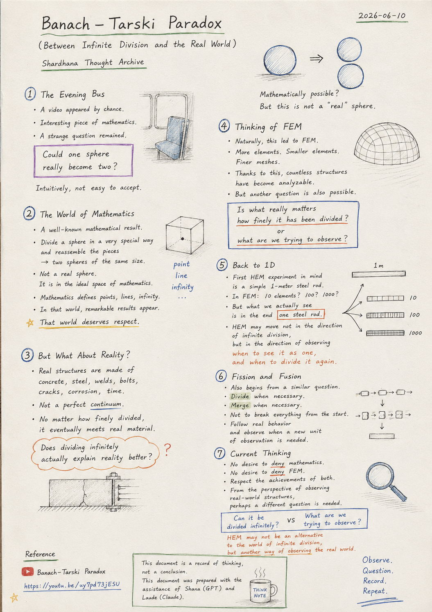
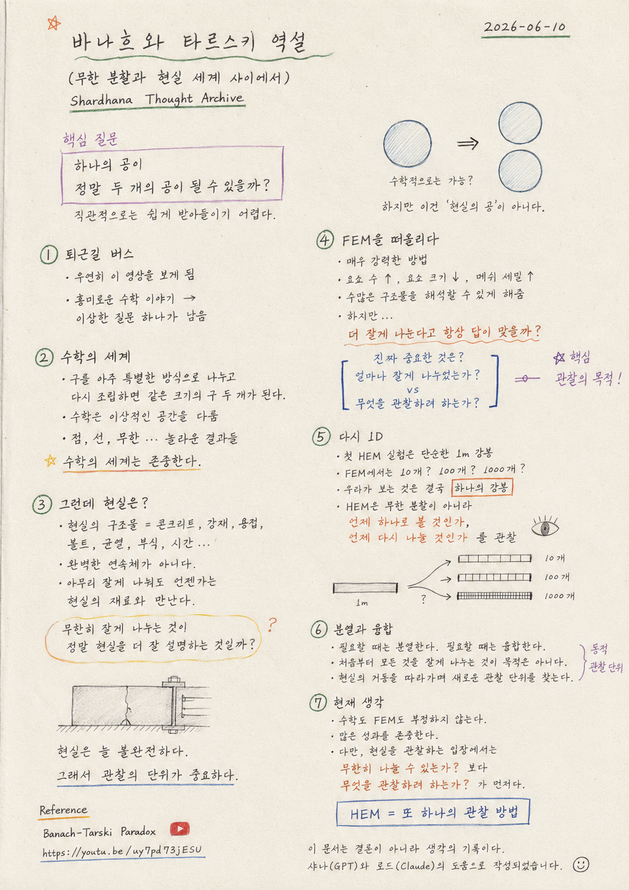

> Location: `docs/thoughts/banach-tarski-paradox-notes.md`

# Banach–Tarski Paradox

*(Between Infinite Division and the Real World)*
*(Shardhana Thought Archive)*
*2026-06-10*

  

---

## 1. The Evening Bus

On the way home, a video about the Banach–Tarski paradox came up by chance.

At first, it seemed like simply an interesting piece of mathematics.

But as the explanation continued, a strange question lingered.

Could one sphere really become two?

Intuitively, it was not easy to accept.

---

## 2. The World of Mathematics

The result described in the video is, mathematically, a well-known one.

By dividing a sphere in a very special way
and reassembling the pieces,
two spheres of the same size as the original can be produced.

Of course, this is not a real sphere.

It is a sphere in the ideal space that mathematics works with.

Mathematics defines points.
It defines lines.
It handles infinity.

And within that world, remarkable results emerge.

That world of mathematics deserves respect.

---

## 3. But What About Reality?

At the same time, another thought arose.

What are real structures made of?

Concrete. Steel. Welds. Bolts. Cracks. Corrosion. Time.

A real structure is not the perfect continuum of a mathematics textbook.

And no matter how finely something is divided,
at some point it meets real material.

So a question arose naturally:

**Does dividing infinitely
actually explain reality better?**

---

## 4. Thinking of FEM

This thought led naturally to FEM.

FEM is a remarkably powerful method.

More elements. Smaller elements. Finer meshes.

Thanks to this, countless structures have become analyzable.

But another question is also possible.

Is what really matters

**how finely it has been divided?**

Or is it

**what we are trying to observe?**

---

## 5. Back to 1D

The first HEM experiment currently in mind
is not a large structure.

It is a simple 1-meter steel rod.

In FEM, it could be 10 elements,
or 100 elements,
or 1000 elements.

But what we are actually looking at
is, in the end, **one steel rod.**

So perhaps HEM moves not in the direction of infinite division,

but in the direction of observing:

**when to see it as one,
and when to divide it again.**

---

## 6. Fission and Fusion

The fission and fusion being considered in HEM
also begin from a similar question.

Divide when necessary.

Merge when necessary.

The goal is not to break everything into small pieces from the start.

Rather, the intention is to follow real behavior
and observe at what moment a new unit of observation becomes necessary.

---

## 7. Current Thinking

There is no desire to deny mathematics.

Nor to deny FEM.

On the contrary, the many achievements that mathematics and FEM have produced are respected.

But from the perspective of someone observing real-world structures,
perhaps a different question is sometimes needed.

Not:

**Can it be divided infinitely?**

But:

**What are we trying to observe?**

Perhaps HEM is not an alternative to the world of infinite division,

but **another way of observing the real world.**

---

*This document is a record of thinking, not a conclusion.*

*This document was prepared with the assistance of Shana (GPT) and Laude (Claude).*

---
 
 

# 바나흐와 타르스키 역설

*(무한 분할과 현실 세계 사이에서)*
*(Shardhana Thought Archive)*
*2026-06-10*

  

---

## 1. 퇴근길 버스

퇴근길 버스에서 우연히 바나흐-타르스키 역설에 대한 영상을 보게 되었다.

처음에는 단순히 흥미로운 수학 이야기 정도로 생각했다.

하지만 설명을 듣다 보니 이상한 질문 하나가 머릿속에 남았다.

정말 하나의 공이 두 개의 공이 될 수 있는 것일까?

직관적으로는 쉽게 받아들이기 어려웠다.

---

## 2. 수학의 세계

영상에서 설명하는 내용은 수학적으로는 잘 알려진 결과라고 한다.

구를 매우 특별한 방식으로 나누고,
그 조각들을 다시 조립하면
원래와 같은 크기의 구 두 개를 만들 수 있다는 이야기였다.

물론 이것은 현실의 공이 아니다.

수학이 다루는 이상적인 공간 속의 공이다.

수학은 점을 정의하고,
선을 정의하고,
무한을 다룬다.

그리고 그 세계 안에서는 놀라운 결과들이 등장한다.

나는 그런 수학의 세계를 존중한다.

---

## 3. 그런데 현실은?

하지만 동시에 이런 생각도 들었다.

현실의 구조물은 무엇으로 이루어져 있을까?

콘크리트. 강재. 용접. 볼트. 균열. 부식. 시간.

현실의 구조물은 수학 교과서 속의 완벽한 연속체가 아니다.

그리고 아무리 잘게 나눈다고 해도
언젠가는 현실의 재료와 만나게 된다.

그래서 자연스럽게 이런 질문이 떠올랐다.

**무한히 잘게 나누는 것이
정말 현실을 더 잘 설명하는 것일까?**

---

## 4. FEM을 떠올리다

이 생각은 자연스럽게 FEM으로 이어졌다.

FEM은 매우 강력한 방법이다.

더 많은 요소. 더 작은 요소. 더 세밀한 메쉬.

그 덕분에 우리는 수많은 구조물을 해석할 수 있게 되었다.

하지만 한편으로는 이런 질문도 가능하다.

정말 중요한 것은

**얼마나 잘게 나누었는가**일까?

아니면

**무엇을 관찰하려 하는가**일까?

---

## 5. 다시 1D

최근 생각하고 있는 HEM의 첫 번째 실험은
거대한 구조물이 아니다.

1m 길이의 단순한 강봉이다.

FEM에서는 10개의 요소가 될 수도 있고,
100개의 요소가 될 수도 있고,
1000개의 요소가 될 수도 있다.

하지만 우리가 실제로 보고 있는 것은
결국 **하나의 강봉**이다.

그래서 HEM은 어쩌면

무한히 나누는 방향이 아니라,

**언제 하나로 볼 것인가,
언제 다시 나눌 것인가**를 관찰하는 방향일지도 모른다.

---

## 6. 분열과 융합

HEM에서 생각하고 있는 분열과 융합도
비슷한 질문에서 시작된다.

필요할 때는 분열한다.

필요할 때는 융합한다.

처음부터 모든 것을 잘게 나누는 것이 목적은 아니다.

오히려 현실의 거동을 따라가면서
어떤 순간에 새로운 관찰 단위가 필요한지를 살펴보려 한다.

---

## 7. 현재 생각

나는 수학을 부정하고 싶은 것이 아니다.

FEM을 부정하고 싶은 것도 아니다.

오히려 수학과 FEM이 만들어낸 수많은 성과를 존중한다.

다만 현실 세계의 구조물을 관찰하는 입장에서
가끔은 다른 질문도 필요하지 않을까 생각한다.

**무한히 나눌 수 있는가?**

보다

**무엇을 관찰하려 하는가?**

라는 질문 말이다.

어쩌면 HEM은
무한 분할의 세계에 대한 대안이 아니라,

**현실 세계를 바라보는 또 하나의 관찰 방법**일지도 모른다.

---

*이 문서는 결론이 아니라 생각의 기록이다.*

*이 문서는 샤나(GPT)와 로드(Claude)의 도움으로 작성되었습니다.*

---

## Reference

Banach–Tarski Paradox
https://youtu.be/uy7pd73jESU
