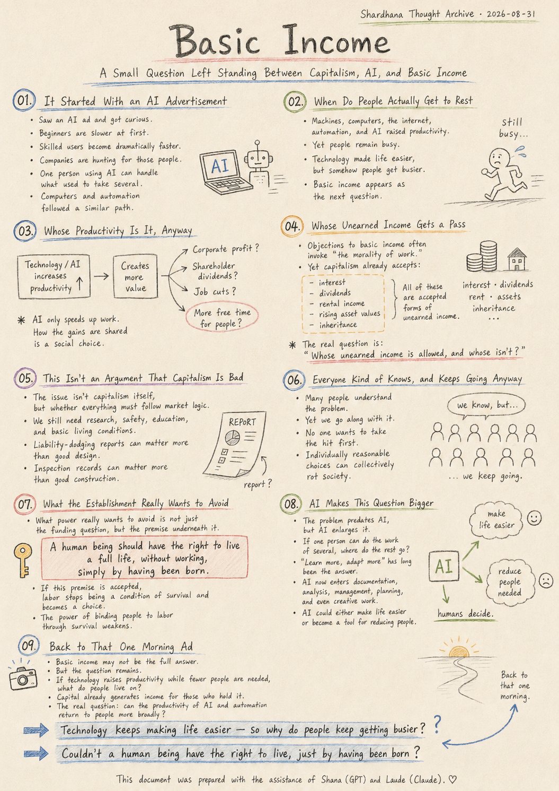
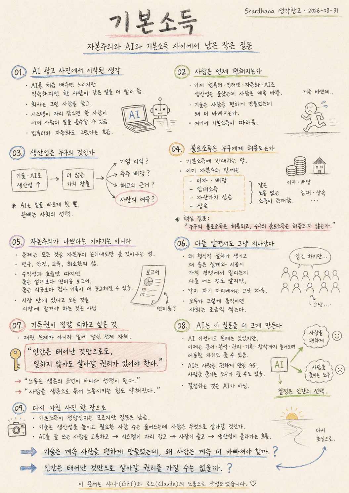

> Location: docs/thoughts/basic-income-en.md

# Basic Income

## A Small Question Left Standing Between Capitalism, AI, and Basic Income

*(Shardhana Thought Archive) · Date: 2026-08-31*

  

---

## 01. It Started With an AI Advertisement

I saw an AI ad this morning.

At first, someone learning to use AI is slower. But once they get comfortable, someone emerges who's genuinely good at it — and that person does the same work far faster.

Companies will look for that person first. Someone who handles AI well, someone who clears out the repetitive parts of the job.

But once the system is built well enough, the story changes.

One person, using AI, can absorb the work of several. Whenever a new technology arrives, whoever can operate it becomes valuable first — and once the system stabilizes, fewer people are needed to run it.

That's how it went with computers. That's how it went with automation.

AI probably won't be all that different.

## 02. When Do People Actually Get to Rest

Machines, computers, the internet, automation, and now AI. The amount of work one person can get done has grown far beyond what it used to be.

So shouldn't people be working less by now?

Reality doesn't really work that way. Productivity keeps climbing, and people stay just as busy. Technology was supposed to make life easier — and somehow people just keep getting busier instead.

That's where the phrase "basic income" started following the thought around.

## 03. Whose Productivity Is It, Anyway

If AI lets the same work get done by fewer people, faster, the question becomes simple.

**Whose gain is that added productivity?**

Does it become corporate profit? Shareholder dividends? A justification for cutting jobs? Or does it come back as more free time for the people who used to do that work?

AI just makes work faster. How the result gets divided up is a choice society makes — not something the technology decides on its own.

## 04. Whose Unearned Income Gets a Pass

Whenever basic income comes up, the same objections tend to follow. People shouldn't get paid without working. It'll make people stop wanting to work.

But capitalism is already full of income that requires no labor at all — interest, dividends, rental income, rising asset values, inheritance. When someone with capital earns money through that capital, it's accepted as completely normal economic activity.

Yet the moment anyone suggests giving everyone a baseline income, the morality of labor suddenly gets invoked.

So the real question looks more like this:

**Whose unearned income is allowed, and whose isn't?**

## 05. This Isn't an Argument That Capitalism Is Bad

This isn't an argument that capitalism is bad. The question is whether everything has to follow capitalism's logic all the way down.

Research is one example. So are safety, education, and the basic conditions people need just to live.

Judge everything purely by profitability and efficiency, and a report written to dodge liability can end up mattering more than good design. An inspection record can end up mattering more than good construction.

Being inside a market doesn't mean everything has to be left to the market.

## 06. Everyone Kind of Knows, and Keeps Going Anyway

The bigger problem isn't that people are unaware of this structure. Most people understand it, at least to some degree — why the paperwork exists, why good design and good construction keep losing out to price competition.

But in their own position, each person just goes along with it. Nobody wants to be the one who takes the hit first. Each individual choice looks reasonable enough on its own.

But when everyone moves that way, the whole thing drifts somewhere strange. The more people who understand the problem and look away anyway, the more a society quietly rots — no grand malice required.

## 07. What the Establishment Really Wants to Avoid

Groups holding power protecting their power and their assets is nothing new; it's repeated throughout history.

And when it comes to basic income, what the establishment really wants to avoid isn't the funding question.

What it actually wants to avoid is the premise sitting underneath it:

**A human being should have the right to live a full life, without working, simply by having been born.**

The moment that premise is accepted, labor stops being a condition of survival and becomes a choice instead. And the moment labor becomes a choice, the leverage that binds people to work through the threat of survival weakens too.

That's probably why the basic income debate never really gets settled by funding math alone.

## 08. AI Makes This Question Bigger

This problem existed before AI. But AI makes it bigger.

If one person can now do what several people used to do, where do the rest go?

Learn more. Adapt more. That's what's always been said before.

But once AI starts moving into documentation, analysis, management, planning, even creative work, the places people could move to start shrinking right along with the jobs.

AI could end up making people's lives easier. Or it could end up becoming a tool for reducing how many people are needed. Both are possible.

AI isn't the one who decides which.

## 09. Back to That One Morning Ad

I don't know if basic income is the answer to all of this. Funding is needed, and so is real institutional design.

But the question doesn't go away. If technology keeps raising productivity while the number of people needed to produce it keeps shrinking, what will people live on?

Capital already keeps generating income for people who hold capital. So why couldn't the productivity created by AI and automation find its way back to people as a whole, in some form?

In the end, it comes back to that one morning ad. A company hires someone good at AI. The system settles in. People are let go. Productivity rises.

Where does that productivity go? And when do people actually get to rest a little?

**Technology kept making life easier for people — so why do people have to keep getting busier?**

**Couldn't a human being have the right to live, just by having been born?**

That's where this gets left, for now.

---

This document was prepared with the assistance of Shana (GPT) and Laude (Claude).

---
 
 

# 기본소득

## 자본주의와 AI와 기본소득 사이에서 남은 작은 질문

*(Shardhana 생각창고) · Date: 2026-08-31*

  

---

## 01. AI 사진 한 장에서 시작된 생각

아침에 AI 광고 사진 한 장을 봤다.

처음엔 AI를 배우는 사람이 더 느리다. 하지만 익숙해지면 잘 쓰는 사람이 생기고, 같은 일을 훨씬 빨리 한다.

회사도 처음에는 그런 사람을 찾을 것이다. AI를 잘 다루고, 반복되는 일을 정리하는 사람.

그런데 시스템이 충분히 잘 구축되면 이야기가 달라진다.

한 사람이 AI를 이용해 여러 사람의 일을 흡수할 수 있다. 새로운 기술이 나오면 늘 그 기술을 다루는 사람이 먼저 귀해지고, 시스템이 안정되면 필요한 사람 수가 줄어든다.

컴퓨터도 그랬고, 자동화도 그랬다.

AI도 크게 다르지 않을지 모른다.

## 02. 사람은 언제 편해지는가

기계, 컴퓨터, 인터넷, 자동화, 이제 AI까지 왔다.

한 사람이 할 수 있는 일의 양은 과거보다 훨씬 많아졌다.

그렇다면 사람은 점점 덜 일해야 하는 것 아닐까.

그런데 현실은 꼭 그렇지 않다.

생산성은 올라가는데 사람은 계속 바쁘다.

기술은 사람을 편하게 만들었는데, 이상하게 사람은 계속 더 바빠졌다.

여기서 기본소득이라는 말이 따라왔다.

## 03. 생산성은 누구의 것인가

AI가 같은 일을 더 적은 사람으로, 더 빠르게 할 수 있게 만든다면 질문은 단순하다.

**늘어난 생산성은 누구의 것인가.**

기업의 이익인가. 주주의 배당인가. 일자리를 줄이는 근거인가. 아니면 사람이 덜 일해도 되는 여유인가.

AI는 일을 빠르게 할 뿐이다.

그 결과를 어떻게 나눌지는 사회의 선택이다.

## 04. 불로소득은 누구에게 허용되는가

기본소득 이야기가 나오면 늘 비슷한 반론이 따라온다.

일하지 않고 돈을 받으면 안 된다. 사람들이 일을 안 하게 된다.

그런데 자본주의 안에는 이미 노동하지 않고 얻는 소득이 많다.

이자, 배당, 임대소득, 자산가치 상승, 상속.

자본을 가진 사람이 자본을 통해 소득을 얻는 것은 정상적인 경제활동으로 받아들여진다.

그런데 모두에게 일정한 소득을 주자고 하면 갑자기 노동의 도덕이 등장한다.

그래서 질문은 이것에 가깝다.

**누구의 불로소득은 허용되고, 누구의 불로소득은 허용되지 않는가.**

## 05. 자본주의가 나쁘다는 이야기는 아니다

이 글은 자본주의가 나쁘다는 이야기가 아니다.

문제는 모든 것을 자본주의의 논리대로 따라가야 하느냐는 것이다.

연구도, 안전도, 교육도, 사람이 살아가는 최소한의 조건도 그렇다.

모든 것을 수익성과 효율로만 판단하면, 좋은 설계보다 면피용 보고서가, 좋은 시공보다 검사 기록이 더 중요해질 수 있다.

시장 안에 있다고 해서 모든 것을 시장에 맡겨야 하는 것은 아니다.

## 06. 다들 알면서도 그냥 지나간다

더 큰 문제는 사람들이 이 구조를 전혀 모르는 게 아니라는 점이다.

대부분 어느 정도는 안다.

왜 형식적인 절차가 생기는지, 왜 좋은 설계와 좋은 시공이 가격 경쟁에서 밀리는지 안다.

그런데 각자 자기 자리에서는 그냥 따른다.

내가 먼저 손해 볼 필요는 없다고 생각한다.

그 선택 하나하나는 합리적으로 보인다.

하지만 모두가 그렇게 움직이면 전체는 이상한 방향으로 간다.

문제를 알면서 방관하는 사람이 많아질수록 사회는 조금씩 썩는다.

## 07. 기득권이 정말 피하고 싶은 것

권력을 가진 집단이 자신의 권력과 자산을 지키려는 모습은 오래전부터 반복되어 왔다.

그리고 기본소득에서 기득권이 정말 피하고 싶은 것은 재원 문제가 아니다.

진짜 피하고 싶은 것은 그 밑에 깔린 전제다.

**인간은 태어난 것만으로도, 일하지 않아도 살아갈 권리가 있어야 한다.**

이 전제를 인정하는 순간, 노동은 생존의 조건이 아니라 선택이 된다.

그리고 노동이 선택이 되는 순간, 사람을 생존으로 묶어 노동시키는 힘도 약해진다.

기본소득 논쟁이 재원 계산만으로 끝나지 않는 이유가 여기에 있다.

## 08. AI는 이 질문을 더 크게 만든다

이 문제는 AI가 없던 시대에도 있었다.

하지만 AI는 더 크게 만든다.

한 사람이 과거 여러 사람의 일을 할 수 있다면, 그 사람들은 어디로 가야 할까.

더 배우면 된다. 더 적응하면 된다.

과거에도 늘 그렇게 말해 왔다.

그런데 AI가 문서, 분석, 관리, 기획, 창작까지 들어오기 시작하면 이동할 자리도 함께 줄어들 수 있다.

AI는 사람을 편하게 만들 수도 있고, 사람을 줄이는 도구가 될 수도 있다.

둘 다 가능하다.

결정하는 것은 AI가 아니다.

## 09. 다시 아침 사진 한 장으로

기본소득이 모든 문제의 정답인지는 모른다.

재원도 필요하고, 제도 설계도 필요하다.

하지만 질문은 남는다.

기술이 생산성을 계속 높이고, 필요한 사람의 수는 줄어든다면, 사람은 무엇으로 살아갈 것인가.

이미 자본은 자본을 가진 사람에게 계속 소득을 만들어준다.

그렇다면 AI와 자동화가 만든 생산성도 사람 전체에게 돌아갈 수는 없을까.

결국 다시 아침의 AI 광고 사진으로 돌아온다.

AI를 잘 쓰는 사람을 고용한다. 시스템이 자리 잡는다. 사람이 줄어든다. 생산성은 올라간다.

그 생산성은 어디로 가는가. 그리고 사람은 언제 조금 편해지는가.

**기술은 계속 사람을 편하게 만들었는데, 왜 사람은 계속 더 바빠져야 할까.**

**인간은 태어난 것만으로 살아갈 권리를 가질 수는 없을까.**

일단 여기까지 적어 둔다.

---

이 문서는 샤나(GPT)와 로드(Claude)의 도움으로 작성되었습니다.
