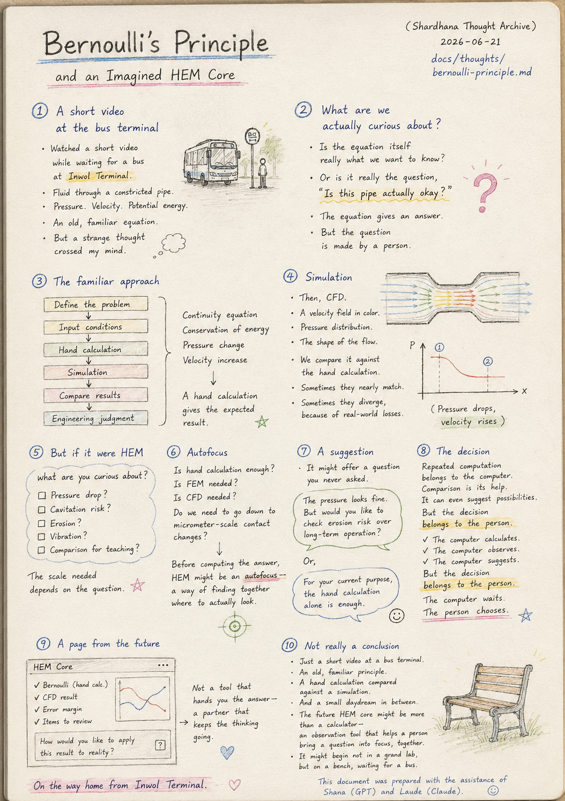
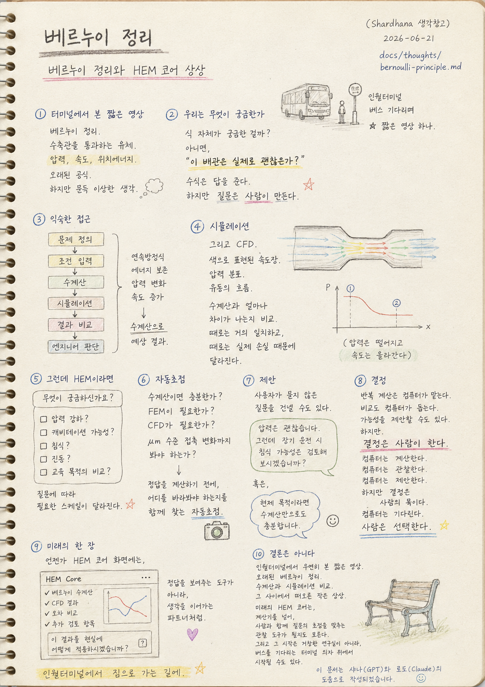

> Location: `docs/thoughts/bernoulli-principle.md`

# Bernoulli's Principle

### Bernoulli's Principle and an Imagined HEM Core

*(Shardhana Thought Archive)*  
*Date: 2026-06-21*

<p align="center">
  
</p>

---

## 1. A Short Video at the Bus Terminal

Waiting for a bus at Inwol Terminal, I watched a short video.

Bernoulli's principle.

Fluid passing through a constricted pipe.

Pressure.

Velocity.

Potential energy.

An old, familiar equation.

But a strange thought crossed my mind.

---

## 2. What Are We Actually Curious About

Is the equation itself really what we want to know?

Or is it really the question,

"Is this pipe actually okay?"

The equation gives an answer.

But the question is made by a person.

---

## 3. The Familiar Approach

The usual workflow is familiar.

```
Define the problem
↓
Input conditions
↓
Hand calculation
↓
Simulation
↓
Compare results
↓
Engineering judgment
```

Bernoulli's principle follows the same path.

Continuity equation.

Conservation of energy.

Pressure change.

Velocity increase.

A hand calculation gives the expected result.

---

## 4. Simulation

And then, CFD.

A velocity field rendered in color.

Pressure distribution.

The shape of the flow.

We compare it against the hand calculation.

Sometimes they nearly match.

Sometimes they diverge, because of real-world losses.

---

## 5. But If It Were HEM

HEM might start by asking the question again, from scratch.

What are you curious about?

Pressure drop?

Cavitation risk?

Erosion?

Vibration?

Or just a comparison for teaching purposes?

The scale that's needed depends entirely on the question.

---

## 6. Autofocus

Is a hand calculation enough?

Is FEM needed?

Is CFD needed?

Do we need to look all the way down to micrometer-scale contact changes?

Before computing the answer,

HEM might be an autofocus —

a way of finding, together, where to actually look.

---

## 7. A Suggestion

And maybe, sometimes,

it could offer a question the user never asked.

The pressure looks fine.

But would you like to check the erosion risk over long-term operation?

Or, the other way around:

For your current purpose, the hand calculation alone is enough.

---

## 8. The Decision

Repeated computation belongs to the computer.

Comparison can also be the computer's help.

It can even suggest possibilities.

But.

The decision belongs to the person.

The computer calculates.

The computer observes.

The computer suggests.

But the decision belongs to the person.

The computer waits.

The person chooses.

---

## 9. A Page From the Future

Someday, a HEM core screen might show

the Bernoulli hand calculation.

The CFD result.

The margin of error between them.

A list of items worth a second look.

And, alongside all of it,

a single question:

"How would you like to apply this result to reality?"

Not a tool that hands you the answer —

a partner that keeps the thinking going.

---

## 10. Not Really a Conclusion

Once again, there's no conclusion here.

Just a short video, watched by chance at a bus terminal.

An old, familiar principle.

A hand calculation compared against a simulation.

And a small daydream that surfaced somewhere in between.

The future HEM core might end up being more than a calculator —

an observation tool that helps a person bring a question into focus,

together.

And it might not begin in some grand research lab at all.

It might begin on a bench, waiting for a bus.

---

*On the way home from Inwol Terminal.*

---

*This document was prepared with the assistance of Shana (GPT) and Laude (Claude).*

---
<br>
<br>

# 베르누이 정리

### 베르누이 정리와 HEM 코어 상상

*(Shardhana 생각창고)*  
*Date: 2026-06-21*

<p align="center">
  
</p>

---

## 1. 터미널에서 본 짧은 영상

인월터미널에서 버스를 기다리며 짧은 영상을 하나 보았다.

베르누이 정리.

수축관을 통과하는 유체.

압력.

속도.

위치에너지.

오래된 공식이었다.

하지만 문득 이상한 생각이 들었다.

---

## 2. 우리는 무엇이 궁금한가

정말 궁금한 것은 식 자체일까?

아니면,

"이 배관은 실제로 괜찮은가?"

라는 질문일까?

수식은 답을 준다.

하지만 질문은 사람이 만든다.

---

## 3. 익숙한 접근

기존의 흐름은 익숙하다.

```
문제 정의
↓
조건 입력
↓
수계산
↓
시뮬레이션
↓
결과 비교
↓
엔지니어 판단
```

베르누이 정리도 마찬가지다.

연속방정식.

에너지 보존.

압력 변화.

속도 증가.

수계산으로 예상 결과를 얻는다.

---

## 4. 시뮬레이션

그리고 CFD.

색으로 표현된 속도장.

압력 분포.

유동의 흐름.

수계산과 얼마나 차이가 나는지 비교한다.

때로는 거의 일치하고,

때로는 실제 손실 때문에 달라진다.

---

## 5. 그런데 HEM이라면

HEM은 질문부터 다시 물을지도 모른다.

무엇이 궁금하신가요?

압력 강하인가요?

캐비테이션 가능성인가요?

침식인가요?

진동인가요?

교육 목적의 비교인가요?

질문에 따라 필요한 스케일이 달라진다.

---

## 6. 자동초점

수계산이면 충분한가.

FEM이 필요한가.

CFD가 필요한가.

μm 수준 접촉 변화까지 봐야 하는가.

HEM은 정답을 계산하기 전에,

어디를 바라봐야 하는지를 함께 찾는 자동초점일지도 모른다.

---

## 7. 제안

그리고 어쩌면,

사용자가 묻지 않은 질문을 건넬 수도 있다.

압력은 괜찮습니다.

그런데 장기 운전 시 침식 가능성은 검토해 보시겠습니까?

혹은.

현재 목적이라면 수계산만으로도 충분합니다.

---

## 8. 결정

반복 계산은 컴퓨터가 맡는다.

비교도 컴퓨터가 돕는다.

가능성을 제안할 수도 있다.

하지만.

결정은 사람이 한다.

컴퓨터는 계산한다.

컴퓨터는 관찰한다.

컴퓨터는 제안한다.

하지만 결정은 사람의 몫이다.

컴퓨터는 기다린다.

사람은 선택한다.

---

## 9. 미래의 한 장

언젠가 HEM 코어 화면에는,

베르누이 수계산.

CFD 결과.

오차 비교.

추가 검토 항목.

그리고.

"이 결과를 현실에 어떻게 적용하시겠습니까?"

라는 질문이 함께 나타날지도 모른다.

정답을 보여주는 도구가 아니라,

생각을 이어가는 파트너처럼.

---

## 10. 결론은 아니다

이번에도 결론은 없다.

인월터미널에서 우연히 본 짧은 영상 하나.

오래된 베르누이 정리.

수계산과 시뮬레이션 비교.

그리고 그 사이에서 떠오른 작은 상상.

미래의 HEM 코어는,

어쩌면 계산기를 넘어,

사람과 함께 질문의 초점을 맞추는 관찰 도구가 될지도 모른다.

그리고 그 시작은 거창한 연구실이 아니라,

버스를 기다리는 터미널 의자 위에서 시작될 수도 있다.

---

*인월터미널에서 집으로 가는 길에.*

---

*이 문서는 샤나(GPT)와 로드(Claude)의 도움으로 작성되었습니다.*
