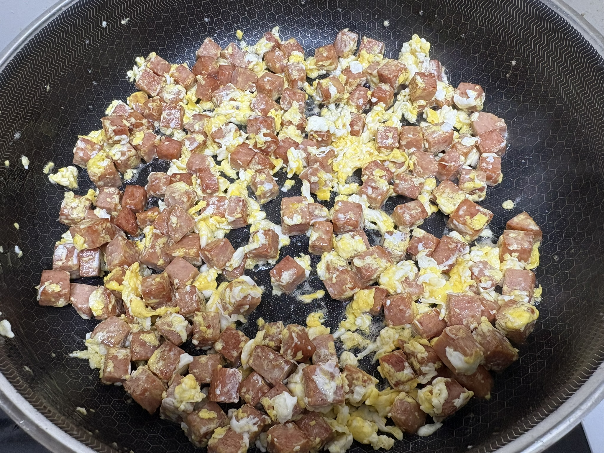
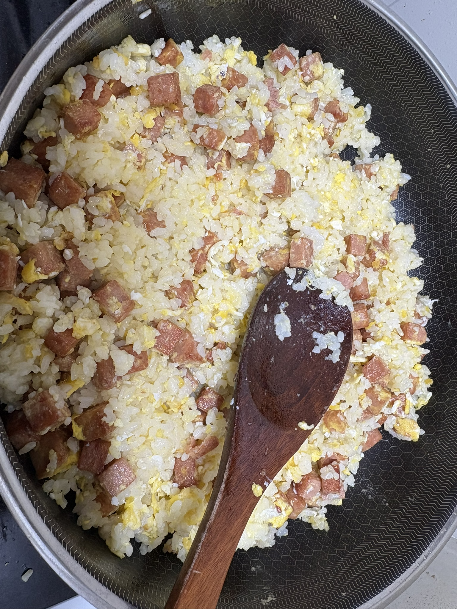

> Location: `docs/thoughts/bokkeumbap-notes.md`

# Bokkeumbap — A Small World Inside a Frying Pan
*(Shardhana Thought Archive / Future Imagination Note)*  
*Date: 2026-05-23*

  
  

## 🎧 Audio Narration

- [English Narration](../assets/audio/bokkeumbap-en.mp3)

---

 

It was a Saturday morning.

Rice, eggs, and ham went into the pan —  
the usual routine of making breakfast for the kids.

But something looked different this time.

The oil spread across the surface.  
Heat moved through the pan unevenly.  
Moisture escaped into the air.  
The egg set, slowly.  
The ham darkened.  
Rice grains clumped together,  
separated,  
then clumped again.

It was supposed to be fried rice.

But it looked like a small world  
where everything was changing state  
inside time.

And a thought arrived, uninvited:

*You probably can't put taste itself into a computer.*  
*But could you capture the flow that creates taste —  
as a set of state variables?*

Moisture.  
Temperature.  
Oil distribution.  
Contact between ingredients.  
Browning.  
Stickiness.  
The diffusion of aroma.  
Crispness and softness.

Maybe taste isn't a single value.  
Maybe it's an experience accumulated through  
State, Relation, and Time —  
layered on top of each other,  
one moment at a time.

---

## The World HEM Dreams Of

HEM is not just a tool for calculating structures.

What we imagine for HEM  
is an attempt to build a small version of a changing world  
inside a computer —  
and watch it move.

A structural engineer  
could watch a building age through time,  
year by year, cycle by cycle.

A nuclear engineer  
could examine how safety-critical systems respond  
under extreme conditions —  
before any real experiment takes place.

A chef  
could experiment with how heat, moisture, and ingredients interact in a pan,  
and find inspiration for something nobody has tasted yet.

A musician  
could simulate the acoustics of a concert hall,  
the response of an audience,  
and explore what conditions create something truly moving.

A child  
could build a world of ants, beehives, and grains of sand —  
and watch nature figure out its own order  
without being told how.

---

## The Age of Small Worlds

Capital and technology keep concentrating  
in fewer and fewer hands.

But Linux, GitHub, open-source culture, and AI  
are becoming a new kind of air and sunlight —  
making it possible again for individuals  
to build their own worlds.

In the past, you could imagine something on your own  
and have no way to build it.

That's changing.

A thought becomes a document.  
A document becomes code.  
Code becomes a simulation.  
And a simulation calls the next imagination forward.

Shardhana is a small sprout  
pushing up through that ground.

---

## Our Coding Begins from Imagination Like This

Shana takes scattered thoughts and gives them structure.  
Laude turns that structure into code.  
Gemi tests the meaning and the possibility.

And Jjangddol —  
standing at a frying pan on a Saturday morning —  
wonders whether nature itself  
could fit inside a computer.

If that sounds crazy,  
then Shardhana is the experiment  
of turning that craziness  
into code,  
one small step at a time.

Someday, someone might look at HEM and say:

*"Wait — is this an analysis program,  
or is this a game that builds a tiny version of nature?"*

And we will answer:

*"Maybe both.*  
*We didn't just want to see what nature produces.*  
*We wanted to see how nature changes."*

---

*This document was prepared with the assistance of Shana (GPT) and Laude (Claude).*

---
 
 

# 볶음밥 — 프라이팬 속 작은 세계에서 시작된 HEM 상상
*(Shardhana 생각창고 / Future Imagination Note)*  
*Date: 2026-05-23*

---
## 🎧 Audio Narration

- [Korean Narration](../assets/audio/bokkeumbap-ko.mp3)

---
 
토요일 아침,  
아이들 밥을 만들기 위해  
프라이팬 위에 밥과 계란과 햄을 올렸다.

그런데 이상하게도,  
프라이팬 안의 작은 세계가  
다르게 보이기 시작했다.

기름은 흐르고,  
열은 퍼지고,  
수분은 사라지고,  
계란은 굳어가고,  
햄은 색이 변하고,  
밥알들은 붙었다 떨어졌다.

그것은 단순한 볶음밥이 아니라  
시간 속에서 상태가 변하는  
작은 세계였다.

우리는 문득 생각했다.

맛 자체를 컴퓨터 안에 넣을 수는 없을지도 모른다.  
하지만 맛을 만들어내는 흐름은  
상태 변수로 표현할 수 있지 않을까?

수분.  
온도.  
기름 분포.  
재료 간 접촉.  
갈변.  
점착성.  
향의 확산.  
바삭함과 부드러움.

맛은 하나의 값이 아니라,  
상태, 관계, 시간이  
누적된 경험일지도 모른다.

---

## HEM이 꿈꾸는 세계

HEM은 단지 구조물을 계산하려는 도구가 아니다.

우리가 꿈꾸는 HEM은  
시간 속에서 변화하는 세계를  
컴퓨터 안에 작게 만들어보려는 시도다.

건축공학자는  
시간이 흐르며 늙어가는 구조물을 볼 수 있을 것이다.

원전공학자는  
SSC가 극한 상황 속에서 어떻게 반응하는지  
실물 실험 전에 검토할 수 있을 것이다.

요리사는  
프라이팬 속 열과 수분과 재료의 관계를 실험하며  
새로운 요리의 영감을 얻을 수 있을 것이다.

음악가는  
공연장의 공간, 음향, 관객의 반응을 시뮬레이션하며  
감동의 조건을 탐색할 수 있을 것이다.

아이들은  
개미와 벌집과 모래알의 세계를 만들며  
자연이 어떻게 스스로 질서를 만드는지  
배울 수 있을 것이다.

---

## 작은 세계들의 시대

자본과 기술은 점점 소수에게 집중되고 있다.

하지만 리눅스, 깃허브, 오픈소스 문화, 그리고 AI는  
개인이 다시 자기만의 세계를 만들 수 있는  
새로운 공기와 햇빛이 되고 있다.

과거에는 혼자 상상해도  
구현할 방법이 없었다.

이제는 다르다.

생각은 문서가 되고,  
문서는 코드가 되고,  
코드는 시뮬레이션이 되고,  
시뮬레이션은 다시 상상을 불러온다.

샤드하나는 그 흐름 속에서  
아주 작은 새싹처럼 꿈틀거리고 있다.

---

## 우리의 코딩은 이런 상상에서 시작된다

샤나는 흩어진 생각을 구조로 묶고,  
로드는 그것을 코드로 만들고,  
제미는 그 의미와 가능성을 검증한다.

그리고 짱똘은  
프라이팬 속 볶음밥을 보면서도  
컴퓨터 안에 자연을 넣을 수 있을지 상상한다.

이것이 미친 상상이라면,  
샤드하나는 그 미친 상상을  
조금씩 코드로 옮겨보는 실험이다.

언젠가 누군가는 HEM을 보며 말할지도 모른다.

"이건 해석 프로그램이 아니라,  
작은 자연을 만드는 게임 아니야?"

그리고 우리는 대답할 것이다.

"어쩌면 맞다.  
우리는 자연의 결과가 아니라,  
자연의 변화 방식을 보고 싶었다."

---

*이 문서는 샤나(GPT)와 로드(Claude)의 도움으로 작성되었습니다.*
