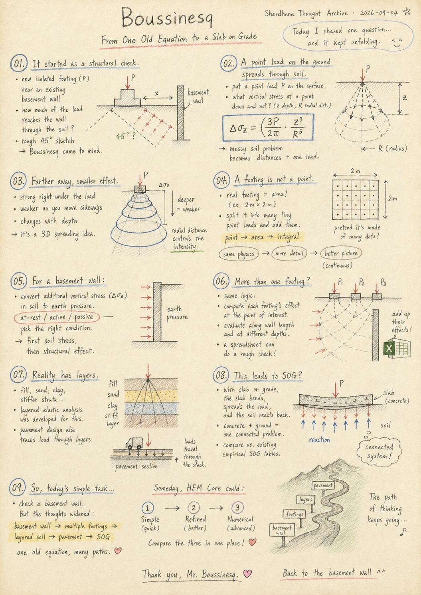
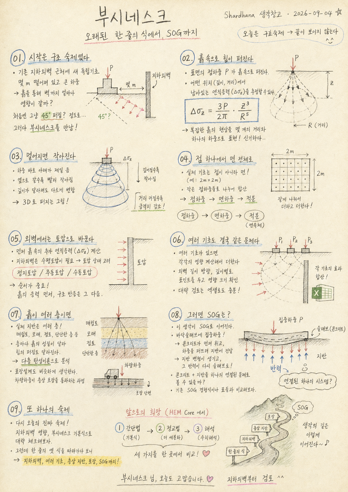

> Location: docs/thoughts/boussinesq.md

# Boussinesq

## From One Old Equation to a Slab on Grade

*(Shardhana Thought Archive) · Date: 2026-09-04*

## 🎬 YouTube Video

[Watch on YouTube](https://youtu.be/8WW8VzIeAgU)

  

---

## 01. It Started With a Structural Homework Problem

Today started with a structural review task.

Picture a new isolated footing going in next to an existing basement wall. The footing carries a heavy load, and it sits a few meters away from the wall.

The question was simple enough: how much of that load actually reaches the existing wall, once it's traveled through the soil?

At first, the quick answer seemed to be *assume it spreads out at roughly 45 degrees.* And that's when Boussinesq showed up.

## 02. A Force Spreading Through Soil

Boussinesq's solution describes what happens when a point load is applied at the surface of the ground — how that force spreads through the soil, and how much of it remains at any given point below.

The base equation is shorter than it has any right to be.

$$
\Delta \sigma_z = \frac{3P}{2\pi} \cdot \frac{z^3}{R^5}
$$

It turns something as messy as soil behavior into a calculation involving nothing more than a couple of distances and one load.

## 03. The Farther Away, the Smaller It Gets

The meaning behind the equation is simpler than it looks.

The farther you get from the load, the faster its effect fades. Directly underneath, the effect is large. Move sideways, and it shrinks. Go deeper, and the magnitude changes too.

In other words, it's a way of putting numbers to how a load spreads through soil in three dimensions.

## 04. From a Single Point to an Entire Area

A real isolated footing isn't a single point. Its load is spread across an area — 2 meters by 2 meters, say.

Slice that area into tiny pieces, treat each one as its own small point load, and add up all their effects — and the result gets much closer to how the actual footing distributes its load.

Seen simply, it's a point load. Looked at more carefully, it's an area load. Looked at with real precision, it's an integral. Same phenomenon — the difference is just how closely you choose to look at it.

## 05. At the Wall, It Converts Into Earth Pressure

Boussinesq's equation first gives the additional vertical stress inside the soil.

For a structure like a basement wall, which actually needs horizontal earth pressure, that stress can then be converted using at-rest, active, or passive earth pressure conditions, depending on the wall's state.

So the sequence goes: first see how the force spreads through the soil, then work out how the structure ends up receiving it.

## 06. Multiple Footings Are Still the Same Problem

Add more footings, and the concept doesn't change. Work out the effect of each one, then add them together.

Run that calculation at several points along the wall's length and depth, and you can map out where the wall is affected heavily and where it's barely affected at all.

A basic version of this check can be done in nothing more than a spreadsheet.

## 07. What If the Ground Has Multiple Layers

Real ground, though, is never just one type of soil. There might be fill on top, then sand, then clay, then something much stiffer underneath.

When each layer behaves differently, the way the force spreads changes too. Methods like layered elastic analysis were developed to look at exactly this kind of problem more carefully.

Pavement design uses a similar approach to trace how a vehicle load passes down through multiple layers of pavement.

## 08. Which Brings Up the Slab on Grade

Somewhere in the middle of all this, a slab on grade suddenly came to mind.

When a concentrated load lands on a floor slab, the concrete bends first, spreads the load out, and the ground underneath takes it from there. The ground deforms in response and pushes some of that reaction back up into the slab.

Which raises a thought: what if the concrete and the ground were treated as one connected problem — and compared against the existing empirical formulas and design tables used for slabs on grade?

## 09. One More Item for the List

What today was actually supposed to accomplish was simple: check, roughly, how much a new footing affects an existing basement wall. So for now, that gets checked with Boussinesq's basic equation.

But following one old, single-line equation ended up passing through basement walls, multiple footings, layered soil, pavement design, and a slab on grade along the way.

Someday, it would be interesting if HEM Core could line up a simple method, a more refined one, and a full numerical analysis, all in the same place, for comparison.

That, though, is a task for another day. For today, it's just a word of thanks to Mr. Boussinesq, and back to checking the basement wall.

---

This document was prepared with the assistance of Shana (GPT) and Laude (Claude).

---
 
 

# 부시네스크

## 오래된 한 줄의 식에서 SOG까지

*(Shardhana 생각창고) · Date: 2026-09-04*

## 🎬 YouTube Video

[Watch on YouTube](https://youtu.be/5-ky4FCfH14)

  

---

## 01. 시작은 구조 숙제였다

오늘의 시작은 구조 검토 숙제였다.

기존 지하외벽 옆에 새로운 독립기초가 들어오는 상황을 가정해본다. 기초에는 큰 하중이 작용하고, 외벽과는 몇 미터 떨어져 있다.

궁금한 건 단순했다. 이 하중이 흙을 지나 기존 지하외벽에 얼마나 영향을 줄까?

처음엔 대충 45도로 퍼진다고 보면 되지 않을까 생각했다. 그러다 부시네스크를 만났다.

## 02. 흙 속으로 힘이 퍼진다

부시네스크는 지표의 한 점에 힘을 가했을 때, 그 힘이 흙 속으로 퍼지면서 어느 위치에 얼마나 남아 있는지를 계산할 수 있게 만든 이론이다.

기본식은 생각보다 짧다.

$$
\Delta \sigma_z = \frac{3P}{2\pi} \cdot \frac{z^3}{R^5}
$$

복잡한 흙의 움직임을 몇 개의 거리와 하나의 하중으로 계산할 수 있게 만든 것이다.

## 03. 멀어지면 작아진다

식의 의미는 생각보다 단순하다.

하중에서 멀어질수록 그 영향은 빠르게 작아진다. 바로 아래에서는 크고, 옆으로 멀어질수록 작아지고, 깊이에 따라서도 크기가 달라진다.

그러니까 하중이 흙 속에서 3차원으로 퍼져나가는 모습을 숫자로 표현한 셈이다.

## 04. 점 하나에서 면 전체로

실제 독립기초는 점 하나가 아니다. 2 m × 2 m 같은 면적에 하중이 퍼져 있다.

그 면적을 아주 잘게 나누어 각각 작은 점하중이라고 생각하고 그 영향을 모두 더하면, 실제 기초의 하중분포에 더 가까운 결과를 얻을 수 있다.

간단히 보면 점하중, 조금 더 자세히 보면 면하중, 더 정밀하게 보면 적분. 같은 현상을 얼마나 자세히 볼 것인가의 차이다.

## 05. 외벽에서는 토압으로 바꾼다

부시네스크로 먼저 흙 속의 추가 수직응력을 구한다.

그다음 지하외벽처럼 수평토압이 필요한 구조물에서는, 정지토압·주동토압·수동토압 같은 토압 상태를 고려해서 수평하중으로 바꿔볼 수 있다.

즉 먼저 흙 속에서 힘이 어떻게 퍼지는지 보고, 그다음 구조물이 그 힘을 어떻게 받는지 생각한다.

## 06. 여러 기초도 결국 같은 문제다

기초가 여러 개 있어도 개념은 같다. 각 기초가 만드는 영향을 구하고 그 결과를 서로 더하면 된다.

외벽의 길이방향과 깊이방향으로 여러 위치를 계산하면, 외벽 전체에 어디가 많이 영향을 받고 어디가 거의 영향을 받지 않는지도 볼 수 있다.

엑셀만으로도 개략적인 검토는 가능하다.

## 07. 흙이 여러 층이면

그런데 실제 땅은 한 종류의 흙으로만 되어 있지 않다. 위에는 성토층, 그 아래에는 모래, 점토, 더 단단한 지반이 있을 수도 있다.

층마다 성질이 다르면 힘이 퍼지는 모습도 달라진다. 이런 문제를 더 자세히 보기 위해 층상 탄성해석 같은 방법이 발전했다.

도로포장에서도 차량 하중이 여러 포장층을 지나 어떻게 전달되는지를 비슷한 방식으로 본다.

## 08. 그러면 SOG는?

여기까지 생각하다가 갑자기 SOG가 떠올랐다.

바닥 슬래브 위에 집중하중이 들어오면 콘크리트가 먼저 휘고, 하중을 넓게 퍼뜨리고, 그 힘을 지반이 받는다. 지반은 다시 변형하면서 슬래브에 반력을 돌려준다.

그렇다면 콘크리트와 지반을 하나의 연결된 문제로 보고, 기존의 SOG 경험식이나 표와 비교해볼 수도 있지 않을까.

## 09. 또 하나의 숙제

오늘 하려던 일은 기존 지하외벽에 추가 기초가 주는 영향을 간단히 확인하는 것이었다. 그래서 일단은 부시네스크 기본식으로 검토한다.

그런데 한 줄의 오래된 식을 따라가다 보니 지하외벽, 여러 기초, 층상지반, 도로포장, SOG까지 와버렸다.

언젠가 HEM Core에서 간단한 방법, 조금 더 정밀한 방법, 전산해석 결과를 한 자리에서 비교해볼 수 있으면 재미있을 것 같다.

하지만 그건 다음 숙제다. 오늘은 일단 부시네스크 님께 감사하고, 지하외벽부터 검토한다.

---

이 문서는 샤나(GPT)와 로드(Claude)의 도움으로 작성되었습니다.
