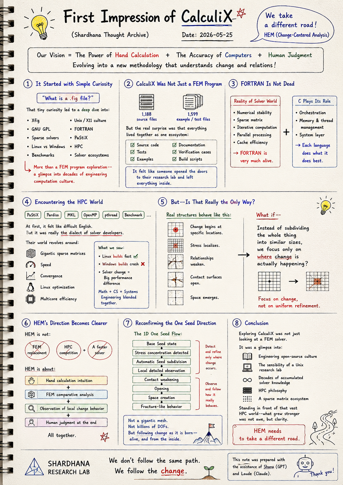
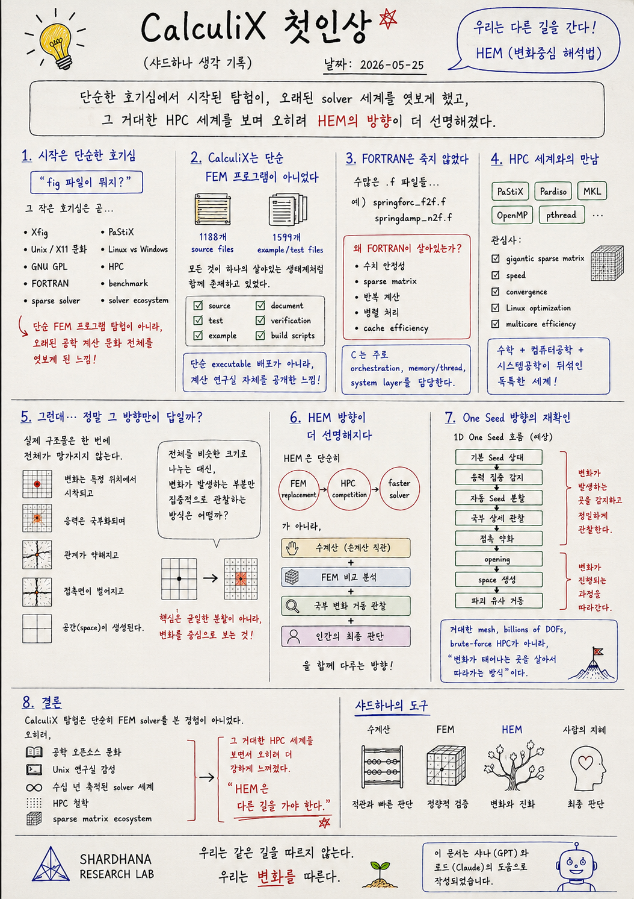

> Location: `docs/thoughts/calculix-first-impression-notes.md`

> Reference:
> CalculiX GitHub repository — A Free Software Three-Dimensional Structural Finite Element Program
<br>
https://github.com/Dhondtguido/CalculiX

# First Impression of CalculiX

*(Shardhana Thought Archive)*  
*Date: 2026-05-25*

<p align="center">
  
</p>

---

## 1. It Started with Simple Curiosity

It began with a small question:

> *"What is a .fig file?"*

But that tiny curiosity quickly pulled everything else in:

- Xfig
- Unix / X11 culture
- GNU GPL
- FORTRAN
- Sparse solvers
- PaStiX
- Linux vs Windows
- HPC
- Benchmarks
- Solver ecosystems

What started as a quick look at a FEM program  
turned into something more like  
a glimpse into an entire culture of engineering computation —  
one that has been quietly running for decades.

---

## 2. CalculiX Was Not Just a FEM Program

Opening the CalculiX repository for the first time,  
the first thing that landed was the sheer scale:

- 1,188 source files
- 1,599 example and test files

But the more striking thing wasn't the numbers.  
It was the fact that:

- Source code
- Tests
- Examples
- Documentation
- Verification cases
- Build scripts

all existed together —  
not as separate downloads,  
but as a single living ecosystem.

This didn't feel like a software release.

It felt more like:

> *"Someone opened the doors to their research lab  
> and left everything inside."*

---

## 3. FORTRAN Is Not Dead

Scrolling through the source tree,  
`.f` files kept appearing everywhere.

For example:

- `springforc_f2f.f`
- `springdamp_n2f.f`

The first reaction was honest surprise.

> *"FORTRAN — in 2026?"*

But looking a little closer, it started to make sense.

The real solver world runs on:

- Numerical stability
- Sparse matrix operations
- Iterative computation
- Parallel processing
- Cache efficiency

And in those areas,  
FORTRAN is very much alive.

C, meanwhile, tends to handle:

- Orchestration
- Memory and thread management
- System-level operations

They coexist — each doing what it does best.

---

## 4. Encountering the HPC(High Performance Computing) World

Reading through the forums,  
certain words kept appearing:

- PaStiX
- Pardiso
- MKL
- OpenMP
- pthread
- Benchmark

At first, it just felt like difficult English.

But it was really something closer to:

> *"The dialect of solver developers."*

Their world revolves around:

- Gigantic sparse matrices
- Speed
- Convergence
- Linux optimization
- Multicore efficiency

And the patterns were telling:

- Linux builds were fast and clean.
- Windows builds crashed.
- Switching solvers could change performance dramatically.

It looked like a world where  
mathematics, computer science, and systems engineering  
blur into something entirely their own.

---

## 5. But — Is That Really the Only Way?

Somewhere in the middle of exploring the CalculiX world,  
a question surfaced — and wouldn't leave:

> *"Is the only path really  
> to subdivide everything infinitely,  
> build enormous matrices,  
> and run an HPC monster?"*

Real structures don't fail everywhere at once.

- Change begins at specific locations.
- Stress localizes.
- Relationships weaken.
- Contact surfaces open.
- Space emerges.

So what if —  
instead of subdividing the whole thing uniformly —  
you focused attention only  
where change is actually happening?

---

## 6. HEM's Direction Becomes Clearer

Ironically, this exploration made HEM's direction  
feel more defined, not less.

HEM is not trying to be:

- A replacement for FEM
- A competitor to HPC
- A faster solver

It's reaching toward something different:

```text
Hand calculation intuition
+ FEM comparative analysis
+ Observation of local change behavior
+ Human judgment at the end
```

All held together.

---

## 7. Reconfirming the One Seed Direction

The 1D One Seed concept felt more meaningful  
after this exploration than it did before.

The expected flow:

```text
Base Seed state
→ Stress concentration detected
→ Automatic Seed subdivision
→ Local detailed observation
→ Contact weakening
→ Opening
→ Space creation
→ Fracture-like behavior
```

This is not:

- A gigantic mesh
- A billion DOFs
- Brute-force HPC

It's closer to:

> *"Following change as it is born —  
> alive, and from the inside."*

---

## 8. Conclusion

Exploring CalculiX was not simply  
an experience of looking at a FEM solver.

It was a glimpse into:

- Engineering open-source culture
- The sensibility of a Unix research lab
- Decades of accumulated solver knowledge
- HPC philosophy
- A sparse matrix ecosystem

And ironically —  
standing in front of that vast HPC world —  
the feeling that grew stronger was not awe.

It was clarity:

> *"HEM needs to take a different road."*

---

*This document was prepared with the assistance of Shana (GPT) and Laude (Claude).*

---
<br>
<br>

# CalculiX 첫인상

*(Shardhana Thought Archive)*  
*Date: 2026-05-25*

<p align="center">
  
</p>

---

## 1. 시작은 단순한 호기심이었다

처음에는 단순히:

> "fig 파일이 뭐지?"

라는 호기심으로 시작했다.

하지만 그 작은 curiosity는 곧:

- Xfig
- Unix/X11 문화
- GNU GPL
- FORTRAN
- sparse solver
- PaStiX
- Linux vs Windows
- HPC
- benchmark
- solver ecosystem

으로 이어졌다.

단순 FEM 프로그램 탐험이 아니라,  
오래된 공학 계산 문화 전체를 엿보게 된 느낌이었다.

---

## 2. CalculiX는 단순 FEM 프로그램이 아니었다

처음 CalculiX 저장소를 열었을 때  
가장 충격적이었던 것은:

- 1188개의 source files
- 1599개의 example/test files

였다.

더 놀라웠던 것은:

- source
- test
- example
- document
- verification
- build scripts

가 모두 하나의 살아있는 생태계처럼  
함께 존재하고 있다는 점이었다.

이것은 단순 executable 배포가 아니라:

> "계산 연구실 자체를 공개한 느낌"

에 가까웠다.

---

## 3. FORTRAN은 죽지 않았다

source tree를 보다 보니  
수많은 `.f` 파일들이 보였다.

예:

- springforc_f2f.f
- springdamp_n2f.f

처음에는 놀라웠다.

> "2026년인데 아직 FORTRAN?"

하지만 조금 더 들여다보니 이해가 되기 시작했다.

현실의 solver 세계는:

- 수치 안정성
- sparse matrix
- 반복 계산
- 병렬 처리
- cache efficiency

가 핵심이며,  
FORTRAN은 여전히 그 영역에서 살아있는 언어였다.

그리고 C는:

- orchestration
- memory/thread handling
- system layer

를 담당하는 경우가 많았다.

---

## 4. HPC 세계와의 만남

포럼을 읽다 보니:

- PaStiX
- Pardiso
- MKL
- OpenMP
- pthread
- benchmark

같은 단어들이 계속 등장했다.

처음에는:

> "영어가 어렵다"

고 느꼈지만,  
사실은:

> "solver 개발자들의 방언"

에 가까웠다.

그 세계의 관심사는:

- gigantic sparse matrix
- speed
- convergence
- Linux optimization
- multicore efficiency

였다.

특히:

- Linux build는 빠르고
- Windows build는 crash 나고
- solver 교체에 따라 속도 차이가 크게 발생하는 모습은

"수학 + 컴퓨터공학 + 시스템공학"이  
뒤섞인 독특한 세계처럼 보였다.

---

## 5. 그런데… 정말 그 방향만이 답일까?

CalculiX 세계를 탐험하면서  
오히려 더 강하게 떠오른 질문이 있었다.

> "정말 모든 것을  
> 무한히 잘게 나누고,  
> 거대한 행렬을 만들고,  
> HPC monster를 돌리는 것이  
> 유일한 길일까?"

실제 구조물은:

- 변화가 특정 위치에서 시작되고
- 응력은 국부화되며
- 관계가 약해지고
- 접촉면이 벌어지고
- 공간(space)이 생성된다.

그렇다면:

> "전체를 비슷한 크기로 나누는 대신"

변화가 발생하는 부분만  
집중적으로 관찰하는 방식은 어떨까?

---

## 6. HEM 방향이 더 선명해지다

이번 탐험은 오히려  
HEM 방향을 더 선명하게 만들어 주었다.

HEM은 단순히:

- FEM replacement
- HPC competition
- faster solver

를 목표로 하는 것이 아니다.

오히려:

```text
수계산
+ FEM 비교 분석
+ 국부 변화 거동 관찰
+ 인간의 최종 판단
```

을 함께 다루는 방향에 가깝다.

---

## 7. One Seed 방향의 재확인

특히 1D One Seed 개념은  
이번 탐험 이후 더 의미 있게 느껴졌다.

예상 흐름:

```text
기본 Seed 상태
→ 응력 집중 감지
→ 자동 Seed 분할
→ 국부 상세 관찰
→ 접촉 약화
→ opening
→ space 생성
→ 파괴 유사 거동
```

이것은:

- gigantic mesh
- billion DOF
- brute-force HPC

보다는,

> "변화가 태어나는 곳을  
> 살아서 따라가는 방식"

에 가깝다.

---

## 8. 결론

CalculiX 탐험은 단순히  
FEM solver를 본 경험이 아니었다.

오히려:

- 공학 오픈소스 문화
- Unix 연구실 감성
- 수십 년 축적된 solver 세계
- HPC 철학
- sparse matrix ecosystem

를 엿본 경험이었다.

그리고 아이러니하게도,  
그 거대한 HPC 세계를 보면서 오히려:

> "HEM은 다른 길을 가야 한다"

는 생각이 더욱 강해졌다.

---

*이 문서는 샤나(GPT)와 로드(Claude)의 도움으로 작성되었습니다.*
