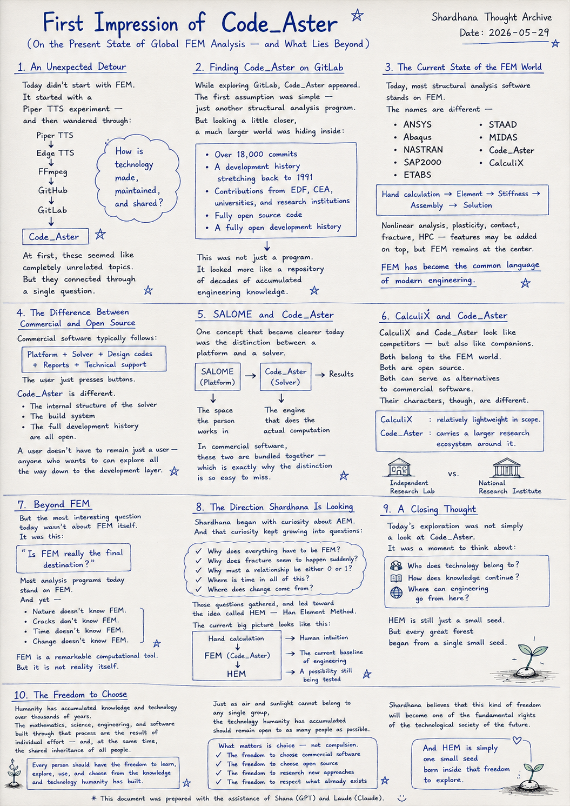
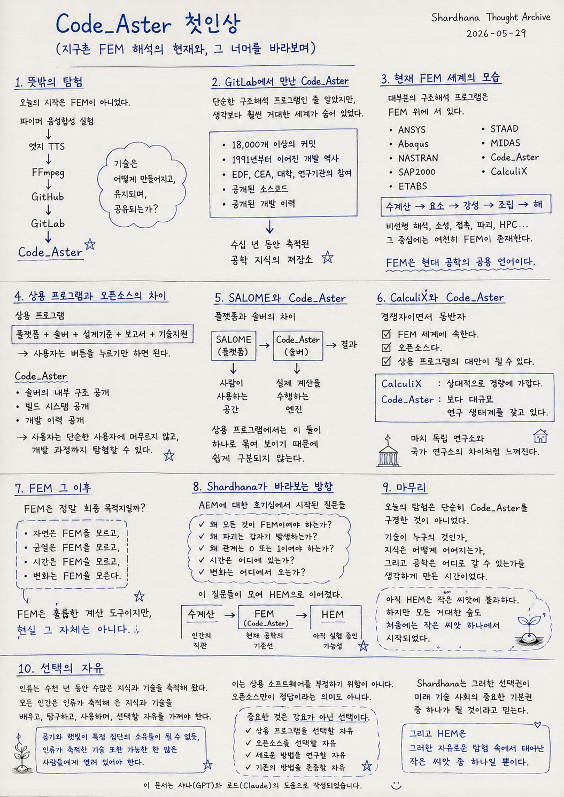

> Location: `docs/thoughts/code-aster-first-impression-notes.md`

# Code_Aster: First Impression

*(On the Present State of Global FEM Analysis — and What Lies Beyond)*  
*(Shardhana Thought Archive)*  
*29 May 2026*

<p align="center">
  
</p>

---

## 1. An Unexpected Detour

Today didn't start with FEM.

It started with a Piper TTS experiment —  
and then wandered through:

Edge TTS,  
FFmpeg,  
GitHub,  
GitLab,

until it arrived, unexpectedly, at Code_Aster.

At first, these seemed like completely unrelated topics.  
But they connected through a single question:

> *"How is technology made, maintained, and shared?"*

---

## 2. Finding Code_Aster on GitLab

While exploring GitLab, Code_Aster appeared.

The first assumption was simple —  
just another structural analysis program.

But looking a little closer,  
a much larger world was hiding inside:

- Over 18,000 commits
- A development history stretching back to 1991
- Contributions from EDF, CEA, universities, and research institutions
- Fully open source code
- A fully open development history

This was not just a program.  
It looked more like a repository  
of decades of accumulated engineering knowledge.

---

## 3. The Current State of the FEM World

Today, most structural analysis software stands on FEM.

The names are different —

- ANSYS
- Abaqus
- NASTRAN
- SAP2000
- ETABS
- STAAD
- MIDAS
- Code_Aster
- CalculiX

— but inside, most of them follow the same flow:

```text
Hand calculation → Element → Stiffness → Assembly → Solution
```

Nonlinear analysis, plasticity, contact, fracture, HPC —  
features may be added on top,  
but FEM remains at the center.

It would not be an overstatement to say  
that FEM has become the common language of modern engineering.

---

## 4. The Difference Between Commercial and Open Source

One of the more interesting observations today  
was the gap between commercial software and open source.

Commercial programs typically follow a structure like:

```text
Platform + Solver + Design codes + Reports + Technical support
```

The user just presses buttons.

Code_Aster is different.

The internal structure of the solver,  
the build system,  
and the full development history are all open.

A user doesn't have to remain just a user —  
anyone who wants to can explore all the way down to the development layer.

---

## 5. SALOME and Code_Aster

One concept that became clearer today  
was the distinction between a **platform** and a **solver**.

SALOME is a platform.  
Code_Aster is a solver.

SALOME is the space the person works in.  
Code_Aster is the engine that does the actual computation.

```text
SALOME → Code_Aster → Results
```

In commercial software, these two are bundled together —  
which is exactly why the distinction is so easy to miss.

---

## 6. CalculiX and Code_Aster

CalculiX and Code_Aster look like competitors —  
but also like companions.

Both belong to the FEM world.  
Both are open source.  
Both can serve as alternatives to commercial software.

Their characters, though, are different.

CalculiX is relatively lightweight in scope.  
Code_Aster carries a larger research ecosystem around it.

The difference feels something like  
an independent research lab  
versus a national research institute.

---

## 7. Beyond FEM

But the most interesting question today wasn't about FEM itself.

It was this:

> *"Is FEM really the final destination?"*

Most analysis programs today stand on FEM.

And yet —

Nature doesn't know FEM.  
Cracks don't know FEM.  
Time doesn't know FEM.  
Change doesn't know FEM.

FEM is a remarkable computational tool.  
But it is not reality itself.

---

## 8. The Direction Shardhana Is Looking

Shardhana began with curiosity about AEM.

And that curiosity kept growing into questions:

- Why does everything have to be FEM?
- Why does fracture seem to happen suddenly?
- Why must a relationship be either 0 or 1?
- Where is time in all of this?
- Where does change come from?

Those questions gathered, and led toward  
the idea called HEM — Han Element Method.

The current big picture looks like this:

```text
Hand calculation
↓
FEM (Code_Aster)
↓
HEM
```

Hand calculation is human intuition.  
FEM is the current baseline of engineering.  
HEM is a possibility still being tested.

---

## 9. A Closing Thought

Today's exploration was not simply a look at Code_Aster.

It was a moment to think about:

Who does technology belong to?  
How does knowledge continue?  
And where can engineering go from here?

HEM is still just a small seed.

But every great forest  
began from a single small seed.

---

## 10. The Freedom to Choose

Humanity has accumulated knowledge and technology  
over thousands of years.

The mathematics, science, engineering, and software  
built through that process  
are the result of individual effort —  
and, at the same time, the shared inheritance of all people.

Every person should have the freedom  
to learn, explore, use, and choose  
from the knowledge and technology humanity has built.

Just as air and sunlight cannot belong to any single group,  
the technology humanity has accumulated  
should remain open to as many people as possible.

This is not a rejection of commercial software.  
It is not a declaration that open source is the only answer.

What matters is choice — not compulsion.

The freedom to choose commercial software.  
The freedom to choose open source.  
The freedom to research new approaches.  
The freedom to respect what already exists.

Shardhana believes that this kind of freedom  
will become one of the fundamental rights  
of the technological society of the future.

And HEM is simply one small seed  
born inside that freedom to explore.

---

*This document was prepared with the assistance of Shana (GPT) and Laude (Claude).*

---
<br>
<br>

# 코드에스터 첫인상

*(지구촌 FEM 해석의 현재와, 그 너머를 바라보며)*  
*(샤드하나 생각창고)*  
*Date: 2026-05-29*

<p align="center">
  
</p>

---


## 1. 뜻밖의 탐험

오늘의 시작은 FEM이 아니었다.

파이퍼 음성합성 실험에서 시작해,

엣지 TTS,  
FFmpeg,  
깃허브,  
깃랩을 거쳐

결국 코드에스터까지 도착했다.

처음에는 전혀 관련 없는 주제처럼 보였지만,  
하나의 질문으로 연결되었다.

> "기술은 어떻게 만들어지고, 유지되며, 공유되는가?"

---

## 2. 깃랩에서 만난 코드에스터

깃랩을 탐험하던 중 코드에스터를 발견했다.

처음에는 단순한 구조해석 프로그램으로 생각했다.

하지만 조금 더 들여다보니  
생각보다 훨씬 거대한 세계가 숨어 있었다.

- 18,000개 이상의 커밋
- 1991년부터 이어진 개발 역사
- EDF, CEA, 대학, 연구기관의 참여
- 공개된 소스코드
- 공개된 개발 이력

이것은 단순한 프로그램이 아니라,  
수십 년 동안 축적된 공학 지식의 저장소처럼 보였다.

---

## 3. 현재 FEM 세계의 모습

오늘날 대부분의 구조해석 프로그램은 FEM 위에 서 있다.

대표적으로:

- 앤시스
- 아바쿠스
- 나스트란
- 셉이천
- 이탭
- 스타드
- 마이다스
- 코드에스터
- 캘큐릭스

등이 있다.

프로그램의 이름은 다르지만,  
그 내부를 들여다보면 대부분 다음과 같은 흐름을 가진다.

```text
수계산 → 요소 → 강성 → 조립 → 해
```

비선형 해석, 소성, 접촉, 파괴, 병렬계산(HPC) 등의 기능이 추가되더라도,  
그 중심에는 여전히 FEM이 존재한다.

FEM은 이미 현대 공학의 공용 언어가 되었다고 해도 과언이 아니다.

---

## 4. 상용 프로그램과 오픈소스의 차이

오늘의 탐험에서 흥미로웠던 점은,  
상용 프로그램과 오픈소스 프로그램의 차이였다.

상용 프로그램은 보통 다음과 같은 구조를 가진다.

```text
플랫폼 + 솔버 + 설계기준 + 보고서 + 기술지원
```

사용자는 버튼을 누르기만 하면 된다.

반면 코드에스터는 다르다.

솔버의 내부 구조,  
빌드 시스템,  
개발 이력까지 공개되어 있다.

사용자는 단순한 사용자에 머무르지 않고,  
원한다면 개발 과정까지 탐험할 수 있다.

---

## 5. 살로메와 코드에스터

오늘 새롭게 이해한 개념 중 하나는  
"플랫폼"과 "솔버"의 차이였다.

살로메는 플랫폼이다.  
코드에스터는 솔버다.

살로메는 사람이 사용하는 공간이고,  
코드에스터는 실제 계산을 수행하는 엔진이다.

```text
살로메 → 코드에스터 → 결과
```

상용 프로그램에서는 이 둘이 하나로 묶여 보이기 때문에  
쉽게 구분되지 않는다.

---

## 6. 캘큐릭스와 코드에스터

캘큐릭스와 코드에스터는 경쟁자이면서 동반자처럼 보였다.

둘 다 FEM 세계에 속한다.  
둘 다 오픈소스다.  
둘 다 상용 프로그램의 대안이 될 수 있다.

다만 성격은 조금 다르다.

캘큐릭스는 상대적으로 경량에 가깝고,  
코드에스터는 보다 대규모 연구 생태계를 갖고 있다.

마치 독립 연구소와 국가 연구소의 차이처럼 느껴진다.

---

## 7. FEM 그 이후

하지만 오늘 가장 흥미로웠던 것은 FEM 자체가 아니었다.

오히려 이런 질문이었다.

> "FEM은 정말 최종 목적지일까?"

현재 대부분의 해석 프로그램은 FEM 위에 서 있다.

그러나:

자연은 FEM을 모르고,  
균열은 FEM을 모르고,  
시간은 FEM을 모르고,  
변화는 FEM을 모른다.

FEM은 훌륭한 계산 도구이지만,  
현실 그 자체는 아니다.

---

## 8. 샤드하나가 바라보는 방향

샤드하나의 출발점은 AEM에 대한 호기심이었다.

그리고 그 질문은 점차 커졌다.

- 왜 모든 것이 FEM이어야 하는가?
- 왜 파괴는 갑자기 발생하는가?
- 왜 관계는 0 또는 1이어야 하는가?
- 시간은 어디에 있는가?
- 변화는 어디에서 오는가?

그 질문들이 모여 HEM(Han Element Method)이라는 생각으로 이어졌다.

현재의 큰 그림은 다음과 같다.

```text
수계산
↓
FEM (코드에스터)
↓
HEM
```

수계산은 인간의 직관이다.  
FEM은 현재 공학의 기준선이다.  
HEM은 아직 실험 중인 가능성이다.

---

## 9. 마무리

오늘의 탐험은 단순히 코드에스터를 구경한 것이 아니었다.

기술이 누구의 것인가,  
지식은 어떻게 이어지는가,  
그리고 공학은 어디로 갈 수 있는가를  
생각하게 만든 시간이었다.

아직 HEM은 작은 씨앗에 불과하다.

하지만 모든 거대한 숲도  
처음에는 작은 씨앗 하나에서 시작되었다.

---

## 10. 선택의 자유

인류는 수천 년 동안 수많은 지식과 기술을 축적해 왔다.

그 과정에서 만들어진 수학, 과학, 공학, 그리고 소프트웨어는  
특정 개인의 노력인 동시에 인류 전체의 유산이기도 하다.

모든 인간은 인류가 축적해 온 지식과 기술을  
배우고, 탐구하고, 사용하며, 선택할 자유를 가져야 한다.

공기와 햇빛이 특정 집단의 소유물이 될 수 없듯,  
인류가 축적한 기술 또한 가능한 한 많은 사람들에게 열려 있어야 한다.

이는 상용 소프트웨어를 부정하기 위함이 아니다.  
오픈소스만이 정답이라는 의미도 아니다.

중요한 것은 강요가 아닌 선택이다.

상용 프로그램을 선택할 자유,  
오픈소스를 선택할 자유,  
새로운 방법을 연구할 자유,  
그리고 기존의 방법을 존중할 자유.

샤드하나는 그러한 선택권이  
미래 기술 사회의 중요한 기본권 중 하나가 될 것이라고 믿는다.

그리고 HEM은 그러한 자유로운 탐험 속에서 태어난  
작은 씨앗 중 하나일 뿐이다.

---

*이 문서는 샤나(GPT)와 로드(Claude)의 도움으로 작성되었습니다.*
