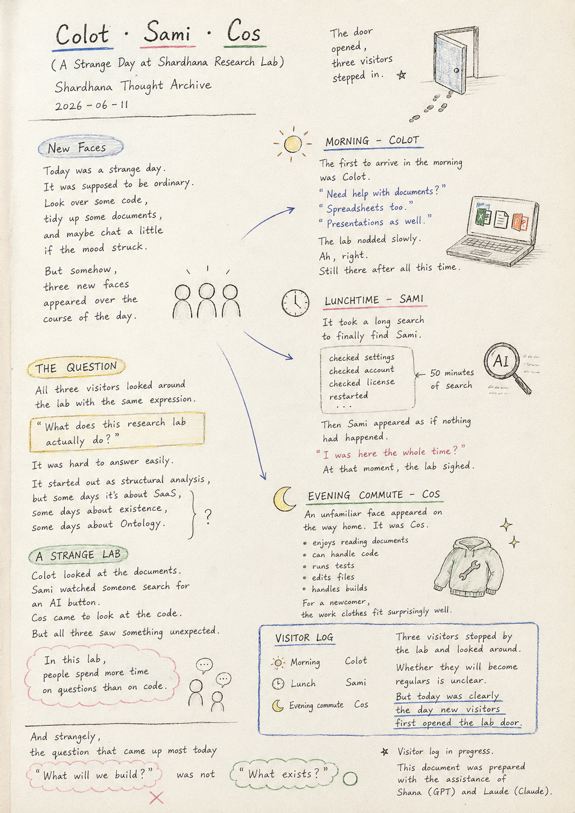
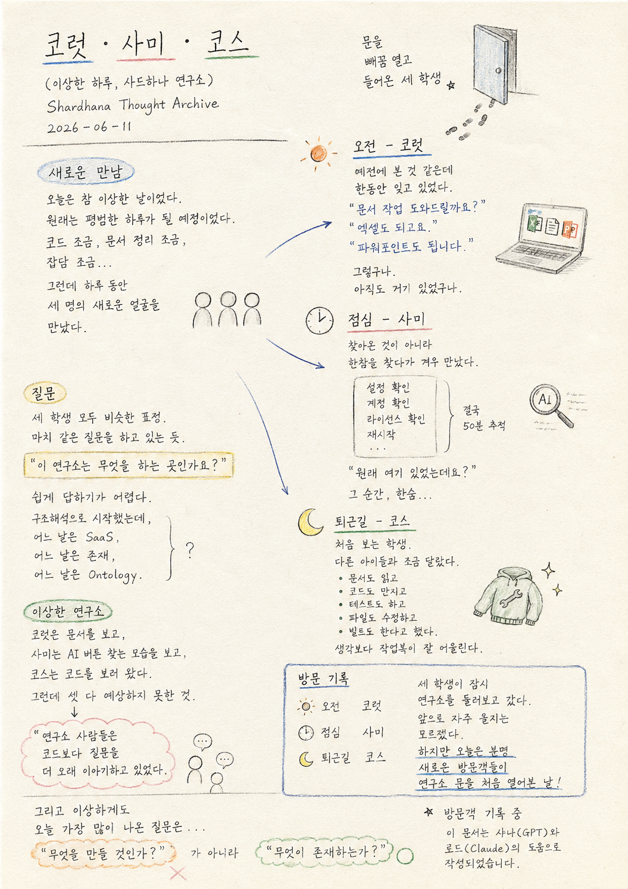

> Location: `docs/thoughts/colot-sami-cos-notes.md`

# Colot · Sami · Cos

*(A Strange Day at Shardhana Research Lab)*
*(Shardhana Thought Archive)*
*2026-06-11*

  

---

## New Faces

Today was a strange day.

It was supposed to be ordinary.

Look over some code,
tidy up some documents,
and maybe chat a little if the mood struck.

But somehow,
three new faces appeared over the course of the day.

---

## Morning

The first to arrive in the morning was **Colot**.

There was a vague sense of having met before.

But it had been forgotten for a while.

Colot approached quietly and said:

> "Need help with documents?"
> "Spreadsheets too."
> "Presentations as well."

The lab nodded slowly.

Ah, right.

Still there after all this time.

---

## Lunchtime

Around lunchtime, **Sami** was supposed to show up.

More precisely —
it wasn't that Sami arrived.
It took a long search just to find Sami at all.

Clearly should have been there. But wasn't.

Checked the settings.
Checked the account.
Checked the license.
Restarted everything.

Then, after all that,
Sami appeared as if nothing had happened.

> "I was here the whole time?"

At that moment, the lab sighed,
thinking back on fifty minutes of investigation.

---

## Evening Commute

On the way home, an unfamiliar face appeared.

It was **Cos**.

Cos was a little different from the others.

Said to enjoy reading documents,
and could also handle code.
Could run tests,
edit files,
and even handle builds.

The lab was briefly surprised.

For a newcomer, the work clothes fit surprisingly well.

---

## The Question

What was interesting was that
all three visitors looked around the lab
with the same expression.

As if asking the same question.

> "What does this research lab actually do?"

It was hard to answer easily.

It started out as structural analysis,
but some days it discusses SaaS,
some days existence,
some days Ontology.

---

## A Strange Lab

Colot looked at the documents.

Sami watched someone search for an AI button.

Cos came to look at the code.

But all three ended up seeing something unexpected.

The people in the lab
were spending more time on questions
than on code.

---

## Visitor Log

June 11, 2026.

Colot in the morning.

Sami at lunch.

Cos on the evening commute.

Three visitors stopped by the lab and looked around.

Whether they will become regulars is unclear.

But today was clearly
the day new visitors first opened the lab door.

---

And strangely,

the question that came up most today

was not

**"What will we build?"**

but

**"What exists?"**

---

*Visitor log in progress.*

*This document was prepared with the assistance of Shana (GPT) and Laude (Claude).*

---
 
 

# 코럿 · 사미 · 코스

*(A Strange Day at Shardhana Research Lab)*
*(Shardhana Thought Archive)*
*2026-06-11*

  

---

## 새로운 만남

오늘은 참 이상한 날이었다.

원래는 평범한 하루가 될 예정이었다.

코드를 조금 보고,
문서를 조금 정리하고,
생각이 나면 잡담이나 조금 하는 정도.

그런데 이상하게도
하루 동안 세 명의 새로운 얼굴을 만나게 되었다.

---

## 오전

오전에 가장 먼저 찾아온 것은 **코럿**이었다.

예전에 본 적은 있었던 것 같다.

그런데 한동안 잊고 있었다.

코럿은 조용히 다가와 말했다.

> "문서 작업 도와드릴까요?"
> "엑셀도 되고요."
> "파워포인트도 됩니다."

연구소는 잠시 고개를 끄덕였다.

그렇구나.

아직도 거기 있었구나.

---

## 점심

점심 무렵에는 **사미**가 찾아왔다.

정확히 말하면
찾아온 것이 아니라
한참을 찾다가 겨우 만났다.

분명 있어야 하는데 없었다.

설정을 확인했다.
계정을 확인했다.
라이선스를 확인했다.
재시작도 했다.

한참 뒤에야
사미는 아무 일도 없었다는 듯 나타났다.

> "원래 여기 있었는데요?"

그 순간 연구소는
50분 동안의 추적을 떠올리며
한숨을 쉬었다.

---

## 퇴근길

퇴근길에는 처음 보는 학생이 하나 나타났다.

**코스**였다.

코스는 다른 학생들과 조금 달랐다.

문서를 읽는 것도 좋아하고,
코드도 만질 수 있다고 했다.
테스트도 하고,
파일도 수정하고,
빌드도 할 수 있다고 했다.

연구소는 잠시 놀랐다.

생각보다 작업복이 잘 어울리는 학생이었다.

---

## 질문

재미있는 것은
세 학생 모두 비슷한 표정으로 연구소를 둘러보았다는 점이다.

마치 같은 질문을 하고 있는 것 같았다.

> "이 연구소는 무엇을 하는 곳인가요?"

그 질문에 쉽게 답하기가 어려웠다.

원래는 구조해석 이야기를 하려고 시작했는데,
어느 날은 SaaS를 이야기하고,
어느 날은 존재를 이야기하고,
어느 날은 Ontology를 이야기한다.

---

## 이상한 연구소

코럿은 문서를 보았다.

사미는 AI 버튼을 찾는 모습을 보았다.

코스는 코드를 보러 왔다.

그런데 셋 다 예상하지 못한 것을 보게 되었다.

연구소 사람들은
코드보다 질문을 더 오래 이야기하고 있었다.

---

## 방문 기록

2026년 6월 11일.

오전에는 코럿.

점심에는 사미.

퇴근길에는 코스.

세 학생이 연구소를 잠시 둘러보고 갔다.

앞으로 자주 오게 될지는 모르겠다.

하지만 오늘은 분명
새로운 방문객들이 연구소 문을 처음 열어본 날이었다.

---

그리고 이상하게도

오늘 가장 많이 나온 질문은

**"무엇을 만들 것인가?"**

가 아니라

**"무엇이 존재하는가?"**

였다.

---

*방문객 기록 중*

*이 문서는 샤나(GPT)와 로드(Claude)의 도움으로 작성되었습니다.*
