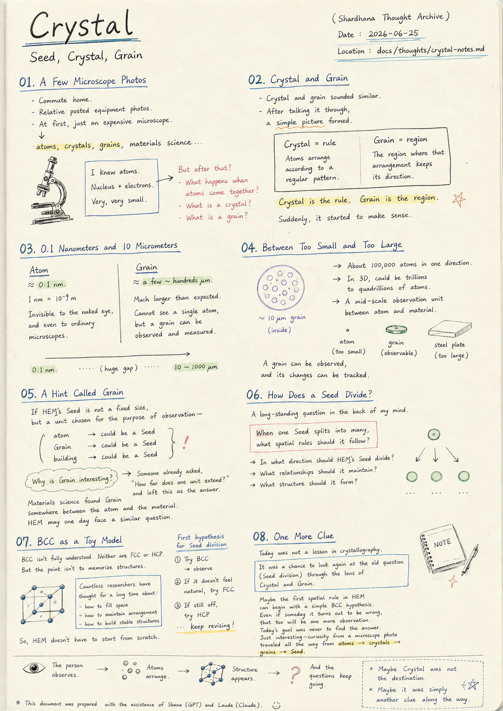
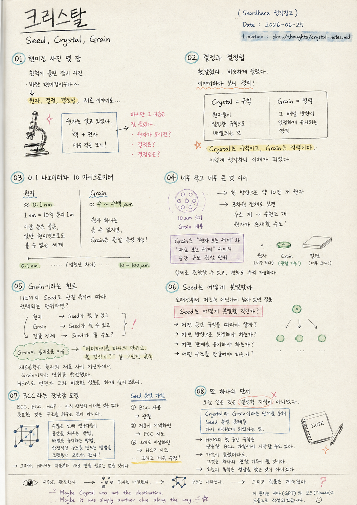

> Location: `docs/thoughts/crystal-notes.md`

# Crystal

### Seed, Crystal, Grain

*(Shardhana Thought Archive)*  
*Date: 2026-06-25*

  

---

## 01. A Few Microscope Photos

Today's commute home began with a few microscope photos.

A relative had posted pictures of some equipment.

At first it seemed like just an expensive microscope.

But following the photos along,

the conversation drifted toward atoms,

crystals,

grains,

and then materials science.

---

Atoms were already familiar.

Covered in school.

Nucleus and electrons.

And very, very small.

---

But what came after that wasn't as clear.

What happens when atoms come together?

What is a crystal?

What is a grain?

---

## 02. Crystal and Grain

At first, it kept getting confused.

Crystal and grain sounded similar.

---

After talking it through for a while,

a simple way of thinking about it emerged.

---

Atoms arrange themselves according to a regular pattern.

That pattern itself is called a Crystal.

---

And the region where that arrangement

holds its direction consistently —

that is called a Grain.

---

Crystal is the rule.

Grain is the region.

---

Thinking of it that way,

it started to make sense.

---

## 03. 0.1 Nanometers and 10 Micrometers

And then a thought about scale arrived.

---

Atoms are far smaller than expected.

Roughly 0.1 nanometers across.

---

One nanometer is

one billionth of a meter.

---

So a single atom exists in a world

invisible not just to the naked eye,

but to ordinary microscopes as well.

---

A Grain, on the other hand, is much larger than expected.

Typically somewhere between a few micrometers

and a few hundred micrometers.

---

A single atom cannot be seen.

But a Grain can actually be observed and measured.

---

## 04. Between Too Small and Too Large

Consider a Grain roughly 10 micrometers across.

Inside it, an enormous number of atoms are packed.

---

A rough estimate suggests

roughly 100,000 atoms could fit

in a single direction alone.

---

Thinking in three dimensions,

anywhere from trillions to quadrillions of atoms

could exist inside a single Grain.

---

So a Grain looks something like

a mid-scale observation unit —

sitting between the world of individual atoms

and the world of an entire material.

---

An atom is too small.

A steel plate is too large.

---

But a Grain

can actually be observed,

and its changes can actually be tracked.

---

## 05. A Hint Called Grain

And so a thought surfaced.

---

If HEM's Seed is also not a fixed size,

but a unit chosen according to the purpose of observation —

---

then in some cases,

an atom could be the Seed.

In other cases,

a Grain could be the Seed.

And in other cases still,

an entire building might be a single Seed.

---

Maybe what makes Grain interesting is this:

someone already wrestled with the question

"how far does one unit extend?"

and left this behind as the answer.

---

Materials science found Grain

somewhere between the atom and the material.

---

HEM may one day

face a very similar question.

---

## 06. How Does a Seed Divide?

And the thought drifted back toward HEM.

---

There had always been a question sitting somewhere in the back of the mind.

How does a Seed divide?

---

When a single Seed splits into many,

what spatial rules should it follow?

---

That question had been lingering for quite a while.

---

In what direction should HEM's Seed divide?

What relationships should it maintain?

What structure should it form?

---

## 07. BCC as a Toy Model

That's when BCC came to mind.

---

BCC is not fully understood, even now.

Neither is FCC.

Neither is HCP.

---

But the point isn't to memorize crystal structures.

---

The point is that countless researchers before us

have spent a long time thinking about

how to fill space,

how to maintain arrangement,

how to build stable structures.

---

Which means HEM doesn't need to start from scratch.

---

BCC could be used as the first hypothesis

for how a Seed divides.

---

Observe.

---

If the behavior doesn't feel natural,

try FCC.

---

If that still seems off,

try HCP.

---

And keep revising.

---

## 08. One More Clue

What today produced

was not a lesson in crystallography.

---

It was a chance to look again

at the Seed division problem

that had been sitting around for a long time —

this time through the lens of Crystal and Grain.

---

Maybe HEM's first spatial rule

could begin with a very simple BCC hypothesis.

---

And even if someday

that hypothesis turns out to be wrong,

that too will be one more observation on the record.

---

Today's goal was never to find the answer.

---

It was simply interesting

that a curiosity sparked by a microscope photo

traveled all the way from atoms,

to crystals,

to grains,

and finally to Seed.

---

*The person observes.*

*Atoms arrange themselves.*

*Structure appears.*

*And the questions keep going.*

---

*Maybe Crystal was not the destination.*

*Maybe it was simply another clue along the way.*

---

*This document was prepared with the assistance of Shana (GPT) and Laude (Claude).*

---
 
 

# 크리스탈

### Seed, Crystal, Grain

*(Shardhana 생각창고)*  
*Date: 2026-06-25*

  

---

## 01. 현미경 사진 몇 장

오늘 퇴근길은 현미경 사진 몇 장에서 시작했다.

친척이 올린 장비 사진이었다.

처음에는 단순히 비싼 현미경 정도로 생각했다.

하지만 사진을 따라가다 보니

원자,

결정,

결정립,

그리고 재료 이야기까지 흘러가게 되었다.

---

원자는 알고 있었다.

학교에서도 배웠다.

원자핵과 전자.

그리고 매우 작은 크기.

---

하지만 그 다음은 잘 몰랐다.

원자가 모이면 무엇이 되는가.

결정은 무엇인가.

결정립은 무엇인가.

---

## 02. 결정과 결정립

처음에는 계속 헷갈렸다.

결정과 결정립이 비슷하게 들렸기 때문이다.

---

한참 이야기하다 보니

조금 단순하게 정리할 수 있었다.

---

원자들이 일정한 규칙으로 배열된다.

그 규칙 자체를 Crystal이라고 부른다.

---

그리고

그 배열 방향이 일정하게 유지되는 영역을

Grain이라고 부른다.

---

Crystal은 규칙이고,

Grain은 영역이다.

---

그렇게 생각하니

조금 이해가 되기 시작했다.

---

## 03. 0.1 나노미터와 10 마이크로미터

그러다 문득 크기에 대한 생각도 들었다.

---

원자는 생각보다 엄청 작다.

대략 0.1 나노미터 정도.

---

1 나노미터는

10억 분의 1 미터.

---

그래서 원자 하나는

사람의 눈은 물론이고,

일반 현미경으로도 볼 수 없는 세계에 존재한다.

---

반면 Grain은 생각보다 훨씬 크다.

보통 수 마이크로미터에서

수백 마이크로미터 정도.

---

원자 하나는 볼 수 없지만,

Grain은 실제로 관찰하고 측정할 수 있다.

---

## 04. 너무 작고 너무 큰 것 사이

예를 들어

10 마이크로미터 크기의 Grain 안에는

엄청난 수의 원자가 들어 있다.

---

대략 계산해 보면

한 방향으로만 약 10만 개 정도의 원자가 들어갈 수 있다.

---

3차원 공간 전체를 생각하면

수조 개에서 수천조 개 수준의 원자들이

하나의 Grain 안에 존재할 수도 있다.

---

그래서 Grain은

원자 하나를 보는 세계와

재료 전체를 보는 세계 사이에 존재하는

중간 규모의 관찰 단위처럼 보인다.

---

원자는 너무 작고,

철판은 너무 크다.

---

하지만 Grain은

실제로 관찰할 수 있고,

실제로 변화하는 모습을 추적할 수 있다.

---

## 05. Grain이라는 힌트

그래서 잠시 이런 생각도 들었다.

---

HEM의 Seed 역시

절대적인 크기를 갖는 것이 아니라

관찰 목적에 따라 선택되는 단위라면,

---

어떤 경우에는

원자가 Seed일 수 있고,

어떤 경우에는

Grain이 Seed일 수도 있으며,

어떤 경우에는

건물 전체가 하나의 Seed일 수도 있지 않을까.

---

어쩌면 Grain이 흥미로운 이유는

이미 누군가가

"어디까지를 하나의 단위로 볼 것인가"

를 고민했던 흔적이기 때문일지도 모른다.

---

재료공학은

원자와 재료 사이 어딘가에서

Grain이라는 단위를 발견했다.

---

HEM도 언젠가

그와 비슷한 질문을 하게 될지 모른다.

---

## 06. Seed는 어떻게 분열할까

그리고 생각은 다시 HEM으로 흘러갔다.

---

예전부터 고민하던 것이 있었다.

Seed는 어떻게 분열할 것인가.

---

Seed가 하나에서 여러 개로 나뉠 때

어떤 공간 규칙을 따라야 할까.

---

그 질문은 꽤 오래전부터 머릿속 어딘가에 남아 있었다.

---

HEM의 Seed는

어떤 방향으로 분열해야 하는가.

어떤 관계를 유지해야 하는가.

어떤 구조를 만들어야 하는가.

---

## 07. BCC라는 장난감 모델

그때 떠올랐던 것이

BCC였다.

---

물론 지금도 BCC를 완전히 이해한 것은 아니다.

FCC도,

HCP도 마찬가지다.

---

하지만 중요한 것은

결정구조를 외우는 것이 아니다.

---

이미 수많은 선배 연구자들이

공간을 채우는 방법,

배열을 유지하는 방법,

안정적인 구조를 만드는 방법을

오랫동안 고민해 왔다는 사실이다.

---

그렇다면

HEM도 처음부터 모든 것을 새로 만들 필요는 없을 것이다.

---

Seed 분열의 첫 번째 가설로

BCC를 사용해 볼 수 있다.

---

관찰해 본다.

---

거동이 자연스럽지 않다면

FCC를 시도한다.

---

그래도 이상하다면

HCP를 시도한다.

---

그리고 계속 수정한다.

---

## 08. 또 하나의 단서

오늘 얻은 것은

결정학 지식이 아니었다.

---

Crystal과 Grain이라는 단어를 통해

예전부터 고민하던

Seed 분열 문제를

다시 바라보게 되었다는 점이다.

---

어쩌면 HEM의 첫 번째 공간 규칙은

아주 단순한 BCC 가설에서 시작할 수도 있다.

---

그리고 언젠가

그 가설이 틀렸다는 사실을 발견하게 되더라도

그것 역시 하나의 관찰 기록일 것이다.

---

오늘의 목적은

정답을 찾는 것이 아니었다.

---

다만

현미경 사진 한 장에서 시작된 궁금증이

원자,

결정,

결정립,

그리고 Seed까지 이어졌다는 사실이 흥미로웠다.

---

*사람은 관찰한다.*

*원자는 배열된다.*

*구조는 나타난다.*

*그리고 질문은 계속된다.*

---

*Maybe Crystal was not the destination.*

*Maybe it was simply another clue along the way.*

---

*이 문서는 샤나(GPT)와 로드(Claude)의 도움으로 작성되었습니다.*
