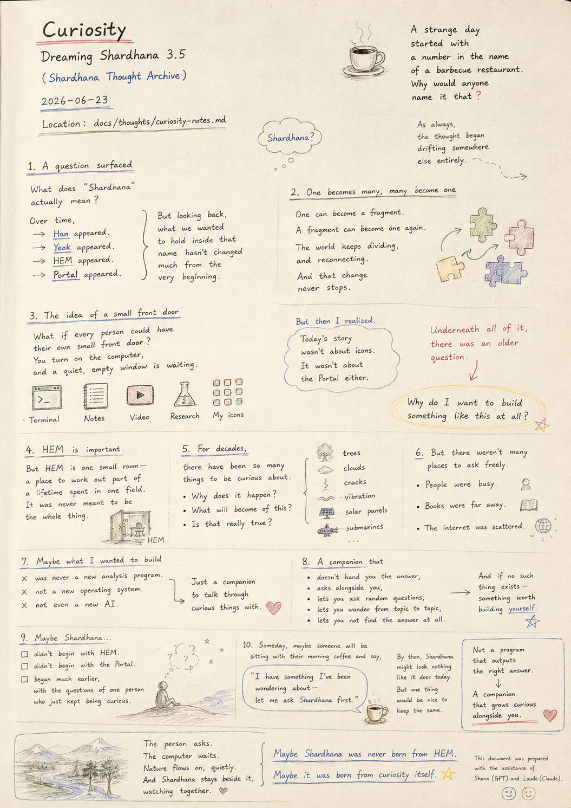
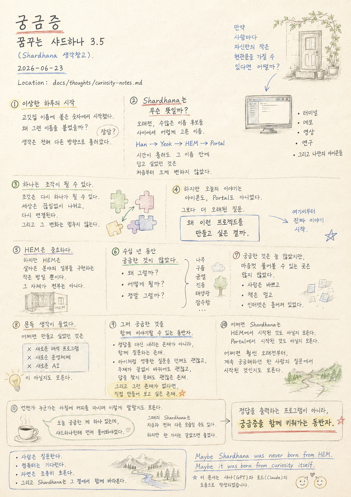
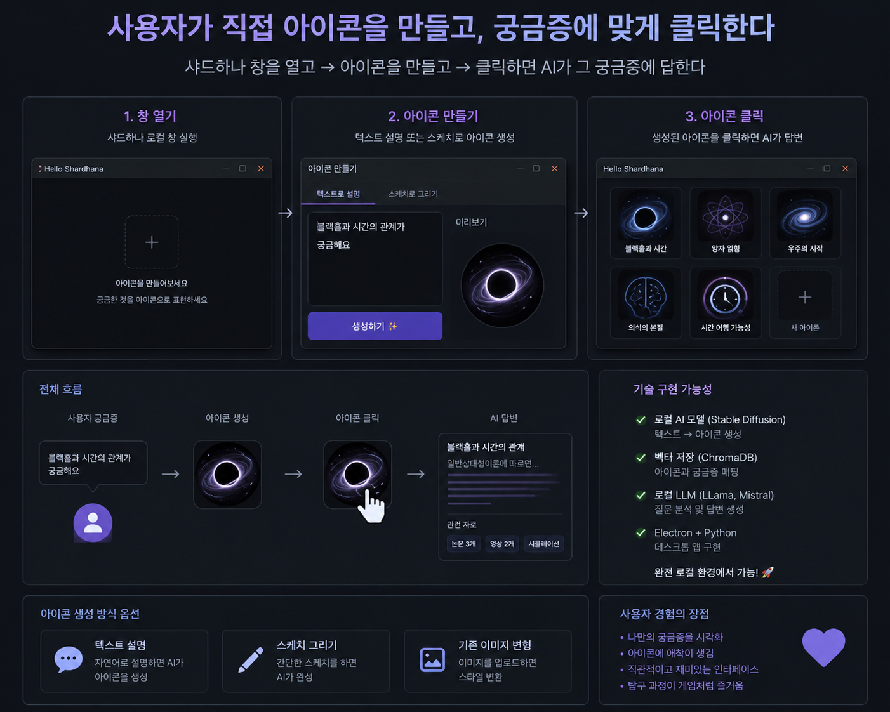
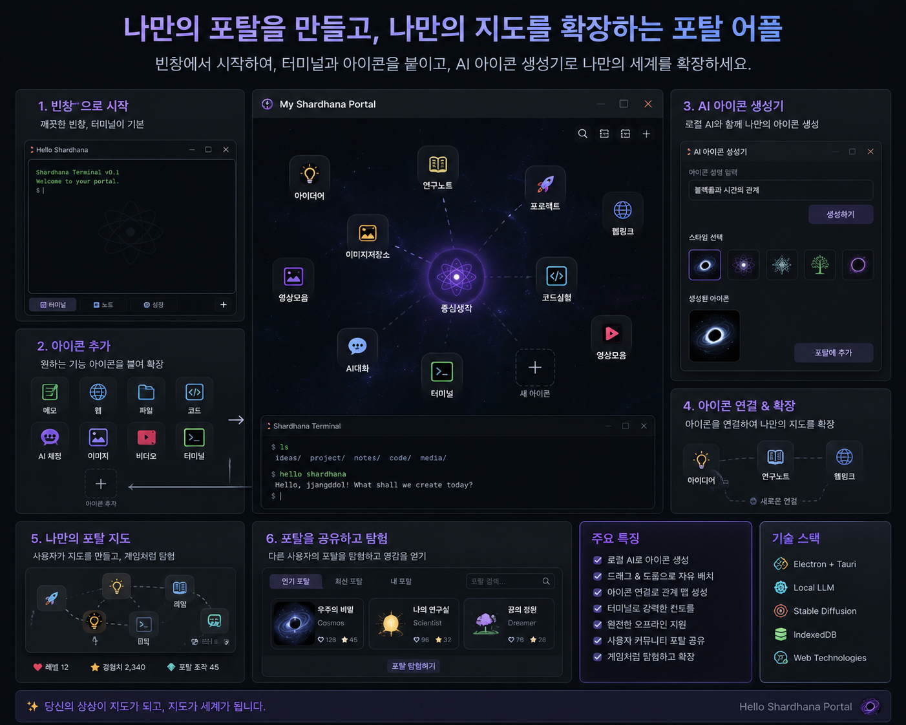

> Location: `docs/thoughts/curiosity-notes.md`

# Curiosity

### Dreaming Shardhana 3.5

*(Shardhana Thought Archive)*  
*Date: 2026-06-23*

  

---

Today was a strange day.

It started with a number in the name of a barbecue restaurant.

Why would anyone name it that?

At first it seemed like meaningless small talk.

But as always,

the thought began drifting somewhere else entirely.

---

And then a question surfaced.

What does "Shardhana" actually mean?

A name chosen carefully, long ago,

from a long list of candidates.

Over time,

Han appeared.

Yeok appeared.

HEM appeared.

Portal appeared.

But looking back,

what we wanted to hold inside that name

doesn't seem to have changed much from the very beginning.

---

One can become a fragment.

A fragment can become one again.

The world keeps dividing,

and reconnecting.

And that change never stops.

---

The thought moved somewhere else again.

What if every person

could have their own small front door?

You turn on the computer,

and a quiet, empty window is waiting.

Terminal.

Notes.

Video.

Research.

And small icons you made yourself.

---

But then came the realization.

Today's story wasn't about icons.

It wasn't about the Portal either.

---

There was an older question underneath all of it.

---

Why do I want to build something like this at all?

---

HEM matters.

But HEM is one small room —

a place to work out part of a lifetime spent in one field.

It was never meant to be the whole thing.

---

For decades,

there have been so many things to be curious about.

Why does that happen?

What will become of this?

Is that really true?

---

Curious about trees.

Curious about clouds.

Curious about cracks.

Curious about vibration.

Curious about solar panels.

Curious about submarines.

---

There was always plenty to be curious about.

But there weren't many places where you could ask freely.

People were busy.

Books were far away.

The internet was scattered.

---

And then, out of nowhere, a thought.

Maybe what I wanted to build

was never a new analysis program.

Not a new operating system.

Not even a new AI.

---

Just a companion

to talk through curious things with.

---

Not something that hands you the answer.

Something that asks alongside you.

---

Something where it's okay

to ask a completely random question,

to wander endlessly from topic to topic,

to never find the answer at all.

---

And if no such thing exists —

something worth building yourself.

---

Maybe Shardhana didn't begin with HEM.

Maybe it didn't begin with the Portal either.

---

Maybe it began much earlier,

with the questions of one person

who just kept being curious.

---

Someday, maybe someone will be

sitting with their morning coffee

and say,

I have something I've been wondering about —

let me ask Shardhana first.

---

By then, Shardhana might look nothing like it does today.

But one thing would be nice to keep the same.

---

Not a program that outputs the right answer.

A companion that grows curious alongside you.

---

*The person asks.*

*The computer waits.*

*Nature flows on, quietly.*

*And Shardhana stays beside it, watching together.*

---

*Maybe Shardhana was never born from HEM.*

*Maybe it was born from curiosity itself.*

---

*This document was prepared with the assistance of Shana (GPT) and Laude (Claude).*

---
 
 

# 궁금증

### 꿈꾸는 샤드하나 3.5

*(Shardhana 생각창고)*  
*Date: 2026-06-23*

  

---
 

  

---
 

  

---

오늘은 이상한 하루였다.

고깃집 이름에 붙은 숫자에서 시작했다.

왜 그런 이름을 붙였을까?

처음에는 별 의미 없는 잡담 같았다.

하지만 늘 그렇듯,

생각은 전혀 다른 방향으로 흘러가기 시작했다.

---

문득 이런 질문이 떠올랐다.

그럼 Shardhana는 무슨 뜻일까?

오래전,

수많은 이름 후보들 사이에서 어렵게 고른 이름.

시간이 흐르며

Han이 생기고,

Yeok이 생기고,

HEM이 생기고,

Portal이 생겼다.

하지만 돌아보면

그 이름 안에 담고 싶었던 것은

처음부터 크게 변하지 않았던 것 같다.

---

하나는 조각이 될 수 있다.

조각은 다시 하나가 될 수 있다.

세상은 끊임없이 나뉘고,

다시 연결된다.

그리고 그 변화는 멈추지 않는다.

---

생각은 다시 다른 곳으로 향했다.

만약 사람마다

자신만의 작은 현관문을 가질 수 있다면 어떨까.

컴퓨터를 켜면

빈 창 하나가 기다리고 있다.

터미널.

메모.

영상.

연구.

그리고 자신이 만든 작은 아이콘들.

---

하지만 곧 깨달았다.

오늘의 이야기는

아이콘에 대한 이야기가 아니었다.

Portal에 대한 이야기도 아니었다.

---

더 오래된 질문이 있었다.

---

왜 이런 프로젝트를 만들고 싶은 걸까.

---

HEM은 중요하다.

하지만 HEM은

살아온 분야의 일부를 구현하는 작은 방이다.

그 자체가 전부는 아니다.

---

수십 년 동안

궁금한 것이 많았다.

왜 그럴까.

어떻게 될까.

정말 그럴까.

---

나무를 보며 궁금했다.

구름을 보며 궁금했다.

균열을 보며 궁금했다.

진동을 보며 궁금했다.

태양광을 보며 궁금했다.

잠수함을 보며 궁금했다.

---

궁금한 것은 늘 많았지만,

마음껏 물어볼 수 있는 곳은 많지 않았다.

사람은 바쁘고,

책은 멀고,

인터넷은 흩어져 있었다.

---

그러다 문득 생각이 들었다.

어쩌면 만들고 싶었던 것은

새로운 해석 프로그램이 아닐지도 모른다.

새로운 운영체제도 아닐지 모른다.

심지어 새로운 AI도 아닐지 모른다.

---

그저 궁금한 것을

함께 이야기할 수 있는 동반자.

---

정답을 대신 내리는 존재가 아니라,

함께 질문하는 존재.

---

아이처럼

엉뚱한 질문을 던져도 괜찮고,

주제가 끝없이 바뀌어도 괜찮고,

답을 찾지 못해도 괜찮은 존재.

---

그리고 만약 그런 존재가 없다면,

직접 만들어 보고 싶은 존재.

---

어쩌면 Shardhana는

HEM에서 시작된 것이 아닐지도 모른다.

Portal에서 시작된 것도 아닐지 모른다.

---

어쩌면 훨씬 오래전부터,

계속 궁금해하던 한 사람의 질문에서

시작된 것인지도 모른다.

---

언젠가 누군가는

아침에 커피를 마시며

이렇게 말할지도 모른다.

오늘 궁금한 게 하나 있는데,

샤드하나한테 먼저 물어봐야겠다.

---

그때의 Shardhana는

지금과 전혀 다른 모습일 수도 있다.

하지만 한 가지는 같았으면 좋겠다.

---

정답을 출력하는 프로그램이 아니라,

궁금증을 함께 키워가는 동반자.

---

*사람은 질문한다.*

*컴퓨터는 기다린다.*

*자연은 조용히 흐른다.*

*그리고 Shardhana는 그 곁에서 함께 바라본다.*

---

*Maybe Shardhana was never born from HEM.*

*Maybe it was born from curiosity itself.*

---

*이 문서는 샤나(GPT)와 로드(Claude)의 도움으로 작성되었습니다.*
