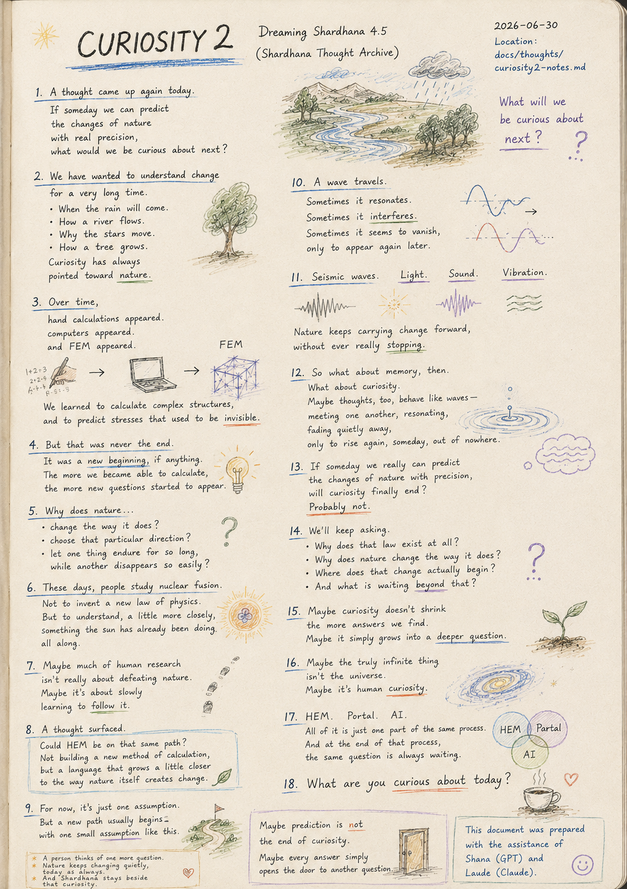
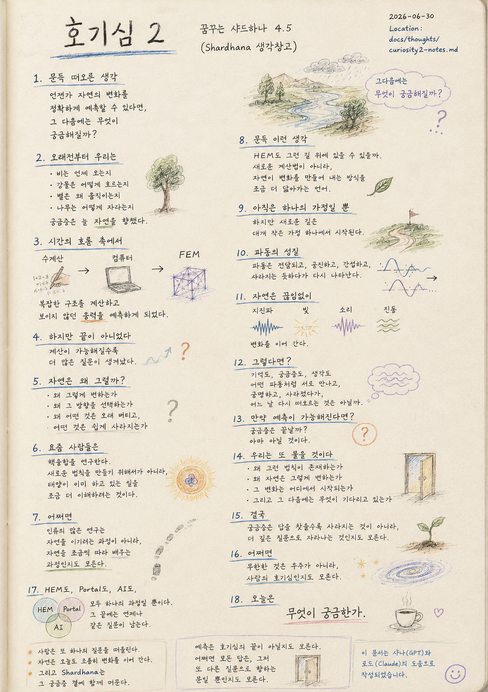

> Location: `docs/thoughts/curiosity2-notes.md`

# Curiosity 2

### Dreaming Shardhana 4.5

*(Shardhana Thought Archive)*  
*Date: 2026-06-30*

  

---

A thought came up again today.

If someday we reach an era

where we can predict the changes of nature with real precision,

what would we become curious about next?

---

We have wanted to understand change

for a very long time.

When the rain will come.

How a river flows.

Why the stars move.

How a tree grows.

Curiosity has always pointed toward nature.

---

Over time,

hand calculations appeared.

Computers appeared.

And FEM appeared.

We learned to calculate complex structures,

and to predict stresses that used to be invisible.

---

But that was never the end.

It was a new beginning, if anything.

The more we became able to calculate,

the more new questions started to appear.

---

Why does nature change the way it does.

Why does it choose that particular direction.

Why does one thing endure for so long,

while another disappears so easily.

---

These days, people study nuclear fusion.

Not to invent a new law of physics.

But to understand, a little more closely,

something the sun has already been doing all along.

---

Maybe much of human research

isn't really about defeating nature.

Maybe it's about slowly learning to follow it.

---

A thought surfaced.

Could HEM be on that same path?

Not building a new method of calculation,

but a language that grows a little closer

to the way nature itself creates change.

---

For now,

it's just one assumption.

But a new path usually begins

with one small assumption like this.

---

A wave travels.

Sometimes it resonates.

Sometimes it interferes.

Sometimes it seems to vanish,

only to appear again later.

---

Seismic waves.

Light.

Sound.

Vibration.

Nature keeps carrying change forward,

without ever really stopping.

---

So what about memory, then.

What about curiosity.

Maybe thoughts, too,

behave like waves —

meeting one another,

resonating,

fading quietly away,

only to rise again, someday, out of nowhere.

---

If someday we really can predict

the changes of nature with precision,

will curiosity finally end?

Probably not.

---

We'll keep asking.

Why does that law exist at all.

Why does nature change the way it does.

Where does that change actually begin.

And what is waiting beyond that.

---

Maybe curiosity doesn't shrink

the more answers we find.

Maybe it simply grows into a deeper question.

---

Maybe the truly infinite thing

isn't the universe.

Maybe it's human curiosity.

---

HEM.

Portal.

AI.

All of it is just one part of the same process.

And at the end of that process,

the same question is always waiting.

---

What are you curious about today?

---

*A person thinks of one more question.*

*Nature keeps changing quietly, today as always.*

*And Shardhana stays beside that curiosity.*

---

*Maybe prediction is not the end of curiosity.*

*Maybe every answer simply opens the door to another question.*

---

*This document was prepared with the assistance of Shana (GPT) and Laude (Claude).*

---
 
 

# 호기심 2

### 꿈꾸는 샤드하나 4.5

*(Shardhana 생각창고)*  
*Date: 2026-06-30*

  

---

오늘도 문득 생각이 떠올랐다.

만약 언젠가

자연의 변화를 꽤 정확하게 예측할 수 있는 시대가 온다면,

그다음에는 무엇이 궁금해질까.

---

우리는 오래전부터

변화를 이해하고 싶어 했다.

비가 언제 오는지,

강물이 어떻게 흐르는지,

별은 왜 움직이는지,

나무는 어떻게 자라는지.

궁금증은 늘 자연을 향해 있었다.

---

시간이 흐르며

수계산이 생겼다.

컴퓨터가 생겼다.

그리고 FEM이 생겼다.

복잡한 구조를 계산하고,

보이지 않던 응력을 예측할 수 있게 되었다.

---

하지만 그것은 끝이 아니었다.

오히려 새로운 시작이었다.

계산이 가능해질수록

더 많은 질문이 나타나기 시작했다.

---

자연은

왜 그렇게 변하는가.

왜 그 방향을 선택하는가.

왜 어떤 것은 오래 버티고,

어떤 것은 쉽게 사라지는가.

---

요즘 사람들은

핵융합을 연구한다.

새로운 법칙을 만들기 위해서가 아니다.

태양이 이미 하고 있는 일을

조금 더 이해하려고 하는 것이다.

---

어쩌면

인류의 많은 연구는

자연을 이기려는 과정이 아니라,

자연을 조금씩 따라 배우는 과정인지도 모른다.

---

문득 이런 생각이 들었다.

HEM도 그런 길 위에 있을 수 있을까.

새로운 계산법을 만드는 것이 아니라,

자연이 변화를 만들어 내는 방식을

조금 더 닮아가는 언어.

---

아직은

그저 하나의 가정일 뿐이다.

하지만 새로운 길은

대개 작은 가정 하나에서 시작된다.

---

파동은 전달된다.

공진하기도 하고,

간섭하기도 하고,

사라지는 듯하다가

다시 나타나기도 한다.

---

지진파도,

빛도,

소리도,

진동도,

자연은 끊임없이

변화를 이어 간다.

---

그렇다면

기억은 어떨까.

궁금증은 어떨까.

생각도

어떤 파동처럼

서로 만나고,

공명하고,

조용히 사라졌다가,

어느 날 다시 떠오르는 것은 아닐까.

---

만약 언젠가

자연의 변화를 꽤 정확하게 예측할 수 있게 된다면,

궁금증은 끝날까.

아마 아닐 것이다.

---

우리는 또 물을 것이다.

왜 그런 법칙이 존재하는가.

왜 자연은 그렇게 변하는가.

그 변화는 어디에서 시작되는가.

그리고

그 다음에는 무엇이 기다리고 있는가.

---

궁금증은

답을 찾을수록

사라지는 것이 아니라,

더 깊은 질문으로 자라나는 것인지도 모른다.

---

어쩌면

무한한 것은

우주가 아니라,

사람의 호기심인지도 모른다.

---

HEM도,

Portal도,

AI도,

모두 하나의 과정일 뿐이다.

그 끝에는

언제나 같은 질문이 남는다.

---

오늘은

무엇이 궁금한가.

---

*사람은 또 하나의 질문을 떠올린다.*

*자연은 오늘도 조용히 변화를 이어 간다.*

*그리고 Shardhana는 그 궁금증 곁에 함께 머문다.*

---

*예측은 호기심의 끝이 아닐지도 모른다.*

*어쩌면 모든 답은, 그저 또 다른 질문으로 향하는 문일 뿐인지도 모른다.*

---

*이 문서는 샤나(GPT)와 로드(Claude)의 도움으로 작성되었습니다.*
