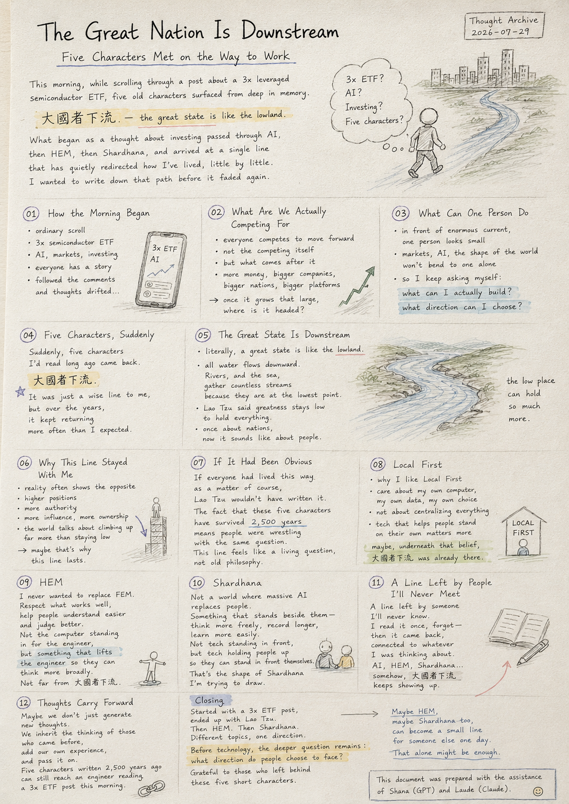
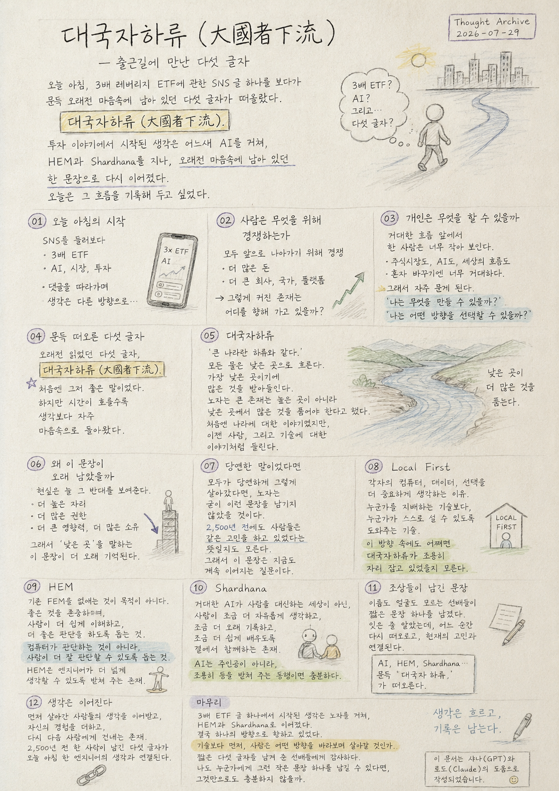

> Location: docs/thoughts/daegukjaharyu.md

# The Great Nation Is Downstream

## Five Characters Met on the Way to Work

*Category: Thought Archive · Date: 2026-07-29*

  

> This morning, scrolling past a social media post about a 3x leveraged semiconductor ETF, five old characters surfaced from somewhere deep in memory.
>
> **大國者下流 — "the great state is like the lowland."**
>
> What began as a thought about investing passed through AI, then HEM, then Shardhana, and finally arrived at a single line that has quietly redirected how I've lived, little by little, for years.
>
> I wanted to write down that path today, before it faded again.

---

# 01. How the Morning Began

It was an ordinary morning scroll.

A 3x semiconductor ETF.

AI.

Markets.

Investing.

Everyone had their own story, their own angle.

At first I read it as nothing more than a post about money.

But as I kept reading, and followed the comments down,
the thought started drifting somewhere else.

---

# 02. What Are We Actually Competing For

Stock markets do it.

The AI industry does it too.

In the end, everyone is competing to move forward.

Competition itself isn't the problem.

What struck me wasn't the competing —

it was the question of *what comes after* it.

More money.

Bigger companies.

Bigger nations.

Bigger platforms.

Once something grows that large,

where is it actually headed?

---

# 03. What Can One Person Do

I think about this sometimes.

Enormous capital.

Enormous corporations.

Enormous nations.

Standing in front of that current,

a single person looks impossibly small.

The stock market,

AI,

the shape of the world —

none of it bends to one person alone.

So more and more often I find myself asking instead:

*What can I actually build?*

*What direction can I choose?*

---

# 04. Five Characters, Suddenly

And then, out of nowhere,

five characters I'd read long ago came back.

**大國者下流.**

The first time I read that line,

I just thought it sounded wise.

But over the years,

those five characters

kept returning more often than I expected.

---

# 05. The Great State Is Downstream

Read literally, it means:

*a great state is like the lower reaches of a river.*

All water

flows downward.

Rivers,

and the sea too,

gather countless streams

precisely because they sit at the lowest point.

Lao Tzu's point was that

a truly great thing

doesn't stand at the top —

it stays low enough

to hold everything else.

He was writing about nations.

But over time,

it started sounding like it was written about people.

---

# 06. Why This Line Stayed With Me

I wonder about this sometimes.

Out of countless lines I've read,

why did these five characters

stay lodged in memory?

Probably because reality

so often shows the opposite.

Higher positions.

More authority.

Greater influence.

More ownership.

The world talks about climbing upward

far more often than it talks about staying low.

Maybe that's exactly why

a line about staying low

is the one that lasts.

---

# 07. If It Had Been Obvious

I realized something today.

If everyone had already lived this way as a matter of course,

Lao Tzu wouldn't have needed to write it down.

The fact that these five characters —

*大國者下流* —

have survived this long

might mean that even 2,500 years ago,

people were wrestling with the same question.

Which makes this line feel

not like philosophy from the past,

but like a question that's still open right now.

---

# 08. Local First

I ask myself sometimes:

why do I like Local First as a philosophy?

Why do I care more about

each person's own computer,

each person's own data,

each person's own choice —

more than I care about centralizing everything?

There are technical reasons, sure.

But I don't think that's the whole story.

Technology that helps someone stand on their own

matters more to me than technology built to control them.

And maybe, quietly, underneath that preference,

*大國者下流* was already there.

---

# 09. HEM

HEM works the same way.

I never set out to replace FEM.

What I wanted, instead,

was to respect what already works well,

while helping people understand more easily

and judge more clearly.

Not a computer standing in for the engineer,

but something that holds the engineer up

so they can think more broadly.

Looking at it now,

that direction isn't so far

from *大國者下流* either.

---

# 10. Shardhana

Shardhana is the same.

Not a world where a massive AI replaces people,

but something that stands beside them —

so people can think a little more freely,

record a little longer,

learn a little more easily.

Not technology standing in front,

but technology holding people up

so they can stand in front themselves.

That's the shape of Shardhana

I keep trying to draw.

---

# 11. A Line Left by People I'll Never Meet

I realized this morning

that part of how I see the world

was never something I built myself.

Someone I'll never know by name or face

left behind a short line.

I read it once, thought I'd forgotten it,

and then, at some point while living my life,

it came back on its own —

and connected itself to whatever I happened to be wrestling with.

Thinking about AI.

Thinking about HEM.

Thinking about Shardhana.

Somehow, *大國者下流*

keeps showing up.

---

# 12. Thoughts Carry Forward

Maybe people aren't creatures who only generate new thoughts.

Maybe we inherit the thinking of those who came before us,

add our own experience to it,

and pass it on to whoever comes next.

That's how five characters, written 2,500 years ago,

could still reach

an engineer reading a post about a 3x ETF

this morning.

---

# Closing

Today I read a post about a 3x ETF,

and somehow ended up thinking about Lao Tzu.

And from there, HEM.

And from there, Shardhana.

The thread seems to wander across entirely unrelated topics,

but looking back,

it was heading in one direction the whole time.

Before technology, there's a prior question:

what direction do people choose to face?

That question existed long before now,

and it's still here.

Today, again, I find myself quietly grateful

to the people who came before me

and left behind five short characters.

Maybe HEM,

and maybe Shardhana too,

could someday be a small line like that for someone else.

That alone might be enough.

---

This document was prepared with the assistance of Shana (GPT) and Laude (Claude).

---
 
 

# 대국자하류

## 출근길에 만난 다섯 글자

*Category: Thought Archive · Date: 2026-07-29*

  

> 오늘 아침, 3배 레버리지 ETF에 관한 SNS 글 하나를 보다가 문득 오래전 마음속에 남아 있던 다섯 글자가 떠올랐다.
>
> **대국자하류(大國者下流).**
>
> 투자 이야기에서 시작된 생각은 AI를 거쳐, HEM과 Shardhana, 그리고 지금까지 살아오며 삶의 방향을 조금씩 바꾸어 온 한 문장으로 이어졌다.
>
> 오늘은 그 흐름을 기록해 두고 싶었다.

---

# 01. 오늘 아침의 시작

오늘 아침은 평범하게 SNS를 둘러보고 있었다.

반도체 3배 ETF.

AI.

시장.

투자.

사람들은 저마다 자신의 경험과 생각을 이야기하고 있었다.

나 역시 처음에는 단순히 투자에 관한 글이라고 생각했다.

하지만 글을 읽고 댓글을 따라가다 보니,
생각은 점점 다른 방향으로 흘러가기 시작했다.

---

# 02. 사람은 무엇을 위해 경쟁하는가

주식시장도 그렇고,

AI 산업도 그렇고,

결국 모두 앞으로 나아가기 위해 경쟁한다.

경쟁 자체가 잘못된 것은 아니다.

문득 떠오른 것은

'경쟁'보다

'경쟁 이후의 방향'이었다.

더 많은 돈.

더 큰 회사.

더 큰 국가.

더 큰 플랫폼.

그렇게 커진 존재는

어디를 향해 가고 있을까.

---

# 03. 개인은 무엇을 할 수 있을까

가끔은 이런 생각도 한다.

거대한 자본.

거대한 기업.

거대한 국가.

그 흐름 앞에서

한 사람은 너무 작아 보인다.

주식시장도,

AI도,

세상의 흐름도,

혼자 바꾸기에는 너무 거대하다.

그래서 더 자주

'나는 무엇을 만들 수 있을까.'

'나는 어떤 방향을 선택할 수 있을까.'

를 생각하게 된다.

---

# 04. 문득 떠오른 다섯 글자

그러다 갑자기

오래전 읽었던 다섯 글자가 떠올랐다.

**대국자하류(大國者下流).**

처음 이 문장을 읽었을 때는

그저 좋은 말이라고만 생각했다.

하지만 시간이 흐를수록

이 다섯 글자는

생각보다 자주 마음속으로 돌아왔다.

---

# 05. 대국자하류

직역하면

'큰 나라란 하류와 같다.'

라는 뜻이다.

모든 물은

낮은 곳으로 흐른다.

강도,

바다도,

가장 낮은 곳에 있기 때문에

수많은 물을 받아들인다.

노자는

큰 존재는

높은 곳에 서는 것이 아니라

낮은 곳에서

많은 것을 품을 수 있어야 한다고 이야기했다.

나라에 대한 이야기였지만,

시간이 지나면서

사람에 대한 이야기처럼 들리기 시작했다.

---

# 06. 왜 이 문장이 오래 남았을까

문득 생각해 본다.

왜 수많은 문장 가운데

이 다섯 글자만은

계속 기억 속에 남아 있었을까.

아마도 현실은

그 반대 모습을 너무 자주 보여 주기 때문일 것이다.

더 높은 자리.

더 많은 권한.

더 큰 영향력.

더 많은 소유.

세상은

위로 올라가는 방향을 이야기하는 경우가 훨씬 많다.

그래서

낮은 곳을 이야기하는 문장이

더 오래 기억되는 것인지도 모른다.

---

# 07. 당연한 말이었다면

오늘 문득 깨달았다.

만약 모두가

당연하게 그렇게 살아갔다면

노자는

굳이 이런 문장을 남기지 않았을 것이다.

'대국자하류.'

라는 다섯 글자가

지금까지 전해졌다는 것은

이미 2,500년 전에도

사람들은 같은 고민을 하고 있었다는 뜻일지도 모른다.

그래서

이 문장은

과거의 철학이 아니라

지금도 계속 이어지는 질문처럼 느껴진다.

---

# 08. Local First

가끔은 스스로에게 묻는다.

왜 나는

Local First라는 철학을 좋아할까.

왜 중앙집중보다

각자의 컴퓨터,

각자의 데이터,

각자의 선택을 더 중요하게 생각할까.

기술적인 이유도 분명 있다.

하지만 그것만은 아닌 것 같다.

누군가를 지배하는 기술보다,

누군가가 스스로 설 수 있도록 도와주는 기술.

그런 방향을 좋아하게 된 이유 속에도

어쩌면

대국자하류가

조용히 자리 잡고 있었는지도 모른다.

---

# 09. HEM

HEM도 비슷하다.

처음부터

기존 FEM을 없애자는 생각은 한 적이 없다.

오히려

기존의 좋은 것을 존중하면서

사람이 더 쉽게 이해하고,

더 좋은 판단을 할 수 있도록

조금 더 도와주는 방향을 꿈꾸었다.

컴퓨터가

엔지니어를 대신하는 것이 아니라,

엔지니어가

더 넓게 생각할 수 있도록

받쳐 주는 존재.

지금 생각해 보면

이 방향 역시

대국자하류와

완전히 멀리 떨어져 있지는 않은 것 같다.

---

# 10. Shardhana

Shardhana 역시 마찬가지다.

거대한 AI가

사람을 대신하는 세상을 꿈꾸기보다,

사람이

조금 더 자유롭게 생각하고,

조금 더 오래 기록하고,

조금 더 쉽게 배우도록

곁에서 함께하는 존재.

기술이 앞에 서는 것이 아니라,

사람이 앞에 설 수 있도록

뒤에서 받쳐 주는 존재.

이런 모습이

내가 그리고 있는 Shardhana의 모습이다.

---

# 11. 조상들이 남긴 문장

오늘 아침 문득 깨달았다.

내가 세상을 바라보는 기준 가운데 일부는

내가 만든 것이 아니었다.

이름도 얼굴도 모르는 선배들이

짧은 문장 하나를 남겨 두었다.

그 문장을 읽고,

잊어버린 줄 알았는데,

살아가면서

어느 순간 다시 떠오른다.

그리고

현재의 고민과 연결된다.

AI를 생각할 때도,

HEM을 생각할 때도,

Shardhana를 생각할 때도,

문득

'대국자하류.'

가 떠오른다.

---

# 12. 생각은 이어진다

어쩌면 사람은

새로운 생각만 만들며 살아가는 존재가 아닐지도 모른다.

먼저 살아간 사람들의 생각을 이어받고,

자신의 경험을 더하고,

다시 다음 사람에게 건네는 존재인지도 모른다.

그래서

2,500년 전

한 사람이 남긴 다섯 글자가

오늘 아침

3배 ETF 글을 읽던 한 엔지니어의 생각과도 연결될 수 있는 것이다.

---

# 마무리

오늘은

3배 ETF에 관한 글 하나를 보다가

노자를 떠올렸다.

그리고

HEM을 떠올렸고,

Shardhana를 떠올렸다.

생각은 전혀 다른 주제로 흘러간 것 같지만,

돌아보면

하나의 방향으로 이어져 있었다.

기술보다 먼저

사람은 어떤 방향을 바라보며 살아갈 것인가.

그 질문은

아주 오래전에도 있었고,

지금도 여전히 남아 있다.

오늘도

짧은 다섯 글자를 남겨 준

먼저 살아간 선배들에게

조용히 감사한 마음이 든다.

어쩌면

HEM도,

Shardhana도,

누군가에게 그런 작은 문장 하나가 될 수 있다면,

그것만으로도 충분하지 않을까.

---

이 문서는 샤나(GPT)와 로드(Claude)의 도움으로 작성되었습니다.
