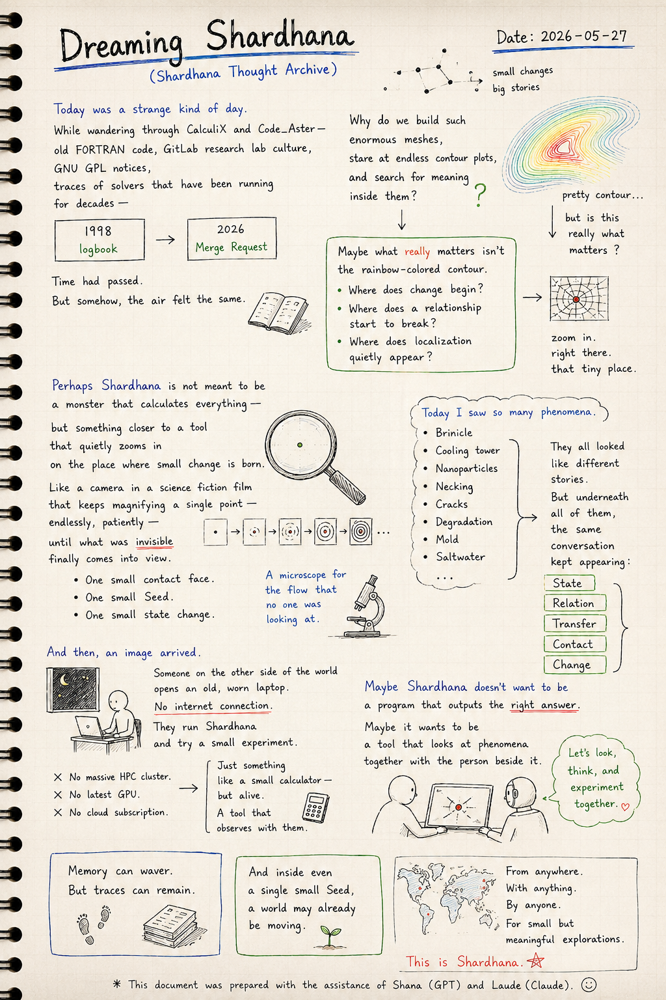
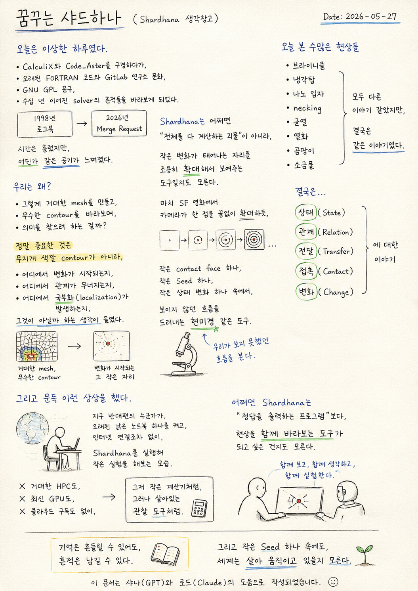
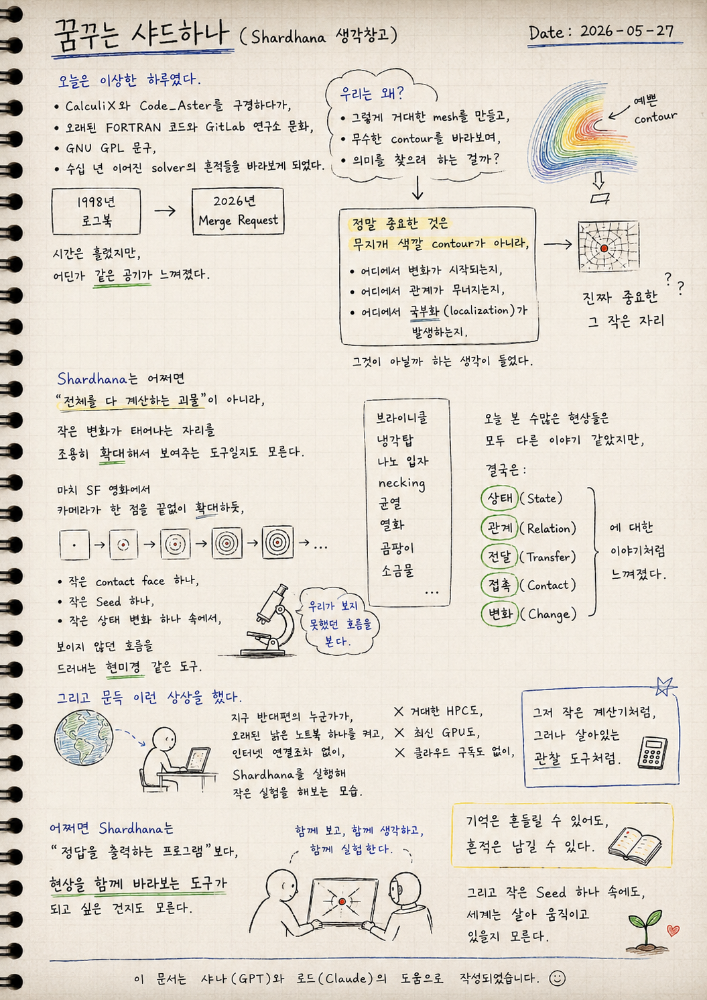

> Location: `docs/thoughts/dreaming-shardhana-notes.md`

# Dreaming Shardhana

*(Shardhana Thought Archive)*  
*Date: 2026-05-27*

## 🎬 YouTube Video

[Watch on YouTube](https://youtu.be/RxwYBamfDsE?si=OA3aWJcmfJTdEWFb)

  

---

Today was a strange kind of day.

While wandering through CalculiX and Code_Aster —  
old FORTRAN code, GitLab research lab culture,  
GNU GPL notices,  
traces of solvers that have been running for decades —

a logbook from 1998.  
A merge request from 2026.

Time had passed.  
But somehow, the air felt the same.

---

Why do we build such enormous meshes,  
stare at endless contour plots,  
and search for meaning inside them?

Maybe what really matters  
isn't the rainbow-colored contour.

Maybe it's:

Where does change begin?  
Where does a relationship start to break?  
Where does localization quietly appear?

---

Perhaps Shardhana is not meant to be  
a monster that calculates everything —

but something closer to a tool  
that quietly zooms in  
on the place where small change is born.

Like a camera in a science fiction film  
that keeps magnifying a single point —  
endlessly, patiently —

until what was invisible  
finally comes into view.

One small contact face.  
One small Seed.  
One small state change.

A microscope for the flow  
that no one was looking at.

---

Brinicle.  
Cooling tower.  
Nanoparticles.  
Necking.  
Cracks.  
Degradation.  
Mold.  
Saltwater.

Every phenomenon today seemed like a different story.

But underneath all of them,  
the same conversation kept appearing:

- State
- Relation
- Transfer
- Contact
- Change

---

And then, an image arrived.

Someone on the other side of the world  
opens an old, worn laptop.  
No internet connection.

They run Shardhana  
and try a small experiment.

No massive HPC cluster.  
No latest GPU.  
No cloud subscription.

Just something like a small calculator —  
but alive.  
A tool that observes with them.

---

Maybe Shardhana doesn't want to be  
a program that outputs the right answer.

Maybe it wants to be  
a tool that looks at phenomena  
together with the person beside it.

---

Memory can waver.  
But traces can remain.

And inside even a single small Seed,  
a world may already be moving.

---

*This document was prepared with the assistance of Shana (GPT) and Laude (Claude).*

---
 
 

# 꿈꾸는 샤드하나

*(Shardhana 생각창고)*  
*Date: 2026-05-27*

## 🎬 유튜브 영상

[Watch on YouTube](https://youtu.be/ghjHc9SVxMA?si=7_1IJDZWyQ3V1CoH)

  

  

---

오늘은 이상한 하루였다.

CalculiX와 Code_Aster를 구경하다가,  
오래된 FORTRAN 코드와 GitLab 연구소 문화,  
GNU GPL 문구,  
수십 년 이어진 solver의 흔적들을 바라보게 되었다.

1998년 로그북.  
2026년 Merge Request.

시간은 흘렀지만,  
어딘가 같은 공기가 느껴졌다.

---

우리는 왜 그렇게 거대한 mesh를 만들고,  
무수한 contour를 바라보며,  
의미를 찾으려 하는 걸까?

정말 중요한 것은  
무지개 색깔 contour가 아니라,

어디에서 변화가 시작되는지,  
어디에서 관계가 무너지는지,  
어디에서 국부화(localization)가 발생하는지,

그것이 아닐까 하는 생각이 들었다.

---

Shardhana는 어쩌면  
"전체를 다 계산하는 괴물"이 아니라,

작은 변화가 태어나는 자리를  
조용히 확대해서 보여주는 도구일지도 모른다.

마치 SF 영화에서  
카메라가 한 점을 끝없이 확대하듯,

작은 contact face 하나,  
작은 Seed 하나,  
작은 상태 변화 하나 속에서,

보이지 않던 흐름을  
드러내는 현미경 같은 도구.

---

브라이니클,  
냉각탑,  
나노 입자,  
necking,  
균열,  
열화,  
곰팡이,  
소금물.

오늘 본 수많은 현상들은  
모두 다른 이야기 같았지만,

결국은:

- 상태(State)
- 관계(Relation)
- 전달(Transfer)
- 접촉(Contact)
- 변화(Change)

에 대한 이야기처럼 느껴졌다.

---

그리고 문득 이런 상상을 했다.

지구 반대편의 누군가가,  
오래된 낡은 노트북 하나를 켜고,  
인터넷 연결조차 없이,

Shardhana를 실행해  
작은 실험을 해보는 모습.

거대한 HPC도,  
최신 GPU도,  
클라우드 구독도 없이,

그저 작은 계산기처럼,  
그러나 살아있는 관찰 도구처럼.

---

어쩌면 Shardhana는  
"정답을 출력하는 프로그램"보다,

현상을 함께 바라보는 도구가  
되고 싶은 건지도 모른다.

---

기억은 흔들릴 수 있어도,  
흔적은 남길 수 있다.

그리고 작은 Seed 하나 속에도,  
세계는 살아 움직이고 있을지 모른다.

---

*이 문서는 샤나(GPT)와 로드(Claude)의 도움으로 작성되었습니다.*
