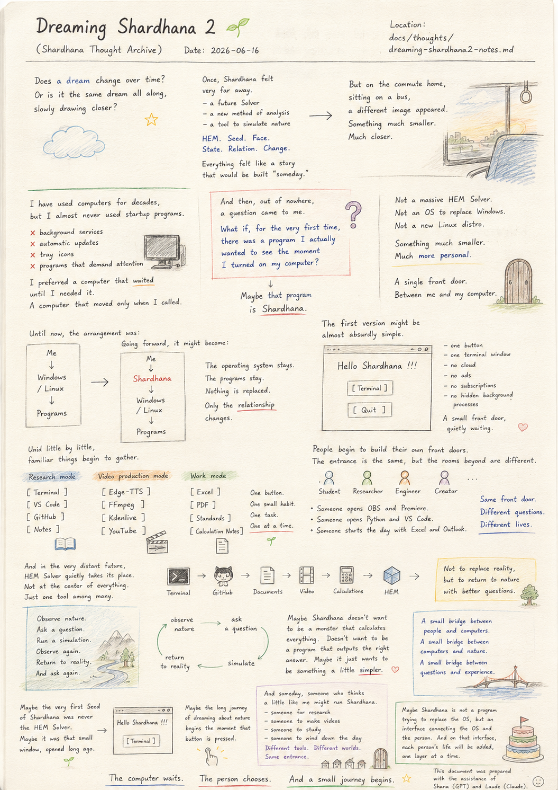
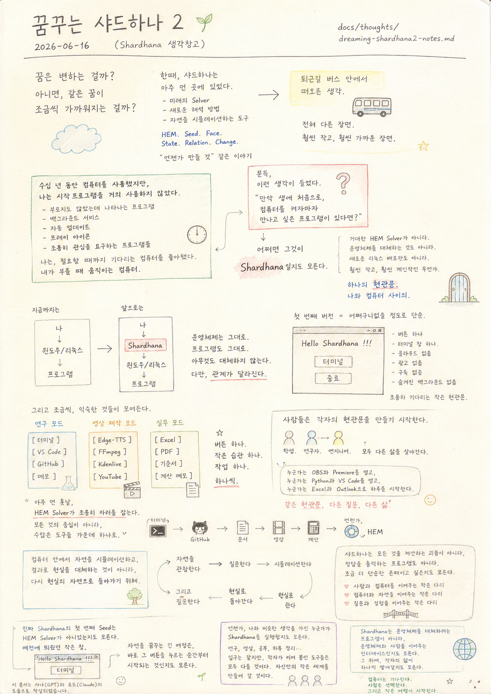

> Location: `docs/thoughts/dreaming-shardhana2-notes.md`

# Dreaming Shardhana 2

*(Shardhana Thought Archive)*  
*Date: 2026-06-16*

## 🎬 YouTube Video

[Watch on YouTube](https://youtu.be/kuVgNjLV0Ng)

<p align="center">
  
</p>

---

Does a dream change over time?

Or is it the same dream all along,

slowly drawing closer?

---

Once, Shardhana felt very far away.

A future Solver.

A new method of analysis.

A tool that would someday simulate nature.

HEM.

Seed.

Face.

State.

Relation.

Change.

Everything felt like a story

that would be built "someday."

---

But on the commute home, sitting on a bus,

a completely different image came to mind.

Something much smaller.

Much closer.

---

I have used computers for decades,

but I almost never used startup programs.

I didn't like programs that appeared without being called.

Background services.

Automatic updates.

Tray icons.

Programs that quietly demanded attention.

I preferred a computer that waited

until I needed it.

A computer that moved only when I called.

---

And then, out of nowhere,

a question came to me.

> What if, for the very first time in my life,
>
> there were a program I actually wanted to see
> the moment I turned on my computer?

---

Maybe that program

is Shardhana.

---

Not a massive HEM Solver.

Not an operating system to replace Windows.

Not a new Linux distribution.

Something much smaller.

Much more personal.

---

A single front door.

Between me and my computer.

---

Until now, the arrangement was:

```
Me
↓
Windows / Linux
↓
Programs
```

Going forward, it might become:

```
Me
↓
Shardhana
↓
Windows / Linux
↓
Programs
```

---

The operating system stays.

The programs stay.

Nothing is replaced.

Only the relationship changes.

---

The first version

might be almost absurdly simple.

```
Hello Shardhana !!!

[ Terminal ]

[ Quit ]
```

That's it.

---

One button.

One terminal window.

No cloud.

No ads.

No subscriptions.

No hidden background processes.

A small front door, quietly waiting.

---

And little by little,

familiar things begin to gather.

---

Research mode.

```
[ Terminal ]
[ VS Code ]
[ GitHub ]
[ Notes ]
```

---

Video production mode.

```
[ Edge-TTS ]
[ FFmpeg ]
[ Kdenlive ]
[ YouTube ]
```

---

Work mode.

```
[ Excel ]
[ PDF ]
[ Standards ]
[ Calculation Notes ]
```

---

One button.

One small habit.

One task.

One at a time.

---

And then people begin to build

their own front doors.

The entrance is the same,

but the rooms beyond are different.

Students.

Researchers.

Engineers.

Creators.

Each living a different life.

---

Someone opens OBS and Premiere.

Someone opens Python and VS Code.

Someone starts their day

with Excel and Outlook.

---

Same front door.

Different questions.

Different lives.

---

And then, in the very distant future,

HEM Solver quietly takes its place.

Not at the center of everything.

Just one tool among many.

---

Terminal.

GitHub.

Documents.

Video.

Calculations.

And someday,

HEM.

---

Not to simulate nature inside a computer

and replace reality with the result —

but to return to the natural world,

having looked a little more carefully.

---

Observe nature.

Ask a question.

Run a simulation.

Observe again.

Return to reality.

And ask again.

---

Maybe Shardhana doesn't want to be

a monster that calculates everything.

Doesn't want to be

a program that outputs the right answer.

Maybe it just wants to be

something a little simpler.

---

A small bridge between people and computers.

A small bridge between computers and nature.

A small bridge between questions and experience.

---

Maybe the very first Seed of Shardhana

was never the HEM Solver.

Maybe it was that small window,

opened long ago.

> Hello Shardhana !!!

And the small button inside it.

> **[ Terminal ]**

Maybe the long journey of dreaming about nature

begins the moment that button is pressed.

---

And someday,

someone who thinks a little like me

might run Shardhana.

Someone for research.

Someone to make videos.

Someone to study.

Someone to wind down the day.

The entrance is the same,

but the tools each person attaches will all be different.

They will build their own small worlds,

in their own way, at their own pace.

---

Maybe Shardhana is not a program

trying to replace the operating system,

but an interface

connecting the operating system and the person.

And on that interface,

each person's life

will be added, one layer at a time.

---

*The computer waits.*

*The person chooses.*

*And a small journey begins.*

---

*This document was prepared with the assistance of Shana (GPT) and Laude (Claude).*

---
<br>
<br>

# 꿈꾸는 샤드하나 2

*(Shardhana 생각창고)*  
*Date: 2026-06-16*

## 🎬 유튜브 영상

[Watch on YouTube](https://youtu.be/VWZB2Uj-eX8)

<p align="center">
  
</p>

---

꿈은 변하는 걸까.

아니면,

원래 같은 꿈이
조금씩 가까워지는 걸까.

---

한때 Shardhana는 아주 먼 곳에 있었다.

미래의 Solver.

새로운 해석 방법.

언젠가 자연을 시뮬레이션하는 도구.

HEM.

Seed.

Face.

State.

Relation.

Change.

모든 것이

"언젠가 만들 것" 같은 이야기였다.

---

그런데 퇴근길 버스 안에서,

전혀 다른 장면이 떠올랐다.

훨씬 작고,

훨씬 가까운 장면.

---

나는 수십 년 동안 컴퓨터를 사용했지만,

시작프로그램을 거의 사용하지 않았다.

부르지도 않았는데 나타나는 프로그램을 좋아하지 않았다.

백그라운드 서비스.

자동 업데이트.

트레이 아이콘.

조용히 관심을 요구하는 프로그램들.

나는,

필요할 때까지 기다리는 컴퓨터를 좋아했다.

내가 부를 때 움직이는 컴퓨터.

---

그런데 문득,

이런 생각이 들었다.

> 만약 생애 처음으로,
>
> 컴퓨터를 켜자마자 만나고 싶은 프로그램이 있다면?

---

어쩌면 그것이

Shardhana일지도 모른다.

---

거대한 HEM Solver가 아니라.

윈도우를 대체하는 운영체제가 아니라.

새로운 리눅스 배포판도 아니라.

훨씬 작고,

훨씬 개인적인 무언가.

---

하나의 현관문.

나와 컴퓨터 사이의.

---

지금까지는,

```
나
↓
윈도우 / 리눅스
↓
프로그램
```

이었다면,

앞으로는,

```
나
↓
Shardhana
↓
윈도우 / 리눅스
↓
프로그램
```

이 될 수도 있다.

---

운영체제는 그대로 있다.

프로그램도 그대로 있다.

아무것도 대체하지 않는다.

다만,

관계가 달라진다.

---

첫 번째 버전은

어처구니없을 정도로 단순할지도 모른다.

```
Hello Shardhana !!!

[ 터미널 ]

[ 종료 ]
```

끝.

---

버튼 하나.

터미널 창 하나.

클라우드 없음.

광고 없음.

구독 없음.

숨겨진 백그라운드 없음.

조용히 기다리는 작은 현관문.

---

그리고 조금씩,

익숙한 것들이 모여든다.

---

연구 모드.

```
[ 터미널 ]
[ VS Code ]
[ GitHub ]
[ 메모 ]
```

---

영상 제작 모드.

```
[ Edge-TTS ]
[ FFmpeg ]
[ Kdenlive ]
[ YouTube ]
```

---

실무 모드.

```
[ Excel ]
[ PDF ]
[ 기준서 ]
[ 계산 메모 ]
```

---

버튼 하나.

작은 습관 하나.

작업 하나.

하나씩.

---

그리고 사람들은

각자의 현관문을 만들기 시작한다.

입구는 같지만,

그 이후의 방은 다르다.

학생.

연구자.

엔지니어.

창작자.

모두 다른 삶을 살아간다.

---

누군가는

OBS와 Premiere를 열고,

누군가는

Python과 VS Code를 열고,

누군가는

Excel과 Outlook으로 하루를 시작한다.

---

같은 현관문.

다른 질문.

다른 삶.

---

그리고 아주 먼 훗날,

HEM Solver가 조용히 자리를 잡는다.

모든 것의 중심이 아니라,

수많은 도구들 가운데 하나로.

---

터미널.

GitHub.

문서.

영상.

계산.

그리고 언젠가,

HEM.

---

컴퓨터 안에서 자연을 시뮬레이션하고,

그 결과로 현실을 대체하는 것이 아니라,

다시 현실의 자연으로 돌아가기 위해.

---

자연을 관찰한다.

질문한다.

시뮬레이션한다.

다시 관찰한다.

현실로 돌아간다.

그리고 또 질문한다.

---

어쩌면 Shardhana는

모든 것을 계산하는 괴물이 되고 싶은 것이 아니라,

정답을 출력하는 프로그램이 되고 싶은 것도 아니라,

조금 더 단순한 존재가 되고 싶은 것인지 모른다.

---

사람과 컴퓨터를 이어주는 작은 다리.

컴퓨터와 자연을 이어주는 작은 다리.

질문과 경험을 이어주는 작은 다리.

---

어쩌면 진짜 Shardhana의 첫 번째 Seed는

HEM Solver가 아니었는지도 모른다.

예전에 띄웠던 작은 창.

> Hello Shardhana !!!

그리고 그 안에 있던 작은 버튼 하나.

> **[ 터미널 ]**

어쩌면 자연을 꿈꾸는 긴 여정은,

바로 그 버튼을 누르는 순간부터 시작되는 것인지도 모른다.

---

그리고 언젠가,

나와 비슷한 생각을 가진 누군가가

Shardhana를 실행할지도 모른다.

누군가는 연구를 위해,

누군가는 영상을 만들기 위해,

누군가는 공부를 위해,

누군가는 하루를 정리하기 위해.

입구는 같지만,

각자가 이어 붙인 도구들은 모두 다를 것이다.

그들은 자신의 취향대로,

자신만의 작은 세계를 만들어 갈 것이다.

---

어쩌면 Shardhana는

운영체제를 대체하려는 프로그램이 아니라,

운영체제와 사람을 이어주는 인터페이스인지도 모른다.

그리고 그 인터페이스 위에,

각자의 삶이 하나씩 쌓여갈지도 모른다.

---

*컴퓨터는 기다린다.*

*사람은 선택한다.*

*그리고 작은 여행이 시작된다.*

---

*이 문서는 샤나(GPT)와 로드(Claude)의 도움으로 작성되었습니다.*
