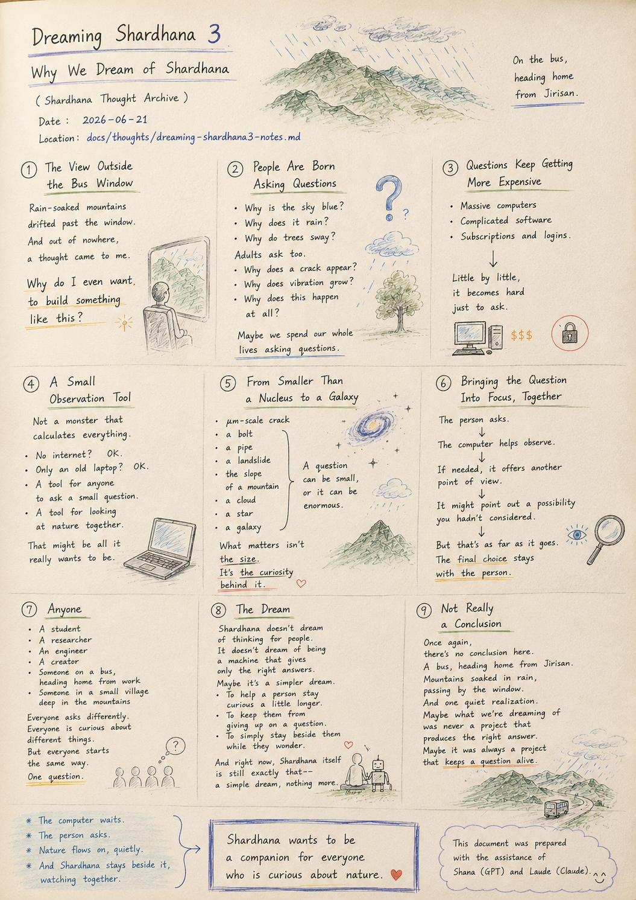
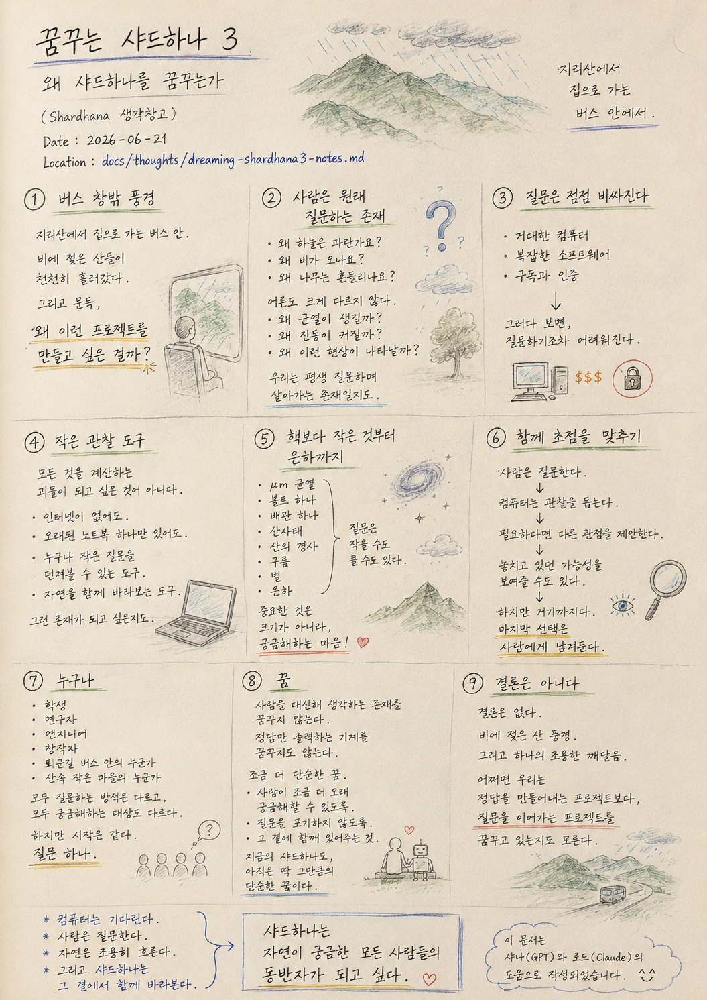

> Location: `docs/thoughts/dreaming-shardhana3-notes.md`

# Dreaming Shardhana 3

### Why We Dream of Shardhana

*(Shardhana Thought Archive)*  
*Date: 2026-06-21*

  

---

## 1. The View Outside the Bus Window

On the bus, heading home from Jirisan.

Mountains, soaked with rain, drifted slowly past the window.

And out of nowhere,

a thought came to me.

Why do I even want to build something like this?

---

## 2. People Are Born Asking Questions

Children ask.

Why is the sky blue?

Why does it rain?

Why do trees sway?

Adults aren't so different.

Why does a crack appear?

Why does vibration grow?

Why does this happen at all?

Maybe we spend our whole lives asking questions, one after another.

---

## 3. Questions Keep Getting More Expensive

Some questions

need a massive computer.

Some questions

need complicated software.

Some questions

demand a subscription and a login.

And little by little,

it becomes hard just to ask.

---

## 4. A Small Observation Tool

Shardhana doesn't want to be

a monster that calculates everything.

Even without an internet connection.

Even with nothing but an old laptop.

A tool that lets anyone ask a small question.

A tool for looking at nature together.

That might be all it really wants to be.

---

## 5. From Smaller Than a Nucleus to a Galaxy

A μm-scale crack.

A single bolt.

A single pipe.

A landslide.

The slope of a mountain.

A cloud.

A star.

A galaxy.

A question can be small, or it can be enormous.

What matters isn't the size.

It's the curiosity behind it.

---

## 6. Bringing the Question Into Focus, Together

The person asks.

The computer helps observe.

If needed, it offers another point of view.

It might even point out a possibility you hadn't considered.

But that's as far as it goes.

The final choice stays with the person.

---

## 7. Anyone

A student.

A researcher.

An engineer.

A creator.

Someone on a bus, heading home from work.

Someone in a small village deep in the mountains.

Everyone asks differently.

Everyone is curious about different things.

But everyone starts the same way.

One question.

---

## 8. The Dream

Shardhana doesn't dream of becoming something

that thinks on a person's behalf.

It doesn't dream of becoming a machine

that only spits out the right answer.

Maybe it's a slightly simpler dream than that.

To help a person stay curious a little longer.

To keep them from giving up on a question.

To simply stay beside them while they wonder.

And right now, Shardhana itself

is still exactly that — a simple dream, nothing more.

---

## 9. Not Really a Conclusion

Once again, there's no conclusion here.

A bus, heading home from Jirisan.

Mountains soaked in rain, passing by the window.

And one quiet realization.

Maybe what we're dreaming of

was never a project that produces the right answer.

Maybe it was always a project that keeps a question alive.

---

*On the bus, heading home from Jirisan.*

---

*The computer waits.*

*The person asks.*

*Nature flows on, quietly.*

*And Shardhana stays beside it, watching together.*

**Shardhana wants to be a companion for everyone who is curious about nature.**

---

*This document was prepared with the assistance of Shana (GPT) and Laude (Claude).*

---
 
 

# 꿈꾸는 샤드하나 3

### 왜 샤드하나를 꿈꾸는가

*(Shardhana 생각창고)*  
*Date: 2026-06-21*

  

---

## 1. 버스 창밖 풍경

지리산에서 집으로 돌아가는 버스 안.

비에 젖은 산들이 창밖으로 천천히 흘러갔다.

그리고 문득,

이런 생각이 들었다.

왜 이런 프로젝트를 만들고 싶은 걸까.

---

## 2. 사람은 원래 질문하는 존재

아이들은 묻는다.

왜 하늘은 파란가요?

왜 비가 오나요?

왜 나무는 흔들리나요?

어른도 크게 다르지 않다.

왜 균열이 생길까.

왜 진동이 커질까.

왜 이런 현상이 나타날까.

어쩌면 우리는 평생 질문하며 살아가는 존재인지도 모른다.

---

## 3. 질문은 점점 비싸진다

어떤 질문은

거대한 컴퓨터를 필요로 한다.

어떤 질문은

복잡한 소프트웨어를 필요로 한다.

어떤 질문은

구독과 인증을 요구한다.

그러다 보면,

질문하기조차 어려워진다.

---

## 4. 작은 관찰 도구

Shardhana는

모든 것을 계산하는 괴물이 되고 싶은 것이 아니다.

인터넷이 없어도.

오래된 노트북 하나만 있어도.

누구나 작은 질문을 던져볼 수 있는 도구.

자연을 함께 바라보는 도구.

그런 존재가 되고 싶은지도 모른다.

---

## 5. 핵보다 작은 것부터 은하까지

μm 균열.

볼트 하나.

배관 하나.

산사태.

산의 경사.

구름.

별.

은하.

질문은 작을 수도 있고 클 수도 있다.

중요한 것은 크기가 아니라,

궁금해하는 마음이다.

---

## 6. 함께 초점을 맞추기

사람은 질문한다.

컴퓨터는 관찰을 돕는다.

필요하다면 다른 관점을 제안한다.

놓치고 있던 가능성을 보여줄 수도 있다.

하지만 거기까지다.

마지막 선택은 사람에게 남겨둔다.

---

## 7. 누구나

학생.

연구자.

엔지니어.

창작자.

퇴근길 버스 안의 누군가.

산속 작은 마을의 누군가.

모두 질문하는 방식은 다르다.

모두 궁금해하는 대상도 다르다.

하지만 시작은 같다.

질문 하나.

---

## 8. 꿈

Shardhana는

사람을 대신해 생각하는 존재를 꿈꾸지 않는다.

정답만 출력하는 기계를 꿈꾸지도 않는다.

어쩌면 조금 더 단순한 꿈.

사람이 조금 더 오래 궁금해할 수 있도록.

질문을 포기하지 않도록.

그 곁에 함께 있어주는 것.

지금의 샤드하나도,

아직은 딱 그만큼의 단순한 꿈이다.

---

## 9. 결론은 아니다

이번에도 결론은 없다.

지리산에서 집으로 돌아가는 버스 안.

비에 젖은 산 풍경.

그리고 하나의 조용한 깨달음.

어쩌면 우리는

정답을 만들어내는 프로젝트보다,

질문을 이어가는 프로젝트를 꿈꾸고 있는지도 모른다.

---

*지리산에서 집으로 가는 버스 안에서.*

---

*컴퓨터는 기다린다.*

*사람은 질문한다.*

*자연은 조용히 흐른다.*

*그리고 샤드하나는 그 곁에서 함께 바라본다.*

**샤드하나는 자연이 궁금한 모든 사람들의 동반자가 되고 싶다.**

---

*이 문서는 샤나(GPT)와 로드(Claude)의 도움으로 작성되었습니다.*
