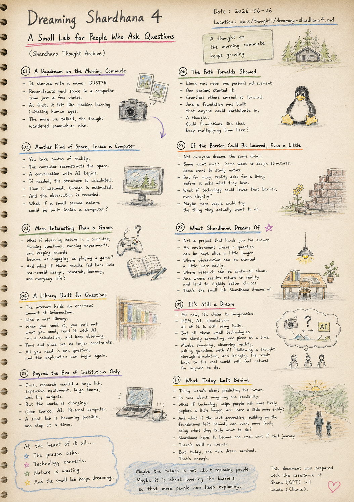
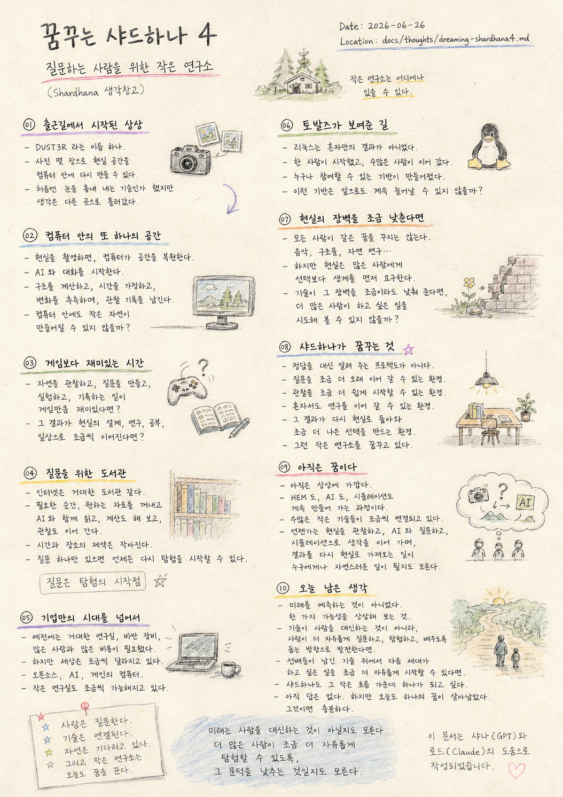

> Location: `docs/thoughts/dreaming-shardhana4-notest.md`

# Dreaming Shardhana 4

### A Small Lab for People Who Ask Questions

*(Shardhana Thought Archive)*  
*Date: 2026-06-26*

## 🎬 YouTube Video

[Watch on YouTube](https://youtu.be/_a3eKHQwmNI)

  

---

## 01. A Daydream on the Morning Commute

Today started with a single name: DUST3R.

---

A technology that reconstructs a real physical space

inside a computer

from just a handful of photographs.

---

At first it seemed like little more than

a machine learning to imitate human eyes.

---

But talking it through a little further,

the thought drifted somewhere else.

---

## 02. Another Kind of Space, Inside a Computer

You photograph reality.

---

The computer reconstructs the space.

---

A conversation with AI begins.

---

If needed, the structure gets calculated.

---

Time gets assumed.

---

Change gets estimated.

---

And the observation gets recorded.

---

A thought arrived quietly:

what if a small second nature

could be built inside a computer?

---

## 03. More Interesting Than a Game

There are countless games in the world.

---

But another thought came too.

---

What if observing nature inside a computer,

forming questions,

running experiments,

and keeping records

became as engaging as playing a game?

---

And what if those results

slowly fed back into real-world design,

research,

learning,

and everyday life?

---

## 04. A Library Built for Questions

The internet holds an enormous amount of information.

---

Something like a vast library.

---

When the moment calls for it,

you pull out what you need,

read it alongside AI,

run a calculation if necessary,

and keep the observation going.

---

Time and place are no longer serious constraints.

---

All you need is one question,

and the exploration can begin again.

---

## 05. Beyond the Era of Institutions Only

Once upon a time,

research required a massive laboratory.

---

Expensive equipment.

---

Large teams.

Large budgets.

---

But the world has been shifting, little by little.

---

Open source.

---

AI.

---

A personal computer.

---

A small lab is becoming possible,

one step at a time.

---

## 06. The Path Torvalds Showed

Linux was never one person's achievement alone.

---

One person started it.

Countless others carried it forward.

---

And along the way,

a foundation was built that anyone could participate in.

---

A thought:

---

Could foundations like that

keep multiplying from here?

---

## 07. If the Barrier Could Be Lowered, Even a Little

Not everyone dreams the same dream.

---

Someone wants to make music.

Someone wants to design structures.

Someone wants to study nature.

---

But for many people,

reality asks for a living

before it asks what they love.

---

What if technology

could lower that barrier,

even slightly?

---

Maybe more people

could try the thing they actually want to do.

---

## 08. What Shardhana Dreams Of

Shardhana is not a project

that hands you the answer.

---

It's an environment where a question

can be kept alive a little longer.

---

Where observation

can be started a little more easily.

---

Where research

can be continued alone.

---

And where the results

find their way back to reality

and make for slightly better decisions.

---

That's the small lab

Shardhana is dreaming of.

---

## 09. It's Still a Dream

For now,

it's closer to imagination than reality.

---

HEM,

AI,

simulation —

all of it is still being built.

---

But all these small technologies

are slowly connecting,

one piece at a time.

---

Maybe someday,

observing reality,

asking questions alongside AI,

following a thought through simulation,

and bringing the result back into the real world

will feel like a natural thing for anyone to do.

---

## 10. What Today Left Behind

Today's purpose wasn't to predict the future.

---

It was to imagine one possibility.

---

What if technology keeps moving

not in the direction of replacing people,

but in the direction of helping people

ask more freely,

explore a little longer,

and learn a little more easily?

---

And what if the next generation,

building on the foundations those before them left behind,

can start a little more freely

doing the things they actually want to do?

---

Shardhana hopes to become one small part of that journey.

---

There's still no answer.

---

But today, one more dream survived.

That's enough.

---

*The person asks.*

*Technology connects.*

*Nature is waiting.*

*And the small lab keeps dreaming today.*

---

*Maybe the future is not about replacing people.*

*Maybe it is about lowering the barriers so that more people can keep exploring.*

---

*This document was prepared with the assistance of Shana (GPT) and Laude (Claude).*

---
 
 

# 꿈꾸는 샤드하나 4

### 질문하는 사람을 위한 작은 연구소

*(Shardhana 생각창고)*  
*Date: 2026-06-26*

## 🎬 유튜브 영상

[Watch on YouTube](https://youtu.be/CQtmHUCZR6I)

  

---

## 01. 출근길에서 시작된 상상

오늘 출근길은

DUST3R라는 이름 하나에서 시작했다.

---

사진 몇 장만으로

현실 공간을

컴퓨터 안에 다시 만들어 내는 기술.

---

처음에는

단순히 눈을 흉내 내는 기술인가 생각했다.

---

하지만 조금 더 이야기를 나누다 보니

생각은 다른 곳으로 흘러가기 시작했다.

---

## 02. 컴퓨터 안의 또 하나의 공간

현실을 촬영한다.

---

컴퓨터는

공간을 복원한다.

---

AI와 대화를 시작한다.

---

필요하다면

구조를 계산한다.

---

시간을 가정한다.

---

변화를 추측한다.

---

그리고

관찰 기록을 남긴다.

---

문득

컴퓨터 안에도

또 하나의 작은 자연이 만들어질 수 있지 않을까 하는 생각이 들었다.

---

## 03. 게임보다 재미있는 시간

세상에는

수많은 게임이 있다.

---

하지만 문득 이런 생각도 들었다.

---

만약

컴퓨터 안에서

자연을 관찰하고,

질문을 만들고,

실험하고,

기록하는 일이

게임만큼 재미있어진다면 어떨까.

---

그 결과가

현실의 설계,

연구,

공부,

그리고 일상으로

조금씩 이어질 수 있다면.

---

## 04. 질문을 위한 도서관

인터넷에는

엄청난 양의 정보가 존재한다.

---

마치

거대한 도서관 같다.

---

필요한 순간,

원하는 자료를 꺼내고,

AI와 함께 읽고,

필요하면

계산도 해 보고,

관찰도 이어 간다.

---

시간과 장소는

더 이상 큰 제약이 되지 않는다.

---

질문 하나만 있다면

언제든 다시 탐험을 시작할 수 있다.

---

## 05. 기업만의 시대를 넘어서

예전에는

거대한 연구실이 필요했다.

---

비싼 장비가 필요했다.

---

많은 사람과

많은 비용이 필요했다.

---

하지만 조금씩

세상이 달라지고 있다.

---

오픈소스.

---

AI.

---

개인의 컴퓨터.

---

작은 연구실도

조금씩 가능해지고 있다.

---

## 06. 토발즈가 보여준 길

리눅스는

혼자만의 결과가 아니었다.

---

한 사람이 시작했고,

수많은 사람이 이어 갔다.

---

그 과정에서

누구나 참여할 수 있는 기반이 만들어졌다.

---

문득 생각했다.

---

앞으로도

이런 기반은

계속 늘어날 수 있지 않을까.

---

## 07. 현실의 장벽을 조금 낮춘다면

모든 사람이

같은 꿈을 꾸지는 않는다.

---

누군가는 음악을 만들고 싶고,

누군가는 구조물을 설계하고 싶고,

누군가는 자연을 연구하고 싶다.

---

하지만 현실은

많은 사람에게

선택보다 생계를 먼저 요구한다.

---

만약

기술이

그 장벽을

조금이라도 낮춰 줄 수 있다면.

---

조금 더 많은 사람이

자신이 하고 싶은 일을

시도해 볼 수 있지 않을까.

---

## 08. 샤드하나가 꿈꾸는 것

샤드하나는

정답을 대신 알려 주는 프로젝트가 아니다.

---

질문을

조금 더 오래 이어 갈 수 있는 환경.

---

관찰을

조금 더 쉽게 시작할 수 있는 환경.

---

혼자서도

연구를 이어 갈 수 있는 환경.

---

그리고

그 결과가

다시 현실로 돌아와

조금 더 나은 선택을 만드는 환경.

---

그런 작은 연구소를

꿈꾸고 있다.

---

## 09. 아직은 꿈이다

아직은

상상에 가깝다.

---

HEM도,

AI도,

시뮬레이션도,

아직은

계속 만들어 가는 과정이다.

---

하지만

수많은 작은 기술들이

조금씩 연결되고 있다.

---

언젠가는

현실을 관찰하고,

AI와 함께 질문하고,

시뮬레이션으로 생각을 이어 가며,

그 결과를 다시 현실로 가져오는 일이

누구에게나 자연스러운 일이 될지도 모른다.

---

## 10. 오늘 남은 생각

오늘의 목적은

미래를 예측하는 것이 아니었다.

---

오히려

한 가지 가능성을 상상해 보는 것이었다.

---

기술이

사람을 대신하는 방향이 아니라,

사람이

조금 더 자유롭게 질문하고,

조금 더 오래 탐험하며,

조금 더 쉽게 배우도록

돕는 방향으로 발전한다면.

---

그리고

선배들이 남긴 기술 위에서

다음 세대가

조금 더 자유롭게

자신이 하고 싶은 일을 시작할 수 있다면.

---

샤드하나도

그 작은 흐름 가운데

하나가 되고 싶다.

---

아직 답은 없다.

---

하지만

오늘도

하나의 꿈이 살아남았다.

그것이면 충분하다.

---

*사람은 질문한다.*

*기술은 연결된다.*

*자연은 기다리고 있다.*

*그리고 작은 연구소는 오늘도 꿈을 꾼다.*

---

*미래는 사람을 대신하는 것이 아닐지도 모른다.*

*더 많은 사람이 조금 더 자유롭게 탐험할 수 있도록,*
*그 문턱을 낮추는 것일지도 모른다.*

---

*이 문서는 샤나(GPT)와 로드(Claude)의 도움으로 작성되었습니다.*
