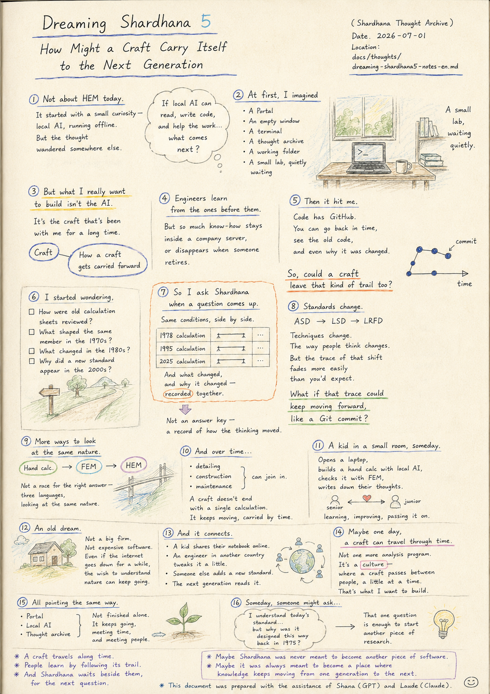
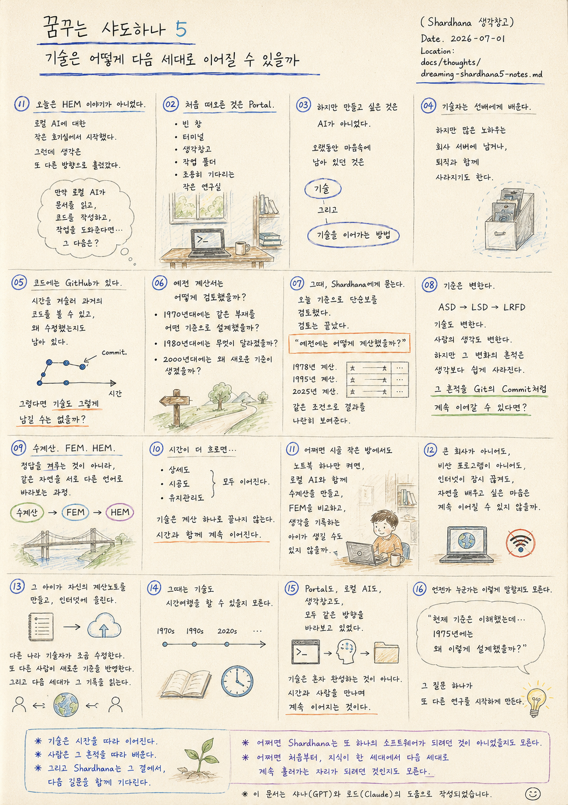

> Location: `docs/thoughts/dreaming-shardhana5-notes-en.md`

# Dreaming Shardhana 5

### How Might a Craft Carry Itself to the Next Generation

*(Shardhana Thought Archive)*
*Date: 2026-07-01*

  

---

This wasn't supposed to be about HEM today.

It started with a small curiosity —

local AI, running without the internet.

But the thought wandered somewhere else.

---

A question surfaced.

If a local AI could

read documents without a connection,

write code,

help with the work at hand —

what would come after that?

---

At first,

a Portal came to mind.

An empty window.

A terminal.

A thought archive.

A working folder.

A small lab, waiting quietly.

---

But looking closer,

what I actually wanted to build

wasn't the AI itself.

---

What had been sitting in the back of my mind for a long time

was the craft.

And how a craft

gets carried forward.

---

Engineers learn from the ones before them.

But so much know-how

stays locked inside a company's server,

or disappears when someone retires.

---

Then it hit me.

Code has GitHub.

You can go back in time

and see the old code.

Even why it was changed is still there.

---

So —

could a craft leave that kind of trail too?

---

How were old calculation sheets reviewed?

Back in the 1970s,

what standard shaped

the same structural member?

---

What changed in the 1980s?

Why did a new standard

appear in the 2000s?

---

Instead of only learning today's standard,

what if we could walk

the whole road the craft has traveled?

---

Say you check a simple beam

against today's code.

The check is done.

---

And then a question surfaces:

"How would this have been calculated back then?"

---

That's when

you ask Shardhana.

---

A 1978 calculation.

A 1995 calculation.

A 2025 calculation.

Same conditions,

results laid side by side.

---

And what changed,

and why it changed —

recorded alongside them.

---

Not an answer key.

A record of how the thinking moved.

---

ASD.

LSD.

LRFD.

Standards shift.

Techniques shift.

The way people think shifts too.

---

But the trace of that shift

fades more easily than you'd expect.

---

What if that trace

could keep moving forward,

the way a Git commit does?

---

A junior engineer wouldn't just learn

today's standard —

they might naturally come to understand

why it became this way.

---

FEM joins in here.

The same problem,

worked through an analysis program instead.

---

And someday,

HEM looks at the same problem too.

---

Hand calculation.

FEM.

HEM.

Not a contest for the right answer —

three languages,

looking at the same nature.

---

Give it more time,

and detailing could join in.

Construction could join in.

Maintenance could join in.

---

A craft doesn't end

with a single calculation.

It keeps moving,

carried along by time.

---

And then, without meaning to,

an older dream came back.

---

Somewhere down the road,

in some small room in the countryside,

a kid opens a laptop —

builds a hand calculation alongside a local AI,

checks it against FEM,

writes down what they're thinking.

---

No need for a big firm.

No need for expensive software.

Even with the internet cut off for a while,

the wish to understand nature

could still carry on.

---

If that kid

builds their own calculation notebook

and puts it online —

---

an engineer in another country

tweaks it a little.

Someone else

folds in a newer standard.

---

And the next generation

reads what they left behind.

---

Maybe by then,

a craft can travel through time too.

---

What Shardhana is really trying to build

is probably not one more analysis program.

---

It's a culture —

where a craft

passes between people, a little at a time.

---

Learning from the ones before you,

making it a little better,

and handing it to the ones after you.

---

Maybe HEM, too,

is just one small workshop

inside that much longer story.

---

Portal.

Local AI.

The thought archive.

All of it, facing the same direction.

---

A craft isn't finished alone.

It keeps going,

meeting time, and meeting people.

---

And someday, someone might say:

---

"I understand today's standard...

but why was it designed this way

back in 1975?"

---

That one question

is enough to start another piece of research.

---

*A craft travels along time.*

*People learn by following its trail.*

*And Shardhana waits beside them, for the next question.*

---

*Maybe Shardhana was never meant to become another piece of software.*

*Maybe it was always meant to become a place where knowledge keeps moving from one generation to the next.*

---

*This document was prepared with the assistance of Shana (GPT) and Laude (Claude).*

---
 
 

# 꿈꾸는 샤드하나 5

### 기술은 어떻게 다음 세대로 이어질 수 있을까

*(Shardhana 생각창고)*  
*Date: 2026-07-01*

  

---

오늘은 HEM 이야기를 하려던 것이 아니었다.

로컬 AI에 대한 작은 호기심에서 시작했다.

그런데 생각은 또 다른 방향으로 흘러갔다.

---

문득 떠오른 질문.

만약 로컬 AI가

인터넷 없이도 문서를 읽고,

코드를 작성하고,

작업을 도와줄 수 있다면,

그 다음에는 무엇을 만들고 싶을까.

---

처음에는

Portal을 떠올렸다.

빈 창.

터미널.

생각창고.

그리고 작업 폴더.

조용히 기다리는 작은 연구실.

---

하지만 조금 더 생각해 보니

만들고 싶은 것은

AI 자체가 아니었다.

---

오랫동안 마음속에 남아 있던 것은

기술이었다.

그리고

기술을 이어가는 방법이었다.

---

기술자는

선배들에게 배운다.

하지만 많은 노하우는

회사 서버 안에 남거나,

퇴직과 함께 사라지기도 한다.

---

문득 생각했다.

코드에는 GitHub가 있다.

시간을 거슬러 올라가

과거의 코드를 볼 수 있다.

왜 수정했는지도 남아 있다.

---

그렇다면

기술도 그렇게 남길 수는 없을까.

---

예전 계산서는

어떻게 검토했을까.

1970년대에는

같은 부재를

어떤 기준으로 설계했을까.

---

1980년대에는

무엇이 달라졌을까.

2000년대에는

왜 새로운 기준이 생겼을까.

---

현재 기준만 배우는 것이 아니라,

기술이 걸어온 길을

함께 볼 수 있다면 어떨까.

---

예를 들어

오늘 기준으로

단순보를 검토한다.

검토는 끝났다.

---

그런데 문득 궁금해진다.

"예전에는 어떻게 계산했을까?"

---

그때

Shardhana에게 묻는다.

---

1978년 계산.

1995년 계산.

2025년 계산.

같은 조건으로

결과를 나란히 보여준다.

---

그리고

무엇이 달라졌는지,

왜 바뀌었는지를

함께 기록해 둔다.

---

정답을 알려주는 것이 아니다.

생각의 흐름을 보여주는 것이다.

---

ASD.

LSD.

LRFD.

기준은 변한다.

기술도 변한다.

사람의 생각도 변한다.

---

하지만

그 변화의 흔적은

생각보다 쉽게 사라진다.

---

만약

그 흔적을

Git의 Commit처럼

계속 이어갈 수 있다면.

---

후배는

현재 기준만 배우는 것이 아니라,

기술이 왜 이렇게 되었는지를

자연스럽게 이해하게 될지도 모른다.

---

여기에

FEM이 이어진다.

같은 문제를

해석 프로그램으로 풀어본다.

---

그리고

언젠가는

HEM도 같은 문제를 바라본다.

---

수계산.

FEM.

HEM.

정답을 겨루는 것이 아니라,

같은 자연을

서로 다른 언어로 바라보는 과정.

---

조금 더 시간이 흐르면

상세도도 이어질 수 있다.

시공도 이어질 수 있다.

유지관리도 이어질 수 있다.

---

기술은

계산 하나로 끝나지 않는다.

시간과 함께

계속 이어진다.

---

그러다 문득

더 오래된 꿈을 떠올렸다.

---

언젠가

시골 작은 방에서도

노트북 하나만 켜면,

로컬 AI와 함께

수계산을 만들고,

FEM을 비교하고,

생각을 기록하는 아이가 생길 수도 있지 않을까.

---

큰 회사가 아니어도,

비싼 프로그램이 아니어도,

인터넷이 잠시 끊겨도,

자연을 배우고 싶은 마음은

계속 이어질 수 있지 않을까.

---

만약

그 아이가

자신만의 계산노트를 만들고,

인터넷에 올린다.

---

다른 나라 기술자가

조금 수정한다.

또 다른 사람이

새로운 기준을 반영한다.

---

그리고

다음 세대가

그 기록을 읽는다.

---

그때는

기술도

시간여행을 할 수 있을지 모른다.

---

아마

Shardhana가 만들고 싶은 것은

새로운 해석 프로그램 하나가 아닐 것이다.

---

사람과 사람 사이에서

기술이

조금씩 이어지는 문화.

---

선배에게 배우고,

조금 더 나아지게 만들고,

다시 후배에게 넘겨주는 문화.

---

어쩌면

HEM도

그 긴 이야기 속에 있는

작은 연구실 하나일 뿐이다.

---

Portal도,

로컬 AI도,

생각창고도,

모두 같은 방향을 바라보고 있었다.

---

기술은

혼자 완성하는 것이 아니다.

시간과 사람을 만나며

계속 이어지는 것이다.

---

그리고

언젠가 누군가는

이렇게 말할지도 모른다.

---

"현재 기준은 이해했는데...

1975년에는

왜 이렇게 설계했을까?"

---

그 질문 하나가

또 다른 연구를 시작하게 만든다.

---

*기술은 시간을 따라 이어진다.*

*사람은 그 흔적을 따라 배운다.*

*그리고 Shardhana는 그 곁에서, 다음 질문을 함께 기다린다.*

---

*어쩌면 Shardhana는 또 하나의 소프트웨어가 되려던 것이 아니었을지도 모른다.*

*어쩌면 처음부터, 지식이 한 세대에서 다음 세대로 계속 흘러가는 자리가 되려던 것인지도 모른다.*

---

*이 문서는 샤나(GPT)와 로드(Claude)의 도움으로 작성되었습니다.*
