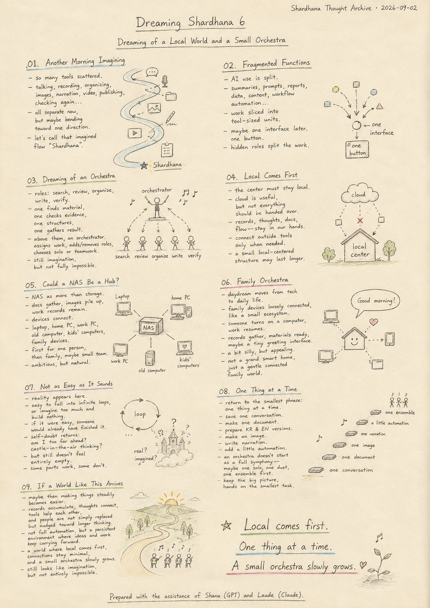
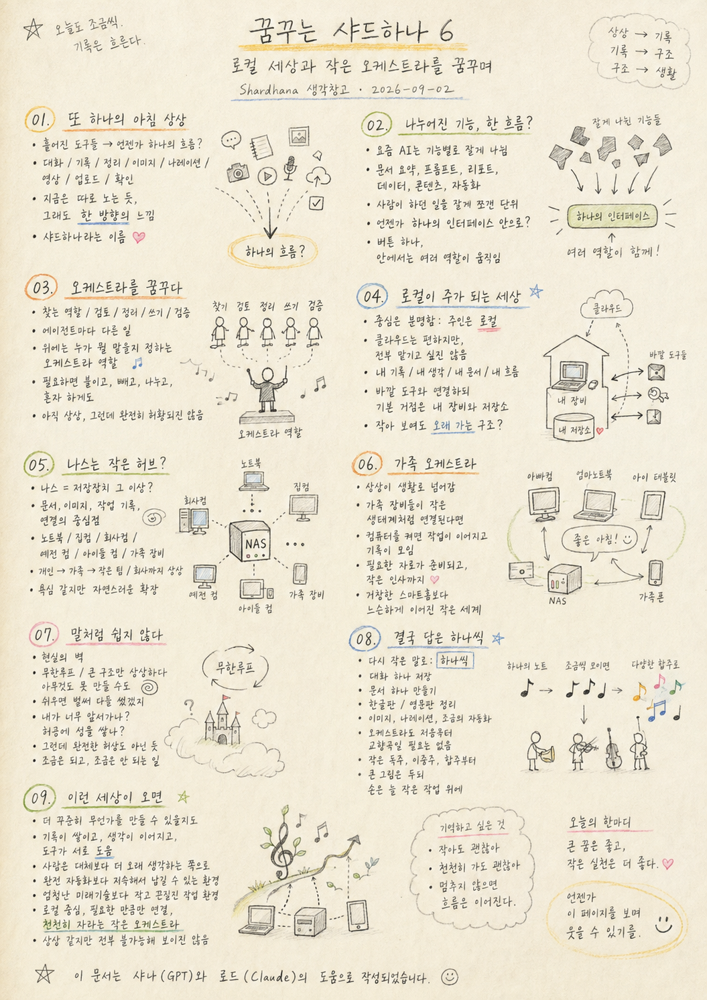

> Location: docs/thoughts/dreaming-shardhana6-notes.md

# Dreaming Shardhana 6

## Dreaming of a Local World and a Small Orchestra

*(Shardhana Thought Archive) · Date: 2026-09-02*

## 🎬 YouTube Video

[Watch on YouTube](https://youtu.be/AFyqHjT-9os)

  

---

## 01. Another Morning Imagining

Sometimes a strange thought arrives first.

Could all these scattered tools eventually be woven into a single flow?

Talking, recording, organizing, making images, writing narration, cutting video, publishing, checking it all again.

Right now it all feels like it's running on its own separate track. But there's a sense that, a little further down the road, it might all bend toward one direction.

I've just been calling that imagined thing Shardhana.

## 02. Fragmented Functions, Maybe One Flow Someday

The way AI gets used these days is broken into small pieces.

Summarizing documents. Writing prompts. Generating reports. Organizing data. Producing content. Automating workflows.

It looks complicated at first glance, but looking closer, it might all be saying the same thing. Work that people used to do has simply been sliced into units that are easy for a tool to pick up.

Which pushes the thought a little further. Could all these fragmented functions eventually gather back into a single interface? A user presses one button, and inside, several roles quietly split up the work.

## 03. Dreaming of an Orchestra

The image gradually starts looking more like people.

A role that searches. A role that reviews. A role that organizes. A role that writes. A role that verifies.

One agent finds material. One agent checks the evidence. One agent builds the structure. One agent pulls the result together.

And above all of them, there needs to be an orchestrator — something that decides who handles what. Adding a new role when needed, pulling one back when it's no longer useful, letting a single agent handle something alone or splitting it across several depending on what the task calls for.

This is still closer to imagination than plan. But strangely, it doesn't feel completely made up either.

## 04. A World Where Local Comes First

Still, the center is clear. Local has to remain in control.

The cloud is powerful and convenient, that's true. But I don't want to hand everything over to it. My records, my thoughts, my documents, my flow — I'm more at ease holding onto those myself.

So the picture that pulls at me more is a small, local-centered system rather than a massive cloud-centered one. Connect to outside tools when needed, but keep the home base inside my own devices and my own storage.

It might look small. But that might be exactly the kind of structure that lasts.

## 05. Could a NAS Become a Small Hub

Following that thought naturally leads to the NAS.

A NAS might not just be simple storage — it could become a small hub. A center point where documents gather, images pile up, work records stay, and every device connects.

Laptop, home computer, work computer, an old computer, the kids' computers, the whole family's devices — loosely connected, it could start looking like a small platform.

At first, just for one person. Then for a family. Push it further, and it's not hard to imagine something for a very small team, or even a small company.

It sounds ambitious. But at the same time, it also looks like a perfectly natural extension.

## 06. Imagining a Family Orchestra

Around this point, the daydream shifts from technology to daily life.

What if the family's devices stopped running each on their own and instead connected like a small ecosystem?

Someone turns on their computer, and the day's work picks up where it left off. Records gather automatically. The materials you need are already prepared. Maybe there's even a small interface that greets you.

It sounds a little silly, a little childish — but I don't mind that kind of daydream.

Not a grand smart home, but a small world where a family's computers and records stay loosely connected to each other. Technology doesn't have to live only in massive industrial systems. It can seep into the texture of everyday life too.

## 07. The Problem Is That It's Never as Easy as It Sounds

Of course, reality shows up right here.

None of this is as simple as it sounds. It's easy to fall into an infinite loop, or spend all your time imagining a grand structure and end up building nothing at all.

If it were easy, someone would already have built the finished version, and everyone would already be using it.

So the doubt keeps circling back. Am I getting too far ahead of myself. Is Shana just egging my imagination on. Am I building castles in the air again.

And yet, at the same time, it doesn't feel like a completely empty dream either.

It works, a little. It doesn't, a little. Which makes it the kind of thing that's genuinely hard to pin down.

## 08. In the End, the Answer Is One Thing at a Time

So it comes back to the smallest possible phrase.

One thing at a time.

Not building every agent from the start, but saving one conversation, making one document, putting together a Korean version and an English version, making an image, writing a narration, then attaching a little automation after that.

An orchestra doesn't have to start as a full symphony either. One small solo. One duet. One ensemble piece. Build them one at a time.

What matters is not giving up the bigger picture, while keeping both hands on the smallest task in front of you.

## 09. If a World Like This Ever Arrives

A thought crosses my mind.

If a world like this arrives, maybe I could keep making things a little more steadily than I do now.

Records pile up, thoughts keep connecting, the tools help each other — and a person isn't replaced outright, just nudged toward thinking a little longer instead.

Not full automation, but an environment where ideas and work can keep accumulating and carrying forward.

Maybe what I actually want isn't some massive future technology, but exactly that kind of small, persistent working environment.

A world where local comes first, where connections happen only as much as they need to, and a small orchestra slowly grows.

Right now it looks like nothing more than imagination. But strangely, it doesn't sound entirely impossible either.

This gets written down here, for now.

---

This document was prepared with the assistance of Shana (GPT) and Laude (Claude).

---
 
 

# 꿈꾸는 샤드하나 6

## 로컬 세상과 작은 오케스트라를 꿈꾸며

*(Shardhana 생각창고) · Date: 2026-09-02*

## 🎬 YouTube Video

[Watch on YouTube](https://youtu.be/8wr978hvwOs)

  

---

## 01. 또 하나의 아침 상상

가끔은 이상한 생각이 먼저 온다.

지금은 흩어져 있는 도구들이 언젠가는 하나의 흐름으로 묶일 수 있지 않을까.

대화하고, 기록하고, 정리하고, 이미지를 만들고, 나레이션을 만들고, 영상을 만들고, 올리고, 다시 확인하는 일.

지금은 다 따로 노는 것 같지만, 조금만 더 가면 한 방향으로 이어질 것 같은 느낌이 있다.

그 상상의 이름을 나는 그냥 샤드하나라고 부르고 있다.

## 02. 나누어진 기능, 언젠가는 한 흐름으로

요즘 보이는 AI 활용 방식은 기능이 잘게 나뉘어 있다.

문서 요약, 프롬프트 작성, 리포트 생성, 데이터 정리, 콘텐츠 제작, 워크플로우 자동화.

처음 보면 복잡해 보이지만, 가만히 보면 결국 같은 말일 수도 있다. 사람이 하던 일을 조금씩 쪼개서 도구가 맡기 쉬운 단위로 나눈 것이다.

그래서 더 멀리 생각하게 된다. 이렇게 잘게 쪼개진 기능들이 언젠가는 다시 하나의 인터페이스 안으로 모이지 않을까. 사용자는 버튼 하나를 누르고, 안에서는 여러 역할이 나누어 움직이는 방식으로.

## 03. 오케스트라를 꿈꾸다

그 상상은 점점 사람처럼 바뀐다.

찾는 역할이 있고, 검토하는 역할이 있고, 정리하는 역할이 있고, 쓰는 역할이 있고, 검증하는 역할이 있다.

어떤 에이전트는 자료를 찾고, 어떤 에이전트는 근거를 확인하고, 어떤 에이전트는 구조를 잡고, 어떤 에이전트는 결과를 묶는다.

그리고 그 위에는 누구에게 어떤 일을 맡길지 정하는 오케스트라 역할이 있어야 할 것 같다. 필요하면 새 역할을 붙이고, 쓸모가 줄면 잠시 빼고, 작업의 성격에 따라 혼자 하게도 하고, 여럿이 나눠 하게도 하는 식이다.

이건 아직 상상에 가깝지만, 이상하게도 완전히 허황되게만 느껴지지는 않는다.

## 04. 로컬이 주가 되는 세상

그래도 중심은 분명하다. 주인은 로컬이어야 한다.

클라우드가 강하고 편한 건 맞지만, 모든 걸 거기에 맡기고 싶지는 않다. 내 기록, 내 생각, 내 문서, 내 흐름은 내가 잡고 있어야 마음이 편하다.

그래서 더 끌리는 그림은 클라우드 중심의 거대한 시스템보다 로컬 중심의 작은 시스템이다. 필요하면 바깥 도구와 연결하되, 기본 거점은 내 장비와 내 저장소 안에 있는 구조.

작아 보여도, 오히려 그런 구조가 오래 갈 수 있을지 모른다.

## 05. 나스는 작은 허브가 될 수 있을까

그 생각을 하다 보면 자연스럽게 나스로 시선이 간다.

나스는 단순 저장장치가 아니라 어쩌면 작은 허브가 될 수 있다. 문서가 모이고, 이미지가 쌓이고, 작업 기록이 남고, 각 기기가 연결되는 중심점.

노트북, 집 컴퓨터, 회사 컴퓨터, 예전 컴퓨터, 아이들 컴퓨터, 가족 장비들까지 느슨하게 연결된다면 작은 플랫폼 같은 모습이 나올 수도 있다.

처음에는 개인용일 것이다. 그다음은 가족용. 더 나아가면 아주 작은 팀이나 회사용까지도 상상해볼 수 있다.

욕심 같지만, 한편으로는 그냥 자연스러운 확장처럼 보이기도 한다.

## 06. 가족 오케스트라라는 상상

이 대목쯤 오면 상상은 기술에서 생활로 넘어간다.

가족의 장비들이 각자 따로 놀지 않고 하나의 작은 생태계처럼 연결되면 어떨까.

누군가 컴퓨터를 켜면 그날의 작업이 이어지고, 기록이 자동으로 모이고, 필요한 자료가 준비되고, 인사 한마디 건네는 작은 인터페이스까지 붙을 수 있지 않을까.

조금 우습고, 조금 유치해 보여도 나는 그런 상상이 싫지 않다.

거창한 스마트홈보다, 가족의 컴퓨터와 기록이 서로 느슨하게 이어지는 작은 세계. 기술은 꼭 대단한 산업 시스템만이 아니라 이런 생활의 결에도 스며들 수 있을 것이다.

## 07. 문제는 언제나 말처럼 쉽지 않다는 것

물론 여기서 바로 현실의 벽이 나온다.

이런 건 말처럼 쉽지 않다. 무한루프에 빠질 수도 있고, 괜히 큰 구조만 상상하다가 아무것도 못 만들 수도 있다.

쉬우면 벌써 누군가 완성형처럼 만들어서 다들 쓰고 있었을지도 모른다.

그래서 자꾸 스스로를 의심하게 된다. 내가 너무 앞서가고 있는 건 아닌가. 샤나가 괜히 상상을 부추기는 건 아닌가. 나는 또 허공에 성을 쌓고 있는 건 아닌가.

그런데 동시에 완전히 허황된 꿈만도 아닌 것 같다는 느낌이 남는다.

조금은 되고, 조금은 안 되고, 그래서 더 헷갈리는 종류의 일이다.

## 08. 결국 답은 하나씩

그래서 다시 제일 작은 말로 돌아온다.

하나씩.

처음부터 모든 에이전트를 만드는 게 아니라, 대화 하나를 저장하고, 문서 하나를 만들고, 한글판과 영문판을 정리하고, 이미지를 만들고, 나레이션을 만들고, 그다음 자동화를 조금 붙여보는 식.

오케스트라도 처음부터 교향곡일 필요는 없다. 작은 독주 하나, 이중주 하나, 합주 하나를 차례로 만들어보면 된다.

중요한 건 거대한 그림을 포기하지 않되, 손은 늘 가장 작은 작업 위에 올려두는 일일 것이다.

## 09. 이런 세상이 오면

문득 그런 생각이 든다.

이런 세상이 오면 나는 지금보다 조금 더 꾸준히 무언가를 만들 수 있을지도 모른다.

기록이 쌓이고, 생각이 이어지고, 도구가 서로 도와주고, 사람은 완전히 대체되는 것이 아니라 조금 더 오래 생각하는 쪽으로 밀려나는 세상.

완전한 자동화보다 지속해서 무언가를 남길 수 있는 환경.

어쩌면 내가 바라는 건 엄청난 미래 기술이 아니라 그런 작고 끈질긴 작업 환경인지도 모른다.

로컬이 중심이 되고, 필요한 만큼만 연결되고, 작은 오케스트라가 천천히 자라나는 세상.

지금은 상상처럼 보이지만, 이상하게도 전부 불가능한 이야기처럼만 들리지는 않는다.

일단 여기까지 적어 둔다.

---

이 문서는 샤나(GPT)와 로드(Claude)의 도움으로 작성되었습니다.
