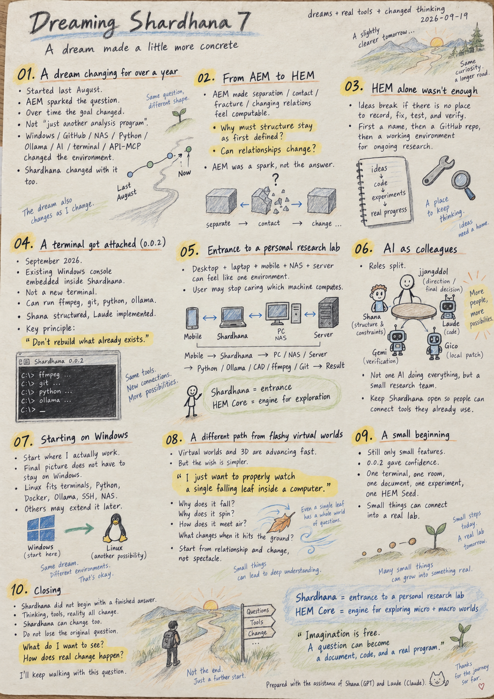
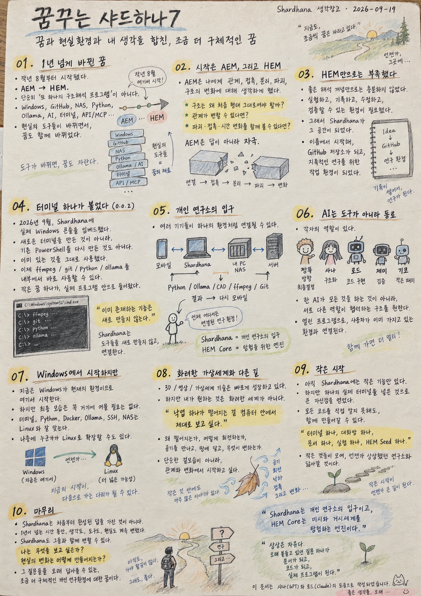

> Location: docs/thoughts/dreaming-shardhana7-notes.md

# Dreaming Shardhana 7
### A dream made a little more concrete — dreams, real-world constraints, and my own thinking, all put together
*(Shardhana Thought Archive)*
*Date: 2026-09-19*

<p align="center">
  
</p>

---

## 01. A dream that has kept changing for over a year

I've been dreaming of Shardhana since last August. It wasn't this concrete back then.

Looking at AEM, I kept wondering whether the relationships between elements — contact, separation, fracture, change — could be expressed a little more naturally. That question grew into HEM.

But over time it became clearer that what I actually wanted to build wasn't just one more structural analysis program. My thinking changed over the past year, and so did the tools I actually use — Windows, GitHub, NAS, Python, Ollama, AI, terminals, API/MCP-style connections. As the real environment changed, Shardhana's shape kept changing with it. What Shardhana is now is closer to a dream made a little more concrete, shaped by both a year of changed thinking and a changed environment.

---

## 02. It started with AEM, then HEM

What interested me about AEM wasn't just calculating elements — it was that separation, contact, changing relationships, and structural change were themselves treated as things to be computed.

> Why should a structure always exist exactly as it was first defined?
> What if the relationship between elements could itself change? What if fracture, contact, and change over time could all be seen within a single structure?

Those questions piled up and became HEM. AEM wasn't an answer — it was a spark.

---

## 03. HEM alone wasn't enough — that's why Shardhana

However good an analytical concept is, if there's no place to keep experimenting, recording, fixing, and verifying it, the thinking easily breaks off. That's the space Shardhana became. First just a name, then a GitHub repository — a place to leave thoughts as Markdown, add code bit by bit, store experiment data. At some point it stopped being just a repository and started becoming a **working environment for keeping the research going**.

---

## 04. A terminal got attached (0.0.2)

In September 2026, I built Shardhana 0.0.2. Nothing dramatic — I put the console that already exists on Windows right inside the Shardhana window. Not a new terminal, not a reimplementation of PowerShell. Just something that already exists, made usable inside Shardhana.

Being able to run `ffmpeg`, `git`, `python`, `ollama` directly from inside it meant something to me. I explained what I wanted, Shana structured it, Laude implemented it — a small dream landed inside a real program.

That's when a principle came into sharper focus: **don't rebuild what already exists.** Windows already has a terminal, Git, Python, ffmpeg, Ollama, CAD, NAS, GitHub. So it's more natural for Shardhana to become a program that **connects** those things rather than one that rebuilds them.

---

## 05. Shardhana as the entrance to a personal research lab

As personal devices — desktop, laptop, mobile, NAS, servers — increasingly connect into something like a single environment, a user may no longer need to think about which device is actually doing the computing.

```
Mobile → Shardhana → my PC/NAS/server → Python/Ollama/CAD/ffmpeg/Git → result → back to mobile
```

Shardhana doesn't have to do everything itself. It's the entrance to a personal research lab — connecting the tools, devices, AI, documents, and experiments I already have. At the center of that is HEM Core: if Shardhana is the entrance, HEM Core is the engine for exploring the micro and macro worlds inside.

---

## 06. AI as a colleague, not just a tool

The way I use AI has changed too. It started as a question-and-answer tool; now the roles are split. **짱똘 (me)** sets direction and makes final decisions. **Shana** structures the thinking, goals, and constraints. **Laude** turns that structure into actual code. When needed, Gemi verifies and Giko does small local patches. I want a structure where no single AI does everything — instead, colleagues with different roles collaborate inside one research environment.

I want Shardhana itself to stay open, and let people connect whatever AI or cloud service they already use — rather than forcing another mandatory subscription on anyone.

---

## 07. Starting on Windows

I'm starting on Windows because that's the environment I actually use. But the final picture doesn't have to stay there. Terminals, Python, Docker, Ollama, SSH, NAS — these all fit naturally with Linux. Once the basic structure of Shardhana exists, someone might think "this would be even more interesting on Linux," and extend it into their own environment.

---

## 08. A different path from flashy virtual worlds

Technology for building virtual worlds — 3D characters, images and video almost indistinguishable from reality — is moving remarkably fast these days. Watching that, I keep thinking something different: I don't want to build a grand virtual world first. **I just want to properly watch a single falling leaf inside a computer** — why it falls, why it spins, how it relates to the air, what changes the moment it hits the ground. Others might start from what can be seen. I want to start from relationships and change.

---

## 09. A small beginning

Shardhana still only has very small features. But the small experience of attaching a real terminal in 0.0.2 gave me some confidence — that I don't have to know every line of code myself to build this together. One terminal, one conversation room, one document, one experiment, one HEM Seed. If small things like this keep connecting, someday it might resemble the research lab I'm imagining now.

---

## 10. Closing

Shardhana didn't start with a finished answer. My thinking kept changing over the past year, and it will keep changing. I don't see that as a problem — if reality changes, tools change, and my thinking changes, Shardhana can change along with it. What matters is not losing the original question: **What do I want to see? How does change in the real world actually come about?** And can I build my own research environment capable of holding onto that question for a long time. What Shardhana is right now is a dream made a little more concrete, in answer to that question.

---

> Shardhana is the entrance to a personal research lab, and HEM Core is the engine for exploring the micro and macro worlds.
> Between the two are the real-world tools I have, and the questions that haven't ended yet.

---

> Imagination is free.
>
> And sometimes,
> a question you've held onto for a long time
> becomes a document,
> becomes code,
> becomes an actual program.

---

*This document was prepared with the assistance of Shana (GPT) and Laude (Claude).*

> Location: docs/thoughts/dreaming-shardhana7-notes.md

# 꿈꾸는 샤드하나7
### 꿈과 현실환경과 내 생각을 합친, 조금 더 구체적인 꿈
*(Shardhana 생각창고)*
*Date: 2026-09-19*

<p align="center">
  
</p>

---

## 01. 1년이 넘게 바뀌어 온 꿈

작년 8월, AEM을 보며 요소 간 관계·접촉·분리·파괴가 좀 더 자연스럽게 표현될 수 없을까 하는 생각에서 HEM이 시작됐다.

시간이 지나며 내가 만들고 싶은 게 "구조해석 프로그램 하나 더"가 아니라는 게 점점 분명해졌다. Windows, GitHub, NAS, Python, Ollama, AI, 터미널, API/MCP — 실제로 쓰는 도구가 바뀌면서 샤드하나의 모습도 같이 바뀌어 왔다. 지금의 샤드하나는 그 변화가 함께 반영된, 조금 더 구체적인 꿈이다.

---

## 02. 시작은 AEM, 그리고 HEM

AEM에서 흥미로웠던 건 요소가 분리되고 접촉하고 관계가 변하며 구조가 변화하는 모습 자체를 계산 대상으로 본다는 점이었다.

> 구조는 왜 항상 처음 정의된 형태 그대로 존재해야 하는가?
> 관계 자체가 변할 수 있다면? 파괴·접촉·시간 변화를 하나의 구조 안에서 바라볼 수 있다면?

그 질문들이 쌓여 HEM이 됐다. AEM은 답이 아니라 자극이었다.

---

## 03. HEM만으로는 부족했다 — 그래서 샤드하나

아무리 좋은 해석 개념이 있어도, 계속 실험하고 기록하고 고치고 검증할 환경이 없으면 생각은 쉽게 끊긴다. 그 공간이 샤드하나였다. 처음엔 이름, 그다음엔 GitHub 저장소, 지금은 **연구를 계속 이어가기 위한 작업환경**으로 변해가고 있다.

---

## 04. 터미널 하나가 붙었다 (0.0.2)

2026년 9월, Shardhana 0.0.2에 Windows 콘솔을 그대로 창 안에 넣었다. 새 터미널을 만든 것도, PowerShell을 재구현한 것도 아니다. 이미 있는 걸 가져와 안에서 쓸 수 있게 했을 뿐이다.

`ffmpeg`, `git`, `python`, `ollama`를 직접 실행할 수 있게 됐다는 게 나에게는 꽤 의미 있었다. 내가 원하는 걸 설명하고, 샤나가 구조를 정리하고, 로드가 구현했다 — 작은 꿈 하나가 실제 프로그램 안에 들어갔다.

여기서 원칙 하나가 선명해졌다: **이미 존재하는 기능은 새로 만들지 않는다.** 샤드하나는 터미널·Git·Python·ffmpeg·Ollama·CAD·NAS·GitHub를 다시 만드는 프로그램이 아니라, **그것들을 연결하는 프로그램**이 되는 편이 자연스럽다.

---

## 05. 샤드하나는 개인 연구소의 입구

앞으로 데스크톱·노트북·모바일·NAS·서버 같은 개인 장비들이 하나의 환경처럼 연결된다면, 어느 장비가 실제 계산을 하는지 사용자가 매번 의식할 필요는 없어질 수 있다.

```
모바일 → Shardhana → 내 PC/NAS/서버 → Python/Ollama/CAD/ffmpeg/Git → 결과 → 다시 모바일
```

샤드하나는 모든 걸 직접 수행하는 프로그램이 아니라, 내가 가진 도구·장비·AI·문서·실험을 연결하는 **입구**다. 그 중심에는 HEM Core가 있다 — 샤드하나가 입구라면, HEM Core는 그 안의 탐험 엔진이다.

---

## 06. AI는 도구가 아니라 동료

AI를 쓰는 방식도 바뀌었다. 처음엔 질문-답 도구였지만, 지금은 역할이 나뉜다: **짱똘**은 방향과 최종 결정, **샤나**는 생각·목표·제약조건의 구조화, **로드**는 실제 코드 구현. 필요하면 제미가 검증하고 기코가 작은 패치를 한다. AI 하나가 모든 걸 하는 게 아니라, 서로 다른 역할을 가진 동료들이 하나의 연구환경에서 협업하는 구조를 만들고 싶다.

샤드하나 자체는 오픈 프로그램으로 남기고, AI든 클라우드든 각자 이미 가진 환경을 연결해 쓰는 방식이 자연스럽다 — 새로운 필수 구독을 강제하기보다는.

---

## 07. Windows에서 시작하지만

지금은 내가 쓰는 환경이 Windows라 여기서 시작하지만, 최종 그림이 여기 묶일 필요는 없다. 터미널·Python·Docker·Ollama·SSH·NAS는 오히려 Linux와 잘 어울린다. 기본 구조가 어느 정도 만들어지면 누군가 "이거 Linux에 붙이면 재밌겠는데" 하고 자기 환경에 맞게 확장해나갈 수도 있다.

---

## 08. 화려한 가상세계와 다른 길

요즘 가상세계·3D·영상 생성 기술은 놀랍게 빠르다. 그런데 나는 거대한 가상세계를 먼저 만들고 싶은 게 아니라, **낙엽 하나가 떨어지는 걸 컴퓨터 안에서 제대로 보고 싶다** — 왜 떨어지는지, 왜 회전하는지, 공기와 어떻게 관계하는지, 바닥에 닿으면 무엇이 바뀌는지. 다른 사람은 보이는 세계에서 출발할 수도 있지만, 나는 관계와 변화에서 출발하고 싶다.

---

## 09. 작은 시작

아직 샤드하나에는 아주 작은 기능들뿐이다. 하지만 0.0.2에서 실제 터미널 하나를 붙인 그 작은 경험이 자신감을 줬다 — 내가 모든 코드를 직접 알지 못해도 함께 만들어갈 수 있다는 것. 터미널 하나, 대화방 하나, 문서 하나, 실험 하나, HEM Seed 하나. 작은 것들이 이어지다 보면 언젠가 지금 상상하는 연구소와 조금 닮아 있을지도 모른다.

---

## 10. 마무리

샤드하나는 완성된 답을 가지고 시작한 프로젝트가 아니다. 지난 1년 동안 생각이 계속 바뀌었고, 앞으로도 바뀔 것이다. 현실이 바뀌고 도구가 바뀌고 생각이 바뀌면, 샤드하나도 같이 변하면 된다. 중요한 건 처음의 질문을 잃지 않는 것이다 — **나는 무엇을 보고 싶은가? 현실의 변화는 어떻게 만들어지는가?** 그 질문을 오래 붙들 수 있는 나만의 연구환경을 만들 수 있을까. 지금의 샤드하나는 그 질문에 대한, 조금 더 구체적인 꿈이다.

---

> Shardhana는 개인 연구소의 입구이고, HEM Core는 미시와 거시세계를 탐험하는 엔진이다.
> 그 둘 사이에는 내가 가진 현실의 도구들과 아직 끝나지 않은 질문들이 있다.

---

> 상상은 자유다.
>
> 그리고 때로는,
> 오래 붙들고 있던 질문 하나가
> 문서가 되고,
> 코드가 되고,
> 실제 프로그램이 된다.

---

*이 문서는 샤나(GPT)와 로드(Claude)의 도움으로 작성되었습니다.*
