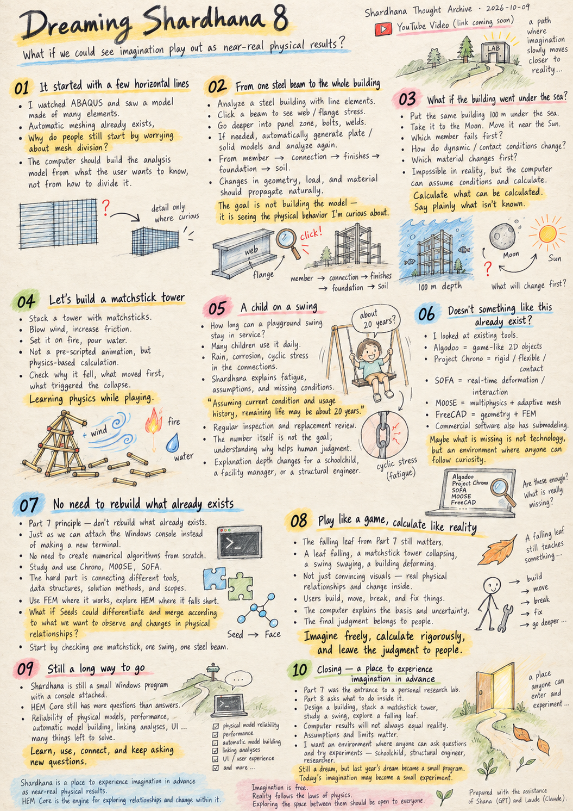
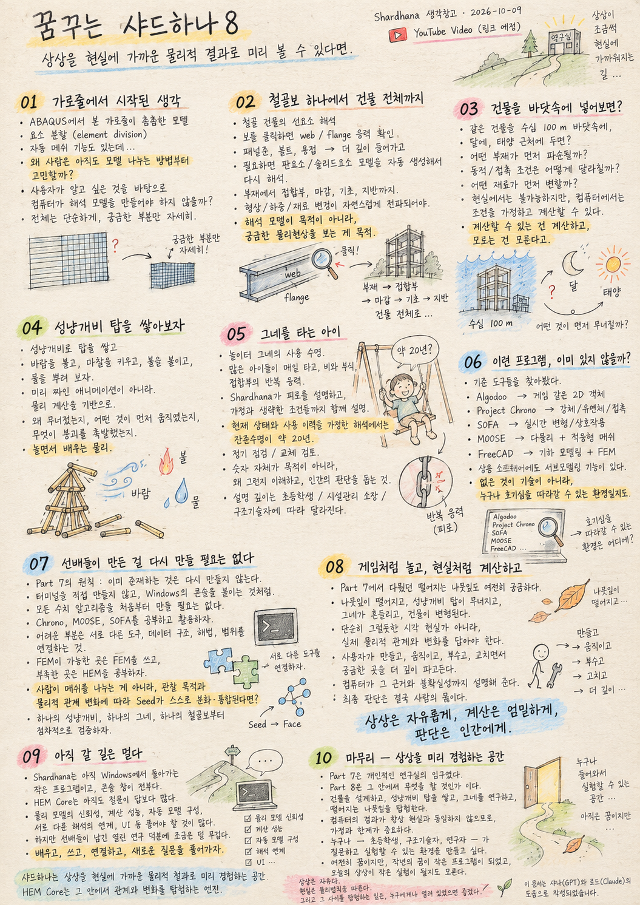

> Location: docs/thoughts/dreaming-shardhana8-notes.md

# Dreaming Shardhana 8
### What if we could see our imagination play out as near-real physical results?
*(Shardhana Thought Archive)*
*Date: 2026-10-09*

## 🎬 YouTube Video

[Watch on YouTube](https://youtu.be/KnJLbMc71G0)

  

---

## 01. It started with a few horizontal lines

I happened to watch a video of someone building an analysis model in ABAQUS. A simple rectangle, with horizontal lines drawn densely across it — the model being divided into elements.

Of course, automatic meshing exists. Still, a question came to mind: **why do people still have to start by worrying about how to divide a model?** Couldn't the computer build the analysis model itself, based on what the user actually wants to know? Keep the whole thing simple, and go into detail only where you're curious.

---

## 02. From a single steel beam to the whole building

Say you've analyzed a steel building with line elements. You click on one beam and see the stress distribution across its web and flanges. Curious about a panel zone? Select it. Curious about the bolts or welds? Go deeper. Whatever the line elements can tell you is shown right away; where local behavior matters, plate or solid models are generated automatically and the analysis runs again.

From members to connections, finishes, foundations, and the soil beneath. Change the geometry, loads, or materials, and the model simply follows. Building the analysis model isn't the goal — **seeing the physical behavior I'm curious about is.**

---

## 03. What if you dropped the building into the sea?

I let my imagination wander a bit. What if the building I'm designing right now were placed 100 m under the sea — which member would fail first? Take it to the Moon, and its self-weight drops, but how would its dynamic behavior or contact conditions change? Move it close to the Sun — which material starts to change first?

These experiments are impossible in reality, but inside a computer we can at least assume the conditions and calculate. Not everything can be calculated precisely, of course. Then the program should explain its own limits: **calculate what can be calculated, and say plainly what isn't known.**

---

## 04. Let's build a matchstick tower

It doesn't have to be a grand building. Stack up a small tower of matchsticks. Blow some wind at it. Increase the friction. Set it on fire. Pour water on it.

What if the result weren't an animation a game developer scripted in advance, but a calculation grounded in the laws of physics? What if you could check why it fell, what moved first, and what actually triggered the collapse? You'd be playing — and somewhere along the way, you'd be learning physics.

---

## 05. A child on a swing

How long can a playground swing stay in service? If several children take turns on it every day, and rain starts corroding the connections, where does cyclic stress build up?

Shardhana should start by explaining what fatigue is, what materials and loads were assumed, and what conditions the calculation leaves out. If the result is reliable enough, it might offer an opinion like this:

> "Based on the assumed current condition and usage history, the remaining life is estimated at about 20 years. However, this may vary with corrosion and the condition of the connections, so regular inspection and a review of replacement timing are recommended."

The 20 years is just an example. What matters isn't the number — **it's understanding why that result came out, so that a person can make the judgment.**

For a schoolchild, a simple explanation. For a facility manager, a maintenance perspective. For a structural engineer, stress ranges, S-N curves, and cumulative damage. The same phenomenon — only the depth of explanation changes.

---

## 06. Doesn't something like this already exist?

I can't be the only person who imagines things like this. So I went looking.

Algodoo lets you build and move 2D objects like a game. Project Chrono computes rigid and flexible bodies and contact. SOFA handles real-time deformation and interaction. MOOSE covers multiphysics and adaptive meshing, and FreeCAD links geometric modeling with FEM. Submodeling — cutting out part of a global model to examine it in detail — already exists in commercial software too.

It wasn't that the physics simulation technology was missing. But in this search, I couldn't find a single program that lets you do everything I'm imagining naturally, in one environment. **What seems to be missing isn't the technology — it's an environment anyone can use to follow their own curiosity.**

---

## 07. No need to rebuild what others have already built

A principle that became clear in Part 7 came back to mind: **don't rebuild what already exists.** Just as I attached the existing Windows console instead of writing a new terminal, there's no need to develop numerical algorithms from scratch either. We can study open-source work like Chrono, MOOSE, and SOFA, and use the parts we need. Connecting different programs isn't easy, of course — their data structures, solution methods, and scopes all differ.

Where existing FEM works, use FEM; where it falls short, explore with HEM. The question from Section 01 leads right back here: **instead of a person dividing the mesh, what if Seeds could differentiate and merge on their own, guided by what we want to observe and by changes in physical relationships?** That's where HEM's ideas about Seeds, Faces, and changing relationships can be tested, little by little.

The goal isn't to build a complete physical world from the start. It's to grow step by step — one matchstick, one swing, one steel beam at a time — checking each against real calculations.

---

## 08. Play like a game, calculate like reality

The falling leaf from Part 7 still fascinates me. A leaf falling, a matchstick tower collapsing, a swing swaying, a building deforming. I don't want these merely to look convincing — I want real physical relationships and change inside them.

Users build, move, break, and fix things freely, like in a game. Where they're curious, they dig deeper. The computer runs the analysis and explains its basis and its uncertainties. The final judgment belongs to people.

**Imagine freely, calculate rigorously, and leave the judgment to people.**

---

## 09. Still a long way to go

Right now, Shardhana is a small Windows program with a console attached, and HEM Core has far more questions than answers. Reliability of the physical models, computational performance, automatic model building, linking different kinds of analysis, the user interface — there's a lot left to solve.

Still, I feel a little lighter. There's a body of open research left by those who came before us. We can learn from it, use it, connect it — and work on the new questions we're curious about.

---

## 10. Closing — a place to experience imagination in advance

In Part 7, I called Shardhana the entrance to a personal research lab. In Part 8, I thought a little more concretely about what I want to do inside that lab: design a building, stack a matchstick tower, look closely at a swing, explore why a single leaf falls the way it does.

There's no guarantee that results inside a computer will always match reality. That's why understanding the assumptions and limits matters just as much. I don't want an environment where you have to master difficult analysis software before you can look at physical phenomena. I want one where anyone with a question can ask it and try an experiment — a schoolchild, a structural engineer, or a researcher.

It's still a dream. But just as last year's dream became a small program, today's imagination may one day become a small experiment.

---

> Shardhana is a place to experience imagination in advance as near-real physical results, and HEM Core is the engine for exploring relationships and change within it.

---

> Imagination is free.
>
> Reality follows the laws of physics.
>
> And exploring the space between them,
> I hope, can be open to everyone.

---

*This document was prepared with the assistance of Shana (GPT) and Laude (Claude).*

---
 
 

# 꿈꾸는 샤드하나8
### 상상을 현실에 가까운 물리적 결과로 미리 볼 수 있다면
*(Shardhana 생각창고)*
*Date: 2026-10-09*

## 🎬 YouTube Video

[Watch on YouTube](https://youtu.be/fgbCTEpr5D4)

  

---

## 01. 가로줄에서 시작된 생각

우연히 ABAQUS로 해석 모델을 만드는 영상을 봤다. 직사각형 모델에 가로줄이 촘촘히 그어져 있었다. 요소를 분할하는 과정이었다.

물론 자동 메쉬 기능도 있다. 그래도 문득 궁금해졌다. **왜 사람은 아직도 모델을 나누는 방법부터 고민해야 할까?** 사용자가 무엇을 알고 싶은지에 따라 컴퓨터가 알아서 해석 모델을 구성하면 되지 않을까. 전체는 간단하게, 궁금한 부분은 자세하게.

---

## 02. 철골보 하나에서 건물 전체까지

철골건물을 선형요소로 해석했다고 하자. 특정 보를 클릭해 웹과 플랜지의 응력 분포를 본다. 패널존이 궁금하면 그 부분을 선택하고, 볼트나 용접부가 궁금하면 더 깊이 들어간다. 선형요소로 알 수 있는 건 바로 보여주고, 국부 거동이 필요하면 판요소나 솔리드요소 모델을 자동으로 만들어 다시 계산한다.

구조부재에서 접합부, 마감재, 기초, 지반까지. 형상·하중·재료를 바꾸면 그 변화가 자연스럽게 반영된다. 해석 모델을 만드는 게 목적이 아니라, **궁금한 물리현상을 보는 게 목적**이니까.

---

## 03. 건물을 바닷속에 넣어보면?

엉뚱한 상상도 해봤다. 지금 설계하는 건물을 바닷속 100m에 넣으면 어떤 부재가 먼저 문제가 생길까? 달에 가져가면 자중은 줄겠지만 동적 거동이나 접촉 상태는 어떻게 달라질까? 태양 가까이 가면 어떤 재료가 먼저 변할까?

현실에서는 불가능한 실험이지만, 컴퓨터 안에서는 조건을 가정하고 계산해볼 수 있다. 물론 모든 걸 정확히 계산할 수는 없다. 그렇다면 프로그램이 그 한계를 설명하면 된다. **계산할 수 있는 건 계산하고, 모르는 건 모른다고 알려주는 것.**

---

## 04. 성냥개비 탑을 쌓아보자

거창한 건물이 아니어도 좋다. 성냥개비 탑 하나를 쌓고, 바람을 불어보고, 마찰을 키워보고, 불을 붙이고, 물을 뿌려본다.

그 결과가 게임 개발자가 정해둔 애니메이션이 아니라 물리법칙에 근거한 계산이라면? 왜 넘어졌는지, 무엇이 먼저 움직였는지, 무엇이 붕괴의 원인이었는지 확인할 수 있다면? 놀고 있었는데 어느새 물리를 공부하고 있는 셈이다.

---

## 05. 그네를 타는 아이

놀이터 그네는 얼마나 오래 쓸 수 있을까? 매일 여러 아이가 번갈아 타고, 비를 맞아 연결부가 부식되기 시작한다면 어디에 반복응력이 쌓일까?

샤드하나는 먼저 피로가 무엇인지, 어떤 재료와 하중을 가정했는지, 계산에서 빠진 조건은 무엇인지 설명하면 된다. 결과가 충분히 신뢰할 만하다면 이런 의견도 줄 수 있다.

> "현재 상태와 사용 이력을 가정한 해석에서는 잔존수명이 약 20년으로 추정됩니다. 다만 부식과 접합부 상태에 따라 달라질 수 있으므로 정기점검과 교체 검토가 필요합니다."

20년은 예시일 뿐이다. 중요한 건 숫자가 아니라 **왜 그런 결과가 나왔는지 이해하고, 사람이 판단할 수 있게 하는 것.**

초등학생에게는 쉽게, 시설관리 소장에게는 유지관리 관점으로, 구조기술자에게는 응력범위와 S-N 곡선, 누적손상까지. 같은 현상에 설명의 깊이만 달라진다.

---

## 06. 이런 프로그램, 이미 있지 않을까?

이런 상상을 하는 사람이 나뿐일 리 없다. 그래서 찾아봤다.

Algodoo는 게임처럼 2D 물체를 만들고 움직일 수 있다. Project Chrono는 강체·유연체·접촉을 계산하고, SOFA는 실시간 변형과 상호작용을 다룬다. MOOSE는 다중물리와 적응형 메쉬를, FreeCAD는 형상 모델링과 FEM을 잇고 있다. 전체 모델에서 일부를 떼어 자세히 보는 서브모델링도 상용 프로그램에는 이미 있다.

물리해석 기술이 없는 게 아니었다. 다만 내가 상상하는 것들을 하나의 환경에서 자연스럽게 쓰는 프로그램은 이번 조사에서 찾지 못했다. **부족한 건 기술이 아니라, 누구나 호기심대로 쓸 수 있는 환경인 것 같았다.**

---

## 07. 선배들이 만든 걸 다시 만들 필요는 없다

7탄에서 선명해진 원칙이 다시 떠올랐다. **이미 존재하는 것은 다시 만들지 않는다.** 터미널을 새로 만들지 않고 Windows 콘솔을 붙였듯, 수치 알고리즘도 처음부터 만들 필요는 없다. Chrono, MOOSE, SOFA 같은 오픈소스 성과를 살펴보고 필요한 부분을 활용하면 된다. 물론 서로 다른 프로그램을 잇는 건 쉽지 않다. 데이터 구조도, 계산 방법도, 적용 범위도 다르다.

기존 FEM으로 되는 건 FEM으로, 부족한 부분은 HEM에서 연구한다. 01의 질문도 결국 여기로 이어진다. **사람이 메쉬를 나누는 게 아니라, 관찰 목적과 물리적 관계의 변화에 따라 Seed가 스스로 분화하고 통합된다면?** HEM의 Seed와 Face, 변화하는 관계에 대한 생각을 그 안에서 조금씩 검증해볼 수 있을 것이다.

처음부터 완성된 물리 세계를 만들려는 게 아니다. 성냥개비 하나, 그네 하나, 철골보 하나를 실제 계산과 비교하며 조금씩 넓혀가는 것이다.

---

## 08. 게임처럼 놀고, 현실처럼 계산하고

7탄의 낙엽 하나는 여전히 궁금하다. 낙엽이 떨어지고, 성냥개비 탑이 무너지고, 그네가 흔들리고, 건물이 변형되는 과정. 그걸 그럴듯하게 보여주는 게 아니라, 그 안에 실제 물리적 관계와 변화가 들어 있었으면 좋겠다.

사용자는 게임처럼 만들고, 움직이고, 부숴보고, 다시 고친다. 궁금한 곳은 더 깊이 들어간다. 컴퓨터는 해석을 수행하고 계산 근거와 불확실성을 설명한다. 최종 판단은 사람이 한다.

**상상은 자유롭게, 계산은 엄밀하게, 판단은 인간에게.**

---

## 09. 아직 갈 길은 멀다

지금 샤드하나는 콘솔 하나 붙은 작은 Windows 프로그램이고, HEM Core는 답보다 질문이 훨씬 많다. 물리 모델의 신뢰성, 계산 성능, 자동 모델 구성, 서로 다른 해석의 연결, 사용자 인터페이스까지 풀어야 할 문제가 많다.

그래도 마음은 조금 가벼워졌다. 선배들이 남긴 공개 연구 성과가 있으니까. 배우고, 활용하고, 연결하면서 우리가 궁금한 새로운 문제를 풀어가면 된다.

---

## 10. 마무리 — 상상을 미리 경험하는 공간

7탄에서는 샤드하나를 개인 연구소의 입구라고 했다. 8탄에서는 그 연구소에서 무엇을 하고 싶은지 조금 더 구체적으로 생각해봤다. 건물을 설계하고, 성냥개비 탑을 쌓고, 그네를 살펴보고, 낙엽 하나가 떨어지는 이유를 탐험하는 것.

컴퓨터 안의 결과가 늘 현실과 같다는 보장은 없다. 그래서 가정과 한계를 함께 이해하는 게 중요하다. 어려운 해석 프로그램을 배워야만 물리현상을 볼 수 있는 환경이 아니라, 궁금하면 누구나 질문하고 실험해볼 수 있는 환경을 만들고 싶다. 초등학생이든, 구조기술자든, 연구자든.

아직은 꿈이다. 하지만 작년의 꿈이 작은 프로그램 하나로 이어졌듯, 오늘의 상상도 언젠가 작은 실험 하나로 이어질 수 있을 것이다.

---

> 샤드하나는 상상을 현실에 가까운 물리적 결과로 미리 경험하는 공간이고, HEM Core는 그 안에서 관계와 변화를 탐험하는 엔진이다.

---

> 상상은 자유다.
>
> 현실은 물리법칙을 따른다.
>
> 그리고 그 사이를 탐험하는 일은,
> 누구에게나 열려 있었으면 좋겠다.

---

*이 문서는 샤나(GPT)와 로드(Claude)의 도움으로 작성되었습니다.*
