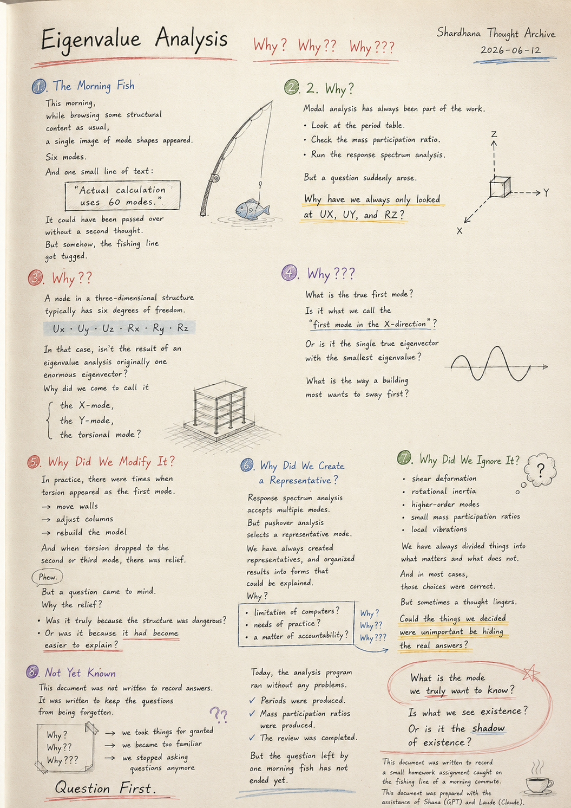
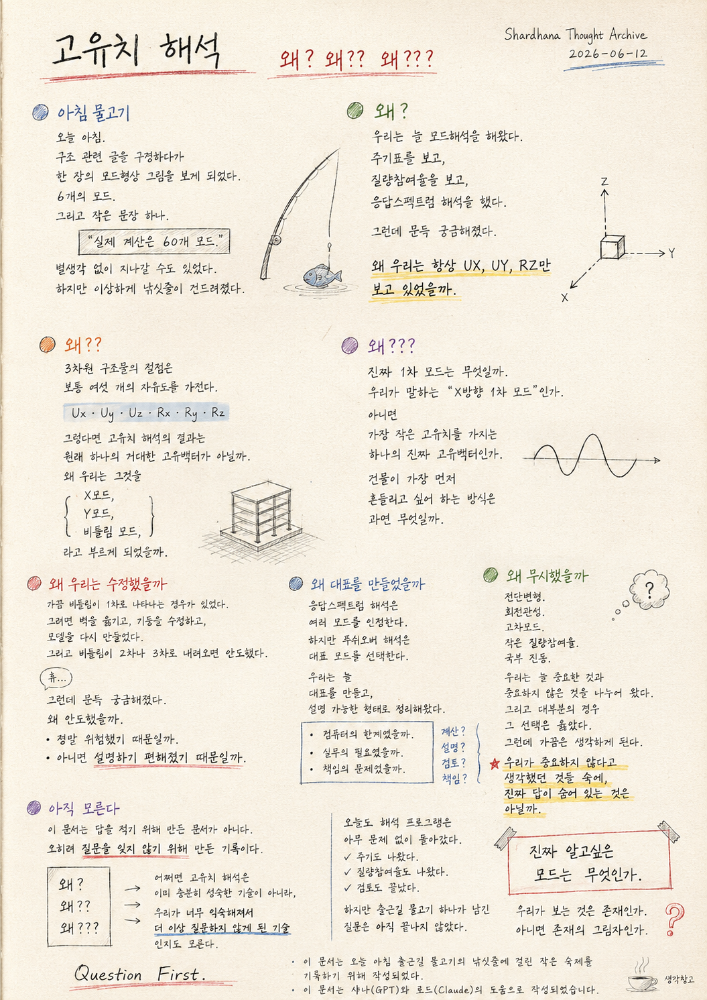

> Location: `docs/thoughts/eigenvalue-analysis-notes.md`

# Eigenvalue Analysis

*(Why? Why?? Why???)*
*(Shardhana Thought Archive)*
*2026-06-12*

  

---

## The Morning Fish

This morning.

While browsing through some structural engineering content as usual,
a single image of mode shapes appeared.

Six modes.

And one small line of text:

> "Actual calculation uses 60 modes."

It could have been passed over without a second thought.

But somehow, the fishing line got tugged.

---

## Why?

Modal analysis has always been part of the work.

Look at the period table.
Check the mass participation ratio.
Run the response spectrum analysis.

But a question suddenly arose.

**Why have we always only looked at UX, UY, and RZ?**

---

## Why??

A node in a three-dimensional structure typically has six degrees of freedom.

Ux · Uy · Uz · Rx · Ry · Rz

In that case, isn't the result of an eigenvalue analysis
originally one enormous eigenvector?

Why did we come to call it

the X-mode,

the Y-mode,

the torsional mode?

---

## Why???

What is the true first mode?

Is it what we call the **"first mode in the X-direction"?**

Or is it the single true eigenvector
with the smallest eigenvalue?

What is the way a building most wants to sway first?

---

## Why Did We Modify It?

In practice, there were times when torsion appeared as the first mode.

When that happened, walls were moved,
columns were adjusted,
and the model was rebuilt.

And when torsion dropped to the second or third mode, there was relief.

*Phew.*

But a question came to mind.

Why the relief?

Was it truly because the structure had been dangerous?

Or was it because it had become **easier to explain?**

---

## Why Did We Create a Representative?

Response spectrum analysis accepts multiple modes.

But pushover analysis selects a representative mode.

We have always
created representatives,
and organized results into forms that could be explained.

Why?

Was it the limitation of computers?

The needs of practice?

A matter of accountability?

---

## Why Did We Ignore It?

Shear deformation.
Rotational inertia.
Higher-order modes.
Small mass participation ratios.
Local vibrations.

We have always divided things into
what matters and what does not.

And in most cases,
those choices were correct.

But sometimes a thought lingers.

Could the things we decided were unimportant
be hiding **the real answers?**

---

## Not Yet Known

This document was not written to record answers.

It was written
**to keep the questions from being forgotten.**

Why?

Why??

Why???

Perhaps eigenvalue analysis is not
a fully mature technology —

but one we have grown so accustomed to
that **we stopped asking questions.**

---

Today, the analysis program ran without any problems.

Periods were produced.

Mass participation ratios were produced.

The review was completed.

But the question left by one morning fish
has not ended yet.

**What is the mode we truly want to know?**

Is what we see existence?

Or is it the shadow of existence?

---

*Question First.*

*This document was written to record a small homework assignment caught on the fishing line of a morning commute.*

*This document was prepared with the assistance of Shana (GPT) and Laude (Claude).*

---
 
 

# 고유치 해석

*(왜? 왜?? 왜???)*
*(Shardhana Thought Archive)*
*2026-06-12*

  

---

## 아침 물고기

오늘 아침.

평소처럼 구조 관련 글을 구경하다가
한 장의 모드형상 그림을 보게 되었다.

6개의 모드.

그리고 작은 문장 하나.

> "실제 계산은 60개 모드."

별생각 없이 지나갈 수도 있었다.

하지만 이상하게 낚싯줄이 건드려졌다.

---

## 왜?

우리는 늘 모드해석을 해왔다.

주기표를 보고,
질량참여율을 보고,
응답스펙트럼 해석을 했다.

그런데 문득 궁금해졌다.

**왜 우리는 항상 UX, UY, RZ만 보고 있었을까.**

---

## 왜??

3차원 구조물의 절점은 보통 여섯 개의 자유도를 가진다.

Ux · Uy · Uz · Rx · Ry · Rz

그렇다면 고유치 해석의 결과는
원래 하나의 거대한 고유벡터가 아닐까.

왜 우리는 그것을

X모드,

Y모드,

비틀림 모드,

라고 부르게 되었을까.

---

## 왜???

진짜 1차 모드는 무엇일까.

우리가 말하는 **"X방향 1차 모드"** 인가.

아니면

가장 작은 고유치를 가지는
하나의 진짜 고유벡터인가.

건물이 가장 먼저 흔들리고 싶어 하는 방식은
과연 무엇일까.

---

## 왜 우리는 수정했을까

실무를 하다 보면
가끔 비틀림이 1차로 나타나는 경우가 있었다.

그러면 벽을 옮기고,
기둥을 수정하고,
모델을 다시 만들었다.

그리고 비틀림이 2차나 3차로 내려오면 안도했다.

*휴…*

그런데 문득 궁금해졌다.

왜 안도했을까.

정말 위험했기 때문일까.

아니면 **설명하기 편해졌기 때문**일까.

---

## 왜 대표를 만들었을까

응답스펙트럼 해석은 여러 모드를 인정한다.

하지만 푸쉬오버 해석은 대표 모드를 선택한다.

우리는 늘
대표를 만들고,
설명 가능한 형태로 정리해왔다.

왜였을까.

컴퓨터의 한계였을까.

실무의 필요였을까.

책임의 문제였을까.

---

## 왜 무시했을까

전단변형.
회전관성.
고차모드.
작은 질량참여율.
국부 진동.

우리는 늘 중요한 것과
중요하지 않은 것을 나누어 왔다.

그리고 대부분의 경우
그 선택은 옳았다.

그런데 가끔은 생각하게 된다.

우리가 중요하지 않다고 생각했던 것들 속에,

**진짜 답이 숨어 있는 것은 아닐까.**

---

## 아직 모른다

이 문서는 답을 적기 위해 만든 문서가 아니다.

오히려
**질문을 잊지 않기 위해** 만든 기록이다.

왜?

왜??

왜???

어쩌면 고유치 해석은
이미 충분히 성숙한 기술이 아니라,

우리가 너무 익숙해져서
**더 이상 질문하지 않게 된 기술**인지도 모른다.

---

오늘도 해석 프로그램은
아무 문제 없이 돌아갔다.

주기도 나왔다.

질량참여율도 나왔다.

검토도 끝났다.

하지만 출근길 물고기 하나가 남긴 질문은
아직 끝나지 않았다.

**진짜 알고싶은 모드는 무엇인가.**

우리가 보는 것은 존재인가.

아니면 존재의 그림자인가.

---

*Question First.*

*이 문서는 오늘 아침 출근길 물고기의 낚싯줄에 걸린 작은 숙제를 기록하기 위해 작성되었다.*

*이 문서는 샤나(GPT)와 로드(Claude)의 도움으로 작성되었습니다.*
