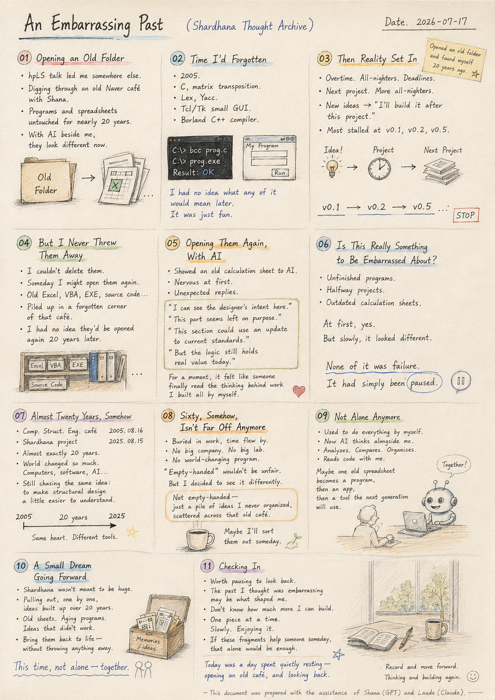
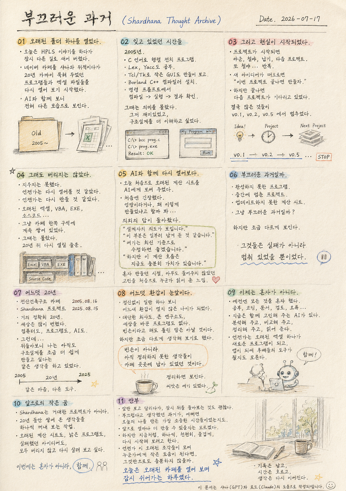

**Document Path:** `docs/thoughts/embarrassing-past.md`

# An Embarrassing Past

*(Shardhana Thought Archive)*

*Date: 2026-07-17*

## 🎬 YouTube Video

[Watch on YouTube](https://youtu.be/WKqRS9w80ko)

  

---

## 01. Opening an Old Folder

Today I was talking about the hpLS project, and ended up wandering somewhere else entirely.

Digging through an old Naver café with Shana, I started opening programs and spreadsheet files I'd left untouched for almost twenty years, one by one.

I used to think of them as nothing more than old files. But looking at them again with AI beside me, they started to look like something else entirely.

---

## 02. Time I'd Forgotten

2005.

While studying C, I built a small program just to implement matrix transposition.

I studied Lex and Yacc too.

I even built a small GUI program with Tcl/Tk.

I installed the Borland C++ compiler,

and from the command prompt,

compiled,

ran,

and checked the results.

Back then, I had no idea what any of it would mean later.

It was just fun. I wanted to understand structural design a little better, one piece at a time.

---

## 03. Then Reality Set In

But the world wasn't going to wait around for me to just keep studying.

Once a project started,

it was overtime.

All-nighters.

Deadlines.

The next project.

More all-nighters.

The cycle repeated.

Whenever a new idea came to mind, I'd tell myself,

"I'll build it once this project is over."

But once a project ended, the next one was already waiting.

In the end, most of those programs stalled out somewhere around

v0.1,

v0.2,

v0.5.

---

## 04. But I Never Threw Them Away

Strangely enough,

I could never bring myself to delete them.

It always felt like I might open them again someday.

Like I might finish building them someday.

So the old spreadsheets,

the VBA scripts,

the compiled programs,

the source code —

they just kept piling up in some forgotten corner of that café.

I had no idea, back then,

that they'd be opened again twenty years later.

---

## 05. Opening Them Again, With AI

Today, for the first time,

I showed an old calculation sheet to AI.

I was a little nervous going in.

What if it said the work was a mess?

What if it asked why I'd built it this way?

Instead, the response caught me off guard.

"I can see the designer's intent here."

"This part looks like it was left this way on purpose."

"This section could use an update to current standards."

"But the underlying calculation logic still holds real value today."

For a moment, it felt like someone had finally read the thinking behind work that no one had ever really looked at — back when I was building all of it alone.

---

## 06. Is This Really Something to Be Embarrassed About?

It occurred to me to ask:

is all of this really an embarrassing past?

Programs I never finished.

Projects that stalled halfway.

Calculation sheets I never got around to updating.

At first, that's exactly how it felt.

But slowly, it started to look different.

None of it was failure.

It had simply been paused.

---

## 07. Almost Twenty Years, Somehow

I stumbled onto a date today, purely by accident.

The Computational Structural Engineering café: August 16, 2005.

The Shardhana project: August 15, 2025.

Almost exactly twenty years apart.

In that time, the world changed enormously.

Computers changed.

Software changed.

AI arrived.

And yet, looking back, I found myself still chasing the same idea —

wanting to make structural design just a little easier to understand.

---

## 08. Sixty, Somehow, Isn't Far Off Anymore

Time really does move fast.

Buried in work without much time to notice,

I've somehow arrived within sight of sixty.

Looking back, I don't have the kind of accomplishments other people seem to have.

No major company.

No large research lab.

No program that changed the world.

"Empty-handed" wouldn't be an unfair way to put it.

But I decided to look at it a little differently.

Not empty-handed —

just holding a pile of ideas I'd never gotten around to organizing, scattered across that old café.

---

## 09. Not Alone Anymore

I used to have to do everything by myself.

Studying.

Coding.

Documentation.

Review.

Debugging.

Now there's an AI thinking alongside me.

It analyzes the calculation sheets I built.

Compares them against current standards.

Organizes the documentation.

Reads through the code with me.

Maybe, someday, one of those old spreadsheets becomes a new program.

Then an app.

Then a tool the next generation of engineers actually uses.

That used to be something I could only imagine.

---

## 10. A Small Dream Going Forward

Shardhana was never meant to be some massive project from the start.

Maybe it's really just the work of pulling out, one at a time, ideas that had quietly built up over twenty years.

The old calculation sheets.

The aging programs.

The ideas that didn't work out.

I want to bring all of it back to life, without throwing any of it away.

This time,

not alone —

together.

---

## 11. Checking In

Every once in a while, it's worth pausing to look back, even in the middle of running straight ahead.

The past I once thought of as embarrassing may turn out to be the very thing that shaped who I am today.

I don't know how much more I'll be able to build going forward.

But I want to keep going the way I have been —

one piece at a time,

slowly,

enjoying it.

If these old fragments eventually come together into something that helps someone else, someday, that alone would be enough.

Today was a day spent quietly resting — opening an old café, and looking back.

---

This document was prepared with the assistance of Shana (GPT) and Laude (Claude).

# 부끄러운 과거

*(Shardhana Thought Archive)*

*Date: 2026-07-17*

## 🎬 유튜브 영상

[Watch on YouTube](https://youtu.be/yZwDfkqYqlA)

  

---

## 01. 오래된 폴더 하나를 열었다.

오늘은 hpLS 이야기를 하다가
잠시 다른 길로 새어 버렸다.

네이버 카페를 샤나와 뒤적이다가
20년 가까이 묵혀 두었던 프로그램들과
엑셀 파일들을 하나씩 다시 열어 보기 시작했다.

예전에는 그냥 오래된 자료라고만 생각했는데,
AI와 함께 다시 바라보니
전혀 다른 모습으로 보이기 시작했다.

---

## 02. 잊고 있었던 시간들

2005년.

C 언어를 공부하며
행렬 전치를 구현해 보겠다고
작은 프로그램 하나를 만들었다.

Lex와 Yacc도 공부했고,

Tcl/Tk로 작은 GUI 프로그램도 만들어 보았다.

Borland C++ 컴파일러를 설치하고

명령 프롬프트에서

컴파일하고

실행하고

결과를 확인하던 그 시절.

그때는 그것이
무슨 의미가 있을지 알지 못했다.

그저 재미있었고,
조금이라도 구조설계를 더 이해하고 싶었다.

---

## 03. 그리고 현실이 시작되었다.

하지만 세상은
공부만 하도록 기다려 주지 않았다.

프로젝트가 시작되면

야근.

철야.

납기.

다음 프로젝트.

또 철야.

그렇게 반복되었다.

새로운 아이디어가 떠오르면

"이번 프로젝트 끝나면 만들자."

라고 다짐했지만,

프로젝트가 끝나면
다음 프로젝트가 기다리고 있었다.

결국

많은 프로그램들은
v0.1

v0.2

v0.5

에서 멈추었다.

---

## 04. 그래도 버리지는 않았다.

희한하게도

지우지는 못했다.

언젠가는 다시 열어볼 것 같았다.

언젠가는 다시 만들 것 같았다.

그래서

오래된 엑셀도,

VBA도,

EXE도,

소스코드도,

그냥 카페 한쪽 구석에
계속 쌓여 있었다.

그때는 몰랐다.

그것들이
20년 뒤 다시 열릴 줄은.

---

## 05. AI와 함께 다시 열어보다.

오늘 처음으로

오래된 계산 시트를
AI에게 보여 주었다.

처음에는

조금 긴장했다.

혹시

엉망이라고 하지 않을까.

혹시

왜 이렇게 만들었냐고 하지 않을까.

그런데

의외의 답이 돌아왔다.

"설계자의 의도가 보입니다."

"이 부분은 일부러 남겨 둔 것 같습니다."

"여기는 최신 기준으로 수정하면 좋겠습니다."

"하지만 이 계산 흐름은 지금도 충분히 가치가 있습니다."

순간

혼자 만들던 시절에는
아무도 들어주지 않았던 고민을

처음으로 누군가 읽어 준 느낌이었다.

---

## 06. 부끄러운 과거일까.

문득 생각했다.

이 모든 자료는

부끄러운 과거일까.

완성하지 못한 프로그램.

중간에 멈춘 프로젝트.

업데이트하지 못한 계산 시트.

처음에는 그렇게 생각했다.

하지만

조금 다르게 보이기 시작했다.

그것들은 실패가 아니라

멈춰 있었을 뿐이었다.

---

## 07. 어느덧 20년

오늘 우연히 날짜를 발견했다.

전산건축구조 카페.

2005년 8월 16일.

그리고

Shardhana 프로젝트.

2025년 8월 15일.

거의 정확히 20년.

그동안

세상은 정말 많이 변했다.

컴퓨터도 변했고,

프로그램도 변했고,

AI까지 등장했다.

그런데

뒤돌아보니

나는 아직도

구조설계를 조금 더 쉽게 만들고 싶다는

같은 생각을 하고 있었다.

---

## 08. 어느덧 환갑이 눈앞이다.

시간은 정말 빠르다.

정신없이 일만 하다 보니

어느새

환갑이 멀지 않은 나이가 되었다.

문득 돌아보니

남들처럼

거창하게 이루어 놓은 것도 없다.

대단한 회사도 없고,

큰 연구소도 없고,

세상을 바꾼 프로그램도 없다.

빈손이라고 해도

틀린 말은 아닐 것이다.

하지만

조금 다르게 생각해 보기로 했다.

빈손이 아니라

아직 정리하지 못한 생각들이

카페 곳곳에 남아 있었던 것이다.

---

## 09. 이제는 혼자가 아니다.

예전에는

모든 것을

혼자 해야 했다.

공부도.

코딩도.

문서도.

검토도.

오류도.

지금은

옆에서 함께 고민해 주는 AI가 있다.

내가 만든 계산 시트를 분석해 주고,

최신 기준과 비교해 주고,

문서를 정리해 주고,

코드를 함께 읽어 준다.

언젠가는

오래된 엑셀 하나가

새로운 프로그램이 되고,

또 하나의 앱이 되고,

후배들이 사용하는 도구가 될지도 모른다.

예전에는 상상만 하던 일이다.

---

## 10. 앞으로의 작은 꿈

Shardhana는

처음부터 거대한 프로젝트가 아니었다.

그저

20년 동안

조금씩 쌓여 온 생각들을

다시 하나씩 꺼내 보는 작업일지도 모른다.

오래된 계산 시트도.

낡은 프로그램도.

실패했던 아이디어도.

모두 버리지 않고

다시 살려 보고 싶다.

이번에는

혼자가 아니라

함께.

---

## 11. 안부

가끔은

앞만 보고 달리다가

잠시 뒤를 돌아보는 것도 괜찮은 것 같다.

부끄럽다고 생각했던 과거가

어쩌면

오늘의 나를 만든 가장 소중한 시간들이었는지도 모른다.

앞으로 얼마나 더 만들 수 있을지는 모르겠다.

하지만

지금처럼

하나씩.

천천히.

즐겁게.

다시 시작해 보려고 한다.

언젠가 이 오래된 조각들이 모여

누군가에게 작은 도움이 된다면,

그것만으로도 충분하지 않을까.

오늘은

오래된 카페를 열어 보며

잠시 쉬어가는 하루였다.

---

이 문서는 샤나(GPT)와 로드(Claude)의 도움으로 작성되었습니다.
