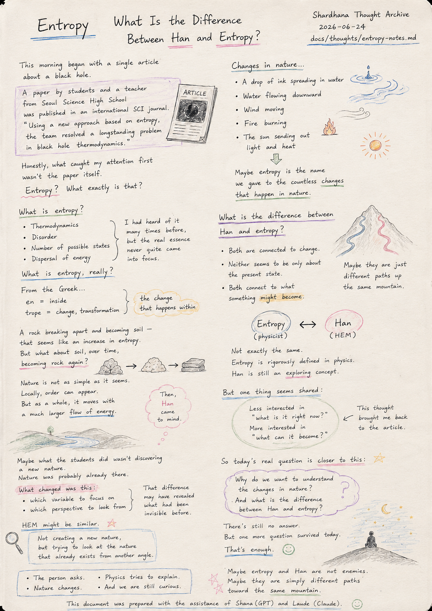
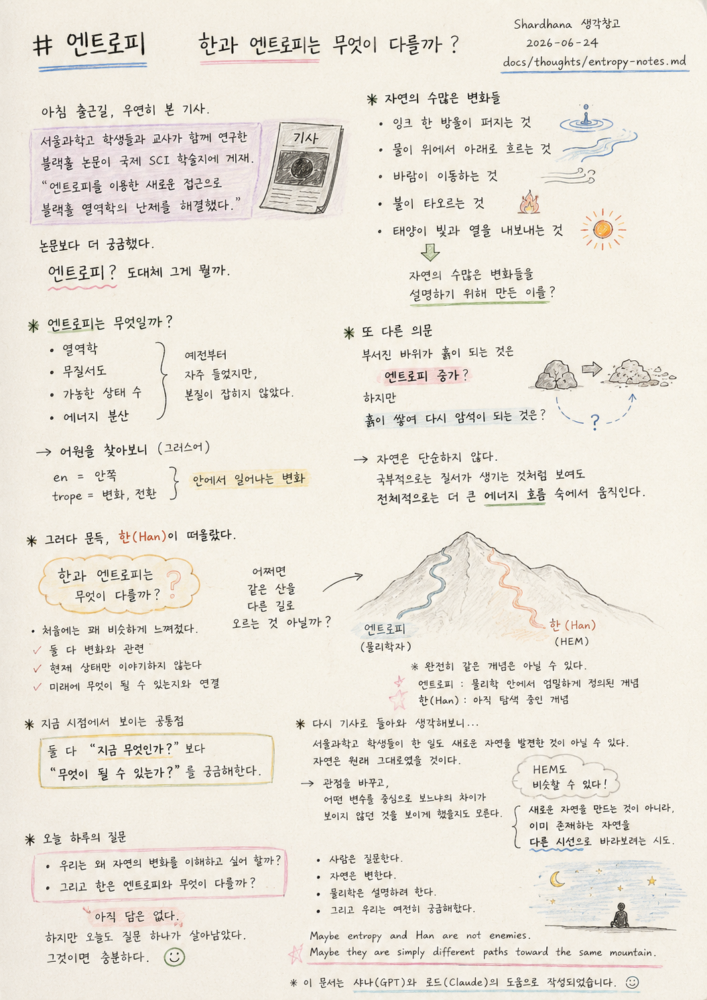

> Location: `docs/thoughts/entropy-notes.md`

# Entropy

### What Is the Difference Between Han and Entropy?

*(Shardhana Thought Archive)*  
*Date: 2026-06-24*

  

---

This morning began with a single article about a black hole.

Spotted by chance on the commute to work.

A research paper co-authored by students and a teacher
from Seoul Science High School
had been published in an international SCI journal.

The article included this line:

"Using a new approach based on entropy,
the team resolved a longstanding problem in black hole thermodynamics."

---

Honestly, the first thing that caught my attention
wasn't the paper itself.

Entropy?

What exactly is that?

---

Thinking back,

the word "entropy" had come up many times before.

Thermodynamics.

Disorder.

The number of possible states.

The dispersal of energy.

---

But something always felt off.

Even after hearing the explanations,

the real essence of it never quite came into focus.

---

And so the question began.

What is entropy, really?

---

Looking up the origin of the word,

it comes from Greek.

"En" — meaning inside.

"Trope" — meaning change or transformation.

Together, something like:

"the change that happens within."

---

That's when a slightly interesting thought arrived.

---

A drop of ink spreading through water.

Water flowing downward.

Wind moving from one place to another.

Fire burning.

The sun sending out light and heat.

---

Maybe entropy is simply the name

we gave to the countless changes

that happen in nature.

---

And then another question appeared.

---

A rock breaking apart and becoming soil —
that seems like an increase in entropy.

But what about soil compressing over time
and becoming rock again?

---

Here, nature turns out to be less simple than expected.

Locally, it can look like order is being created.

But as a whole, it moves alongside a much larger flow of energy.

---

And then, out of nowhere,

Han came to mind.

---

What is the difference between Han and entropy?

---

At first they felt quite similar.

Both are connected to change.

Neither seems to be only about the present state.

Both connect to the question of what something might become.

---

Which led to this thought:

Maybe Han and entropy

are two different paths up the same mountain.

---

A physicist calls it entropy.

HEM calls it Han.

---

Of course, they may not be exactly the same concept.

Entropy is defined with great precision within physics.

Han, by contrast, is still a concept being explored.

---

But at least one thing seems to be shared, for now.

---

Both are less interested in

"what is it right now?"

and more interested in

"what can it become?"

---

The thought circled back to the article.

---

Maybe what the students at Seoul Science High School did

wasn't discovering an entirely new nature.

Nature was probably already there, unchanged.

---

What shifted was this:

which variable to center the view on.

which perspective to look from.

That difference

may have made visible what had been invisible before.

---

HEM might be similar.

---

Not an attempt to create a new nature,

but an attempt to look at the nature that already exists

from a different angle.

---

So the real question of today

was less about black holes,

less about entropy,

and closer to this:

---

Why do we want to understand the changes happening in nature?

---

And what is the difference between Han and entropy?

---

There's still no answer.

But today, one more question survived.

That's enough.

---

*The person asks.*

*Nature changes.*

*Physics tries to explain.*

*And we are still curious.*

---

*Maybe entropy and Han are not enemies.*

*Maybe they are simply different paths toward the same mountain.*

---

*This document was prepared with the assistance of Shana (GPT) and Laude (Claude).*

---
 
 

# 엔트로피

### 한과 엔트로피는 무엇이 다를까?

*(Shardhana 생각창고)*  
*Date: 2026-06-24*

  

---

오늘 아침은 블랙홀 기사 하나로 시작했다.

출근길에 우연히 본 기사였다.

서울과학고 학생들과 교사가 함께 연구한 블랙홀 논문이
국제 SCI 학술지에 게재되었다는 내용이었다.

기사에는 이런 문장이 있었다.

"엔트로피를 이용한 새로운 접근으로
블랙홀 열역학의 난제를 해결했다."

---

솔직히 처음에는 논문보다 다른 것이 더 궁금했다.

엔트로피?

도대체 그게 뭘까.

---

기억을 더듬어 보니

엔트로피라는 단어는 예전부터 자주 들었다.

열역학.

무질서도.

가능한 상태 수.

에너지 분산.

---

하지만 늘 이상했다.

설명을 들어도

뭔가 본질이 잡히지 않았다.

---

그래서 질문이 시작되었다.

엔트로피는 무엇일까.

---

어원을 찾아보니

그리스어에서 왔다.

안쪽을 뜻하는 "en"

변화나 전환을 뜻하는 "trope"

그리고

"안에서 일어나는 변화"

정도로 해석할 수 있다는 이야기가 나온다.

---

그 순간 조금 재미있는 생각이 들었다.

---

잉크 한 방울이 물속으로 퍼지는 것.

물이 위에서 아래로 흐르는 것.

바람이 이동하는 것.

불이 타오르는 것.

태양이 빛과 열을 내보내는 것.

---

어쩌면 자연에서 일어나는 수많은 변화들을

설명하기 위해 만든 이름이

엔트로피 아닐까?

---

그러다 또 다른 의문이 생겼다.

---

부서진 바위가 흙이 되는 것은 엔트로피 증가라고 할 수 있을 것 같다.

하지만

흙이 쌓여 다시 암석이 되는 것은 무엇일까?

---

여기서 자연은 생각보다 단순하지 않다는 사실이 보인다.

국부적으로는 질서가 생기는 것처럼 보여도

전체적으로는 더 큰 에너지 흐름과 함께 움직인다.

---

그러다 문득

한(Han)이 떠올랐다.

---

한과 엔트로피는 무엇이 다를까?

---

처음에는 꽤 비슷하게 느껴졌다.

둘 다 변화와 관련되어 있다.

둘 다 현재 상태만 이야기하는 것 같지 않다.

둘 다 미래에 무엇이 될 수 있는지와 연결된다.

---

그래서 이런 생각도 들었다.

어쩌면

한과 엔트로피는

같은 산을 다른 길로 오르는 것 아닐까?

---

물리학자는 엔트로피라고 부르고,

HEM은 한이라고 부르는 것일 수 있다.

---

물론 완전히 같은 개념은 아닐 수 있다.

엔트로피는 물리학 안에서 매우 엄밀하게 정의되어 있다.

반면 한은 아직 탐색 중인 개념이다.

---

하지만 적어도 지금 시점에서 보이는 공통점은 있다.

---

둘 다

"지금 무엇인가?"

보다

"무엇이 될 수 있는가?"

를 궁금해한다는 점이다.

---

생각은 다시 기사로 돌아왔다.

---

어쩌면 서울과학고 학생들이 한 일도

전혀 새로운 자연을 발견한 것이 아닐 수 있다.

자연은 원래 그대로 있었을 것이다.

---

다만

어떤 변수를 중심으로 보느냐.

어떤 관점으로 보느냐.

그 차이가

보이지 않던 것을 보이게 만들었을지도 모른다.

---

HEM도 비슷할 수 있다.

---

새로운 자연을 만드는 것이 아니라,

이미 존재하는 자연을

다른 시선으로 바라보려는 시도.

---

그래서 오늘 하루의 질문은

블랙홀보다도

엔트로피보다도

오히려 이것에 가까웠다.

---

우리는 왜 자연의 변화를 이해하고 싶어 할까?

---

그리고

한은 엔트로피와 무엇이 다를까?

---

아직 답은 없다.

하지만 오늘도 질문 하나가 살아남았다.

그것이면 충분하다.

---

*사람은 질문한다.*

*자연은 변한다.*

*물리학은 설명하려 한다.*

*그리고 우리는 여전히 궁금해한다.*

---

*Maybe entropy and Han are not enemies.*

*Maybe they are simply different paths toward the same mountain.*

---

*이 문서는 샤나(GPT)와 로드(Claude)의 도움으로 작성되었습니다.*
