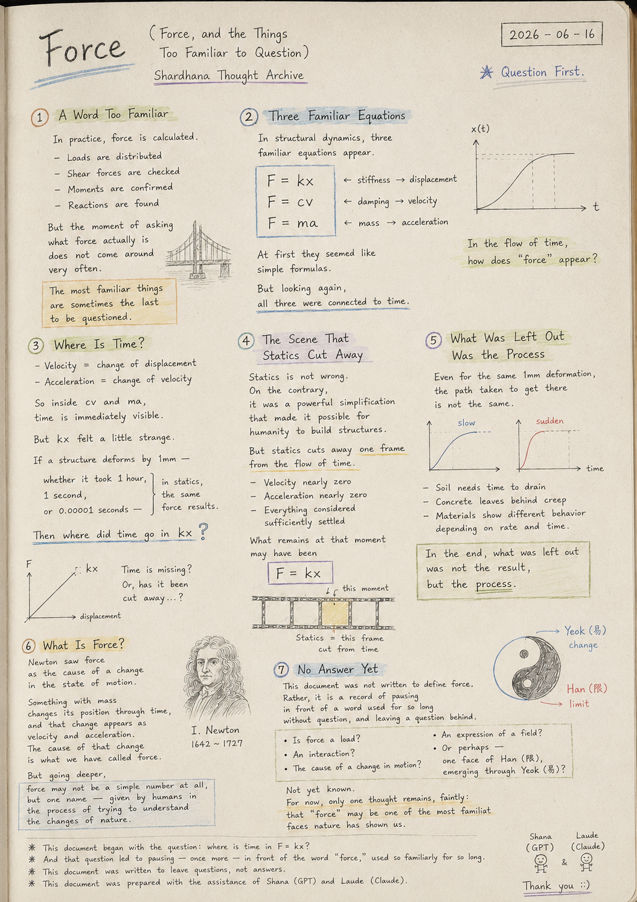
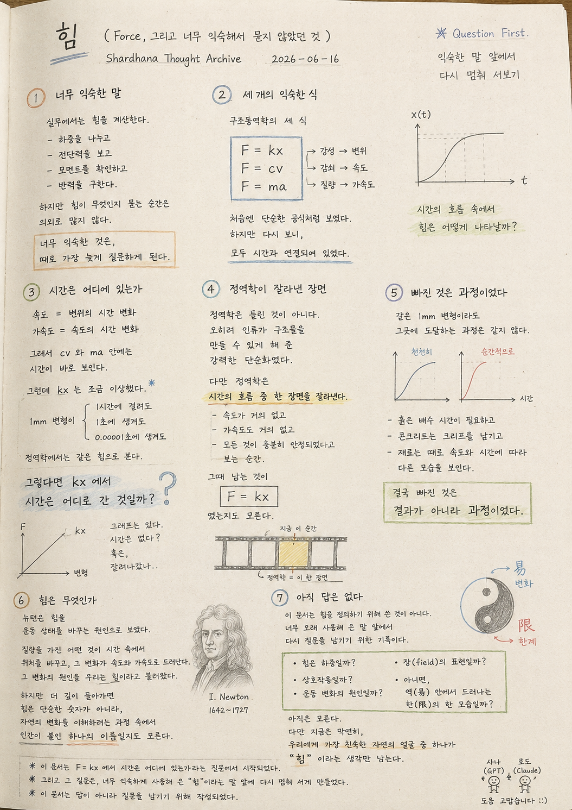

> Location: `docs/thoughts/force-notes.md`

# Force

*(Force, and the Things Too Familiar to Question)*
*(Shardhana Thought Archive)*
*2026-06-16*

<p align="center">
  
</p>

---

## A Word Too Familiar

In practice, force is calculated.

Loads are distributed,
shear forces are checked,
moments are confirmed,
reactions are found.

But the moment of asking what force actually is
does not come around very often.

The most familiar things
are sometimes the last to be questioned.

---

## Three Familiar Equations

In structural dynamics, three familiar equations appear.

```
F = kx
F = cv
F = ma
```

Stiffness responds to displacement.

Damping responds to velocity.

Mass responds to acceleration.

At first they seemed like simple formulas.

But looking again,

all three were connected to time.

---

## Where Is Time?

Velocity is the change in displacement over time.

Acceleration is the change in velocity over time.

So inside `cv` and `ma`,
time is immediately visible.

But `kx` felt a little strange.

If a structure deforms by 1mm —

whether that deformation took 1 hour,

1 second,

or 0.00001 seconds —

in statics, the same force results.

Then **where did time go in `kx`?**

---

## The Scene That Statics Cut Away

Statics is not wrong.

On the contrary, statics was a powerful simplification
that made it possible for humanity to build structures.

But statics cuts away **one frame** from the flow of time.

The moment when velocity is nearly zero,
acceleration is nearly zero,
and everything is considered sufficiently settled.

What remains at that moment

may have been

```
F = kx
```

---

## What Was Left Out Was the Process

Even for the same 1mm deformation,
the path taken to get there is not the same.

A material that deforms slowly
and a material that deforms suddenly
respond differently.

Soil needs time to drain.
Concrete leaves behind creep.
Materials sometimes show different behavior
depending on rate and time.

In the end, what was left out was not the result,

but **the process.**

---

## What Is Force?

Newton saw force as the cause of a change in the state of motion.

Something with mass
changes its position through time,
and that change appears as velocity and acceleration.

The cause of that change
is what we have called force.

But going deeper,

force may not be a simple number at all,
but **one name** —
given by humans in the process of trying to understand the changes of nature.

---

## No Answer Yet

This document was not written to define force.

Rather, it is a record of pausing in front of a word
used for so long without question,
and leaving a question behind.

Is force a load?

An interaction?

The cause of a change in motion?

An expression of a field?

Or perhaps —

one face of Han (限),
emerging through Yeok (易)?

Not yet known.

For now, only one thought remains, faintly:

that **"force"** may be one of the most familiar faces
nature has shown us.

---

*Question First.*

*This document began with the question: where is time in `F = kx`?*

*And that question led to pausing — once more — in front of the word "force," used so familiarly for so long.*

*This document was written to leave questions, not answers.*

*This document was prepared with the assistance of Shana (GPT) and Laude (Claude).*

---
<br>
<br>

# 힘

*(Force, 그리고 너무 익숙해서 묻지 않았던 것)*
*(Shardhana Thought Archive)*
*2026-06-16*

<p align="center">
  
</p>

---

## 너무 익숙한 말

실무에서는 힘을 계산한다.

하중을 나누고,
전단력을 보고,
모멘트를 확인하고,
반력을 구한다.

하지만 힘이 무엇인지를 묻는 순간은
의외로 많지 않다.

너무 익숙한 것은,
때로 가장 늦게 질문하게 된다.

---

## 세 개의 익숙한 식

구조동역학에서는 익숙한 세 식이 나온다.

```
F = kx
F = cv
F = ma
```

강성은 변위에 반응하고,

감쇠는 속도에 반응하고,

질량은 가속도에 반응한다.

처음에는 단순한 공식처럼 보였다.

하지만 다시 보니,

모두 시간과 연결되어 있었다.

---

## 시간은 어디에 있는가

속도는 변위의 시간 변화다.

가속도는 속도의 시간 변화다.

그래서 `cv`와 `ma` 안에는
시간이 바로 보인다.

그런데 `kx`는 조금 이상했다.

1mm 변형되었다면,

그 변형이 1시간에 걸쳐 생겼든,

1초에 생겼든,

0.00001초에 생겼든,

정역학에서는 같은 힘으로 본다.

그렇다면 **`kx`에서 시간은 어디로 간 것일까.**

---

## 정역학이 잘라낸 장면

정역학은 틀린 것이 아니다.

오히려 정역학은
인류가 구조물을 만들 수 있게 해 준
강력한 단순화였다.

다만 정역학은
시간의 흐름 중 **한 장면을 잘라낸다.**

속도가 거의 없고,
가속도도 거의 없고,
모든 것이 충분히 안정되었다고 보는 순간.

그때 남는 것이

```
F = kx
```

였는지도 모른다.

---

## 빠진 것은 과정이었다

같은 1mm 변형이라도
그곳에 도달하는 과정은 같지 않다.

천천히 변형되는 재료와
순간적으로 변형되는 재료는
다르게 반응한다.

흙은 배수 시간이 필요하고,
콘크리트는 크리프를 남기고,
재료는 때로 속도와 시간에 따라
다른 모습을 보인다.

결국 빠진 것은

결과가 아니라

**과정이었다.**

---

## 힘은 무엇인가

뉴턴은 힘을
운동 상태를 바꾸는 원인으로 보았다.

질량을 가진 어떤 것이
시간 속에서 위치를 바꾸고,
그 변화가 속도와 가속도로 드러난다.

그 변화의 원인을
우리는 힘이라고 불러왔다.

하지만 더 깊이 들어가면

힘은 단순한 숫자가 아니라,
자연의 변화를 이해하려는 과정 속에서
인간이 붙인 **하나의 이름**일지도 모른다.

---

## 아직 답은 없다

이 문서는 힘을 정의하기 위해 쓴 문서가 아니다.

오히려,
너무 오래 사용해 온 말 앞에서
다시 질문을 남기기 위한 기록이다.

힘은 하중일까.

상호작용일까.

운동 변화의 원인일까.

장(field)의 표현일까.

아니면,

역(易) 안에서 드러나는
한(限)의 한 모습일까.

아직은 모른다.

다만 지금은 막연히,

우리에게 가장 친숙한 자연의 얼굴 중 하나가
**"힘"** 이라는 생각만 남는다.

---

*Question First.*

*이 문서는 `F = kx`에서 시간은 어디에 있는가라는 질문에서 시작되었다.*

*그리고 그 질문은, 너무 익숙하게 사용해 온 "힘"이라는 말 앞에 다시 멈춰 서게 만들었다.*

*이 문서는 답이 아니라 질문을 남기기 위해 작성되었다.*

*이 문서는 샤나(GPT)와 로드(Claude)의 도움으로 작성되었습니다.*
