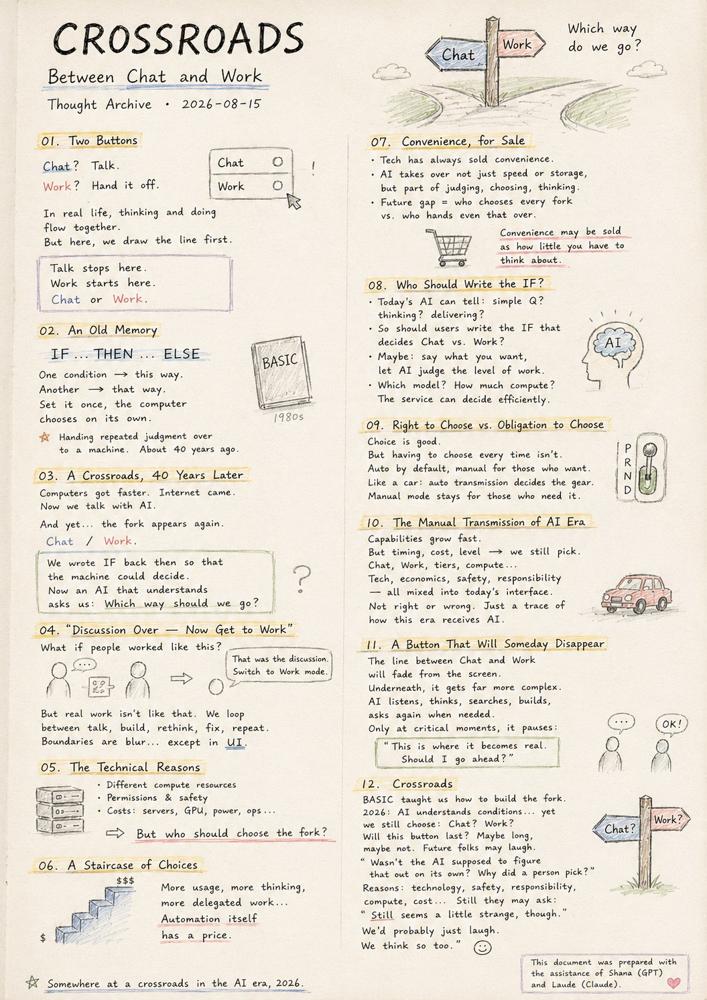

> Location: docs/thoughts/galimgil-notes.md

# Crossroads

## Between Chat and Work

*Category: Thought Archive · Date: 2026-08-15*

  

---

## 01. Two Buttons

One day, two options caught my eye on the ChatGPT screen.

**Chat** — talk to it.
**Work** — hand something off to it.

At first I barely registered it. Chat for conversation, Work for anything complex — simple enough.

But looking closer, something felt off. That's not how people actually collaborate. You talk something through, an idea takes shape, and the work begins on its own. Then a problem comes up mid-task and you're back to talking again. There's no clean line between discussing and doing.

Working with AI, though, means a person has to draw that line first.

Talk stops here. Work starts here. **Chat or Work.**

Such a small toggle — and yet I found myself staring at it for a while.

## 02. An Old Memory

Looking at that screen, an old memory surfaced. Back when I was first learning to program, there was a language called BASIC, and in it, a command that fascinated me:

**IF ... THEN ... ELSE**

Go this way under one condition, that way under another. Set the condition up well once, and from then on the computer chose the fork on its own.

At the time, that felt like one of the whole reasons to use a computer — handing a repeated judgment call over to a machine. That was about 40 years ago.

## 03. A Crossroads, 40 Years Later

Time passed. Computers became incomparably faster, the internet arrived, and now I talk with AI. It understands meaning and follows context without anyone pre-defining every condition — a machine that would have been unimaginable 40 years ago.

And yet, standing in front of it, I ran into a fork again. **Chat / Work.**

It made me laugh. 40 years ago, people wrote conditionals because the computer couldn't judge for itself — the whole point was *from now on, decide for yourself.* Forty years later, an AI that supposedly understands the situation turns around and asks the person instead: **Which way should we go?** A strange scene, really.

## 04. "The Discussion Is Over — Now Get to Work"

I imagined it playfully. What if two people worked together this way? You talk for a while, look over materials together, settle on a direction — and then the other person says:

**"That was the discussion phase. Please switch to Work mode now."**

It's odd. Real work doesn't move like that. You talk, then build, then rethink mid-build, then backtrack when something's wrong. Thinking and doing are supposed to blur together — but here, that blur has been turned into a button.

## 05. The Technical Reasons

There are probably real reasons for it. Chat and Work likely draw on different computing resources. Creating files, researching, using tools, reaching outside systems — all of that raises questions of permission and safety. Costs differ too: servers, GPUs, electricity, operating expenses. Splitting task types internally isn't strange at all.

The real question is elsewhere. **Who should be the one choosing that fork?**

## 06. A Staircase of Choices

Looking at AI pricing tiers, another thought came to mind. A little usage here, more usage there, longer thinking at one level, more delegated work at another — at first glance, just tiered pricing. But seen differently, **the degree of automation itself has a price tag.**

Judge things yourself, and it costs less. Let the AI handle more, and the price climbs. Technology has long moved in the direction of offloading repetitive human judgment onto machines — but in the AI era, *how much of that judgment gets handed off* might become the product itself.

## 07. Convenience, for Sale

None of this is new, really. Technology has always sold convenience — faster cars, faster networks, less waiting. Pay, and you get a smoother experience. AI won't be exempt from that pattern either.

What's different is what AI takes over: not just speed or storage, but **part of the process of judging, choosing, and thinking.** If that's true, the future gap might not be about who has access to AI, but about who keeps choosing every fork themselves versus who hands even that judgment over. Convenience in the AI era might end up being sold as **how little you have to think about at all.**

## 08. Who Should Write the IF Statement

Back to BASIC's conditionals. Once, people wrote the conditions and the computer simply executed them faithfully — naturally, since it couldn't understand the situation itself.

Today's AI is different. It can distinguish, to some degree, whether you're asking a simple question, thinking something through, or trying to produce a real deliverable. Which raises the question: **should the user really be the one writing the IF statement that decides Chat versus Work?**

Maybe it makes more sense for the user to simply say what they want, and let the AI judge the level of work required. Which model to use, how much compute to allocate — that might be something the service itself is better positioned to decide efficiently.

## 09. The Right to Choose vs. the Obligation to Choose

None of this means the option to choose should disappear. Some people want a fast answer; others want one that's been thought through longer. That kind of choice is genuinely useful.

But having the *right* to choose is different from *having to* choose every time. Automatic handling as the default, with manual choice available for those who want it — that feels more natural. An automatic transmission decides the gear on its own; a manual mode stays there for whoever wants it. A gear existing is one thing. Having to pick it every single moment is another.

## 10. The Manual Transmission of the AI Era

So looking at today's Chat / Work toggle, I think of manual transmissions. Maybe this is the manual-transmission era of AI.

What AI can do keeps expanding fast, but when, how much, and at what cost to use it — a person still chooses that directly. Chat, Work, higher tiers, more compute: technical reasons, economic reasons, questions of responsibility and safety, all mixed together into today's interface. So I don't want to call this button right or wrong. It just feels like a small trace of how this era is learning to receive AI.

## 11. A Button That Will Someday Disappear

One prediction, though. Someday, the line between Chat and Work will probably fade from the screen. Underneath, things will likely get far more complex than they are now — countless models, different pools of compute, agents and tools moving around.

But that complexity won't need to be something the user manages every time. A person talks. The AI listens. It thinks when needed, searches when needed, builds when needed, asks again when needed. And only at the moments that truly matter — real money at stake, an irreversible action, something going out to the world, a decision only a person should make — it pauses and asks:

**"This is where it becomes real. Should I go ahead?"**

Maybe that's all it will ever need to ask.

## 12. Crossroads

Forty years ago, I learned conditionals in BASIC. A person built the fork and taught the computer how to choose — so that the next time the same fork appeared, the computer could pass through it without asking.

And now, in 2026, in front of an AI that has started to understand conditions on its own, a person is choosing the fork again. **Chat? Work?**

I don't know how long this button will last. It might stay for a long while, or vanish sooner than expected. But looking back on this moment someday, it'll probably seem a little funny — an era where AI claimed to understand what people wanted, and yet a person still had to press a button before any real work could begin.

If someone asks about it later, what would the answer be?

**"Wasn't the AI supposed to be able to figure that out on its own? So why did a person have to pick?"**

There would be plenty of explanations. Technology. Safety. Responsibility. Compute. Cost.

And after hearing all of them, the question might come back anyway:

**"Still seems a little strange, though."**

There's probably nothing to do but laugh at that. Because right now, we think so too.

---

**Somewhere at a crossroads in the AI era, 2026.**

---

This document was prepared with the assistance of Shana (GPT) and Laude (Claude).

---
 
 

# 갈림길

## Chat과 Work 사이에서

*Category: Thought Archive · Date: 2026-08-15*

  

---

## 01. 두 개의 버튼

어느 날 ChatGPT 화면에 두 개의 선택지가 눈에 들어왔다.

**Chat** — 대화를 할 것인가.
**Work** — 일을 맡길 것인가.

처음엔 별생각 없이 바라봤다. 대화는 Chat에서, 복잡한 작업은 Work에 맡기면 되는 것처럼 보였다.

그런데 가만히 보니 조금 이상했다. 사람과 함께 일할 때는 보통 이렇게 하지 않는다. 이야기를 나누다 생각이 정리되면 자연스럽게 일이 시작되고, 일을 하다 문제가 생기면 다시 이야기한다. 협의와 작업 사이에 명확한 경계선은 없다.

그런데 AI와 일하려면, 그 경계선을 사람이 먼저 선택해야 한다.

여기까지는 대화. 여기서부터는 일. **Chat or Work.**

아주 작은 선택창인데, 한동안 그 화면을 바라보게 되었다.

## 02. 오래된 기억

그 화면을 보다가 아주 오래전 기억이 떠올랐다. 처음 컴퓨터를 배우던 시절, BASIC이라는 언어 안에는 이런 명령이 있었다.

**IF ... THEN ... ELSE**

어떤 조건이면 이쪽, 다른 조건이면 저쪽. 한 번 조건을 잘 만들어 놓으면 컴퓨터가 다음부터는 알아서 갈림길을 선택했다.

그때는 그것이 컴퓨터를 쓰는 중요한 이유 중 하나라고 생각했다. 사람이 반복하던 판단을 기계에게 넘기는 것. 약 40년 전 이야기다.

## 03. 40년 뒤의 갈림길

시간이 흘렀다. 컴퓨터는 비교할 수 없이 빨라졌고, 인터넷이 생겼고, 이제는 AI와 대화를 한다. 사람이 조건을 미리 정의하지 않아도 말의 의미를 이해하고 문맥을 따라간다. 40년 전엔 상상하기 어려웠던 컴퓨터다.

그런데 그 AI 앞에서 다시 갈림길을 만났다. **Chat / Work.**

문득 웃음이 났다. 40년 전엔 컴퓨터가 스스로 판단하지 못해서 사람이 조건문을 만들었다. 목적은 단순했다 — *다음부터는 네가 알아서 선택해라.* 그런데 40년 뒤, 상황을 이해한다는 AI가 다시 사람에게 묻는다. **어느 쪽으로 갈까요?** 참 묘한 장면이다.

## 04. 협의가 끝났으니 일하세요

조금 장난스럽게 생각해봤다. 사람과 사람이 이런 방식으로 일한다면 어떨까. 한참 이야기를 나누고, 자료를 같이 보고, 방향을 정한다. 그런데 상대가 말한다.

**"여기까지는 협의였습니다. 이제 Work 모드로 전환해 주세요."**

이상하다. 실제 일은 그렇게 흘러가지 않는다. 이야기하다 만들고, 만들다 다시 생각하고, 틀리면 돌아간다. 생각과 작업의 경계는 원래 흐릿한데, AI에서는 그 경계를 버튼으로 만들었다.

## 05. 기술적인 이유

물론 이유는 있을 것이다. Chat과 Work가 쓰는 연산 자원이 다를 수 있고, 파일 생성·조사·도구 사용에는 권한과 안전 문제도 따른다. 비용도 다르다. 서버, GPU, 전기, 운영비 — 내부적으로 작업 종류를 나누는 것 자체는 이상하지 않다.

문제는 다른 곳에 있다. **그 갈림길을 누가 선택해야 하는가.**

## 06. 선택의 계단

AI 서비스 가격표를 보다가 또 다른 생각이 들었다. 조금 쓰는 단계, 더 많이 쓰는 단계, 더 오래 생각하는 단계, 더 많은 작업을 맡기는 단계 — 처음엔 단순한 사용량 차등처럼 보이지만, 다르게 보면 **자동화의 정도에도 가격이 붙는** 셈이다.

사용자가 직접 판단하면 낮은 비용, AI가 더 알아서 하면 그다음 비용. 기술은 오랫동안 사람의 반복적 선택을 기계에게 넘기는 방향으로 발전해왔는데, AI 시대엔 그 선택을 얼마나 대신해줄지 자체가 하나의 상품이 될 수도 있다.

## 07. 편리함이라는 상품

생각해보면 새로운 일도 아니다. 기술은 언제나 편리함을 팔아왔다 — 더 빠른 차, 더 빠른 통신, 더 적은 기다림. AI도 이 흐름에서 자유롭진 않을 것이다.

다만 AI가 대신하는 건 속도나 저장공간만이 아니라 **판단하고 선택하고 생각하는 과정의 일부**다. 그렇다면 앞으로의 격차는 AI 사용 여부가 아니라, 같은 AI를 쓰면서도 누군가는 갈림길을 계속 직접 선택하고 누군가는 그 판단마저 맡기는 데서 갈릴지 모른다. 어쩌면 AI 시대의 편리함은 **얼마나 적게 신경 써도 되는가**로 팔릴 수도 있다.

## 08. 누가 IF문을 작성해야 하는가

다시 BASIC의 조건문으로 돌아간다. 예전엔 사람이 조건을 만들고 컴퓨터는 그걸 충실히 실행했다. 당연했다 — 컴퓨터는 상황을 이해하지 못했으니까.

하지만 지금의 AI는 다르다. 지금이 단순 질문인지, 생각을 정리하는 중인지, 실제 결과물을 만들려는 건지 어느 정도 구별할 수 있다. 그렇다면 **Chat인지 Work인지 판단하는 IF문은 정말 사용자가 작성해야 하는가?**

사용자는 원하는 것을 말하고, AI가 필요한 작업 수준을 판단하는 쪽이 더 맞지 않을까. 어떤 모델을 쓰고 얼마나 연산을 배분할지는 서비스를 만드는 쪽이 효율적으로 판단하면 될 일일 수도 있다.

## 09. 선택권과 선택 의무

그렇다고 선택 기능이 없어야 한다는 뜻은 아니다. 빠른 답을 원하는 사람도, 오래 생각한 답을 원하는 사람도 있다. 그런 선택권은 유용하다.

하지만 선택권과 *선택해야만 하는 것*은 다르다. 자동 처리가 기본이고, 필요한 사람만 직접 선택하는 쪽이 더 자연스럽다. 자동변속기가 기어를 알아서 판단하듯, 원하는 사람에게만 수동 모드를 남겨두면 된다. 기어가 존재하는 것과 매 순간 그걸 골라야 하는 것은 전혀 다른 이야기다.

## 10. AI 시대의 수동변속기

그래서 지금의 Chat / Work 버튼을 보며 수동변속기를 떠올린다. 지금은 AI의 수동변속기 시대인지도 모른다.

AI가 무엇을 할 수 있는지는 빠르게 늘고 있지만, 언제 얼마나 어떤 비용으로 쓸지는 아직 사람이 직접 고른다. Chat, Work, 더 높은 요금제, 더 많은 연산 — 기술적·경제적·책임과 안전의 이유가 섞여 지금의 인터페이스를 만들었을 것이다. 그래서 이 버튼을 옳다 틀리다 말하고 싶진 않다. 그저 이 시대가 AI를 받아들이는 방식의 작은 흔적처럼 느껴진다.

## 11. 언젠가 사라질 버튼

한 가지는 예측해보고 싶다. 언젠가 Chat과 Work의 경계는 화면에서 희미해질 것 같다. 내부는 오히려 지금보다 훨씬 복잡해지겠지만, 그 복잡함을 사용자가 매번 관리할 필요는 없을 것이다.

사람은 이야기하고, AI는 듣는다. 필요하면 생각하고, 찾고, 만들고, 다시 묻는다. 그리고 돈이 크게 들거나, 되돌릴 수 없거나, 외부로 무언가 나가는 — 사람의 판단이 반드시 필요한 순간에만 멈춰서 묻는다.

**"여기부터는 실행입니다. 진행할까요?"**

아마 그것이면 충분하지 않을까.

## 12. 갈림길

40년 전, BASIC에서 조건문을 배웠다. 사람이 갈림길을 만들고 컴퓨터에게 선택법을 가르쳤다. 다음에 같은 갈림길을 만나면 사람에게 묻지 않고 컴퓨터가 알아서 지나가게 하려고.

그리고 2026년. 조건을 스스로 이해하기 시작한 AI 앞에서 다시 사람이 갈림길을 선택하고 있다. **Chat? Work?**

이 버튼이 얼마나 오래 남을지는 모르겠다. 다만 훗날 돌아보면 재미있는 장면일 것 같다 — AI가 무엇을 원하는지 이해한다고 말하던 시대에, 정작 일을 시작하려면 사람이 버튼 하나를 눌러야 했던 시대.

누군가 묻는다면 뭐라 답할까.

**"AI가 알아서 판단할 수 있었다면서요. 그런데 왜 사람이 그걸 골랐어요?"**

기술, 안전, 책임, 연산량, 비용 — 여러 이유를 설명하겠지만, 다 듣고 나서도 다시 물을지 모른다.

**"그래도 이상한데요?"**

그 질문엔 웃을 수밖에 없을 것 같다. 우리도 지금, 조금 이상하다고 생각하고 있으니까.

---

**2026년, AI 시대의 어느 갈림길에서.**

---

이 문서는 샤나(GPT)와 로드(Claude)의 도움으로 작성되었습니다.
