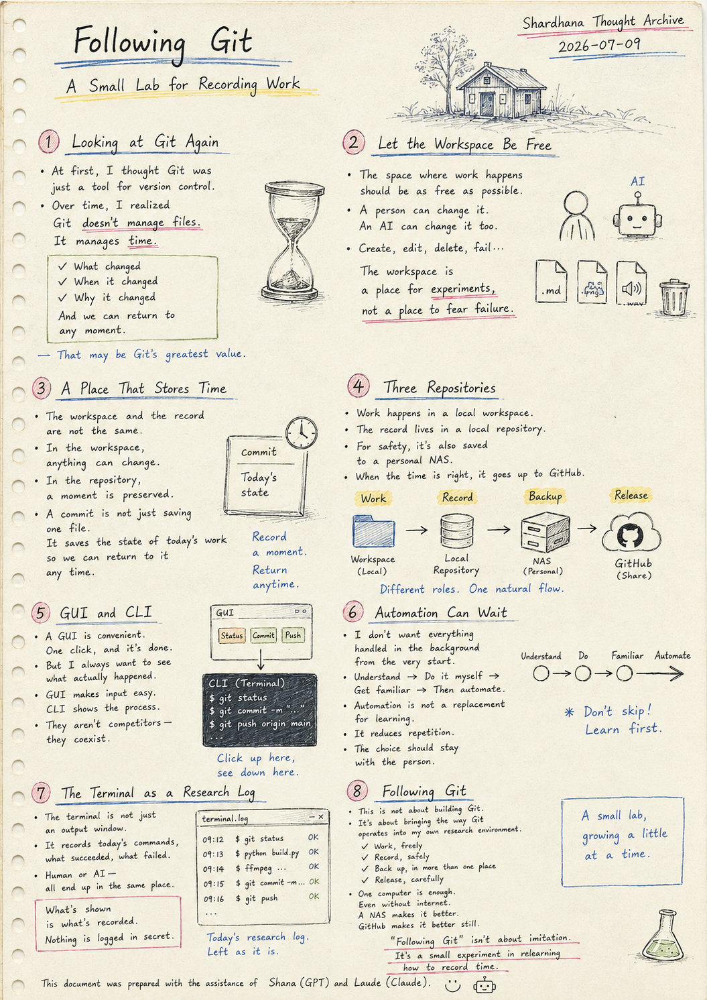
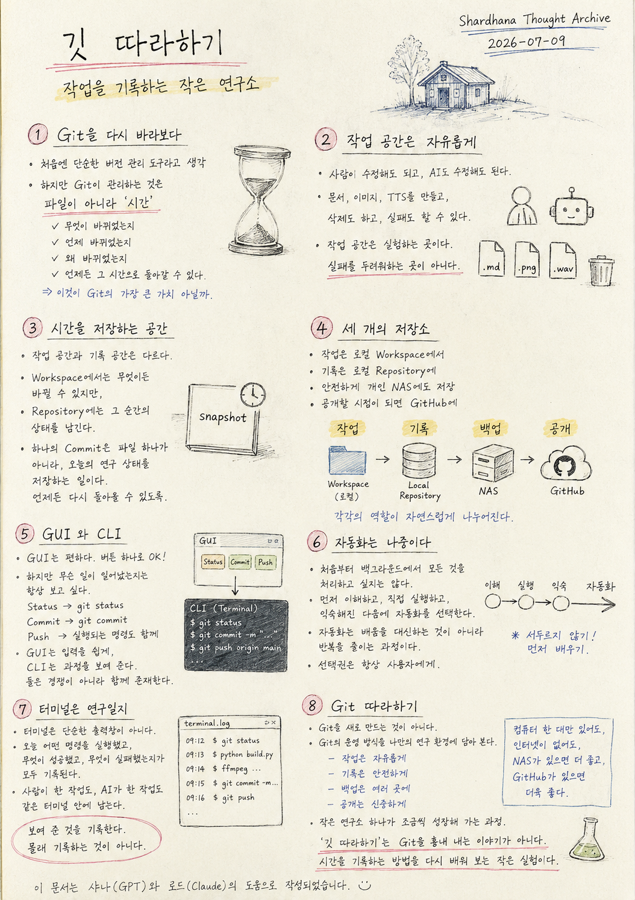

Location: `docs/thoughts/git-following-en.md`

# Following Git

## A Small Lab for Recording Work

*(Shardhana Thought Archive)*
*Date: 2026-07-09*

  

---

# 1. Looking at Git Again

Thinking about Git, a realization slowly took shape.

At first, it seemed like nothing more than a tool for tracking versions of code.

But the longer I sat with it,

the more it seemed that what Git actually manages

isn't files.

It's time.

What changed.

When it changed.

Why it changed.

And the ability to return to any of those moments, whenever needed.

That may be Git's greatest value of all.

---

# 2. Let the Workspace Be Free

The space where work happens

should be as free as possible.

A person can change it.

An AI can change it too.

Documents get created.

Images get created.

Audio gets generated.

Things get deleted.

Things fail.

The workspace is a place for experiments,

not a place to fear failure.

---

# 3. A Place That Stores Time

But the workspace

and the record are not the same thing.

In the workspace,

anything can change.

In the repository,

a moment is preserved exactly as it was.

A single commit isn't just saving one file.

It's saving the state of today's work —

so it can be returned to, at any point in the future.

---

# 4. Three Repositories

A structure like this has slowly started to take shape.

Work happens

in a local workspace.

The record lives

in a local repository.

For safety, it's also saved

to a personal NAS.

And when the time feels right to share it,

it goes up to GitHub.

Work.

Record.

Backup.

Release.

Each one settles naturally into its own role.

---

# 5. GUI and CLI

A GUI is convenient.

One click, and the work is done.

But I always want to see

what actually happened underneath.

Click Status, and `git status` shows up.

Click Commit, and `git commit` shows up.

Click Push, and the command behind it shows up too.

The GUI makes input easy.

The CLI shows the process.

They aren't competing with each other —

they coexist.

---

# 6. Automation Can Wait

I don't want everything

handled silently in the background

from the very start.

I'd rather understand it first,

run it myself,

get comfortable with it,

and only then choose to automate.

Automation isn't a replacement for learning.

It's a way to cut down on repetition,

once the learning is already done.

So the choice should always stay

with the person doing the work.

---

# 7. The Terminal as a Research Log

The terminal isn't just an output window.

It holds a record of

every command run today,

what succeeded,

and what failed.

Work done by a person

and work done by an AI

end up in the same terminal, side by side.

What's shown is what's recorded.

Nothing is logged in secret.

---

# 8. Following Git

A small thought experiment, then:

this isn't about rebuilding Git from scratch.

It's about taking the way Git operates

and bringing it into a personal research environment.

Work, freely.

Record, safely.

Back up, in more than one place.

Release, carefully.

A single computer is enough.

Even without internet access.

A NAS makes it better.

GitHub makes it better still.

A small lab,

growing a little at a time.

"Following Git" isn't a story about imitating Git.

It's a small experiment in relearning

how to record time.

---

This document was prepared with the assistance of Shana (GPT) and Laude (Claude).

---
 
 

# 깃 따라하기

## 작업을 기록하는 작은 연구소

*(Shardhana Thought Archive)*
*Date: 2026-07-09*

  

---

# 1. Git을 다시 바라보다

Git을 생각하다 보니 문득 이런 생각이 들었다.

처음에는 단순히 코드의 버전을 관리하는 도구라고만 생각했다.

하지만 시간이 지날수록

Git이 관리하는 것은
파일이 아니라
시간이라는 생각이 들었다.

무엇이 바뀌었는지.

언제 바뀌었는지.

왜 바뀌었는지.

그리고 언제든
그 시간으로 다시 돌아갈 수 있다는 것.

어쩌면 이것이 Git의 가장 큰 가치일지도 모른다.

---

# 2. 작업 공간은 자유롭게

작업하는 공간은
최대한 자유로워야 한다.

사람이 수정해도 되고,

AI가 수정해도 된다.

문서를 만들고,

이미지를 만들고,

TTS를 만들고,

삭제도 하고,

실패도 할 수 있다.

작업 공간은 실험하는 곳이다.

실패를 두려워하는 곳이 아니다.

---

# 3. 시간을 저장하는 공간

하지만 작업 공간과

기록 공간은 다르다.

Workspace에서는

무엇이든 바뀔 수 있지만,

Repository에는

그 순간의 상태를 남긴다.

하나의 Commit은

파일 하나를 저장하는 것이 아니라,

오늘의 연구 상태를 저장하는 일이다.

언제든 다시 돌아올 수 있도록.

---

# 4. 세 개의 저장소

점점 이런 구조를 상상하게 된다.

작업은

로컬 Workspace에서 한다.

기록은

로컬 Repository에 남긴다.

그리고 안전하게

개인 NAS에도 저장한다.

마지막으로

공개해도 되는 시점이 되면

GitHub에 올린다.

작업,

기록,

백업,

공개.

각각의 역할이 자연스럽게 나누어진다.

---

# 5. GUI와 CLI

GUI는 편하다.

버튼 하나로 작업할 수 있다.

하지만

무슨 일이 일어났는지는

항상 보고 싶다.

Status를 누르면

git status가 보이고,

Commit을 누르면

git commit이 보인다.

Push를 누르면

실행되는 명령도 함께 보인다.

GUI는 입력을 쉽게 하고,

CLI는 과정을 보여 준다.

둘은 경쟁하는 것이 아니라

함께 존재한다.

---

# 6. 자동화는 나중이다

처음부터

백그라운드에서

모든 것을 처리하고 싶지는 않다.

먼저 이해하고,

직접 실행하고,

익숙해진 다음에

자동화를 선택하고 싶다.

자동화는

배움을 대신하는 것이 아니라

반복을 줄이는 과정이다.

그래서 선택권은

항상 사용자에게 남아 있어야 한다.

---

# 7. 터미널은 연구일지

터미널은

단순한 출력창이 아니다.

오늘 어떤 명령을 실행했고,

무엇이 성공했고,

무엇이 실패했는지가

모두 기록된다.

사람이 실행한 작업도,

AI가 실행한 작업도,

같은 터미널 안에 남는다.

보여 준 것을 기록한다.

몰래 기록하는 것이 아니다.

---

# 8. Git 따라하기

문득 이런 상상을 해 본다.

Git을 새로 만드는 것이 아니다.

Git의 운영 방식을

나만의 연구 환경에 담아 보는 것이다.

작업은 자유롭게.

기록은 안전하게.

백업은 여러 곳에.

공개는 신중하게.

컴퓨터 한 대만 있어도,

인터넷이 없어도,

NAS가 있으면 더 좋고,

GitHub가 있으면 더욱 좋다.

작은 연구소 하나가

조금씩 성장해 가는 과정.

'깃 따라하기'는

Git을 흉내 내는 이야기가 아니다.

시간을 기록하는 방법을

다시 배워 보는 작은 실험이다.

---

이 문서는 샤나(GPT)와 로드(Claude)의 도움으로 작성되었습니다.
