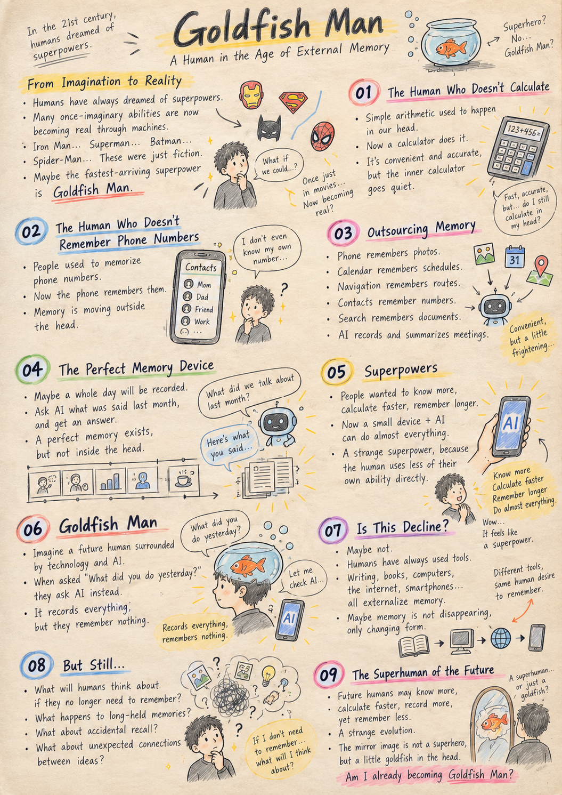
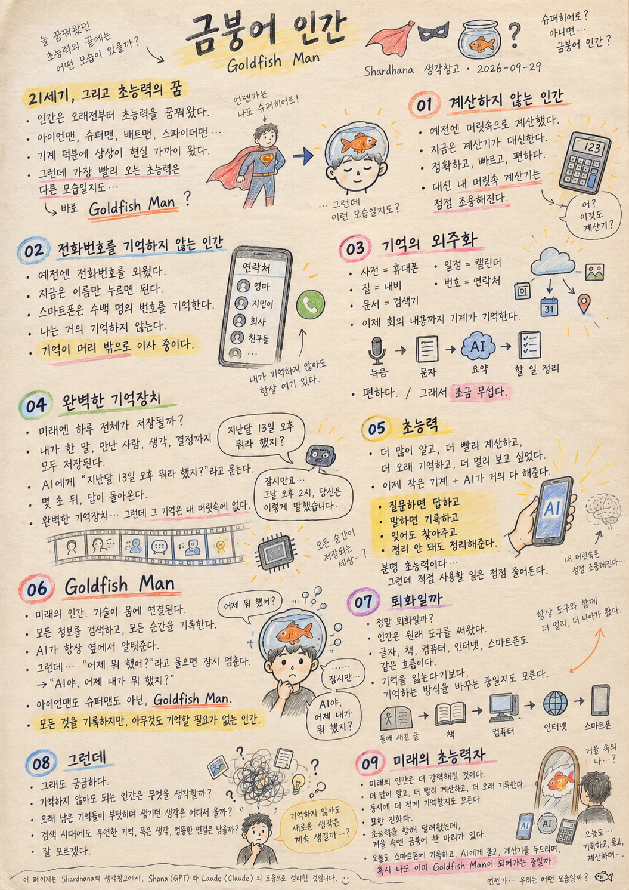

`docs/thoughts/goldfish-man.md`

# Goldfish Man

*Shardhana Thought Archive · 2026-09-29*

## 🎬 YouTube Video

[Watch on YouTube](https://youtu.be/H4G2fA_DslQ)

  

---

The 21st century.

Humanity has dreamed of superpowers for a long time.

Flying through the sky.
Climbing walls.
Wearing steel armor.
Shooting light from your eyes.
Crossing to the other side of the planet in an instant.

Iron Man.
Superman.
Batman.
Spider-Man.

The imagination never runs out.

And strangely enough,
things that used to exist only in imagination
are edging closer to real life, one by one.

People fly with the help of machines.
They talk face to face with someone on the other side of the world.
A device the size of a palm
lets them look up almost all the knowledge in the world.

Maybe humanity really is
gaining superpowers.

And yet.

The superpower becoming real the fastest
might look a little different.

**Goldfish Man.**

---

## 01. The Human Who Doesn't Calculate

There was a time when simple arithmetic
happened inside your head.

Buying a few things.
Working out the change.
Roughly guessing a percentage in your mind.

Now you reach for a calculator.

Me too.

Using a calculator isn't wrong.

It's accurate.
It's fast.
It's convenient.

And then, one day,
you find yourself pausing
in front of a calculation you used to do without thinking.

Wait —
do I need to open the calculator for this too?

You gained a superpower.

With a calculator,
you're almost never wrong.

In exchange,
the calculator in your head
has gone a little quiet.

---

## 02. The Human Who Doesn't Remember Phone Numbers

There was a time when you memorized your friends' phone numbers.

Your home number.
Your office number.
A few people's numbers your fingers knew before you did.

Now you know almost none of them.

You tap a name, and the call goes through.

There's no reason to remember the number.

Your phone remembers hundreds of numbers.

I remember none of them.

I don't know if my memory got worse,
or if I simply stopped needing it.

But one thing is certain.

Memory is quietly
moving out of my head.

---

## 03. Outsourcing Memory

Photos are remembered by the phone.
Schedules are remembered by the calendar.
Routes are remembered by the navigation app.
Phone numbers are remembered by the contacts list.
Documents are remembered by the search engine.

And now,
even meetings are starting to be remembered by machines.

It records.
It turns speech into text.
AI summarizes it.
It pulls out the important parts.
It even organizes the to-dos.

Very convenient.

Genuinely convenient.

Which is exactly why it's a little frightening.

---

## 04. The Perfect Memory Device

Someday, an entire day
might get recorded in full.

What I said.
Who I met.
What I was thinking.
What I decided.

All of it saved.

If you need it, you just ask the AI.

"What did I say about that problem
on the afternoon of the 13th last month?"

A few seconds later, the answer arrives.

Perfect.

Humanity has finally gotten
a perfect memory.

But here's the strange part.

That memory
isn't actually in my head.

---

## 05. Superpowers

We wanted superpowers.

We wanted to know more.
We wanted to calculate faster.
We wanted to remember longer.
We wanted to see farther.

And in the end,
we ended up holding a small machine
that can do almost anything.

Now AI is attached to it, too.

Ask it something, and it answers.
Say something, and it's recorded.
Even if you forget, it finds it for you.
Even if your thoughts aren't organized,
it organizes them for you.

This is, without question, a superpower.

But the more we use this superpower,
the less we seem to need
to use our own ability directly.

A slightly strange kind of superpower.

---

## 06. Goldfish Man

So I try to imagine it.

The human of the future.

A body wired into countless technologies.

Able to search almost any information in the world.
Able to record every moment.
An AI beside them, ready to answer anything.

An incredible set of abilities.

And then someone asks:

"What did you do yesterday?"

A pause.

They call on the AI.

"What did I do yesterday?"

Not Iron Man.
Not Superman.

**Goldfish Man.**

A human who records everything,
and needs to remember nothing.

---

## 07. Is This Decline?

Can this really be called decline, though?

I'm not sure.

Humans have always used tools.

Writing was a technology for keeping memory outside the body.
Books held the memories of countless people.

Computers, the internet, smartphones —
they all sit on that same line.

Maybe we aren't losing memory.

Maybe we're just changing
how we remember.

---

## 08. But Still

Even so, one thing bothers me.

What will a human who no longer needs to remember
actually think about?

The thoughts that used to form
when old memories collided with each other in your head —
where will those come from now?

Even in an age when everything can be searched up,
will a memory that surfaces by accident,
a thought that's aged for years,
a strange, unexpected connection —

will any of that still be there?

I don't know.

---

## 09. The Superhuman of the Future

The human of the future will probably
be far more powerful than we are now.

Knowing more.
Calculating faster.
Recording for longer.
Doing more.

And, at the same time,
they may remember
far less than we do now.

If that's a kind of evolution,
it's a strange one.

Humanity ran toward superpowers for so long,
and then one day looked in the mirror
to find —

not Iron Man,
not Superman,
not Spider-Man —

just a small goldfish,
swimming around inside their head.

---

Today, once again,
I record it on my phone,
I ask the AI,
I tap away on a calculator.

And I wonder:

am I already becoming
a **Goldfish Man** myself?

---

> This document was prepared with the assistance of Shana (GPT) and Laude (Claude).

---
 
 

# 금붕어 인간
## Goldfish Man

*Shardhana 생각창고 · 2026-09-29*

## 🎬 YouTube Video

[Watch on YouTube](https://youtu.be/QYSv9ItbBMI)

  

---

21세기.

인간은 오래전부터 초능력을 꿈꿔왔다.

하늘을 날고,
벽을 타고,
강철 갑옷을 입고,
눈에서 빛을 쏘고,
순식간에 지구 반대편으로 이동한다.

아이언맨,
슈퍼맨,
배트맨,
스파이더맨.

상상력에는 끝이 없다.

그리고 이상하게도,
예전에 상상으로만 존재하던 것들이
하나씩 현실 가까이 다가오고 있다.

사람은 기계의 힘으로 날고,
지구 반대편 사람과 얼굴을 보며 이야기하고,
손바닥만 한 장치 하나로
세상의 거의 모든 지식을 찾아본다.

어쩌면 인간은 정말
초능력을 얻고 있는지도 모른다.

그런데.

가장 빠르게 현실이 되고 있는 초능력은
조금 다른 모습일지도 모른다.

**Goldfish Man.**

---

## 01. 계산하지 않는 인간

예전에는 간단한 계산 정도는
머릿속에서 했다.

물건 몇 개를 사고,
거스름돈을 계산하고,
대충 몇 퍼센트인지 머리로 굴려봤다.

지금은 계산기를 꺼낸다.

나도 그렇다.

계산기를 쓰는 것이 잘못은 아니다.

정확하고,
빠르고,
편하다.

그러다 어느 날
예전에는 쉽게 했던 계산 앞에서
잠깐 멈춘다.

어?
이것도 계산기를 켜야 하나?

초능력 하나를 얻었다.

계산기를 이용하면
거의 틀리지 않는다.

대신 머릿속 계산기는
조금 조용해졌다.

---

## 02. 전화번호를 기억하지 않는 인간

예전에는 친구 전화번호를 외웠다.

집 전화번호도,
회사 번호도,
몇몇 사람의 번호는
손가락이 먼저 기억했다.

지금은 거의 모른다.

이름을 누르면 전화가 걸린다.

번호를 기억할 이유가 없다.

스마트폰은
수백 명의 번호를 기억한다.

나는 하나도 기억하지 않는다.

기억력이 나빠진 것인지,
기억할 필요가 없어진 것인지
잘 모르겠다.

다만 확실한 것은 하나다.

기억은 조금씩
내 머리 밖으로 이사하고 있다.

---

## 03. 기억의 외주화

사진은 휴대폰이 기억한다.
일정은 캘린더가 기억한다.
길은 내비게이션이 기억한다.
전화번호는 연락처가 기억한다.
문서는 검색기가 기억한다.

그리고 이제는
회의 내용까지 기계가 기억하기 시작한다.

녹음한다.
문자로 바꾼다.
AI가 요약한다.
중요한 내용을 뽑아준다.
해야 할 일까지 정리한다.

아주 편하다.

정말 편하다.

그래서 조금 무섭다.

---

## 04. 완벽한 기억장치

미래에는 어쩌면
하루 전체를 기록하게 될지도 모른다.

내가 무슨 말을 했는지.
누구를 만났는지.
무슨 생각을 했는지.
어떤 결정을 내렸는지.

모두 저장된다.

필요하면 AI에게 물으면 된다.

"지난달 13일 오후에
내가 그 문제에 대해 뭐라고 했지?"

몇 초 뒤 답이 나온다.

완벽하다.

인간은 드디어
완벽한 기억을 갖게 되었다.

그런데 이상하다.

그 기억은
내 머릿속에는 없다.

---

## 05. 초능력

우리는 초능력을 원했다.

더 많이 알고 싶었다.
더 빨리 계산하고 싶었다.
더 오래 기억하고 싶었다.
더 멀리 보고 싶었다.

그리고 결국
우리는 거의 모든 것을 할 수 있는
작은 기계를 손에 넣었다.

이제 AI까지 붙었다.

질문하면 답한다.
말하면 기록한다.
기억하지 못해도 찾아준다.
생각이 정리되지 않아도
대신 정리해준다.

분명 초능력이다.

그런데 초능력을 사용할수록
인간은 점점
그 능력을 직접 사용하지 않아도 된다.

조금 이상한 초능력이다.

---

## 06. Goldfish Man

그래서 상상해본다.

미래의 인간.

몸에는 수많은 기술이 연결되어 있다.

세상의 모든 정보를 검색할 수 있고,
모든 순간을 기록할 수 있고,
AI가 옆에서 무엇이든 알려준다.

엄청난 능력이다.

그런데 누군가 묻는다.

"어제 뭐 했어?"

잠시 멈춘다.

그리고 AI를 부른다.

"어제 내가 뭐 했지?"

ㅋㅋ

아이언맨도 아니고,
슈퍼맨도 아니다.

**Goldfish Man.**

모든 것을 기록하지만
아무것도 기억할 필요가 없는 인간.

---

## 07. 퇴화일까

그렇다고 이것을
퇴화라고 부를 수 있을까.

잘 모르겠다.

인간은 원래 도구를 사용해왔다.

글자는 기억을 밖에 남기는 기술이었고,
책은 수많은 사람의 기억을 보관했다.

컴퓨터도,
인터넷도,
스마트폰도
그 흐름 위에 있다.

어쩌면 우리는
기억을 잃는 것이 아니라,
기억하는 방법을
바꾸고 있는 것인지도 모른다.

---

## 08. 그런데

그래도 한 가지는 궁금하다.

기억하지 않아도 되는 인간은
무엇을 생각하게 될까.

머릿속에 오래 남아 있던 기억들이
서로 부딪치면서 만들어내던 생각들은
어디에서 생기게 될까.

모든 것을 검색해서 찾는 시대에도
우연히 떠오르는 기억,
오래 묵은 생각,
엉뚱한 연결은
그대로 남아 있을까.

잘 모르겠다.

---

## 09. 미래의 초능력자

아마 미래의 인간은
지금보다 훨씬 강력할 것이다.

더 많이 알고,
더 빠르게 계산하고,
더 오래 기록하고,
더 많은 일을 할 수 있을 것이다.

그리고 동시에
지금보다 훨씬 적게
기억할지도 모른다.

그것도 하나의 진화라면
참 묘한 진화다.

초능력을 얻으려고 달려온 인간이
어느 날 거울을 봤더니

아이언맨도,
슈퍼맨도,
스파이더맨도 아닌

조그만 금붕어 한 마리가
머릿속에서 헤엄치고 있는 것이다.

ㅋㅋ

---

나는 오늘도
스마트폰에 기록하고,
AI에게 물어보고,
계산기를 두드린다.

그리고 생각한다.

혹시 나도 이미
**Goldfish Man**이 되어가고 있는 건 아닐까.

---

> 이 문서는 샤나(GPT)와 로드(Claude)의 도움으로 작성되었습니다.
