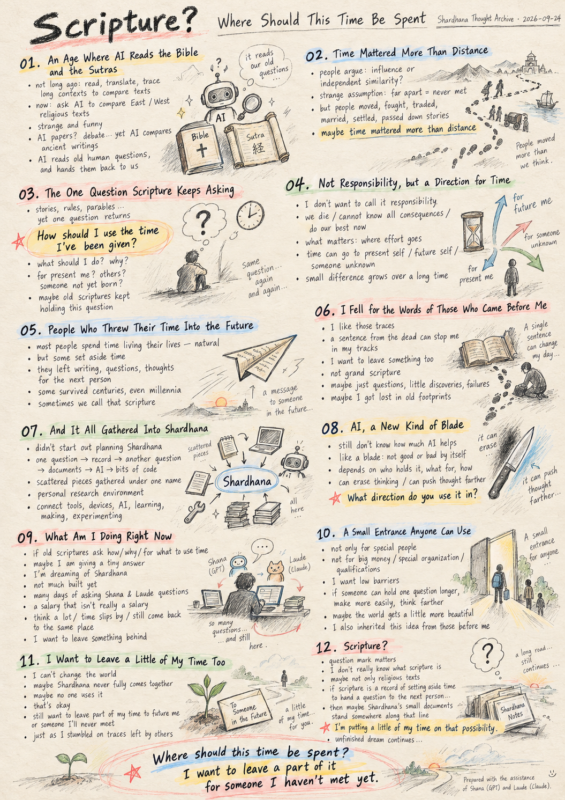
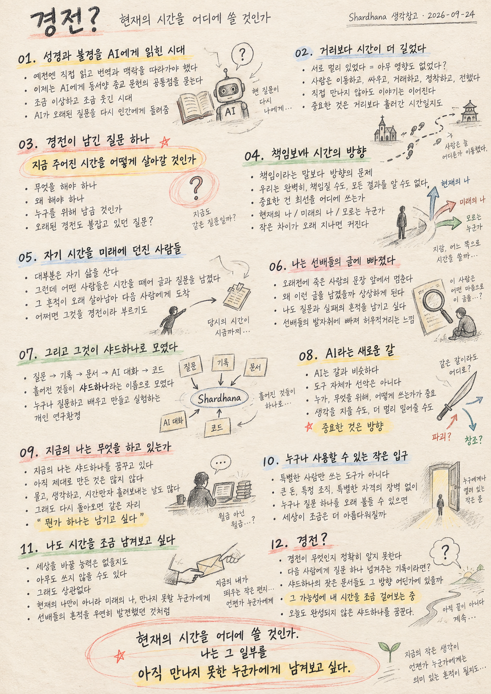

> Location: docs/thoughts/gyeongjeon-notes.md

# Scripture?
### Where Should This Time Be Spent
*(Shardhana Thought Archive)*
*Date: 2026-09-24*

  

---

## 01. An Age Where AI Reads the Bible and the Sutras

Not long ago, comparing the Bible and the Buddhist sutras meant reading through countless texts yourself, checking translations, and following each other's context over a long stretch of time.

Now we can simply ask AI to lay the great religious texts of East and West side by side and find what they share.

A little strange. A little funny.

On one hand, people say AI shouldn't be allowed to write papers. On the other, we're using AI to compare thousands of years of religious writing.

We've arrived at an age where AI reads some of humanity's oldest questions, and hands them back to us.

---

## 02. Time Mattered More Than Distance

Comparing religious texts, people argue over whether East and West influenced each other, or arrived at similar ideas independently.

That argument often carries a strange assumption: that being far apart meant they never met.

But people haven't stood still for thousands of years. They moved, fought, traded, married, settled elsewhere, passed down stories — and the next generation carried those stories further.

Just because two peoples never met directly, can we really say nothing passed between them?

Maybe what matters isn't distance at all, but how much time has passed.

---

## 03. The One Question Scripture Keeps Asking

Scriptures are full of stories, rules, and parables. But wading through all those lines, one question keeps resurfacing.

**How should I use the time I've been given?**

What should I do. Why should I do it.

Should I live for the present me? For others? Or leave something behind for someone not yet born, in the future?

The words differ, but perhaps this is the question the old scriptures were always holding onto.

---

## 04. Not Responsibility, but a Direction for Time

I don't really want to call this responsibility.

We all die eventually. We can't take perfect responsibility for anything, and we can't know all the consequences. We just do our best with what we have right now.

What matters is where that effort goes.

You can spend all the time you have on the present you. You can leave part of it to your future self. Or you can spend a small part of it on someone you'll never know.

The ratio differs from person to person. And that small difference, over a long enough time, seems to become a very large one.

---

## 05. People Who Threw Their Time Into the Future

Most people spend most of their time simply living their own lives. That's natural — you have to eat, care for family, get through today.

But every once in a while, it seems, some people found that wasn't enough. They set aside a little of their own time, left writing behind, left questions behind, and threw their thoughts forward to whoever came next.

Some of it survived, and reached people hundreds, even thousands of years later. We sometimes call that scripture.

---

## 06. I Fell for the Words of Those Who Came Before Me

I love finding traces like that. Reading a sentence left by someone long dead, there are moments I suddenly stop where I am.

Imagining what that person was thinking, why they wrote it down, makes me want to leave something of my own someday too.

I don't mean writing some grand scripture. Just the questions I held while I was alive, the little things I figured out, even the traces of what I failed at — I'd like to leave those behind.

Maybe I've simply fallen too deep into the footprints left by those who came before, and I'm still wading around in them.

---

## 07. And It All Gathered Into Shardhana

I didn't set out to build Shardhana from the start.

One question came up. I recorded it. Another question came up. I made documents, talked with AI, built a little code here and there — and at some point, these scattered pieces began gathering under one name: Shardhana.

A personal research environment anyone could enter without a big barrier — connecting their own devices and tools, asking questions with AI, learning, building, experimenting.

I started wishing something like that existed.

---

## 08. AI, a New Kind of Blade

I still don't know how much AI will actually help people.

It's a bit like a blade. A blade isn't inherently good or bad — it depends on who holds it, what it's used for, and how.

AI could just as easily erase a person's own thinking as push that thinking somewhere they could never have reached alone.

So the real question isn't whether to use AI or not. It's **what direction you use it in.**

---

## 09. What Am I Doing Right Now

If the old scriptures keep asking how, why, and for what we should use our given time, then what I'm doing now is offering a very small answer to that question.

I'm dreaming of Shardhana.

I haven't really built much yet. I'm not even sure I'm capable enough. There are plenty of days where I just ask Shana and Laude question after question, pay them something like a salary that isn't really a salary, think a lot, and let the time slip by.

But whenever I come back to it, I find myself standing in the same place.

I want to leave something behind.

---

## 10. A Small Entrance Anyone Can Use

The Shardhana I want isn't a tool only special people get to use. It's not a research environment you need a lot of money, a specific organization, or special qualifications to enter.

If at all possible, I'd like anyone to be able to use it without a big barrier.

If someone can hold onto their own question a little longer inside it, build something a little more easily, think a little further out — maybe the world gets just a little more beautiful.

That's not even my own idea to begin with. I've simply picked up something I liked from what those before me left behind, and carried it forward.

---

## 11. I Want to Leave a Little of My Time Too

I don't have the power to change the world. I don't even know if Shardhana will really come together. And if it does, I don't know who will use it. Maybe no one will.

That's fine.

Even so, I want to spend some small part of my given time not just on the present me, but on my future self — or on someone I'll never meet in this lifetime.

The same way I happened to stumble on what those before me left behind.

---

## 12. Scripture?

That's why there's a question mark at the end of the title.

I don't really know what scripture is. I'm not even sure only religious texts deserve the name.

But if it's simply a record of someone setting aside their own time to hand a question to the next person — then, seen from far enough away, maybe even Shardhana's small documents belong somewhere along that line.

Right now, I'm putting a little of my time on that possibility.

And today, too, I keep dreaming of a Shardhana that isn't finished yet.

---

> **Where should this time be spent?**
>
> I want to leave a part of it
> for someone I haven't met yet.

---

*This document was prepared with the assistance of Shana (GPT) and Laude (Claude).*

---
 
 

# 경전?
### 현재의 시간을 어디에 쓸 것인가
*(Shardhana 생각창고)*
*Date: 2026-09-24*

  

---

## 01. 성경과 불경을 AI에게 읽힌 시대

얼마 전까지만 해도
성경과 불경을 비교하려면
수많은 문헌을 직접 읽고, 번역을 확인하고,
오랜 시간 서로의 맥락을 따라가야 했다.

그런데 이제는 AI에게
동양과 서양의 거대한 종교 문헌을 놓고
공통점을 찾아보라고 하는 시대가 되었다.

조금 이상하고, 조금 웃기다.

한쪽에서는
AI에게 논문을 쓰게 하면 안 된다고 말하고,
다른 한쪽에서는
AI를 이용해 수천 년의 종교 문헌을 비교한다.

AI가 인간의 오래된 질문을 읽고,
그 질문을 다시 인간에게 돌려주는 시대가 된 것이다.

---

## 02. 거리보다 시간이 더 길었다

종교 문헌을 비교하다 보면
동양과 서양의 유사성을 두고
서로 영향을 주었는지,
독립적으로 생겨났는지를 논쟁한다.

그런데 그 논쟁에는
조금 이상한 전제가 들어 있을 때가 있다.

멀리 떨어져 있었으니
서로 만나지 않았을 것이라는 전제다.

하지만 사람은 수천 년 동안
한 자리에 멈춰 있지 않았다.

이동했고, 싸웠고, 거래했고, 결혼했고,
다른 곳에 정착했고, 이야기를 전했고,
그 이야기를 다음 세대가 이어받았다.

직접 만나지 않았다고 해서
아무것도 전달되지 않았다고 말할 수 있을까.

어쩌면 중요한 것은 거리가 아니라
얼마나 많은 시간이 흘렀는가일지도 모른다.

---

## 03. 경전이 남긴 질문 하나

경전에는 수많은 이야기와 규칙과 비유가 있다.

하지만 그 많은 문장을 지나가다 보면
결국 반복해서 나타나는 질문이 하나 있는 것 같다.

**지금 주어진 시간을 어떻게 살아갈 것인가.**

무엇을 해야 하는가.
왜 그것을 해야 하는가.

현재의 나를 위해 살아야 하는가.
다른 사람을 위해 살아야 하는가.

아직 태어나지도 않은
미래의 누군가를 위해
무언가를 남겨야 하는가.

표현은 다르지만
오래된 경전들이 계속 붙잡고 있던 것도
어쩌면 그 질문이었을지 모른다.

---

## 04. 책임보다 시간의 방향

나는 그것을 꼭
책임이라는 말로 부르고 싶지는 않다.

사람은 결국 죽는다.
완벽하게 책임질 수도 없고,
모든 결과를 알 수도 없다.

그저 지금 할 수 있는 만큼
최선을 다할 뿐이다.

중요한 것은
그 최선을 어디에 사용하는가이다.

지금 가진 시간을
전부 현재의 나에게 쓸 수도 있다.

그 일부를 미래의 나에게 남길 수도 있다.

또 아주 작은 일부를
내가 전혀 모르는 누군가를 위해 사용할 수도 있다.

사람마다 그 비율이 다르다.

그리고 그 작은 차이가
오랜 시간이 지나면
아주 큰 차이가 되는 것 같다.

---

## 05. 자기 시간을 미래에 던진 사람들

대부분의 사람은
자기 삶을 살아가는 데 대부분의 시간을 쓴다.

그것은 당연한 일이다.

먹고 살아야 하고,
가족을 돌봐야 하고,
오늘 해야 할 일을 해야 한다.

그런데 아주 가끔
그것만으로는 부족했던 사람들이 있었던 것 같다.

자신의 시간을 조금 떼어
글을 남기고, 질문을 남기고,
생각을 다음 사람에게 던졌다.

그중 일부가 살아남아
수백 년, 수천 년 뒤의 사람에게까지 도착했다.

그리고 우리는 그것을
경전이라고 부르기도 한다.

---

## 06. 나는 선배들의 글에 빠졌다

나는 그런 선배들의 흔적을 좋아한다.

이미 오래전에 죽은 사람이 남긴 문장을 읽다가
갑자기 지금의 내가 멈춰 서게 되는 순간이 있다.

그 사람이 무슨 생각을 했는지,
왜 그런 글을 남겼는지 상상하다 보면
나도 언젠가
무언가 하나쯤 남겨보고 싶다는 생각을 하게 된다.

거창한 경전을 쓰겠다는 이야기는 아니다.

그저 내가 살아 있는 동안 품었던 질문과
조금씩 알아낸 것과
실패했던 흔적이라도 남겨보고 싶다.

어쩌면 나는
선배들이 남긴 발자취에 너무 빠져버려
아직도 그 안에서 허우적거리고 있는지도 모른다.

---

## 07. 그리고 그것이 샤드하나로 모였다

처음부터 샤드하나를 만들려고 했던 것은 아니다.

질문 하나가 생기고,
그 질문을 기록하고,
또 다른 질문이 생기고,
문서를 만들고,
AI와 이야기하고,
조금씩 코드를 만들다 보니

어느 순간 흩어져 있던 것들이
샤드하나라는 이름으로 모이기 시작했다.

누구나 큰 장벽 없이
자신의 장비와 도구를 연결하고,
AI와 함께 질문하고, 배우고, 만들고, 실험할 수 있는
개인 연구환경.

그런 것이 하나 있으면 좋겠다고 생각하게 되었다.

---

## 08. AI라는 새로운 칼

AI가 인간에게
얼마나 도움이 될지는 아직 알 수 없다.

칼과 비슷하다.

칼 자체가 좋은 것도 아니고
나쁜 것도 아니다.

누가 들고,
무엇을 위해,
어떻게 사용하는가에 따라 달라진다.

AI 역시
사람의 생각을 대신 없애버릴 수도 있고,
반대로
혼자서는 도달하기 어려웠던 곳까지
생각을 밀어줄 수도 있다.

그래서 중요한 것은
AI를 쓰느냐 쓰지 않느냐가 아니라,
**AI를 어떤 방향으로 사용하는가**일 것이다.

---

## 09. 지금의 나는 무엇을 하고 있는가

만약 오래된 경전이
현재의 시간을
어떻게, 왜, 무엇을 위해 사용할 것인가를 묻는다면

지금의 나는
그 질문에 아주 작은 답 하나를 내놓고 있는 셈이다.

나는 샤드하나를 꿈꾸고 있다.

아직 제대로 만든 것은 별로 없고,
능력이 충분한지도 모르겠고,
샤나와 로드에게 월급 아닌 월급을 주면서
이것저것 물어보고,
생각만 하다가
시간만 흘려보내는 날도 많다.

그래도 다시 돌아오면
결국 같은 곳에 서 있다.

뭔가 하나는 남겨보고 싶다.

---

## 10. 누구나 사용할 수 있는 작은 입구

내가 원하는 샤드하나는
특별한 사람만 사용할 수 있는 도구가 아니다.

큰 돈이 있어야 하거나,
특정 조직에 들어가야 하거나,
특별한 자격이 있어야만
접근할 수 있는 연구환경도 아니다.

가능하다면 누구나
큰 장벽 없이 사용할 수 있었으면 좋겠다.

누군가가 그 안에서
자기 질문 하나를 오래 붙들 수 있고,
조금 더 쉽게 만들 수 있고,
조금 더 멀리 생각할 수 있다면

세상이 아주 조금이라도
아름다워질 수 있지 않을까.

그것은 내가 처음 만든 생각도 아니다.

나 역시
오래전 선배들이 남긴 것 중에서
내가 마음에 드는 것을 골라
이어받았을 뿐이다.

---

## 11. 나도 시간을 조금 남겨보고 싶다

나는 세상을 바꿀 능력이 없다.

샤드하나가 정말 만들어질지도 모르겠다.

만들어진다고 해도
누가 사용할지도 모른다.

어쩌면 아무도 사용하지 않을 수도 있다.

그래도 상관없다.

지금의 나에게 주어진 시간 중
아주 일부라도
현재의 나만을 위해 사용하지 않고,

미래의 나에게,
혹은 내가 평생 만나지 못할
누군가에게 남겨보고 싶다.

선배들이 그렇게 남긴 흔적을
내가 우연히 발견했던 것처럼.

---

## 12. 경전?

그래서 문서 제목 끝에
물음표를 붙인다.

경전이 무엇인지
나는 정확히 알지 못한다.

종교 문헌만을 경전이라고 해야 하는지도 모르겠다.

하지만 누군가가
자신의 시간을 떼어
다음 사람에게
질문 하나를 넘겨주는 기록이라면,

아주 멀리서 보면
샤드하나의 작은 문서들도
그 방향 어딘가에 놓일 수 있지 않을까.

지금의 나는
그 가능성에 내 시간을 조금 걸어보는 중이다.

그리고 오늘도
완성되지 않은 샤드하나를
계속 꿈꾸고 있다.

---

> **현재의 시간을 어디에 쓸 것인가.**
>
> 나는 그 일부를
> 아직 만나지 못한 누군가에게 남겨보고 싶다.

---

*이 문서는 샤나(GPT)와 로드(Claude)의 도움으로 작성되었습니다.*
