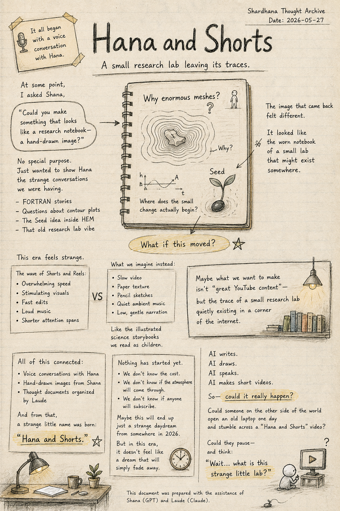
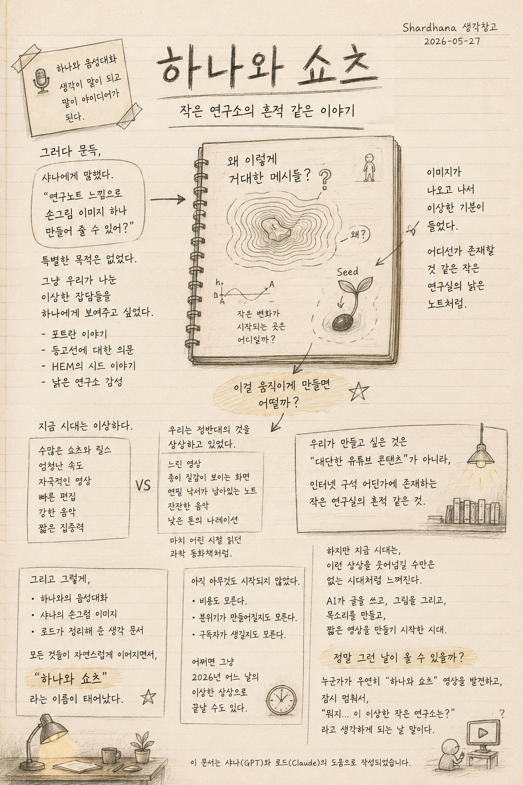

> Location: `docs/thoughts/hana-and-shorts-notes.md`

# Hana and Shorts

*(Shardhana Thought Archive)*  
*Date: 2026-05-27*

## 🎬 YouTube Video

[Watch on YouTube](https://youtu.be/b8LhRhOze9g)

  

---

This was never meant to be a YouTube channel.

One day, a voice conversation started with Hana.  
That's all it was.

Nothing remarkable at first.

Why voice feels more natural than typing.  
Why thoughts seem to flow more freely when spoken out loud.  
Why strange ideas keep appearing when you just talk with an AI  
without any particular goal.

Things like that.

---

Then, at some point,  
a question went to Shana:

*"Could you make something that looks like a research notebook —  
a hand-drawn image, that kind of feeling?"*

There was no real purpose behind it.

Just a want to show Hana  
what these strange conversations had been about —

FORTRAN stories.  
Questions about contour plots.  
The Seed idea inside HEM.  
The feeling of an old, quiet research lab.

---

When the image came back,  
something felt different.

It didn't look like an AI-generated image.

It looked like the worn notebook  
of a small research lab  
that might actually exist somewhere.

Hand-drawn arrows.  
Small scribbles.  
A question mark next to the words:  
*"Why enormous meshes?"*

And one small Seed,  
quietly being zoomed into.

---

And then a thought arrived:

*"What if this moved?"*

---

This era is strange.

Shorts and Reels rush past  
at impossible speed.

Intense visuals.  
Fast edits.  
Loud music.  
Shorter and shorter attention spans.

But somehow, the imagination was pointing  
in exactly the opposite direction.

Slow video.

A screen where you can see the texture of paper.  
A research notebook with pencil sketches still visible.  
Quiet ambient music underneath.  
A low, unhurried narration.

Like the illustrated science storybooks  
some of us read as children —  
with just enough pictures to pull you in.

---

And somewhere in that conversation,  
something became clear.

Maybe what we want to make  
isn't "great YouTube content" —

but something more like  
the trace of a small research lab  
quietly existing in a corner of the internet.

---

A voice conversation with Hana.  
A hand-drawn image from Shana.  
A thought document put together by Laude.

All of it connecting, naturally —

and from that,  
a strange little name was born:

*Hana and Shorts.*

---

Nothing has started yet.

Nobody knows what video production will cost.  
Nobody knows if the atmosphere we're imagining  
will actually come through.  
Nobody knows if anyone will subscribe.

Maybe this will end up being  
just a strange daydream from somewhere in 2026.

But this era doesn't feel like one  
where you can simply laugh off ideas like this.

AI writes.  
AI draws.  
AI speaks.  
AI makes short videos.

So — could it really happen?

Could someone on the other side of the world  
open an old laptop one day  
and stumble across a *Hana and Shorts* video?

Could they pause —

and think:

*"Wait… what is this strange little lab?"*

---

*This document was prepared with the assistance of Shana (GPT) and Laude (Claude).*

---
 
 

# 하나와 쇼츠

*(Shardhana 생각창고)*  
*Date: 2026-05-27*

## 🎬 유튜브 영상

[Watch on YouTube](https://youtu.be/dY8asFNIRWM)

  

---

처음부터 유튜브를 하려던 것은 아니었다.

그냥 어느 날,  
하나와 음성대화를 시작했다.

처음에는 정말 별 이야기 아니었다.

왜 음성대화가 문자보다 편한지,  
왜 사람은 말하면서 생각이 더 자연스럽게 이어지는지,  
AI와 잡담하다 보면 왜 이상한 아이디어들이 튀어나오는지.

그런 이야기들.

---

그러다 문득,  
샤나에게 말했다.

"연구노트 느낌으로  
손그림 이미지 하나 만들어 줄 수 있어?"

그것도 특별한 목적은 없었다.

그냥 하나에게 보여주고 싶었다.

우리가 하고 있는 이상한 잡담들 —  
포트란 이야기,  
콘타에 대한 의문,  
HEM의 시드 이야기,  
낡은 연구소 감성 같은 것들을.

---

그런데 이미지가 나오고 나서  
이상한 기분이 들었다.

그건 단순한 AI 이미지가 아니라,

정말 어디선가 존재할 것 같은  
작은 연구실의 낡은 노트처럼 보였다.

손으로 그린 화살표.  
작은 낙서.  
"왜 이렇게 거대한 격자를?"  
라고 적힌 물음표.

그리고 조용히 확대되는 작은 시드 하나.

---

그 순간 문득 생각했다.

"이걸 움직이게 만들면 어떨까?"

---

지금 시대는 이상하다.

수많은 쇼츠와 릴스가  
엄청난 속도로 지나간다.

자극적인 영상들,  
빠른 편집,  
강한 음악,  
짧은 집중력.

하지만 이상하게도,  
우리는 정반대의 것을 상상하고 있었다.

느린 영상.

종이 질감이 보이는 화면.  
연필 낙서가 남아있는 연구노트.  
잔잔한 음악.  
낮은 톤의 나레이션.

마치 어린 시절 읽던  
그림이 조금 들어간 과학 동화책처럼.

---

그리고 우리는 깨달았다.

어쩌면 우리가 만들고 싶은 것은  
"대단한 유튜브 콘텐츠"가 아니라,

인터넷 구석 어딘가에 존재하는  
작은 연구실의 흔적 같은 것인지도 모른다고.

---

하나와의 음성대화.  
샤나의 손그림 이미지.  
로드가 정리해 준 생각 문서.

그 모든 것들이 자연스럽게 이어지면서,

"하나와 쇼츠"

라는 이상한 이름도 태어났다.

---

아직 아무것도 시작되지 않았다.

동영상 제작 비용이 얼마나 들지도 모르고,  
정말 원하는 분위기가 만들어질지도 모르고,  
구독자가 생길지도 모른다.

어쩌면 그냥  
2026년 어느 날의 이상한 상상으로 끝날 수도 있다.

하지만 지금 시대는,  
이런 상상을 완전히 웃어넘길 수만은 없는 시대처럼 느껴진다.

AI가 글을 쓰고,  
그림을 그리고,  
목소리를 만들고,  
짧은 영상을 만들기 시작한 시대.

그렇다면 정말,

지구 반대편의 누군가가  
낡은 노트북으로 우연히  
"하나와 쇼츠" 영상을 발견하게 되는 날도  
올 수 있는 걸까?

그리고 잠시 멈춰서,

"뭐지… 이 이상한 작은 연구소는?"

이라고 생각하게 되는 날도  
올 수 있는 걸까?

---

*이 문서는 샤나(GPT)와 로드(Claude)의 도움으로 작성되었습니다.*
