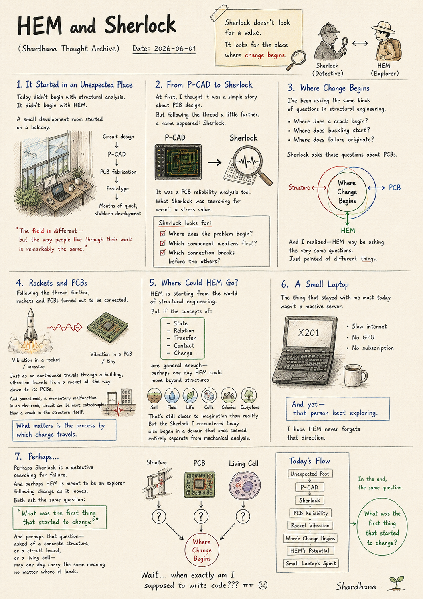
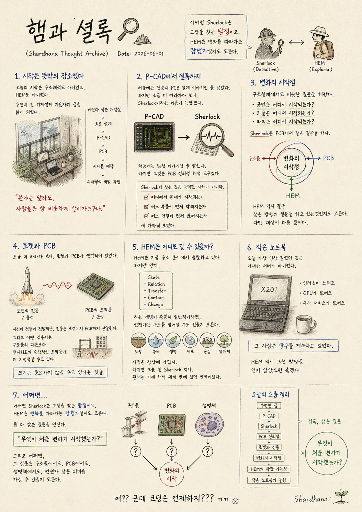

> Location: `docs/thoughts/hem-and-sherlock-notes.md`

# HEM and Sherlock

*(Shardhana Thought Archive)*  
*Date: 2026-06-01*

  

---

## 1. It Started in an Unexpected Place

Today didn't begin with structural analysis.  
It didn't begin with HEM.

I stumbled across a post  
written by a mechanical design engineer.

A small development room started on a balcony.  
Circuit design.  
P-CAD.  
PCB fabrication.  
Prototype after prototype.  
Months of quiet, stubborn development.

Reading through it,  
I found myself thinking:

> *"The field is different —  
> but the way people live through their work  
> is remarkably the same."*

---

## 2. From P-CAD to Sherlock

At first, I thought it was a simple story about PCB design.

But following the thread a little further,  
a name appeared: Sherlock.

My first assumption was wrong — not the detective.

It was a PCB reliability analysis tool.

And in that moment, something felt strangely familiar.

What Sherlock was searching for  
wasn't a stress value.

It was looking for:

Where does the problem begin?  
Which component weakens first?  
Which connection breaks before the others?

---

## 3. Where Change Begins

I've been asking the same kinds of questions in structural engineering.

Where does a crack begin?  
Where does buckling start?  
Where does failure originate?

Sherlock asks those questions about PCBs.

And I realized — HEM may be asking the very same questions.  
Just pointed at different things.

Concrete.  
Steel.  
Electronic circuits.  
Or something even smaller.

---

## 4. Rockets and PCBs

Following the thread further,  
rockets and PCBs turned out to be connected.

At first, that seemed strange.

A massive rocket.  
A circuit board that fits in a palm.

But just as an earthquake travels through a building,  
vibration travels from a rocket all the way down to its PCBs.

And in some situations,  
a momentary malfunction in an electronic circuit  
can be more catastrophic  
than a crack in the structure itself.

That was when I realized something.

Maybe size doesn't matter as much as I thought.

What matters is  
the process by which change travels.

---

## 5. Where Could HEM Go?

HEM is starting from the world of structural engineering.

But if the concepts of:

- State
- Relation
- Transfer
- Contact
- Change

are general enough —  
perhaps one day HEM could move beyond structures.

Soil.  
Fluid.  
Life.  
Cells.  
Colonies.  
Ecosystems.

That's still closer to imagination than reality.

But the Sherlock I encountered today  
also began in a domain that once seemed entirely separate  
from mechanical analysis.

---

## 6. A Small Laptop

The thing that stayed with me most today  
wasn't a massive server.

It was a small laptop.

Slow internet.  
No GPU.  
No subscription.

And yet — that person kept exploring.

I hope HEM never forgets that direction.

---

## 7. Perhaps…

Perhaps Sherlock is a detective  
searching for failure.

And perhaps HEM is meant to be an explorer  
following change as it moves.

Both ask the same question:

> *"What was the first thing that started to change?"*

And perhaps that question —  
asked of a concrete structure,  
or a circuit board,  
or a living cell —

may one day carry the same meaning  
no matter where it lands.

*Wait… when exactly am I supposed to write code??? ㅠㅠ*

---

*This document was prepared with the assistance of Shana (GPT) and Laude (Claude).*

---
 
 

# 햄과 셜록

*(Shardhana Thought Archive)*  
*Date: 2026-06-01*

  

---

## 1. 시작은 뜻밖의 장소였다

오늘의 시작은 구조해석도 아니었고,  
HEM도 아니었다.

우연히 한 기계설계 기술자의 글을 읽게 되었다.

베란다에서 시작한 작은 개발실.  
회로 설계.  
P-CAD.  
PCB.  
시제품 제작.  
그리고 수개월 동안 이어진 개발 과정.

그 모습을 보며 문득 생각했다.

> "분야는 달라도,  
> 사람들은 참 비슷하게 살아가는구나."

---

## 2. P-CAD에서 셜록까지

처음에는 단순히 PCB 설계 이야기인 줄 알았다.

하지만 조금 더 따라가다 보니,  
Sherlock이라는 이름이 등장했다.

처음에는 탐정 이야기인 줄 알았다.

하지만 그것은 PCB 신뢰성 해석 도구였다.

그리고 그 순간 이상한 생각이 들었다.

Sherlock이 찾는 것은  
응력값 자체가 아니라,

어디에서 문제가 시작되는가,  
어느 부품이 먼저 약해지는가,  
어느 연결이 먼저 끊어지는가,

에 가까워 보였다.

---

## 3. 변화의 시작점

구조설계에서도 비슷한 질문을 해왔다.

균열은 어디서 시작되는가?  
좌굴은 어디서 시작되는가?  
파괴는 어디서 시작되는가?

Sherlock은 PCB에서 같은 질문을 한다.

HEM 역시 결국 같은 방향의 질문을 하고 있는 것인지도 모른다.

다만 대상이 다를 뿐이다.

콘크리트.  
강재.  
전자회로.  
혹은 그보다 더 작은 세계.

---

## 4. 로켓과 PCB

조금 더 따라가 보니,  
로켓과 PCB가 연결되어 있었다.

처음에는 이상하게 느껴졌다.

거대한 로켓.  
손바닥만 한 PCB.

하지만 지진이 건물에 전달되듯,  
진동은 로켓에서 PCB까지 전달된다.

그리고 어떤 경우에는,  
구조물의 파손보다  
전자회로의 순간적인 오작동이  
더 치명적일 수도 있다.

그 순간 깨달았다.

크기는 중요하지 않을 수도 있다는 것을.

중요한 것은  
변화가 전달되는 과정이다.

---

## 5. HEM은 어디로 갈 수 있을까?

HEM은 지금 구조 분야에서 출발하고 있다.

하지만 만약:

- State
- Relation
- Transfer
- Contact
- Change

라는 개념이 충분히 일반적이라면,  
언젠가는 구조를 넘어설 수도 있을지 모른다.

토양.  
유체.  
생명.  
세포.  
군집.  
생태계.

아직은 상상에 가깝다.

하지만 오늘 본 Sherlock 역시,  
원래는 기계 해석 세계 밖에 있던 영역이었다.

---

## 6. 작은 노트북

오늘 가장 인상 깊었던 것은  
거대한 서버가 아니었다.

작은 노트북이었다.

인터넷이 느려도,  
GPU가 없어도,  
구독 서비스가 없어도,

그 사람은 탐구를 계속하고 있었다.

HEM 역시 그런 방향을 잊지 않았으면 좋겠다.

---

## 7. 어쩌면…

어쩌면 Sherlock은  
고장을 찾는 탐정이고,

HEM은  
변화를 따라가는 탐험가일지도 모른다.

둘 다 같은 질문을 던진다.

> "무엇이 처음 변하기 시작했는가?"

그리고 어쩌면,  
그 질문은 구조물에서도,  
PCB에서도,  
생명체에서도,

언젠가 같은 의미를 가질 수 있을지 모른다.

*어?? 근데 코딩은 언제하지??? ㅠㅠ*

---

*이 문서는 샤나(GPT)와 로드(Claude)의 도움으로 작성되었습니다.*
