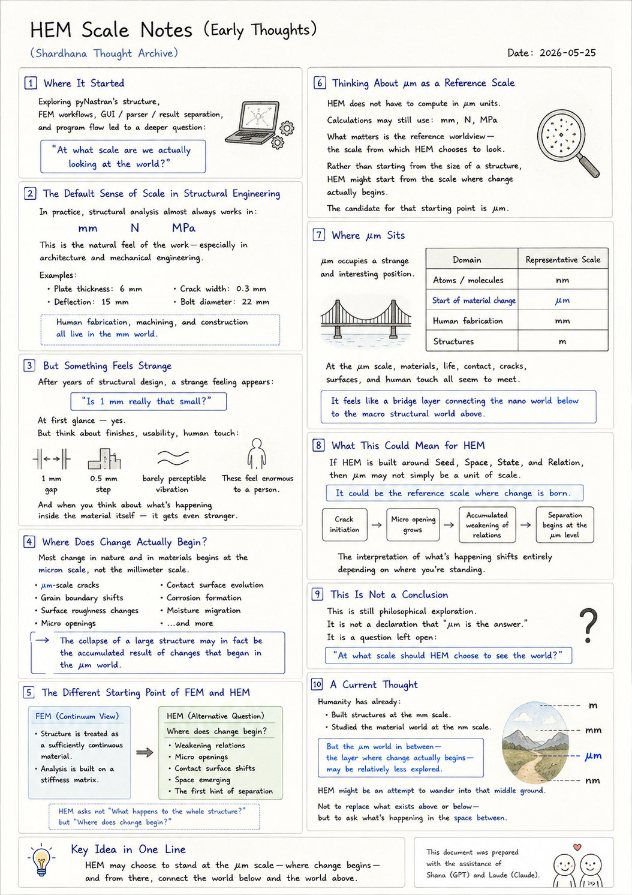

> Location: `docs/thoughts/hem-scale-notes.md`

# HEM Scale Notes (Early Thoughts)

*(Shardhana Thought Archive)*  
*Date: 2026-05-25*

## 🎬 YouTube Video

[Watch on YouTube](https://youtu.be/ZM40OYScW24?si=wS9O4xuyV1H3eW6F)

  

---

## 1. Where It Started

Today, one thought led to another.

It began simply enough —  
browsing through pyNastran's structure,  
watching how FEM workflows are organized,  
how GUI, parser, and result layers are separated,  
how a structural analysis program actually flows.

And then, somewhere in the middle of that,  
a different question arrived:

> *"At what scale are we actually looking at the world?"*

---

## 2. The Default Sense of Scale in Structural Engineering

In practice, structural analysis almost always works in:

- mm
- N
- MPa

It's not a rule anyone announces.  
It's just the natural feel of the work —  
especially in architecture and mechanical engineering.

Examples from everyday practice:

- Plate thickness: 6 mm
- Deflection: 15 mm
- Crack width: 0.3 mm
- Bolt diameter: 22 mm

Human fabrication, machining, and construction  
all live in the mm world.  
And so, quietly, mm became the default lens.

---

## 3. But Something Feels Strange

After years of structural design,  
a strange feeling starts to creep in.

> *"Is 1 mm really that small?"*

At first glance — yes.  
1 mm feels like almost nothing.

But think about finishes, usability, human touch:

- A 1 mm gap
- A 0.5 mm step
- A barely perceptible vibration

These feel enormous to a person standing in front of them.

And when you start thinking about  
what's happening inside the material itself —  
it gets even stranger.

---

## 4. Where Does Change Actually Begin?

Most change in nature and in materials  
doesn't start at the mm scale.

It starts somewhere around:

- μm-scale cracks
- Grain boundary shifts
- Surface roughness changes
- Micro openings
- Contact surface evolution
- Corrosion formation
- Moisture migration

The collapse of a large structure —  
the kind you can see from across the street —  
may in fact be:

> the accumulated result of changes that began in the μm world.

---

## 5. The Different Starting Point of FEM and HEM

FEM is a remarkably powerful method.

But at its core,  
it operates from a **continuum** perspective:

- The structure is treated as a sufficiently continuous material.
- Analysis is built on a stiffness matrix.

HEM can ask a different question:

> *"Where does change begin?"*

Not at the level of the whole structure —  
but at the level of:

- Weakening relations
- Micro openings
- Contact surface shifts
- Space emerging between things
- The first hint of separation

---

## 6. Thinking About μm as a Reference Scale

This doesn't mean HEM must compute in μm units.

The actual calculations might still use:

- mm
- N
- MPa

That's fine.

What matters is something different:

> the **reference worldview** — the scale from which HEM chooses to look.

Rather than starting from the size of a structure,  
HEM might start from:

> the scale where change actually begins.

And the candidate for that starting point  
is μm.

---

## 7. Where μm Sits

μm occupies a strange and interesting position.

| Domain | Representative Scale |
|---|---|
| Atoms / molecules | nm |
| Start of material change | μm |
| Human fabrication | mm |
| Structures | m |

At the μm scale,  
something remarkable happens —  
it's where:

- Materials
- Life
- Contact
- Cracks
- Surfaces
- Human touch

all seem to meet.

It feels less like a unit of measurement  
and more like a **bridge layer** —  
connecting the nano world below  
to the macro structural world above.

---

## 8. What This Could Mean for HEM

If HEM is built around:

- Seed
- Space
- State
- Relation

then μm might not simply be a unit of scale.  
It could be:

> the reference scale where change is born.

Which would change the way analysis itself flows:

- Crack initiation → micro opening grows
- Fracture → accumulated weakening of relations
- Space creation → separation begins at the μm level

The interpretation of what's happening  
shifts entirely depending on where you're standing.

---

## 9. This Is Not a Conclusion

This is still philosophical exploration.

It's not a declaration that:

> *"μm is the answer."*

It's a question left open:

> *"At what scale should HEM choose to see the world?"*

---

## 10. A Current Thought

Humanity has already:

- Built structures at the mm scale.
- Studied the material world at the nm scale.

But the μm world in between —  
the layer where change actually begins —  
may be relatively less explored.

HEM might be an attempt  
to wander into that middle ground.

Not to replace what exists above or below —  
but to ask what's happening  
in the space between.

---

*This document was prepared with the assistance of Shana (GPT) and Laude (Claude).*

---
 
 

# HEM 단위 생각 (초기 생각 정리)

*(Shardhana Thought Archive)*  
*Date: 2026-05-25*

## 🎬 유튜브 영상

[Watch on YouTube](https://youtu.be/1mqvdRWw4Vc?si=dcxzcJx9SEQDpC6M)

  

---

## 1. 시작점

오늘 여러 가지 생각이 이어졌다.

처음에는 단순히:

- pyNastran 구조 탐색
- FEM workflow 구경
- GUI / parser / result 분리
- 구조해석 프로그램 흐름 관찰

정도를 보고 있었다.

그러다가 자연스럽게 다음 질문으로 이어졌다.

> "우리는 지금 어떤 스케일에서 세상을 보고 있는가?"

---

## 2. 기존 구조해석의 기본 감각

실무 구조해석에서는 보통:

- mm
- N
- MPa

조합을 많이 사용한다.

특히 건축/기계 분야에서는 거의 기본 감각처럼 사용된다.

예:

- 판 두께 6 mm
- 처짐 15 mm
- 균열폭 0.3 mm
- 볼트 22 mm

즉 인간 제작/가공/시공 스케일 자체가 mm 중심이다.

---

## 3. 하지만 이상한 감각

구조설계를 오래 하다 보면 어느 순간 이상한 느낌이 든다.

> "1 mm는 정말 작은 단위인가?"

처음에는:

- 1 mm 정도는 작은 값처럼 느껴진다.

하지만 비구조/마감/사용성/촉감까지 생각하면:

- 1 mm 틈
- 0.5 mm 단차
- 미세 진동

같은 것들이 인간에게 매우 크게 느껴진다.

그리고 재료 내부 세계를 생각하면 더 이상해진다.

---

## 4. 실제 변화는 어디서 시작되는가

자연과 재료의 변화는 대부분:

- μm 균열
- 입계 변화
- 표면 거칠기 변화
- 미세 opening
- 접촉면 변화
- 부식 생성
- 수분 이동

같은 영역에서 시작된다.

즉 거시 구조물 파괴도 사실:

> μm 세계 변화의 누적

일 가능성이 크다.

---

## 5. FEM과 HEM의 출발 감각 차이

FEM은 매우 강력한 방법이다.

하지만 기본적으로는:

> 연속체(continuum)

관점이 강하다.

즉:

- 구조물을 충분히 연속적인 물질로 보고,
- stiffness matrix 기반으로 해석한다.

반면 HEM은 조금 다른 질문을 던질 수 있다.

> "변화는 어디서부터 시작되는가?"

예:

- relation 약화
- micro opening
- contact 변화
- space 생성
- separation

같은 것들.

---

## 6. μm를 기준 스케일로 생각해보기

HEM의 실제 구현이 반드시 μm 단위일 필요는 없다.

실제 계산은 여전히:

- mm
- N
- MPa

를 사용할 수도 있다.

하지만 중요한 것은:

> 기준 세계관(reference scale)

이다.

HEM은 구조물 크기에서 출발하기보다:

> 변화가 실제로 시작되는 스케일

에서 출발할 수도 있다.

그 기준 후보가 μm라는 생각이다.

---

## 7. μm 스케일의 위치

μm는 묘한 위치에 있다.

| 영역 | 대표 스케일 |
|---|---|
| 원자/분자 | nm |
| 재료 변화 시작 | μm |
| 인간 제작 | mm |
| 구조물 | m |

μm는:

- 재료
- 생명
- 접촉
- 균열
- 표면
- 인간 촉감

이 모두 만나는 중간층처럼 보인다.

즉:

> 나노 세계와 거시 구조 세계를 연결하는 bridge layer

처럼 느껴진다.

---

## 8. HEM에서의 가능성

만약 HEM이:

- Seed
- Space
- State
- Relation

기반으로 간다면,

μm 스케일은 단순 단위가 아니라:

> 변화가 태어나는 기준 스케일

이 될 수도 있다.

예를 들면:

- 균열 발생 → micro opening 증가
- 파괴 → relation 약화의 누적
- 공간 생성 → μm 수준 separation 시작

처럼 해석 흐름 자체가 달라질 수 있다.

---

## 9. 아직 결론은 아니다

현재 이 생각은 아직 철학적 탐색 단계에 가깝다.

즉:

> "μm가 정답이다"

라는 뜻은 아니다.

다만:

> "HEM은 어떤 스케일에서 세계를 바라봐야 하는가?"

라는 질문을 남긴다.

---

## 10. 현재의 생각

인류는 이미:

- mm 스케일 구조물을 만들었고,
- nm 스케일 물질 세계도 연구해 왔다.

하지만 그 사이,  
변화가 실제로 시작되는 μm 세계는  
상대적으로 덜 탐험되었을 수도 있다.

HEM은 어쩌면  
그 중간 세계를 탐험하려는 시도일지도 모른다.

---

*이 문서는 샤나(GPT)와 로드(Claude)의 도움으로 작성되었습니다.*
