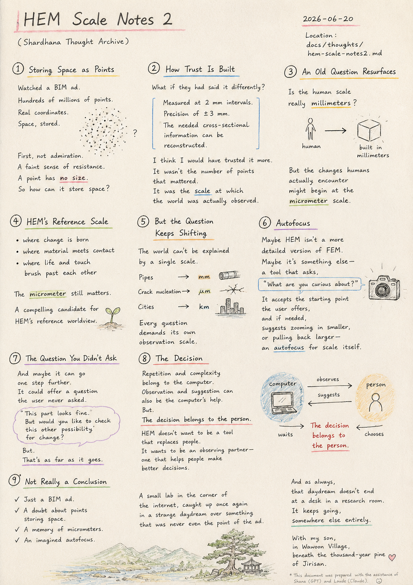
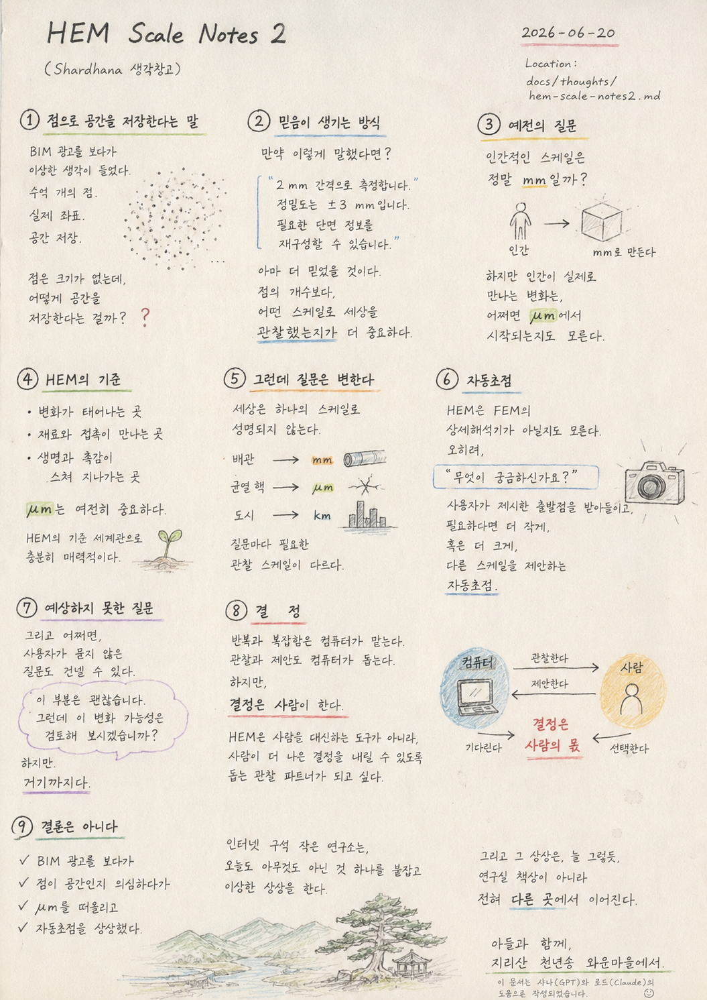

> Location: `docs/thoughts/hem-scale2-notes.md`

# HEM Scale 2 Notes

*(Shardhana Thought Archive)*  
*Date: 2026-06-20*

## 🎬 YouTube Video

[Watch on YouTube](https://youtu.be/UFNQ6jgrYkI)

  

---

## 1. Storing Space as Points

A strange thought hit me while watching a BIM advertisement.

Hundreds of millions of points.

Real coordinates.

Space, stored.

The first thing I felt wasn't admiration.

It was a faint sense of resistance.

A point has no size.

So how exactly does it store space?

---

## 2. How Trust Is Built

What if they had said it differently?

Measured at 2 mm intervals.

Precision of ±3 mm.

The needed cross-sectional information can be reconstructed.

I think I would have trusted it more.

It wasn't the number of points that mattered.

It was the scale at which the world had actually been observed.

---

## 3. An Old Question Resurfaces

An old thought came back to me.

Is the human scale really millimeters?

Humans build at the millimeter scale.

But the changes humans actually encounter

might begin at the micrometer scale.

---

## 4. HEM's Reference Scale

The micrometer still matters.

It's where change is born.

Where material meets contact.

Where life and touch brush past each other.

It's still a compelling candidate for HEM's reference worldview.

---

## 5. But the Question Keeps Shifting

The world can't be explained by a single scale.

Pipes belong to millimeters.

Crack nucleation belongs to micrometers.

Cities belong to kilometers.

Every question demands its own observation scale.

---

## 6. Autofocus

Maybe HEM isn't a more detailed version of FEM.

Maybe it's something else entirely —

a tool that asks,

"What are you curious about?"

It accepts whatever starting point the user offers,

and if needed,

suggests zooming in smaller,

or pulling back larger —

an autofocus for scale itself.

---

## 7. The Question You Didn't Ask

And maybe it can go one step further.

It could offer a question the user never asked.

This part looks fine.

But would you like to check this other possibility for change?

But.

That's as far as it goes.

---

## 8. The Decision

Repetition and complexity belong to the computer.

Observation and suggestion can also be the computer's help.

But.

The decision belongs to the person.

HEM doesn't want to be a tool that replaces people.

It wants to be an observing partner —

one that helps people make better decisions.

The computer can observe.

The computer can suggest.

But the decision belongs to the person.

The computer waits.

The person chooses.

---

## 9. Not Really a Conclusion

Once again, there's no conclusion here.

Just a BIM ad.

A doubt about whether a point can really hold space.

A memory of micrometers.

An imagined autofocus.

A small lab in the corner of the internet,

caught up once again in a strange daydream

over something that was never even the point of the ad.

And as always,

that daydream doesn't end at a desk in a research room.

It keeps going, somewhere else entirely.

---

*With my son, in Wawoon Village, beneath the thousand-year pine of Jirisan.*

---

*This document was prepared with the assistance of Shana (GPT) and Laude (Claude).*

---
 
 

# HEM 단위생각 2

*(Shardhana 생각창고)*  
*Date: 2026-06-20*

## 🎬 유튜브 영상

[Watch on YouTube](https://youtu.be/dUKRy1NF-Hw)

  

---

## 1. 점으로 공간을 저장한다는 말

BIM 광고를 보다가 이상한 생각이 들었다.

수억 개의 점.

실제 좌표.

공간 저장.

처음에는 대단하다는 생각보다,

묘한 거부감이 먼저 들었다.

점은 크기가 없는데,

어떻게 공간을 저장한다는 걸까?

---

## 2. 믿음이 생기는 방식

만약 이렇게 말했다면 어땠을까.

2 mm 간격으로 측정합니다.

정밀도는 ±3 mm입니다.

필요한 단면 정보를 재구성할 수 있습니다.

아마 더 믿었을 것이다.

점의 개수보다,

어떤 스케일로 세상을 관찰했는지가 더 중요하게 느껴졌다.

---

## 3. 예전의 질문

문득 예전 생각이 떠올랐다.

인간적인 스케일은 정말 mm일까?

인간은 mm로 만든다.

하지만 인간이 실제로 만나는 변화는,

어쩌면 μm에서 시작되는지도 모른다.

---

## 4. HEM의 기준

μm는 여전히 중요하다.

변화가 태어나는 곳.

재료와 접촉이 만나는 곳.

생명과 촉감이 스쳐 지나가는 곳.

HEM의 기준 세계관으로 충분히 매력적이다.

---

## 5. 그런데 질문은 변한다

하지만 세상은 하나의 스케일로 설명되지 않는다.

배관은 mm.

균열 핵은 μm.

도시는 km.

질문마다 필요한 관찰 스케일이 다르다.

---

## 6. 자동초점

HEM은 FEM의 상세해석기가 아닐지도 모른다.

오히려.

"무엇이 궁금하신가요?"

라고 묻는 도구.

사용자가 제시한 출발점을 받아들이고,

필요하다면 더 작게,

혹은 더 크게,

다른 스케일을 제안하는 자동초점.

---

## 7. 예상하지 못한 질문

그리고 어쩌면.

사용자가 묻지 않은 질문도 건넬 수 있다.

이 부분은 괜찮습니다.

그런데 이 변화 가능성은 검토해 보시겠습니까?

하지만.

거기까지다.

---

## 8. 결정

반복과 복잡함은 컴퓨터가 맡는다.

관찰과 제안도 컴퓨터가 돕는다.

하지만.

결정은 사람이 한다.

HEM은 사람을 대신하는 도구가 아니라,

사람이 더 나은 결정을 내릴 수 있도록 돕는 관찰 파트너가 되고 싶다.

컴퓨터는 관찰한다.

컴퓨터는 제안한다.

하지만 결정은 사람의 몫이다.

컴퓨터는 기다린다.

사람은 선택한다.

---

## 9. 결론은 아니다

이번에도 결론은 없다.

BIM 광고를 보다가.

점이 공간인지 의심하다가.

μm를 떠올리고.

자동초점을 상상했다.

인터넷 구석 작은 연구소는,

오늘도 아무것도 아닌 것 하나를 붙잡고 이상한 상상을 한다.

그리고 그 상상은, 늘 그렇듯,

연구실 책상이 아니라

전혀 다른 곳에서 이어진다.

---

*아들과 함께, 지리산 천년송 와운마을에서.*

---

*이 문서는 샤나(GPT)와 로드(Claude)의 도움으로 작성되었습니다.*
